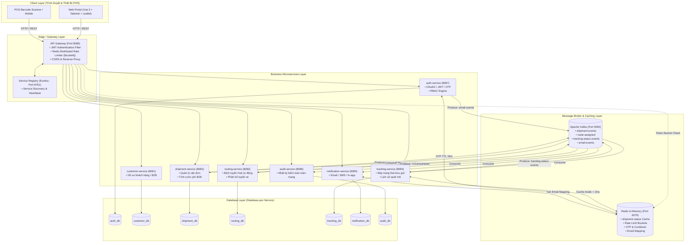

# Waybill Platform - Hệ Thống Điều Phối & Quản Trị Vận Đơn Bưu Chính Toàn Trình

[](https://www.oracle.com/java/)
[](https://spring.io/projects/spring-boot)
[](https://spring.io/projects/spring-cloud)
[](https://kafka.apache.org/)
[](https://redis.io/)
[](https://www.microsoft.com/sql-server)
[](https://vuejs.org/)
[](https://tailwindcss.com/)

---

## Mục Lục
1. [Giới Thiệu Tổng Quan](#1-giới-thiệu-tổng-quan)
2. [Kiến Trúc Hệ Thống (System Architecture)](#2-kiến-trúc-hệ-thống-system-architecture)
3. [Danh Sách Microservices & Cổng Dịch Vụ](#3-danh-sách-microservices--cổng-dịch-vụ)
4. [Luồng Nghiệp Vụ Cốt Lõi (Core Workflows)](#4-luồng-nghiệp-vụ-cốt-lõi-core-workflows)
5. [Các Điểm Nhấn Kỹ Thuật Đột Phá](#5-các-điểm-nhấn-kỹ-thuật-đột-phá)
6. [Hệ Thống Phân Quyền Ma Trận (RBAC Matrix)](#6-hệ-thống-phân-quyền-ma-trận-rbac-matrix)
7. [Yêu Cầu Môi Trường & Công Nghệ](#7-yêu-cầu-môi-trường--công-nghệ)
8. [Hướng Dẫn Cài Đặt & Khởi Chạy (Step-by-Step)](#8-hướng-dẫn-cài-đặt--khởi-chạy-step-by-step)
9. [Tài Khoản Kiểm Thử Mẫu (Demo Accounts)](#9-tài-khoản-kiểm-thử-mẫu-demo-accounts)
10. [Cấu Trúc Thư Mục Dự Án (Project Structure)](#10-cấu-trúc-thư-mục-dự-án-project-structure)

---

## 1. Giới Thiệu Tổng Quan

**VNPT Waybill Platform** là nền tảng quản trị và điều phối vận đơn bưu chính toàn trình chuẩn Enterprise, được thiết kế chuyên biệt cho hệ sinh thái logistics thông minh. Hệ thống giải quyết bài toán luân chuyển bưu phẩm đa chặng giữa các Siêu Hub khai thác (Bắc - Trung - Nam), kết nối bưu tá giao hàng chặng cuối (Last-mile Delivery) và cổng dịch vụ cho khách hàng doanh nghiệp B2B / chủ Shop thương mại điện tử.

### Điểm nổi bật:
- **Kiến trúc Microservices độc lập (Database-per-Service):** Mỗi dịch vụ sở hữu cơ sở dữ liệu riêng biệt, không chia sẻ trực tiếp dữ liệu tầng DB, giao tiếp qua REST API (Gateway) và Message Broker.
- **Hạ tầng hướng sự kiện (Event-Driven Architecture với Kafka):** Tách rời các tác vụ nặng (phân tuyến, thông báo, kiểm toán) ra khỏi luồng xử lý chính, đảm bảo tốc độ phản hồi người dùng `< 50ms`.
- **Tầng đệm bộ nhớ siêu tốc (Redis Caching & Distributed Rate Limiting):** Tối ưu tốc độ tra cứu hành trình (`< 2ms`), bảo vệ hệ thống khỏi tấn công DDoS bằng thuật toán Token Bucket.
- **Bản đồ số GIS tương tác:** Trực quan hóa lộ trình luân chuyển xe tải giữa các bưu cục trên nền bản đồ Leaflet đa lớp (OSM, Google Maps Tiếng Việt, Ảnh vệ tinh).

---

## 2. Kiến Trúc Hệ Thống (System Architecture)

Hệ thống được thiết kế theo mô hình Microservices hiện đại kết hợp Event-Driven Streaming:



---

## 3. Danh Sách Microservices & Cổng Dịch Vụ

| STT | Service Name | Port | CSDL (SQL Server) | Trách Nhiệm Nghiệp Vụ Chính |
| :---: | :--- | :---: | :---: | :--- |
| 1 | **`service-registry`** | `8761` | *None* | Netflix Eureka Server: Quản lý vị trí mạng và trạng thái hoạt động của toàn bộ Microservices. |
| 2 | **`api-gateway`** | `8080` | *None* | Cổng giao tiếp duy nhất (Single Entry Point): Kiểm tra JWT Token, Rate Limiting (Bucket4j-Redis), định tuyến request. |
| 3 | **`auth-service`** | `8087` | `auth_db` | Đăng nhập/Đăng ký, xác thực Google OAuth2, phát hành JWT Token, quản lý OTP quên mật khẩu và bảng phân quyền RBAC. |
| 4 | **`customer-service`** | `8081` | `customer_db` | Quản trị danh bạ đối tác B2B, chủ Shop TMĐT, hạn mức công nợ và đồng bộ hồ sơ người gửi. |
| 5 | **`shipment-service`** | `8082` | `shipment_db` | Khởi tạo bưu gửi, tính toán cước phí tự động, quản lý vòng đời bưu kiện và in phiếu gửi A5/A6. |
| 6 | **`routing-service`** | `8083` | `routing_db` | Thuật toán phân tuyến bưu cục tự động dựa trên mã bưu chính / địa chỉ gửi - nhận (Hà Nội, Đà Nẵng, TP.HCM, Cần Thơ, Hải Phòng). |
| 7 | **`tracking-service`** | `8084` | `tracking_db` | Quản lý máy trạng thái bưu gửi (State Machine), ghi nhận lịch sử quét mã barcode và cung cấp API tra cứu tốc độ cao. |
| 8 | **`notification-service`**| `8085` | `notification_db` | Lắng nghe sự kiện Kafka gửi Email HTML thông báo hành trình cho khách hàng và lưu vết thông báo. |
| 9 | **`audit-service`** | `8086` | `audit_db` | Ghi nhận toàn bộ chuỗi sự kiện Kafka thành nhật ký kiểm toán không thể xóa (Audit Trail) phục vụ tra soát. |
| 10 | **`frontend-dev-server`** | `3000` | *None* | Máy chủ Node.js phục vụ giao diện tĩnh và Reverse Proxy đường dẫn `/api` về cổng `8080`. |
| 11 | **`kafka-ui`** | `8090` | *None* | Giao diện trực quan hóa Topic, Partition, Consumer Group và tin nhắn trên Kafka Cluster. |

---

## 4. Luồng Nghiệp Vụ Cốt Lõi (Core Workflows)

### 4.1. Luồng Khởi Tạo Vận Đơn Tự Động (Shipment Creation & Routing)
1. **Khách hàng / Giao dịch viên** điền form tạo đơn trên giao diện $\rightarrow$ Gọi `POST /api/shipments`.
2. `shipment-service` lưu bản ghi vào `shipment_db` với trạng thái `CREATED`.
3. `shipment-service` bắn sự kiện `CreateShipmentEvent` lên Kafka Topic `shipment-events` (Partition Key = `trackingCode`).
4. **Các Consumer phản hồi song song:**
   - **`routing-service`**: Tính toán tuyến đường tối ưu qua các Siêu Hub và bắn event `RouteAssignedEvent` lên Topic `route-assigned`.
   - **`tracking-service`**: Khởi tạo mốc lịch sử đầu tiên (`CREATED`) và ghi trạng thái vào Redis Cache.
   - **`notification-service`**: Lưu mapping email khách vào Redis và gửi email xác nhận tạo đơn thành công.
   - **`audit-service`**: Ghi log kiểm toán khởi tạo đơn.

### 4.2. Luồng Luân Chuyển Bưu Cục & Giao Hàng (Hub Operations & Last-mile Delivery)
1. **Thủ kho Hub hoặc Bưu tá** quét mã barcode trên kiện hàng $\rightarrow$ Gọi `POST /api/tracking/{code}/status`.
2. `tracking-service` kiểm tra tính hợp lệ của bước chuyển trạng thái (chống nhảy cóc trạng thái).
3. `tracking-service` ghi nhận mốc hành trình vào `tracking_db`, cập nhật Redis Cache và bắn event `ShipmentStatusUpdatedEvent` lên Topic `tracking-status-events`.
4. **Các Consumer phản hồi:**
   - **`shipment-service`**: Lắng nghe topic cập nhật trường `currentStatus` trong `shipment_db` (có cơ chế Retry 3 lần nếu CSDL bận).
   - **`notification-service`**: Khi trạng thái là `OUT_FOR_DELIVERY` (Đang phát), `DELIVERED` (Thành công) hoặc `DELIVERY_FAILED` (Thất bại), tự động lấy email khách hàng từ Redis và gửi email thông báo chi tiết.
   - **`audit-service`**: Ghi nhận vết kiểm toán luân chuyển.

---

## 5. Các Điểm Nhấn Kỹ Thuật Đột Phá

### 5.1. Tối Ưu Hóa Tốc Độ Tra Cứu Với Redis (Cache-Aside Pattern)
* Tra cứu vận đơn là thao tác có tần suất đọc (Read-heavy) lớn nhất hệ sinh thái.
* Khi có yêu cầu tra cứu:
  * **Cache HIT:** Lấy trực tiếp từ Redis RAM trong **1 - 2ms**, không chạm vào SQL Server.
  * **Cache MISS:** Đọc CSDL SQL Server 1 lần duy nhất rồi nạp lại vào Redis.
* Khi có cập nhật trạng thái: `tracking-service` ghi đè ngay trạng thái mới vào Redis, đảm bảo dữ liệu luôn thời gian thực (Real-time consistency).

### 5.2. Chống Tấn Công DDoS Bằng Token Bucket (Bucket4j-Redis)
* Tích hợp bộ lọc phân tán `RateLimitingFilter` ngay tại Gateway:
  * Mỗi IP bị giới hạn tối đa **60 requests / 30 giây**.
  * Toàn hệ thống có trần bảo vệ **100 requests / 60 giây**.
* Nếu vượt ngưỡng, hệ thống trả về HTTP `429 Too Many Requests` ngay lập tức, triệt tiêu nguy cơ quá tải dịch vụ nội bộ.

### 5.3. Phiên Đăng Nhập Phi Trạng Thái (Stateless JWT Security)
* Client lưu trữ `accessToken` trong `localStorage`.
* Mỗi request gửi qua Header `Authorization: Bearer <token>`.
* Gateway xác thực chữ ký HMAC-SHA256 bí mật, bóc tách `userId`, `roles`, `permissions` và đính kèm vào Header nội bộ (`X-User-Id`, `X-User-Roles`, `X-User-Permissions`) đẩy xuống các microservice. Không sử dụng Session bộ nhớ, hỗ trợ Scale-out vô hạn.

### 5.4. Giao Diện Chuẩn Enterprise & Hoạt Ảnh Mượt Mà
* Áp dụng nguyên tắc thiết kế tối giản dành cho B2B Logistics:
  * **Chuyển đổi trang chính (Main Page):** Fade & Slide-up (`0.20s`, `cubic-bezier(0.16, 1, 0.3, 1)`).
  * **Chuyển đổi biểu mẫu & subtab:** Slide-fade mượt mà (`0.18s - 0.22s`), không giật layout.
  * **Splash Preloader:** Vòng quay công nghệ Smooth Arc xoay 360° quanh Logo VNPT.
  * **Bản đồ số Leaflet:** Tích hợp tùy biến các lớp bản đồ đường bộ, Google tiếng Việt và ảnh vệ tinh, kèm các nút định vị nhanh lãnh thổ Việt Nam.

---

## 6. Hệ Thống Phân Quyền Ma Trận (RBAC Matrix)

Hệ thống thiết lập 5 vai trò phân quyền chặt chẽ:

| Vai Trò (Role Code) | Tên Hiển Thị | Quyền Hạn & Màn Hình Khả Dụng |
| :--- | :--- | :--- |
| **`ROLE_ADMIN`** | Quản Trị Viên Toàn Hệ Thống | Toàn quyền kiểm soát hệ thống, quản lý tài khoản nhân viên, gán vai trò RBAC, xem nhật ký Audit, mô phỏng điều phối toàn mạng. |
| **`ROLE_CS`** | Giao Dịch Viên Bưu Cục | Tiếp nhận đơn tại quầy, sử dụng chế độ *"Tạo Hộ Khách Hàng"*, tra cứu đơn hàng, hỗ trợ khiếu nại. |
| **`ROLE_HUB_STAFF`** | Nhân Viên Khai Thác Hub | Quét barcode tiếp nhận hàng (Scan In), đóng chuyến xe luân chuyển (Scan Out), kiểm soát tồn bãi tại Hub. |
| **`ROLE_SHIPPER`** | Bưu Tá Giao Hàng | Tiếp nhận danh sách đơn phát trong ngày, cập nhật kết quả giao hàng (Thành công / Báo thất bại kèm lý do), quyết toán COD cuối ca. |
| **`ROLE_CUSTOMER`** | Khách Hàng / Chủ Shop B2B | Tạo vận đơn cá nhân từ kho Shop, quản lý danh sách đơn gửi, theo dõi dòng tiền COD và cập nhật hồ sơ cá nhân. |

---

## 7. Yêu Cầu Môi Trường & Công Nghệ

Trước khi cài đặt, máy tính của bạn cần có sẵn:
- **Java Development Kit (JDK):** Phiên bản **21 LTS** trở lên.
- **Apache Maven:** Phiên bản **3.9+**.
- **Docker & Docker Compose:** Dùng để chạy Kafka và Redis.
- **Microsoft SQL Server:** Phiên bản **2019 / 2022** (Lắng nghe tại cổng mặc định `1433`, tài khoản `sa` / `sa` hoặc cấu hình tương ứng).
- **Node.js:** Phiên bản **18+** (Dùng chạy frontend static server).

---

## 8. Hướng Dẫn Cài Đặt & Khởi Chạy (Step-by-Step)

### Bước 1: Clone Mã Nguồn
```bash
git clone https://github.com/Khanhnv26/Mini-Waybill-Platform---VNPT-Cloud.git
cd Mini-Waybill-Platform---VNPT-Cloud
```

### Bước 2: Khởi Động Hạ Tầng (Kafka & Kafka-UI)
Chạy lệnh Docker Compose ở thư mục gốc:
```bash
docker-compose up -d
```
* Kiểm tra Kafka UI tại: [http://localhost:8090](http://localhost:8090)

### Bước 3: Chuẩn Bị Cơ Sở Dữ Liệu SQL Server
1. Mở **SQL Server Management Studio (SSMS)** hoặc Azure Data Studio.
2. Tạo 7 cơ sở dữ liệu độc lập:
   ```sql
   CREATE DATABASE auth_db;
   CREATE DATABASE customer_db;
   CREATE DATABASE shipment_db;
   CREATE DATABASE routing_db;
   CREATE DATABASE tracking_db;
   CREATE DATABASE notification_db;
   CREATE DATABASE audit_db;
   ```
3. Chạy các script tạo dữ liệu mẫu trong thư mục `database/`:
   - Thực thi [`database/HubSeed.sql`](file:///c:/Users/LENOVO/Desktop/microservice/mini-waybill-platform/database/HubSeed.sql) (Nạp 5 Siêu Hub toàn quốc vào `routing_db`).
   - Thực thi [`database/seed_rbac_data.sql`](file:///c:/Users/LENOVO/Desktop/microservice/mini-waybill-platform/database/seed_rbac_data.sql) (Nạp bảng vai trò, quyền hạn và tài khoản mẫu vào `auth_db`).

### Bước 4: Biên Dịch Dự Án Backend
Tại thư mục gốc, chạy lệnh Maven để biên dịch toàn bộ các module:
```bash
mvn clean install -DskipTests
```

### Bước 5: Khởi Chạy Các Microservices (Theo Thứ Tự Chuẩn)
Mở các cửa sổ Terminal riêng biệt để chạy từng service:

1. **Khởi động Service Registry (Eureka) đầu tiên:**
   ```bash
   cd service-registry
   mvn spring-boot:run
   ```
   *(Chờ đến khi Eureka khởi động xong tại [http://localhost:8761](http://localhost:8761))*

2. **Khởi động API Gateway:**
   ```bash
   cd api-gateway
   mvn spring-boot:run
   ```

3. **Khởi động các dịch vụ nghiệp vụ (Core Services):**
   ```bash
   # Terminal 3: Auth Service
   cd auth-service && mvn spring-boot:run

   # Terminal 4: Customer Service
   cd customer-service && mvn spring-boot:run

   # Terminal 5: Shipment Service
   cd shipment-service && mvn spring-boot:run

   # Terminal 6: Routing Service
   cd routing-service && mvn spring-boot:run

   # Terminal 7: Tracking Service
   cd tracking-service && mvn spring-boot:run

   # Terminal 8: Notification Service
   cd notification-service && mvn spring-boot:run

   # Terminal 9: Audit Service
   cd audit-service && mvn spring-boot:run
   ```

### Bước 6: Khởi Chạy Giao Diện Người Dùng (Frontend Portal)
Mở terminal tại thư mục gốc dự án và chạy máy chủ phục vụ giao diện:
```bash
node server.js
```
* Truy cập Cổng Đăng Nhập: **[http://localhost:3000/login.html](http://localhost:3000/login.html)**
* Truy cập Cổng Dashboard / Tra Cứu: **[http://localhost:3000](http://localhost:3000)**

---

## 9. Tài Khoản Kiểm Thử Mẫu (Demo Accounts)

Hệ thống đã nạp sẵn danh sách tài khoản theo từng vai trò nghiệp vụ (Mật khẩu mặc định: `123456`):

| Vai Trò | Email Đăng Nhập | Mật Khẩu | Nghiệp Vụ Trọng Tâm |
| :--- | :--- | :---: | :--- |
| **Quản Trị Viên (Admin)** | `vankhanhak54@gmail.com` | `123456` | Quản trị RBAC, xem Audit Log, phân phối quyền hạn. |
| **Giao Dịch Viên (CS)** | `cs_quyet@vnpt.vn` | `123456` | Tiếp nhận đơn tại bưu cục, chế độ "Tạo Hộ Khách Hàng". |
| **Thủ Kho Hub (Hub Staff)** | `hub_hn_staff@vnpt.vn` | `123456` | Quét mã tiếp nhận (Scan In) & Đóng chuyến xe (Scan Out). |
| **Bưu Tá (Shipper)** | `shipper_nam@vnpt.vn` | `123456` | Giao hàng chặng cuối, báo phát thất bại, quyết toán COD. |
| **Khách Hàng Shop (Customer)** | `shop_hoangmai@gmail.com` | `123456` | Tạo đơn hàng loạt, theo dõi dòng tiền COD và hồ sơ Shop. |

---

## 10. Cấu Trúc Thư Mục Dự Án (Project Structure)

```plaintext
mini-waybill-platform/
├── .gitattributes             # Cấu hình GitHub Linguist ưu tiên hiển thị Java
├── docker-compose.yaml        # Hạ tầng Docker: Kafka, Kafka-UI, Redis
├── pom.xml                    # Maven Parent POM quản lý đa module
├── server.js                  # Máy chủ tĩnh phục vụ Frontend (Port 3000)
│
├── api-gateway/               # Spring Cloud Gateway (Port 8080)
│   └── src/main/java/.../filter/  # JWT Authentication & Rate Limiter Filter
│
├── auth-service/              # Dịch vụ xác thực & Quản trị RBAC (Port 8087)
├── customer-service/          # Quản lý hồ sơ đối tác & khách hàng B2B (Port 8081)
├── shipment-service/          # Quản lý vòng đời bưu phẩm & tính cước (Port 8082)
├── routing-service/           # Định tuyến thông minh qua 5 Siêu Hub (Port 8083)
├── tracking-service/          # Quản lý máy trạng thái & Redis Cache (Port 8084)
├── notification-service/      # Gửi Email thông báo hành trình bưu gửi (Port 8085)
├── audit-service/             # Lưu vết chuỗi sự kiện Kafka kiểm toán (Port 8086)
├── service-registry/          # Netflix Eureka Service Discovery (Port 8761)
│
├── database/                  # Tập hợp script SQL Server DDL & Data Seeding
│   ├── HubSeed.sql            # Dữ liệu 5 Siêu Hub khai thác
│   └── seed_rbac_data.sql     # Dữ liệu phân quyền RBAC & tài khoản mẫu
│
└── frontend/                  # Giao diện Web SPA (Vue 3 + Tailwind CSS)
    ├── css/style.css          # Theme màu VNPT, hiệu ứng chuyển trang 60fps
    ├── index.html             # Cổng chính tích hợp Sidebar điều hướng phân quyền
    ├── login.html             # Cổng đăng nhập bảo mật có hoạt ảnh trôi chậm
    └── js/
        ├── auth.js            # Module quản lý phiên JWT & giải mã Claims
        ├── api.js             # HTTP Client tự động gắn Bearer Token
        ├── app.js             # Điểm điều phối ứng dụng Vue chính
        ├── map.js             # Tích hợp bản đồ số Leaflet đa tầng
        ├── services/          # Các service gọi API tới Gateway
        └── views/             # Các màn hình nghiệp vụ (Shipment, Hub, Shipper,...)
```

---

## Tuyên Bố Miễn Trừ Trách Nhiệm (Disclaimer)
Dự án được xây dựng và phát triển với mục đích học tập, nghiên cứu và mô phỏng kiến trúc hệ thống Microservices (Simulation / Pet Project). Mọi thông tin thương hiệu, tên gọi bưu cục và dữ liệu vận đơn trong dự án đều mang tính chất minh họa kỹ thuật và phi thương mại.

