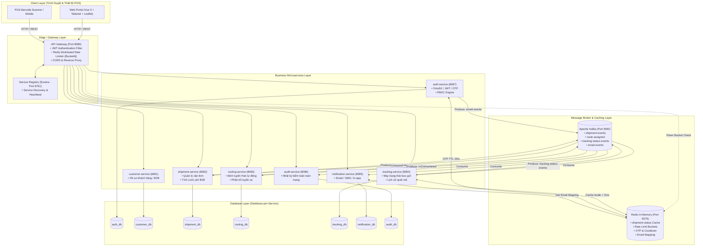
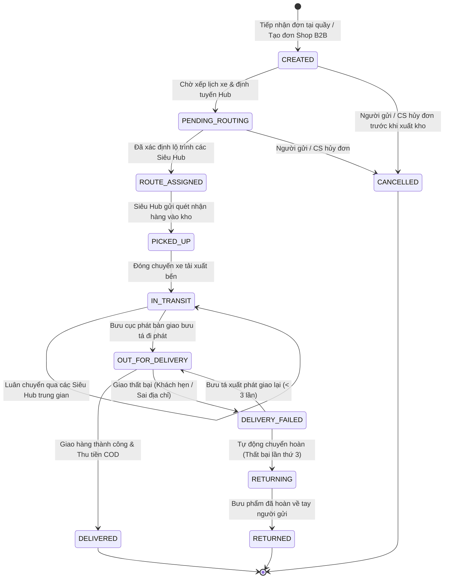

# Waybill Platform - Hệ Thống Điều Phối & Quản Trị Vận Đơn Bưu Chính Toàn Trình

[](https://www.oracle.com/java/)
[](https://spring.io/projects/spring-boot)
[](https://spring.io/projects/spring-cloud)
[](https://kafka.apache.org/)
[](https://redis.io/)
[](https://www.microsoft.com/sql-server)
[](https://vuejs.org/)
[](https://tailwindcss.com/)

---

## Mục Lục
1. [Giới Thiệu Tổng Quan](#1-giới-thiệu-tổng-quan)
2. [Kiến Trúc Hệ Thống (System Architecture)](#2-kiến-trúc-hệ-thống-system-architecture)
3. [Danh Sách Microservices & Cổng Dịch Vụ](#3-danh-sách-microservices--cổng-dịch-vụ)
4. [Chuỗi Nghiệp Vụ & Quy Trình Vận Hành Toàn Trình (Core Business Workflows)](#4-chuỗi-nghiệp-vụ--quy-trình-vận-hành-toàn-trình-core-business-workflows)
5. [Các Giải Pháp Kiến Trúc Đột Phá Vì Nghiệp Vụ (Key Architectural Solutions)](#5-các-giải-pháp-kiến-trúc-đột-phá-vì-nghiệp-vụ-key-architectural-solutions)
6. [Hệ Thống Phân Quyền Vận Hành Chuyên Trách (RBAC Matrix)](#6-hệ-thống-phân-quyền-vận-hành-chuyên-trách-rbac-matrix)
7. [Yêu Cầu Môi Trường & Công Nghệ](#7-yêu-cầu-môi-trường--công-nghệ)
8. [Hướng Dẫn Cài Đặt & Khởi Chạy (Step-by-Step)](#8-hướng-dẫn-cài-đặt--khởi-chạy-step-by-step)
9. [Tài Khoản Kiểm Thử Mẫu (Demo Accounts)](#9-tài-khoản-kiểm-thử-mẫu-demo-accounts)
10. [Cấu Trúc Thư Mục Dự Án (Project Structure)](#10-cấu-trúc-thư-mục-dự-án-project-structure)

---

## 1. Giới Thiệu Tổng Quan

**VNPT Waybill Platform** là nền tảng quản trị và điều phối vận đơn bưu chính toàn trình chuẩn Enterprise, được thiết kế chuyên biệt cho hệ sinh thái logistics thông minh và thương mại điện tử (E-Commerce). Hệ thống giải quyết trọn vẹn chuỗi cung ứng chuyển phát: từ khâu tiếp nhận đơn tại quầy bưu cục / kho Shop B2B, luân chuyển đa chặng giữa các Siêu Hub khai thác vùng (Bắc - Trung - Nam), cho đến điều phối bưu tá giao hàng chặng cuối (Last-mile Delivery) và đối soát dòng tiền thu hộ COD.

### 1.1. Bối Cảnh & Thách Thức Ngành Logistics Thực Tế
Trong kỷ nguyên bùng nổ thương mại điện tử, các đơn vị bưu chính - chuyển phát phải đối mặt với 5 bài toán nan giải:
1. **Nghẽn mạng tra cứu giờ cao điểm:** Hàng triệu người mua cùng lúc tra cứu hành trình bưu phẩm trong các đợt Siêu Sale khiến hệ thống CSDL dễ rơi vào tình trạng quá tải, treo quầy giao dịch.
2. **Vấn nạn lộ lọt thông tin cá nhân (PII) & Lừa đảo COD:** Thông tin số điện thoại, địa chỉ và giá trị tiền thu hộ bị rò rỉ, tạo kẽ hở cho đối tượng xấu mạo danh bưu tá giao hàng giả để chiếm đoạt tiền của người mua.
3. **Thất thoát cước phí & Gian lận tham số:** Nguy cơ người gửi cố tình can thiệp giá cước, làm sai lệch trọng lượng hoặc khai báo thiếu cước dịch vụ bưu chính.
4. **Ách tắc kho bãi do bưu phẩm "bom" (Hàng không phát được):** Hàng giao không thành công bị ngâm tại bưu cục phát quá hạn mà không có quy trình kích hoạt chuyển hoàn tự động về người gửi, gây đọng vốn và nguy cơ thất lạc.
5. **Rủi ro an ninh nhân sự nội bộ:** Nhân viên kho hoặc bưu tá vi phạm/nghỉ việc nhưng phiên đăng nhập (JWT Token) vẫn còn hiệu lực đến 24 giờ, có thể tiếp tục truy cập dữ liệu nhạy cảm.

### 1.2. Giá Trị Cốt Lõi Của Giải Pháp VNPT Waybill Platform
* **Bảo vệ toàn vẹn doanh thu:** Động cơ định giá cước bưu chính độc lập tại máy chủ theo công thức chuẩn logistics (tính lũy tiến theo khối lượng + phụ phí biến động xăng dầu + phí quản lý dòng tiền COD).
* **Bảo mật dữ liệu cá nhân theo nguyên tắc Zero-Trust:** Người nhận tra cứu công khai chỉ thấy lộ trình bưu phẩm; toàn bộ số điện thoại, địa chỉ nhà chi tiết và tiền COD được bảo mật tuyệt đối.
* **Tự động hóa luân chuyển & Chuyển hoàn thông minh:** Máy trạng thái 11 bước chuẩn hóa toàn trình, tự động kích hoạt lệnh chuyển hoàn khi giao thất bại quá 3 lần.
* **Kiểm soát truy cập tức thời (< 0.5ms):** Cơ chế "Danh sách đen" (Blacklist) tại cửa ngõ API Gateway vô hiệu hóa ngay lập tức quyền truy cập của tài khoản bị khóa mà không cần chờ hết hạn Token.
* **Trải nghiệm tra cứu thời gian thực siêu tốc (< 2ms):** Sử dụng tầng đệm phân tán giúp hệ thống chịu tải hàng chục ngàn yêu cầu đồng thời mà không chạm tới CSDL cốt lõi.

---

## 2. Kiến Trúc Hệ Thống (System Architecture)

Hệ thống được thiết kế theo mô hình Microservices hiện đại kết hợp Event-Driven Streaming:



---

## 3. Danh Sách Microservices & Cổng Dịch Vụ

| STT | Service Name | Port | CSDL (SQL Server) | Trách Nhiệm Nghiệp Vụ Chính |
| :---: | :--- | :---: | :---: | :--- |
| 1 | **`service-registry`** | `8761` | *None* | Netflix Eureka Server: Quản lý vị trí mạng và trạng thái hoạt động của toàn bộ Microservices. |
| 2 | **`api-gateway`** | `8080` | *None* | Cổng giao tiếp duy nhất (Single Entry Point): Kiểm tra JWT Token, Rate Limiting (Bucket4j-Redis), định tuyến request. |
| 3 | **`auth-service`** | `8087` | `auth_db` | Đăng nhập/Đăng ký, xác thực Google OAuth2, phát hành JWT Token, quản lý OTP quên mật khẩu và bảng phân quyền RBAC. |
| 4 | **`customer-service`** | `8081` | `customer_db` | Quản trị danh bạ đối tác B2B, chủ Shop TMĐT, hạn mức công nợ và đồng bộ hồ sơ người gửi. |
| 5 | **`shipment-service`** | `8082` | `shipment_db` | Khởi tạo bưu gửi, tính toán cước phí tự động, quản lý vòng đời bưu kiện và in phiếu gửi A5/A6. |
| 6 | **`routing-service`** | `8083` | `routing_db` | Thuật toán phân tuyến bưu cục tự động dựa trên mã bưu chính / địa chỉ gửi - nhận (Hà Nội, Đà Nẵng, TP.HCM, Cần Thơ, Hải Phòng). |
| 7 | **`tracking-service`** | `8084` | `tracking_db` | Quản lý máy trạng thái bưu gửi (State Machine), ghi nhận lịch sử quét mã barcode và cung cấp API tra cứu tốc độ cao. |
| 8 | **`notification-service`**| `8085` | `notification_db` | Lắng nghe sự kiện Kafka gửi Email HTML thông báo hành trình cho khách hàng và lưu vết thông báo. |
| 9 | **`audit-service`** | `8086` | `audit_db` | Ghi nhận toàn bộ chuỗi sự kiện Kafka thành nhật ký kiểm toán không thể xóa (Audit Trail) phục vụ tra soát. |
| 10 | **`frontend-dev-server`** | `3000` | *None* | Máy chủ Node.js phục vụ giao diện tĩnh và Reverse Proxy đường dẫn `/api` về cổng `8080`. |
| 11 | **`kafka-ui`** | `8090` | *None* | Giao diện trực quan hóa Topic, Partition, Consumer Group và tin nhắn trên Kafka Cluster. |

---

## 4. Chuỗi Nghiệp Vụ & Quy Trình Vận Hành Toàn Trình (Core Business Workflows)

### 4.1. Quy Trình Tiếp Nhận & Tự Động Định Tuyến Bưu Gửi (Shipment Intake & Smart Routing)
1. **Tiếp nhận nhu cầu gửi hàng:**
   - Khách hàng doanh nghiệp / Chủ Shop khởi tạo đơn số lượng lớn qua cổng thông tin trực tuyến, hoặc Giao dịch viên tiếp nhận bưu phẩm trực tiếp tại quầy bưu cục.
2. **Kiểm soát chất lượng dữ liệu bưu phẩm (Data Quality Control):**
   - **Trọng lượng kiện hàng:** Tự động đối soát trong khung chuẩn vận tải bưu chính từ $0.01\text{ kg}$ đến $50.0\text{ kg}$/kiện (phù hợp năng lực vận chuyển xe máy chặng cuối và xe tải liên tỉnh).
   - **Hạn mức bảo hiểm tiền mặt COD:** Kiểm soát chặt chẽ giá trị thu hộ tối đa $50.000.000\text{ VNĐ}$/đơn nhằm giảm thiểu rủi ro bảo an tiền mặt cho bưu tá.
   - **Thông tin liên lạc:** Kiểm tra định dạng số điện thoại di động chuẩn 10 số của các nhà mạng viễn thông Việt Nam để bảo đảm tỷ lệ kết nối thành công khi giao hàng.
   - **Xác thực mạng lưới bưu cục:** Tự động đối chiếu địa chỉ gửi - nhận với danh mục 5 Siêu Hub khai thác trọng điểm toàn quốc (Hà Nội, Hải Phòng, Đà Nẵng, TP.HCM, Cần Thơ).
3. **Niêm phong & Tính cước bưu phẩm độc lập (Tamper-Proof Pricing):**
   - Hệ thống máy chủ tự động tính cước chuẩn xác dựa trên khối lượng thực tế và gói dịch vụ lựa chọn, ngăn chặn triệt để mọi hành vi gian lận hoặc can thiệp sửa đổi giá cước từ phía người dùng.
4. **Phản hồi tức thì & Kích hoạt luân chuyển ngầm (Event-Driven Stream):**
   - Người gửi nhận ngay mã vận đơn bưu chính thời gian thực ($< 50\text{ ms}$) mà không cần chờ đợi.
   - Dưới nền tảng, hệ thống phát tín hiệu điều phối song song:
     - Dịch vụ điều tuyến tự động tính toán lộ trình xe tải tối ưu qua các Siêu Hub.
     - Dịch vụ hành trình nạp mốc trạng thái khởi tạo (`CREATED`) vào bộ nhớ đệm siêu tốc.
     - Dịch vụ thông báo kích hoạt gửi email xác nhận tạo đơn kèm mã tra cứu cho người gửi.
     - Dịch vụ kiểm toán lập biên bản ghi nhận nhật ký điện tử phục vụ tra soát.

### 4.2. Luân Chuyển Liên Hub & Điều Phối Giao Hàng Chặng Cuối (Hub Logistics & Last-Mile Delivery)
1. **Khai thác và phân luồng tại Siêu Hub:**
   - Thủ kho trung chuyển sử dụng máy quét mã vạch POS chuyên dụng để quét tiếp nhận bưu phẩm vào kho Hub (**Scan In** - `PICKED_UP`) và quét xuất kho đóng chuyến xe tải liên tỉnh (**Scan Out** - `IN_TRANSIT`).
   - **Phân định nghiệp vụ nghiêm ngặt:** Nhân viên Hub chỉ có thẩm quyền thao tác trong phạm vi kho bãi và các chuyến xe trung chuyển, không thể can thiệp vào quy trình giao hàng chặng cuối.
2. **Giao hàng chặng cuối (Last-Mile Delivery):**
   - Bưu tá tại bưu cục phát tiếp nhận danh sách bưu phẩm trên tuyến và quét xuất phát đi giao (`OUT_FOR_DELIVERY`).
   - Sau khi tiếp xúc người nhận, bưu tá cập nhật kết quả giao hàng thực tế:
     - **Giao thành công (`DELIVERED`):** Người nhận ký nhận bưu phẩm, bưu tá thu tiền COD (nếu có) và đơn hàng hoàn tất toàn trình.
     - **Giao thất bại (`DELIVERY_FAILED`):** Bưu tá ghi nhận nguyên nhân cụ thể (khách hẹn lại ngày giao, sai địa chỉ, không liên lạc được điện thoại) để hệ thống lên lịch phát lại.
3. **Chăm sóc khách hàng tự động đa kênh:**
   - Mỗi khi kiện hàng chuyển qua các mốc then chốt (xuất phát đi phát, giao thành công, báo phát thất bại hoặc chuyển hoàn), hệ thống tự động gửi thông báo chi tiết qua Email/SMS giúp người gửi và người nhận luôn chủ động nắm bắt hành trình.

### 4.3. Động Cơ Định Giá Cước Thông Minh & Bảo Toàn Doanh Thu (Smart Pricing Engine)
Cước phí bưu chính là huyết mạch doanh thu của doanh nghiệp vận tải. Hệ thống thiết lập bảng cước minh bạch, tính toán hoàn toàn tự động theo chuẩn mực ngành chuyển phát:

$$\text{Tổng Cước Thanh Toán} = (\text{Cước Cơ Bản} + \text{Phụ Phí Nhiên Liệu}) + \text{Phí Dịch Vụ Thu Hộ COD}$$

| Hạng Mục Cấu Thành Cước | Dịch Vụ Hỏa Tốc (EXPRESS) | Dịch Vụ Tiêu Chuẩn (STANDARD) | Ý Nghĩa Nghiệp Vụ Logistics |
| :--- | :--- | :--- | :--- |
| **Cước Khởi Điểm** ($\le 2.0\text{ kg}$) | **35.000 VNĐ** | **20.000 VNĐ** | Chi phí tiếp nhận, xử lý bao bì và chặng vận chuyển tối thiểu. |
| **Cước Vượt Cân** (Mỗi $\text{kg}$ tiếp theo) | **+22.000 VNĐ / kg** | **+13.000 VNĐ / kg** | Bù đắp chi phí tải trọng phương tiện trên từng cung đường. |
| **Phụ Phí Xăng Dầu (Fuel Surcharge)** | **6%** trên cước cơ bản | **6%** trên cước cơ bản | Cơ chế tự động thích ứng với biến động giá xăng dầu thị trường. |
| **Phí Dịch Vụ COD (Cash On Delivery)** | **1%** giá trị thu hộ *(Sàn tối thiểu 10.000 VNĐ)* | **1%** giá trị thu hộ *(Sàn tối thiểu 10.000 VNĐ)* | Chi phí quản lý rủi ro tiền mặt, bảo hiểm bưu gửi và đối soát ngân hàng. |

> [!IMPORTANT]
> **Nguyên tắc Bảo Toàn Doanh Thu (Backend Single Source of Truth):** Toàn bộ phép tính cước phí được thực thi độc quyền tại máy chủ trung tâm. Giao diện người dùng chỉ có nhiệm vụ hiển thị kết quả, hoàn toàn bị tước quyền tự khai báo hoặc chỉnh sửa giá tiền, triệt tiêu mọi khả năng gian lận cước phí.

### 4.4. Quy Trình Hủy Vận Đơn An Toàn & Chống Can Thiệp Chéo (Safe Cancellation & Anti-IDOR)
Trong thực tế vận hành logistics, khi bưu phẩm đã được xếp lên xe tải di chuyển trên cao tốc, việc hủy đơn giữa chặng là bất khả thi về mặt vật lý. Hệ thống thiết lập các chốt chặn kiểm soát:
1. **Kiểm tra trạng thái vật lý của bưu phẩm:**
   - Bưu phẩm **chỉ được phép hủy** khi còn nằm ở trạng thái ban đầu: vừa tạo đơn (`CREATED`) hoặc đang chờ phân tuyến xe (`PENDING_ROUTING`).
   - Một khi bưu phẩm đã vào luồng luân chuyển (`ROUTE_ASSIGNED`, `PICKED_UP`, v.v.), hệ thống lập tức từ chối lệnh hủy để bảo đảm tính chính xác của kế hoạch điều xe và tồn bãi tại các kho Hub.
2. **Bảo vệ quyền sở hữu dữ liệu (Chống can thiệp chéo IDOR):**
   - Chủ Shop chỉ có quyền hủy những vận đơn do chính cửa hàng mình tạo ra. Tuyệt đối không thể xem trộm hoặc hủy nhầm đơn hàng của đối tác khác.
   - Nhân viên Chăm sóc khách hàng (CS) và Quản trị viên (Admin) được cấp quyền hủy bảo trợ khi nhận được yêu cầu xác thực qua tổng đài hỗ trợ.
3. **Đồng bộ thời gian thực toàn mạng lưới:**
   - Ngay khi lệnh hủy được phê duyệt, hệ thống cập nhật trạng thái `CANCELLED`, xóa ngay bộ nhớ đệm để tránh hiển thị sai lệch và phát sự kiện đồng bộ toàn mạng, ngăn các bưu cục tiếp tục gom hàng nhầm.

### 4.5. Vòng Đời Bưu Gửi & Cơ Chế Tự Động Chuyển Hoàn (State Machine & Auto-Returning)
Hành trình bưu phẩm từ khi gửi đến khi phát tận tay người nhận được kiểm soát nghiêm ngặt qua cỗ máy trạng thái 11 bước:



* **Trạng thái kết thúc bất biến (Terminal States):**
  - Giao thành công (`DELIVERED`), Đã hủy đơn (`CANCELLED`) và Đã chuyển hoàn (`RETURNED`) là các điểm dừng cuối cùng của vòng đời. Khi đã rơi vào các trạng thái này, dữ liệu hành trình được đóng băng, không một cá nhân nào có thể quét thêm mốc mới vào bưu gửi.
* **Cơ chế tự động chuyển hoàn (Auto-Returning) bảo vệ người gửi:**
  - *Bài toán:* Hàng giao không thành công nhiều lần nếu không xử lý dứt điểm sẽ bị "ngâm" vô thời hạn tại bưu cục phát, gây đọng vốn COD của Shop và tăng nguy cơ hư hỏng, thất lạc.
  - *Giải pháp:* Hệ thống quy định bưu tá được giao lại tối đa **3 lượt**. Khi bưu tá báo giao thất bại đến lần thứ 3, máy trạng thái sẽ **tự động kích hoạt lệnh `RETURNING` (Chuyển hoàn bưu phẩm)** ngay lập tức, đưa hàng lên chuyến xe quay về người gửi, giải phóng kho bãi bưu cục phát.

---

## 5. Các Điểm Nhấn Kỹ Thuật Đột Phá

### 5.1. Tối Ưu Hóa Tốc Độ Tra Cứu Với Redis (Cache-Aside Pattern)
* Tra cứu vận đơn là thao tác có tần suất đọc (Read-heavy) lớn nhất hệ sinh thái.
* Khi có yêu cầu tra cứu:
  * **Cache HIT:** Lấy trực tiếp từ Redis RAM trong **1 - 2ms**, không chạm vào SQL Server.
  * **Cache MISS:** Đọc CSDL SQL Server 1 lần duy nhất rồi nạp lại vào Redis.
* Khi có cập nhật trạng thái: `tracking-service` ghi đè ngay trạng thái mới vào Redis, đảm bảo dữ liệu luôn thời gian thực (Real-time consistency).

### 5.2. Chống Tấn Công DDoS Bằng Token Bucket (Bucket4j-Redis)
* Tích hợp bộ lọc phân tán `RateLimitingFilter` ngay tại Gateway:
  * Mỗi IP bị giới hạn tối đa **60 requests / 30 giây**.
  * Toàn hệ thống có trần bảo vệ **100 requests / 60 giây**.
* Nếu vượt ngưỡng, hệ thống trả về HTTP `429 Too Many Requests` ngay lập tức, triệt tiêu nguy cơ quá tải dịch vụ nội bộ.

### 5.3. Phiên Đăng Nhập Phi Trạng Thái (Stateless JWT Security)
* Client lưu trữ `accessToken` trong `localStorage`.
* Mỗi request gửi qua Header `Authorization: Bearer <token>`.
* Gateway xác thực chữ ký HMAC-SHA256 bí mật, bóc tách `userId`, `roles`, `permissions` và đính kèm vào Header nội bộ (`X-User-Id`, `X-User-Roles`, `X-User-Permissions`) đẩy xuống các microservice. Không sử dụng Session bộ nhớ, hỗ trợ Scale-out vô hạn.

### 5.4. Giao Diện Chuẩn Enterprise & Hoạt Ảnh Mượt Mà
* Áp dụng nguyên tắc thiết kế tối giản dành cho B2B Logistics:
  * **Chuyển đổi trang chính (Main Page):** Fade & Slide-up (`0.20s`, `cubic-bezier(0.16, 1, 0.3, 1)`).
  * **Chuyển đổi biểu mẫu & subtab:** Slide-fade mượt mà (`0.18s - 0.22s`), không giật layout.
  * **Splash Preloader:** Vòng quay công nghệ Smooth Arc xoay 360° quanh Logo VNPT.
  * **Bản đồ số Leaflet:** Tích hợp tùy biến các lớp bản đồ đường bộ, Google tiếng Việt và ảnh vệ tinh, kèm các nút định vị nhanh lãnh thổ Việt Nam.

---

## 6. Hệ Thống Phân Quyền Vận Hành Chuyên Trách (RBAC Matrix)

Hệ thống thiết lập cơ cấu phân quyền phản ánh chuẩn xác mô hình tổ chức doanh nghiệp bưu chính, đảm bảo mỗi vị trí chỉ được tiếp cận đúng phạm vi nghiệp vụ được giao:

### 6.1. Cơ Cấu Tổ Chức & Trách Nhiệm Nghiệp Vụ
| Vai Trò Phân Quyền | Vị Trí Vận Hành Tương Đương | Trách Nhiệm & Phạm Vi Thao Tác |
| :--- | :--- | :--- |
| **`ROLE_ADMIN`** | Quản Trị Viên / Ban Điều Hành | Toàn quyền kiểm soát hệ thống, cấp phát quyền hạn nhân sự, khóa tài khoản vi phạm (kích hoạt Blacklist), xem nhật ký kiểm toán Audit Trail, điều hành toàn mạng lưới. |
| **`ROLE_CS`** | Giao Dịch Viên Quầy Bưu Cục | Tiếp nhận bưu phẩm tại quầy, sử dụng chế độ *"Tạo Hộ Khách Hàng"*, tra cứu toàn diện hồ sơ đơn, hỗ trợ hủy đơn và xử lý khiếu nại của khách. |
| **`ROLE_HUB_OPERATOR`** | Nhân Viên Khai Thác Siêu Hub | Quét mã vạch tiếp nhận hàng vào kho Hub (`PICKED_UP`), quét xuất kho đóng chuyến xe tải liên tỉnh (`IN_TRANSIT`), kiểm soát tồn bãi tại kho trung chuyển. |
| **`ROLE_SHIPPER`** | Bưu Tá Giao Hàng Chặng Cuối | Nhận danh sách bưu phẩm đi phát (`OUT_FOR_DELIVERY`), cập nhật kết quả giao hàng (`DELIVERED` hoặc `DELIVERY_FAILED` kèm lý do), quyết toán tiền mặt COD cuối ngày. |
| **`ROLE_CUSTOMER`** | Khách Hàng Doanh Nghiệp / Chủ Shop | Tự tạo đơn hàng loạt từ kho Shop, theo dõi lịch sử luân chuyển, hủy đơn khi chưa xếp xe (`CREATED` / `PENDING_ROUTING`), theo dõi dòng tiền thanh toán COD. |

### 6.2. Ma Trận Thẩm Quyền Thao Tác Trạng Thái Bưu Gửi (State Transition RBAC Matrix)

| Mốc Thao Tác Trên Bưu Gửi | Nhân Viên Hub (`ROLE_HUB_OPERATOR`) | Bưu Tá Phát (`ROLE_SHIPPER`) | Khách Hàng Shop (`ROLE_CUSTOMER`) | Quản Trị / CSKH (`ROLE_ADMIN` / `ROLE_CS`) |
| :--- | :---: | :---: | :---: | :---: |
| **`PICKED_UP`** (Tiếp nhận vào kho Hub) | Cho phép | Từ chối (403) | Từ chối (403) | Toàn quyền can thiệp |
| **`IN_TRANSIT`** (Đóng chuyến xe luân chuyển) | Cho phép | Từ chối (403) | Từ chối (403) | Toàn quyền can thiệp |
| **`OUT_FOR_DELIVERY`** (Xuất phát đi phát) | Từ chối (403) | Cho phép | Từ chối (403) | Toàn quyền can thiệp |
| **`DELIVERED`** (Phát hàng thành công) | Từ chối (403) | Cho phép | Từ chối (403) | Toàn quyền can thiệp |
| **`DELIVERY_FAILED`** (Báo phát thất bại) | Từ chối (403) | Cho phép | Từ chối (403) | Toàn quyền can thiệp |
| **`CANCELLED`** (Hủy bưu phẩm) | Không có quyền | Không có quyền | Đơn chính chủ (Chưa xuất kho) | Toàn quyền hủy bảo trợ |
| **`RETURNING`** (Chuyển hoàn bưu phẩm) | Tự động (Hệ thống) | Tự động (Hệ thống) | Không có quyền | Can thiệp thủ công |

---

## 7. Yêu Cầu Môi Trường & Công Nghệ

Trước khi cài đặt, máy tính của bạn cần có sẵn:
- **Java Development Kit (JDK):** Phiên bản **21 LTS** trở lên.
- **Apache Maven:** Phiên bản **3.9+**.
- **Docker & Docker Compose:** Dùng để chạy Kafka và Redis.
- **Microsoft SQL Server:** Phiên bản **2019 / 2022** (Lắng nghe tại cổng mặc định `1433`, tài khoản `sa` / `sa` hoặc cấu hình tương ứng).
- **Node.js:** Phiên bản **18+** (Dùng chạy frontend static server).

---

## 8. Hướng Dẫn Cài Đặt & Khởi Chạy (Step-by-Step)

### Bước 1: Clone Mã Nguồn
```bash
git clone https://github.com/Khanhnv26/Mini-Waybill-Platform---VNPT-Cloud.git
cd Mini-Waybill-Platform---VNPT-Cloud
```

### Bước 2: Khởi Động Hạ Tầng (Kafka & Kafka-UI)
Chạy lệnh Docker Compose ở thư mục gốc:
```bash
docker-compose up -d
```
* Kiểm tra Kafka UI tại: [http://localhost:8090](http://localhost:8090)

### Bước 3: Chuẩn Bị Cơ Sở Dữ Liệu SQL Server
1. Mở **SQL Server Management Studio (SSMS)** hoặc Azure Data Studio.
2. Tạo 7 cơ sở dữ liệu độc lập:
   ```sql
   CREATE DATABASE auth_db;
   CREATE DATABASE customer_db;
   CREATE DATABASE shipment_db;
   CREATE DATABASE routing_db;
   CREATE DATABASE tracking_db;
   CREATE DATABASE notification_db;
   CREATE DATABASE audit_db;
   ```
3. Chạy các script tạo dữ liệu mẫu trong thư mục `database/`:
   - Thực thi [`database/HubSeed.sql`](file:///c:/Users/LENOVO/Desktop/microservice/mini-waybill-platform/database/HubSeed.sql) (Nạp 5 Siêu Hub toàn quốc vào `routing_db`).
   - Thực thi [`database/seed_rbac_data.sql`](file:///c:/Users/LENOVO/Desktop/microservice/mini-waybill-platform/database/seed_rbac_data.sql) (Nạp bảng vai trò, quyền hạn và tài khoản mẫu vào `auth_db`).

### Bước 4: Biên Dịch Dự Án Backend
Tại thư mục gốc, chạy lệnh Maven để biên dịch toàn bộ các module:
```bash
mvn clean install -DskipTests
```

### Bước 5: Khởi Chạy Các Microservices (Theo Thứ Tự Chuẩn)
Mở các cửa sổ Terminal riêng biệt để chạy từng service:

1. **Khởi động Service Registry (Eureka) đầu tiên:**
   ```bash
   cd service-registry
   mvn spring-boot:run
   ```
   *(Chờ đến khi Eureka khởi động xong tại [http://localhost:8761](http://localhost:8761))*

2. **Khởi động API Gateway:**
   ```bash
   cd api-gateway
   mvn spring-boot:run
   ```

3. **Khởi động các dịch vụ nghiệp vụ (Core Services):**
   ```bash
   # Terminal 3: Auth Service
   cd auth-service && mvn spring-boot:run

   # Terminal 4: Customer Service
   cd customer-service && mvn spring-boot:run

   # Terminal 5: Shipment Service
   cd shipment-service && mvn spring-boot:run

   # Terminal 6: Routing Service
   cd routing-service && mvn spring-boot:run

   # Terminal 7: Tracking Service
   cd tracking-service && mvn spring-boot:run

   # Terminal 8: Notification Service
   cd notification-service && mvn spring-boot:run

   # Terminal 9: Audit Service
   cd audit-service && mvn spring-boot:run
   ```

### Bước 6: Khởi Chạy Giao Diện Người Dùng (Frontend Portal)
Mở terminal tại thư mục gốc dự án và chạy máy chủ phục vụ giao diện:
```bash
node server.js
```
* Truy cập Cổng Đăng Nhập: **[http://localhost:3000/login.html](http://localhost:3000/login.html)**
* Truy cập Cổng Dashboard / Tra Cứu: **[http://localhost:3000](http://localhost:3000)**

---

## 9. Tài Khoản Kiểm Thử Mẫu (Demo Accounts)

Hệ thống đã nạp sẵn danh sách tài khoản theo từng vai trò nghiệp vụ (Mật khẩu mặc định: `123456`):

| Vai Trò | Email Đăng Nhập | Mật Khẩu | Nghiệp Vụ Trọng Tâm |
| :--- | :--- | :---: | :--- |
| **Quản Trị Viên (Admin)** | `vankhanhak54@gmail.com` | `123456` | Quản trị RBAC, xem Audit Log, phân phối quyền hạn. |
| **Giao Dịch Viên (CS)** | `cs_quyet@vnpt.vn` | `123456` | Tiếp nhận đơn tại bưu cục, chế độ "Tạo Hộ Khách Hàng". |
| **Thủ Kho Hub (Hub Operator)** | `hub_hn_staff@vnpt.vn` | `123456` | Quét mã tiếp nhận (Scan In) & Đóng chuyến xe (Scan Out). |
| **Bưu Tá (Shipper)** | `shipper_nam@vnpt.vn` | `123456` | Giao hàng chặng cuối, báo phát thất bại, quyết toán COD. |
| **Khách Hàng Shop (Customer)** | `shop_hoangmai@gmail.com` | `123456` | Tạo đơn hàng loạt, theo dõi dòng tiền COD và hồ sơ Shop. |

---

## 10. Cấu Trúc Thư Mục Dự Án (Project Structure)

```plaintext
mini-waybill-platform/
├── .gitattributes             # Cấu hình GitHub Linguist ưu tiên hiển thị Java
├── docker-compose.yaml        # Hạ tầng Docker: Kafka, Kafka-UI, Redis
├── pom.xml                    # Maven Parent POM quản lý đa module
├── server.js                  # Máy chủ tĩnh phục vụ Frontend (Port 3000)
│
├── api-gateway/               # Spring Cloud Gateway (Port 8080)
│   └── src/main/java/.../filter/  # JWT Authentication & Rate Limiter Filter
│
├── auth-service/              # Dịch vụ xác thực & Quản trị RBAC (Port 8087)
├── customer-service/          # Quản lý hồ sơ đối tác & khách hàng B2B (Port 8081)
├── shipment-service/          # Quản lý vòng đời bưu phẩm & tính cước (Port 8082)
├── routing-service/           # Định tuyến thông minh qua 5 Siêu Hub (Port 8083)
├── tracking-service/          # Quản lý máy trạng thái & Redis Cache (Port 8084)
├── notification-service/      # Gửi Email thông báo hành trình bưu gửi (Port 8085)
├── audit-service/             # Lưu vết chuỗi sự kiện Kafka kiểm toán (Port 8086)
├── service-registry/          # Netflix Eureka Service Discovery (Port 8761)
│
├── database/                  # Tập hợp script SQL Server DDL & Data Seeding
│   ├── HubSeed.sql            # Dữ liệu 5 Siêu Hub khai thác
│   └── seed_rbac_data.sql     # Dữ liệu phân quyền RBAC & tài khoản mẫu
│
└── frontend/                  # Giao diện Web SPA (Vue 3 + Tailwind CSS)
    ├── css/style.css          # Theme màu VNPT, hiệu ứng chuyển trang 60fps
    ├── index.html             # Cổng chính tích hợp Sidebar điều hướng phân quyền
    ├── login.html             # Cổng đăng nhập bảo mật có hoạt ảnh trôi chậm
    └── js/
        ├── auth.js            # Module quản lý phiên JWT & giải mã Claims
        ├── api.js             # HTTP Client tự động gắn Bearer Token
        ├── app.js             # Điểm điều phối ứng dụng Vue chính
        ├── map.js             # Tích hợp bản đồ số Leaflet đa tầng
        ├── services/          # Các service gọi API tới Gateway
        └── views/             # Các màn hình nghiệp vụ (Shipment, Hub, Shipper,...)
```

---

## Tuyên Bố Miễn Trừ Trách Nhiệm (Disclaimer)
Dự án được xây dựng và phát triển với mục đích học tập, nghiên cứu và mô phỏng kiến trúc hệ thống Microservices (Simulation / Pet Project). Mọi thông tin thương hiệu, tên gọi bưu cục và dữ liệu vận đơn trong dự án đều mang tính chất minh họa kỹ thuật và phi thương mại.

