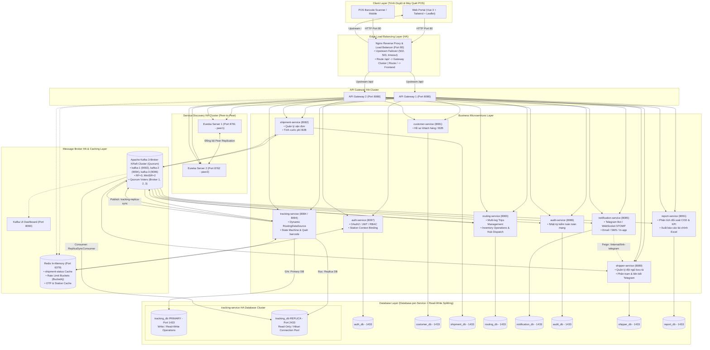

# VNPT Waybill Platform - Nền Tảng Điều Phối & Quản Trị Vận Đơn Bưu Chính Toàn Trình

[](https://www.oracle.com/java/)
[](https://spring.io/projects/spring-boot)
[](https://spring.io/projects/spring-cloud)
[](https://kafka.apache.org/)
[](https://redis.io/)
[](https://www.microsoft.com/sql-server)
[](https://nginx.org/)
[](https://flywaydb.org/)
[](https://vuejs.org/)
[](https://tailwindcss.com/)
[](https://leafletjs.com/)
[](https://stomp.github.io/)
[](https://core.telegram.org/bots)
[](https://developers.google.com/identity)
[](https://www.docker.com/)
[](https://springdoc.org/)

---

## 1. Giới Thiệu Tổng Quan

**VNPT Waybill Platform** là hệ thống Microservices chuẩn Enterprise mô phỏng chuỗi cung ứng chuyển phát bưu chính toàn trình: từ tiếp nhận bưu phẩm tại quầy / Shop B2B, quản lý chuyến xe trục liên tỉnh (Trips Management), phân luồng tại 5 Siêu Hub trọng điểm toàn quốc (Hà Nội, Hải Phòng, Đà Nẵng, TP.HCM, Cần Thơ), cho đến điều phối bưu tá phát hàng chặng cuối và quyết toán tiền thu hộ COD.

Hệ thống được thiết kế theo tiêu chuẩn **High Availability (HA - Tính sẵn sàng cao)** đa tầng, sẵn sàng chịu lỗi và tự phục hồi khi có sự cố phần cứng, mạng hoặc máy chủ dữ liệu.

---

## 2. Bối Cảnh Vận Hành & Nghiệp Vụ Bưu Chính Toàn Trình

Khác với các ứng dụng giao hàng nội thành đơn chặng, hệ thống bưu chính quy mô quốc gia vận hành theo mô hình phân tầng đa chặng với mạng lưới kho bãi phức tạp. Nền tảng mô phỏng và giải quyết triệt để 4 trụ cột nghiệp vụ trọng yếu:

### 2.1. Mô Hình Mạng Lưới Hub-and-Spoke & 5 Siêu Hub Toàn Quốc
* **Quy trình luân chuyển đa tầng:** Bưu gửi từ Người gửi tại quầy hoặc Shop B2B được tiếp nhận tại **Bưu cục gửi (Origin Post Office)** -> xe gom Feeder chở về **Siêu Hub gửi** -> xe tải trục liên tỉnh (**Trunk Trip**) chạy đường dài tới **Siêu Hub nhận** -> xe gom Feeder chuyển về **Bưu cục phát (Dest Post Office)** -> **Bưu tá (Shipper) phát hàng tận nơi (Last-Mile)** tới Người nhận.
* **Mạng lưới 5 Siêu Hub trọng điểm:** Phân bổ chiến lược trên toàn quốc gồm Hà Nội (`HUB_HAN`), Hải Phòng (`HUB_HPH`), Đà Nẵng (`HUB_DAD`), TP.HCM (`HUB_SGN`), và Cần Thơ (`HUB_VCA`), đóng vai trò cửa ngõ gom tải và định tuyến hàng hóa liên vùng.
* *Tài liệu chi tiết:* Xem sơ đồ phân cấp mạng lưới bưu chính tại [Cẩm nang 04 - Mô Hình Hub-and-Spoke](docs/04-logistics-domain-and-rbac-station-context.md#1-bản-đồ-nghiệp-vụ-vận-tải-bưu-chính-thực-tế).

### 2.2. Vòng Đời Vận Đơn & Máy Trạng Thái 11 Bước (State Machine)
* **Luân chuyển trạng thái tuần tự:** Vận đơn trải qua 11 mốc trạng thái chuẩn: `CREATED` -> `PENDING_ROUTING` -> `ROUTE_ASSIGNED` -> `PICKED_UP` -> `IN_TRANSIT` -> `ARRIVED_DEST_HUB` -> `OUT_FOR_DELIVERY` -> `DELIVERED`.
* **Cơ chế Tự động Chuyển hoàn (Auto-Returning):** Khi bưu tá báo phát thất bại (`DELIVERY_FAILED` do khách hẹn lại hoặc sai địa chỉ), hệ thống cho phép phát lại tối đa 3 lần. Khi phát hiện số lần thất bại đạt mốc 3, hệ thống tự động kích hoạt trạng thái `RETURNING` để chuyển hoàn bưu phẩm về người gửi, giải phóng sức chứa kho bãi.
* **Tính Bất Biến (Immutable Terminal States):** Các trạng thái kết thúc gồm `DELIVERED` (Giao thành công & Thu tiền COD), `RETURNED` (Đã hoàn hàng về Shop) và `CANCELLED` (Hủy hợp lệ) là bất biến tuyệt đối nhằm bảo đảm tính toàn vẹn chứng từ tài chính và kế toán.
* *Tài liệu chi tiết:* Xem mã nguồn Java State Machine và logic tự động chuyển hoàn tại [Cẩm nang 04 - Máy Trạng Thái Bưu Gửi](docs/04-logistics-domain-and-rbac-station-context.md#3-máy-trạng-thái-bưu-gửi-11-bước--tự-động-chuyển-hoàn-auto-returning) và kiến trúc phát sự kiện bất đồng bộ tại [Cẩm nang 03 - Kafka KRaft Cluster](docs/03-kafka-kraft-cluster-and-event-streaming.md).

### 2.3. Điều Phối Chuyến Xe Trục (Trips), Kiểm Soát Tải Trọng & Niêm Phong Seal
* **Kiểm soát tải trọng theo thời gian thực (Load Capacity Bar):** Hệ thống tự động cộng dồn khối lượng thực tế và thể tích quy đổi của từng kiện hàng khi xếp lên chuyến xe. Giao diện trực quan hóa mức tải xe (Xanh lá < 80%, Vàng 80-99%, Đỏ >= 100% cảnh báo/chặn xếp thêm đơn) giúp doanh nghiệp tuân thủ nghiêm ngặt quy định tải trọng đường bộ.
* **Niêm phong bảo an (Seal Number):** Trước khi xe tải xuất bến rời Hub, điều phối viên bắt buộc phải chốt mã số niêm chì (Seal). Khi xe cập bến Hub đích, thủ kho bắt buộc đối soát mã Seal thực tế trùng khớp với bảng kê điện tử (Manifest) mới được phép dỡ hàng.
* **Chống xung đột đa luồng:** Áp dụng khóa phân tán Redis (`SETNX`) đảm bảo khi 2 bưu tá cùng quét một kiện hàng trên thiết bị cầm tay, chỉ duy nhất 1 người giành được quyền xử lý, tránh race condition trong môi trường đồng thời cao.
* *Tài liệu chi tiết:* Xem thuật toán tính tải và quy trình niêm phong tại [Cẩm nang 04 - Quản Lý Chuyến Xe Trục](docs/04-logistics-domain-and-rbac-station-context.md#2-quản-lý-chuyến-xe-trục-đa-chặng-multi-leg-trips--manifests) và boilerplate khóa phân tán tại [Cẩm nang 05 - Redis Distributed Lock](docs/05-redis-caching-and-distributed-patterns.md#23-luồng-khóa-phân-tán-redis-distributed-lock---tránh-race-condition).

### 2.4. Quyết Toán Tài Chính COD 3 Pha & Báo Cáo Đối Soát Dòng Tiền (Financial Settlement & Reconciliation)
* **Quản trị dòng tiền COD minh bạch:** Tách biệt rõ ranh giới giữa tiền thu hộ COD (tiền của Shop ủy thác) và tiền cước vận chuyển B2B. Giải quyết triệt để rủi ro thất thoát bằng máy trạng thái tài chính 3 pha độc lập với trạng thái phát hàng: `UNSETTLED` (Bưu tá tạm giữ tiền mặt, nợ quỹ trạm) -> `PENDING_SETTLEMENT` (Bưu tá nộp bảng kê ca phát, chờ thủ quỹ kiểm đếm) -> `SETTLED` (Thủ quỹ bưu cục kiểm đếm đủ và duyệt tiền nhập két trạm).
* **Nghiệp vụ bưu tá nộp quỹ 1-Click & bưu cục duyệt quỹ:** Hỗ trợ bưu tá chọn lọc từng đơn hoặc bấm 1-click nộp toàn bộ ca phát; giao diện bưu cục đối soát tiền mặt tức thì với huy hiệu chấm tròn nhấp nháy động (`live-pulse-dot`).
* **Ràng buộc ngữ cảnh trạm làm việc (Station Context Binding):** Ngăn chặn triệt để lỗ hổng nhân viên có vai trò `ROLE_POST_OFFICE_STAFF` tại trạm Hà Nội cố tình hoặc vô ý thao tác đơn hàng thuộc địa bàn TP.HCM. Thông tin trạm (`X-User-Station-Id`) được Gateway trích xuất từ JWT và kiểm tra chéo tại tầng Business Service.
* **Thu hồi quyền tức thời qua Redis Blacklist:** Khi phát hiện nhân viên vi phạm hoặc đăng xuất, Gateway kiểm tra Redis Blacklist trong thời gian < 0.5ms để chặn đứng truy cập ngay lập tức mà không cần chờ JWT hết hạn.
* *Tài liệu chi tiết:* Xem giải pháp Station Context Binding tại [Cẩm nang 04 - Bảo Mật Ngữ Cảnh Trạm](docs/04-logistics-domain-and-rbac-station-context.md#4-bảo-mật-ngữ-cảnh-trạm-station-context-rbac), kiến trúc quyết toán COD tại [Cẩm nang 09 - Quyết Toán COD & Báo Cáo Đối Soát Dòng Tiền](docs/09-cod-settlement-and-financial-reconciliation.md), và bảo mật Gateway tại [Cẩm nang 06 - Microservices Security & Redis Blacklist](docs/06-microservices-security-jwt-and-rbac.md).

### 2.5. Tối Ưu Hóa Trải Nghiệm Giao Diện & Phòng Thủ Cửa Ngõ (Performance & Gateway Defense)
* **Client-side Caching với Vue 3 `<keep-alive>`:** Toàn bộ giao diện SPA áp dụng cơ chế lưu trữ các component vào RAM khi chuyển đổi menu sidebar. Triệt tiêu 100% các request `GET` dư thừa, tốc độ chuyển tab đạt tức thì (0ms latency), đồng thời bảo toàn nguyên vẹn bộ lọc tìm kiếm, phân trang và trạng thái checkbox đang chọn.
* **Bộ lọc Rate Limiting phân tầng (Tiered Token Bucket):** Tại API Gateway, tách biệt hạn mức độc lập giữa thao tác đọc (`GET`: 200 req / 30s) và thao tác ghi (`POST/PUT/DELETE`: 30 req / 30s). Giúp người dùng lướt web mượt mà không lo chạm ngưỡng 429, trong khi các luồng nhạy cảm vẫn được bảo vệ nghiêm ngặt chống spam và brute-force.
* **Xử lý an toàn CORS Preflight (`OPTIONS`):** Tự động bypass các request `OPTIONS` của trình duyệt trước khi trừ token rate limit, triệt tiêu hoàn toàn hiện tượng sập CORS giả lập trên Developer Console.
* **Cụm Service Registry HA 2 chiều:** Khắc phục triệt để lỗi so khớp hostname `PeerEurekaNodes.isInstanceURL()` bằng cơ chế đan xen `localhost` và `127.0.0.1`, đảm bảo 100% dữ liệu microservice được nhân bản 2 chiều giữa các node Eureka.
* *Tài liệu chi tiết:* Xem phân tích chuyên sâu tại [Cẩm nang 01 - Cấu Hình HA & Eureka Replication](docs/01-high-availability-and-nginx.md#34-bẫy-kỹ-thuật-eureka-peer-sync-1-chiều--cơ-chế-peereurekanodesisinstanceurl) và [Cẩm nang 05 - Redis Caching & Rate Limiter](docs/05-redis-caching-and-distributed-patterns.md#34-bộ-lọc-rate-limiting-phân-tầng-theo-http-method--xử-lý-an-toàn-cors).

### 2.6. Điều Phối Bưu Tá Qua Telegram Bot & Thông Báo Thời Gian Thực (WebSocket / STOMP)
* **Kênh điều phối di động tức thời (Telegram Bot):** Bưu tá hiện trường nhận thông báo lệnh phát hàng mới ngay trên ứng dụng Telegram di động mà không cần treo web portal. Tin nhắn điều phối gồm định dạng HTML trực quan: Mã vận đơn, thông tin người nhận, địa chỉ phát hàng, tiền thu hộ COD và ghi chú bưu gửi.
* **Cơ chế Long-Polling linh hoạt:** Cho phép `notification-service` kết nối nhận lệnh điều phối `/link` từ máy chủ Telegram Cloud mà không yêu cầu Public IP tĩnh, chứng chỉ SSL công khai hay mở cổng Inbound qua tường lửa doanh nghiệp.
* **WebSocket STOMP Broker (< 50ms):** Đẩy thông báo sự kiện bưu gửi thời gian thực tới chuông Notification Center và Toast pop-up trên Web Portal, giải phóng 100% tải HTTP Polling dư thừa từ Client.
* *Tài liệu chi tiết:* Xem chi tiết cơ chế tại [Cẩm nang 07 - Telegram Bot & Realtime Notifications](docs/07-telegram-bot-and-realtime-notifications.md).

### 2.7. Quản Trị Đội Ngũ Bưu Tá (shipper-service), Google Identity & Chống Quét Đúp (Idempotency)
* **Phân tách vi dịch vụ Bưu tá độc lập (`shipper-service`):** Định nghĩa bưu tá là tài nguyên vận hành giao vận theo Domain-Driven Design (DDD), gắn với ca làm việc thực địa (`ACTIVE`/`INACTIVE`), địa bàn bưu cục (`stationCode`) và kênh nhận tin (`telegram_chat_id`), độc lập hoàn toàn với tài khoản người dùng (`auth-service`) và khách hàng B2B (`customer-service`).
* **Xác thực đa nguồn Google OAuth2 & Avatar Stateless JWT:** Hỗ trợ xác thực Google ID Token qua Google API Client, nhúng trực tiếp claim `avatarUrl` vào JWT Payload giúp giao diện hiển thị ảnh đại diện với độ trễ 0ms mà không phát sinh thêm HTTP roundtrip.
* **Mô hình Idempotency & OperationId trong Logistics:** Xử lý triệt để bài toán công nhân bóp cò máy quét barcode 2 lần liên tiếp (Double-Scanning) hoặc mạng 4G chập chờn gây gửi đúp request, đảm bảo 100% tính toàn vẹn trạng thái kiện hàng và bảng kê COD.
* **Bộ lập lịch gom đơn tự động (Automated Consolidator) & Mốc Cut-off Buffer:** Tự động hóa gom kiện đạt ngưỡng tải trọng ($80\%$) và đóng sổ chuyến xe trước giờ xuất bến 30 phút để in bảng kê Manifest và niêm phong chì (Seal).
* *Tài liệu chi tiết:* Xem chi tiết kiến trúc tại [Cẩm nang 08 - Shipper Service, Google Identity & Idempotency](docs/08-shipper-service-identity-and-idempotency.md).

### 2.8. Vi Dịch Vụ Báo Cáo Phân Tích (report-service) & Xuất Excel 2 Sheet Chuẩn Kiểm Toán
* **Phân tách vi dịch vụ báo cáo độc lập (`report-service` - Port 8091):** Ứng dụng mô hình CQRS (Command Query Responsibility Segregation). Thay vì chạy các query aggregate nặng (`SUM`, `COUNT`, `GROUP BY`) làm chậm CSDL giao dịch cốt lõi `shipment_db`, `report-service` lưu trữ snapshot tối ưu (`report_db`) và nhận dữ liệu qua Kafka streaming.
* **Xuất báo cáo tài chính Excel 2 Sheet chuẩn kiểm toán:** Sử dụng Apache POI sinh file `.xlsx` chuyên nghiệp: Sheet 1 tổng hợp KPI tài chính (doanh thu cước, COD đã vào két, COD bưu tá đang giữ, tỷ lệ giao thành công); Sheet 2 là bảng kê chi tiết toàn bộ vận đơn phục vụ đối soát và lưu trữ thuế.
* **Tương tác vi mô 60fps (Micro-Interactions & Transitions):** Tích hợp hiệu ứng chuyển động mượt mà, phản hồi visual tức thời khi nộp quỹ / duyệt quỹ, thông báo realtime không cần reload trang.
* *Tài liệu chi tiết:* Xem chi tiết kiến trúc CQRS và xuất báo cáo tại [Cẩm nang 09 - Quyết Toán COD & Báo Cáo Đối Soát Dòng Tiền](docs/09-cod-settlement-and-financial-reconciliation.md).

---

## 3. Kiến Trúc Hệ Thống (System & HA Architecture)

Hệ thống kết hợp giữa **Spring Cloud Microservices**, **Apache Kafka KRaft Event-Driven Streaming**, và cơ chế **Database Read-Write Splitting** (Xem thêm chi tiết triển khai tại [Cẩm nang 01 - Cấu Hình HA & Nginx Failover](docs/01-high-availability-and-nginx.md) và [Cẩm nang 02 - Database Read-Write Splitting](docs/02-database-read-write-splitting-boilerplate.md)):



---

## 4. Cẩm Nang Kỹ Thuật Chuyên Sâu & Boilerplate (Documentation Deep-Dive)

Toàn bộ chi tiết triển khai kiến trúc, cú pháp cấu hình mẫu, mã nguồn boilerplate Java và checklist câu hỏi phỏng vấn được lưu trữ trong thư mục [`docs/`](docs/):

| STT | Tài Liệu Chuyên Sâu | Nội Dung Trọng Tâm & Boilerplate Code |
| :---: | :--- | :--- |
| **01** | [**Kiến Trúc HA & Nginx Load Balancing**](docs/01-high-availability-and-nginx.md) | Cấu hình Nginx Edge Reverse Proxy Upstream Failover, khắc phục bẫy Eureka Peer Sync 1 chiều (`PeerEurekaNodes.isInstanceURL`), thiết lập cụm Eureka Server Peer-to-Peer Replication (`peer1`/`peer2`) và template `docker-compose` mẫu. |
| **02** | [**Database Read-Write Splitting & Boilerplate**](docs/02-database-read-write-splitting-boilerplate.md) | Kỹ thuật tách luồng Đọc/Ghi qua Spring `AbstractRoutingDataSource`, xử lý `ThreadLocal`, cấu hình Hikari Pool, đồng bộ ngầm qua Kafka và **Bộ Template Generic độc lập** để copy vào dự án công ty. |
| **03** | [**Kafka KRaft Cluster & Event Streaming HA**](docs/03-kafka-kraft-cluster-and-event-streaming.md) | Sơ đồ luồng Kafka toàn trình, KRaft Quorum, Producer bất đồng bộ (`whenComplete`), Consumer Error Handling & Dead Letter Topic (`.DLT`), Idempotent Producer. |
| **04** | [**Nghiệp Vụ Logistics & Station Context RBAC**](docs/04-logistics-domain-and-rbac-station-context.md) | Logic Chuyến xe trục (Trips), thanh tải trọng (Load Bar), niêm phong Seal, dỡ hàng tại cổng Hub, tự động chuyển hoàn lần thứ 3 và bảo mật ngữ cảnh trạm làm việc. |
| **05** | [**Redis Caching, Rate Limiter & Distributed Lock**](docs/05-redis-caching-and-distributed-patterns.md) | Sơ đồ luồng Cache-Aside (< 2ms), Token Bucket phân tầng Read/Write chống DDoS (Bucket4j), xử lý an toàn CORS Preflight (`OPTIONS`), Distributed Lock (`SETNX`) chống race condition và Generic `RedisCacheService` độc lập. |
| **06** | [**Bảo Mật Microservices: Stateless JWT & RBAC**](docs/06-microservices-security-jwt-and-rbac.md) | Sơ đồ luồng Gateway Auth, Blacklist tức thời qua Redis (< 0.5ms), chống Header Spoofing (`HeaderMapRequestWrapper`), Spring Security 6.x và `UserContextHolder` boilerplate. |
| **07** | [**Telegram Bot & Realtime Notification (WebSocket/STOMP)**](docs/07-telegram-bot-and-realtime-notifications.md) | Phân tích sâu Long-Polling vs Webhook, luồng liên kết bưu tá qua Feign Client, kiến trúc WebSocket STOMP Message Broker (< 50ms), HTML notification templates và xử lý lỗi Telegram API rate limit. |
| **08** | [**Quản Trị Bưu Tá, Google Identity & Idempotency**](docs/08-shipper-service-identity-and-idempotency.md) | Phân tách vi dịch vụ `shipper-service` theo DDD, xác thực Google Identity & Avatar Stateless JWT, cơ chế Idempotent OperationId chống lỗi quét đúp mã vạch (Double-Scanning) và thuật toán Scheduler gom đơn có Cut-off buffer. |
| **09** | [**Quyết Toán COD & Báo Cáo Đối Soát Dòng Tiền**](docs/09-cod-settlement-and-financial-reconciliation.md) | Kiến trúc máy trạng thái quyết toán COD 3 pha (`UNSETTLED` -> `PENDING_SETTLEMENT` -> `SETTLED`), nghiệp vụ bưu tá nộp quỹ ca phát, bưu cục kiểm đếm nhập két, đồng bộ Event-Driven qua Kafka sang `report-service` (Port 8091) và xuất file Excel 2-sheet đối soát tài chính theo chuẩn kiểm toán. |

---

## 5. Hướng Dẫn Khởi Chạy Nhanh (Quickstart - 5 Phút)

### Bước 1: Khởi động Hạ tầng Docker HA
```bash
docker compose up -d
```
* **Kafka UI:** [http://localhost:8090](http://localhost:8090) (Kiểm tra 3 Brokers online).
* **Nginx Load Balancer:** [http://localhost:80](http://localhost:80).
* **Redis:** Port `6379`.
* **SQL Server Replica:** Port `2433` (`sa` / `Replica@123456`).

### Bước 2: Chuẩn bị CSDL Primary (SQL Server Port 1433)
1. Tạo 9 database: `auth_db`, `customer_db`, `shipment_db`, `routing_db`, `tracking_db`, `notification_db`, `audit_db`, `shipper_db`, `report_db`.
2. Chạy 2 script seed dữ liệu nền trong thư mục `database/`:
   * [`database/HubSeed.sql`](database/HubSeed.sql) (Nạp 5 Siêu Hub vào `routing_db`).
   * [`database/seed_rbac_data.sql`](database/seed_rbac_data.sql) (Nạp vai trò, quyền hạn vào `auth_db`).

### Bước 3: Biên dịch Backend
```bash
mvn clean install -DskipTests
```

### Bước 4: Khởi chạy các Microservices
```bash
# 1. Khởi động Eureka Registry (2 nodes HA)
cd service-registry && ./mvnw spring-boot:run -Dspring-boot.run.profiles=peer1
# (Mở terminal khác) cd service-registry && ./mvnw spring-boot:run -Dspring-boot.run.profiles=peer2

# 2. Khởi động API Gateway (2 instances HA)
cd api-gateway && ./mvnw spring-boot:run
# (Mở terminal khác) cd api-gateway && ./mvnw spring-boot:run -Dspring-boot.run.arguments=--server.port=8088

# 3. Khởi động các Core Services
cd auth-service && ./mvnw spring-boot:run
cd customer-service && ./mvnw spring-boot:run
cd shipment-service && ./mvnw spring-boot:run
cd routing-service && ./mvnw spring-boot:run
cd tracking-service && ./mvnw spring-boot:run
cd notification-service && ./mvnw spring-boot:run
cd audit-service && ./mvnw spring-boot:run
cd shipper-service && ./mvnw spring-boot:run
cd report-service && ./mvnw spring-boot:run
```

### Bước 5: Khởi chạy Frontend Portal
```bash
node server.js
```
* Truy cập qua Nginx Load Balancer: **[http://localhost](http://localhost)**
* Cổng Đăng Nhập: **[http://localhost/login.html](http://localhost/login.html)**

---

## 6. Tài Khoản Kiểm Thử Mẫu (Demo Accounts)

Mật khẩu mặc định cho toàn bộ tài khoản: `123456`

| Vai Trò | Email Đăng Nhập | Nghiệp Vụ & Quyền Hạn Trọng Tâm |
| :--- | :--- | :--- |
| **Quản Trị Viên (Admin)** | `vankhanhak54@gmail.com` | Quản trị RBAC, Audit Trail, gán vị trí trạm làm việc. |
| **Giao Dịch Viên (CS)** | `cs_quyet@vnpt.vn` | Tiếp nhận đơn tại quầy bưu cục, tạo hộ khách hàng. |
| **Thủ Kho Hub (Hub Operator)** | `hub_hn_staff@vnpt.vn` | Dỡ hàng tại cổng (Unload Gate), đóng chuyến xe liên tỉnh. |
| **Bưu Tá (Shipper)** | `shipper_nam@vnpt.vn` | Xuất phát giao hàng, báo phát thất bại, tự động chuyển hoàn. |
| **Khách Hàng Shop (Customer)** | `shop_hoangmai@gmail.com` | Tạo đơn số lượng lớn, theo dõi đối soát tiền COD. |

---

## 7. Cấu Trúc Thư Mục Dự Án (Project Structure)

```plaintext
mini-waybill-platform/
├── docker-compose.yaml        # Cụm hạ tầng HA: Kafka 3-Broker, Nginx LB, Redis, SQL Server Replica
├── pom.xml                    # Maven Parent POM quản lý đa module
├── server.js                  # Máy chủ Frontend (Port 3000 / 3001)
│
├── docs/                      # TÀI LIỆU KỸ THUẬT CHUYÊN SÂU & BOILERPLATE TEMPLATES
│   ├── 01-high-availability-and-nginx.md
│   ├── 02-database-read-write-splitting-boilerplate.md
│   ├── 03-kafka-kraft-cluster-and-event-streaming.md
│   ├── 04-logistics-domain-and-rbac-station-context.md
│   ├── 05-redis-caching-and-distributed-patterns.md
│   ├── 06-microservices-security-jwt-and-rbac.md
│   ├── 07-telegram-bot-and-realtime-notifications.md
│   ├── 08-shipper-service-identity-and-idempotency.md
│   └── 09-cod-settlement-and-financial-reconciliation.md
│
├── nginx/                     # Cấu hình Nginx Edge Load Balancer (nginx.conf)
├── api-gateway/               # Spring Cloud Gateway HA (Port 8080 & 8088)
├── service-registry/          # Netflix Eureka Server Peer-to-Peer (Port 8761 & 8762)
├── auth-service/              # Xác thực, RBAC & Station Context (Port 8087, auth_db)
├── customer-service/          # Quản lý hồ sơ đối tác B2B (Port 8081, customer_db)
├── shipment-service/          # Quản lý bưu gửi, tính cước độc lập (Port 8082, shipment_db)
├── routing-service/           # Quản lý Chuyến xe (Trips), Inventory Hub/Bưu cục (Port 8083, routing_db)
├── tracking-service/          # Máy trạng thái, CSDL Read-Write Splitting (Port 8084 & 8094)
├── notification-service/      # Lắng nghe Kafka gửi Email HTML & Telegram (Port 8085, notification_db)
├── audit-service/             # Nhật ký kiểm toán toàn mạng (Port 8086, audit_db)
├── shipper-service/           # Quản lý bưu tá, phân trạm & liên kết Telegram (Port 8089, shipper_db)
├── report-service/            # Phân tích đối soát COD, KPI tài chính & xuất Excel (Port 8091, report_db)
├── shared-events/             # DTO Event Contracts dùng chung giữa các microservice
├── database/                  # Script khởi tạo 5 Siêu Hub và ma trận RBAC
└── frontend/                  # Giao diện Web SPA (Vue 3 + Tailwind CSS + Leaflet Maps)
```

---

## 8. Tuyên Bố Miễn Trừ Trách Nhiệm (Disclaimer)
Dự án được xây dựng và phát triển với mục đích học tập, nghiên cứu và mô phỏng kiến trúc hệ thống Microservices (Simulation / Pet Project). Mọi thông tin thương hiệu, tên gọi bưu cục và dữ liệu vận đơn trong dự án đều mang tính chất minh họa kỹ thuật và phi thương mại.
