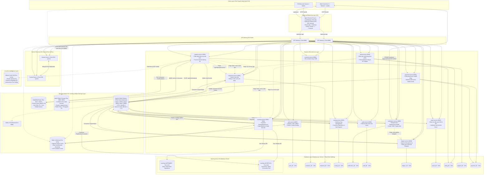

# VNPT Waybill Platform - Nền Tảng Điều Phối & Quản Trị Vận Đơn Bưu Chính Toàn Trình

[](https://www.oracle.com/java/)
[](https://spring.io/projects/spring-boot)
[](https://spring.io/projects/spring-cloud)
[](https://kafka.apache.org/)
[](https://redis.io/)
[](https://www.microsoft.com/sql-server)
[](https://nginx.org/)
[](https://flywaydb.org/)
[](https://vuejs.org/)
[](https://tailwindcss.com/)
[](https://leafletjs.com/)
[](https://stomp.github.io/)
[](https://core.telegram.org/bots)
[](https://developers.google.com/identity)
[](https://www.docker.com/)
[](https://kubernetes.io/)
[](https://github.com/features/actions)
[](https://springdoc.org/)
[](https://www.quartz-scheduler.org/)
[](https://spring.io/projects/spring-ai)
[](https://ollama.com/)
[](https://www.rabbitmq.com/)
[](https://min.io/)
[](https://vietqr.net/)
[](https://argoproj.github.io/cd/)
[](https://prometheus.io/)
[](https://grafana.com/)
[](https://waybill.vn)
[](https://waybill.vn)

---


## 1. Giới Thiệu Tổng Quan

**VNPT Waybill Platform** là hệ thống Microservices chuẩn Enterprise mô phỏng chuỗi cung ứng chuyển phát bưu chính toàn trình: từ tiếp nhận bưu phẩm tại quầy / Shop B2B, quản lý chuyến xe trục liên tỉnh (Trips Management), phân luồng tại 5 Siêu Hub trọng điểm toàn quốc (Hà Nội, Hải Phòng, Đà Nẵng, TP.HCM, Cần Thơ), cho đến điều phối bưu tá phát hàng chặng cuối và quyết toán tiền thu hộ COD.

Hệ thống được thiết kế theo tiêu chuẩn **High Availability (HA - Tính sẵn sàng cao)** đa tầng, sẵn sàng chịu lỗi và tự phục hồi khi có sự cố phần cứng, mạng hoặc máy chủ dữ liệu.

---

## 2. Bối Cảnh Vận Hành & Nghiệp Vụ Bưu Chính Toàn Trình

Hệ thống bưu chính vận hành theo mô hình phân tầng đa chặng với mạng lưới kho bãi và phương tiện phân tán. Nền tảng tập trung giải quyết các bài toán nghiệp vụ trọng yếu sau:

### 2.1. Mô Hình Mạng Lưới Hub-and-Spoke & 5 Siêu Hub Toàn Quốc
* **Quy trình luân chuyển:** Luồng bưu gửi đa chặng: Bưu cục gửi (Origin PO) $\rightarrow$ Xe gom (Feeder) $\rightarrow$ Siêu Hub gửi $\rightarrow$ Chuyến xe trục liên tỉnh (Trunk Trip) $\rightarrow$ Siêu Hub nhận $\rightarrow$ Xe gom $\rightarrow$ Bưu cục phát (Dest PO) $\rightarrow$ Bưu tá (Last-mile) phát tới người nhận.
* **Mạng lưới 5 Siêu Hub:** Đặt tại Hà Nội (`HUB_HAN`), Hải Phòng (`HUB_HPH`), Đà Nẵng (`HUB_DAD`), TP.HCM (`HUB_SGN`), Cần Thơ (`HUB_VCA`) làm cửa ngõ gom tải và định tuyến liên vùng.
* *Chi tiết:* [Cẩm nang 04 - Mô Hình Hub-and-Spoke](docs/04-logistics-domain-and-rbac-station-context.md#1-bản-đồ-nghiệp-vụ-vận-tải-bưu-chính-thực-tế).

### 2.2. Vòng Đời Vận Đơn & Máy Trạng Thái (State Machine)
* **11 mốc trạng thái tuần tự:** `CREATED` $\rightarrow$ `PENDING_ROUTING` $\rightarrow$ `ROUTE_ASSIGNED` $\rightarrow$ `PICKED_UP` $\rightarrow$ `IN_TRANSIT` $\rightarrow$ `ARRIVED_DEST_HUB` $\rightarrow$ `OUT_FOR_DELIVERY` $\rightarrow$ `DELIVERED`.
* **Tự động chuyển hoàn (Auto-Returning):** Bưu tá báo phát thất bại (`DELIVERY_FAILED`) tối đa 3 lần; khi đủ 3 lần hệ thống tự chuyển sang `RETURNING` để hoàn hàng về người gửi.
* **Trạng thái kết thúc bất biến:** `DELIVERED`, `RETURNED`, `CANCELLED` là trạng thái cuối không thể sửa đổi nhằm bảo toàn tính toàn vẹn chứng từ tài chính.
* *Chi tiết:* [Cẩm nang 04 - Máy Trạng Thái Bưu Gửi](docs/04-logistics-domain-and-rbac-station-context.md#3-máy-trạng-thái-bưu-gửi-11-bước--tự-động-chuyển-hoàn-auto-returning) và [Cẩm nang 03 - Kafka KRaft Cluster](docs/03-kafka-kraft-cluster-and-event-streaming.md).

### 2.3. Điều Phối Chuyến Xe Trục (Trips), Tải Trọng & Niêm Phong Seal
* **Kiểm soát tải trọng theo thời gian thực:** Tự động cộng dồn khối lượng và thể tích quy đổi khi xếp kiện lên xe; thanh tải trọng cảnh báo theo ngưỡng (< 80% Xanh, 80-99% Vàng, $\ge 100\%$ Đỏ - chặn xếp thêm).
* **Niêm phong bảo an (Seal Number):** Bắt buộc chốt mã niêm chì trước khi xe xuất bến; Hub đích đối soát mã Seal trùng khớp với Manifest điện tử mới được phép dỡ hàng.
* **Chống xung đột đa luồng:** Áp dụng Redis Distributed Lock (`SETNX`) khi nhiều thiết bị cùng quét một kiện hàng trong môi trường đồng thời cao.
* *Chi tiết:* [Cẩm nang 04 - Quản Lý Chuyến Xe Trục](docs/04-logistics-domain-and-rbac-station-context.md#2-quản-lý-chuyến-xe-trục-đa-chặng-multi-leg-trips--manifests) và [Cẩm nang 05 - Redis Distributed Lock](docs/05-redis-caching-and-distributed-patterns.md#23-luồng-khóa-phân-tán-redis-distributed-lock---tránh-race-condition).

### 2.4. Quyết Toán Tài Chính COD 3 Pha & Đối Soát Dòng Tiền
* **Máy trạng thái COD 3 pha:** Tách biệt tiền thu hộ COD và tiền cước B2B; chu trình 3 pha: `UNSETTLED` (Bưu tá giữ tiền mặt) $\rightarrow$ `PENDING_SETTLEMENT` (Bưu tá nộp bảng kê ca phát) $\rightarrow$ `SETTLED` (Thủ quỹ trạm duyệt nhập két).
* **Ràng buộc ngữ cảnh trạm (Station Context RBAC):** Header `X-User-Station-Id` được trích xuất từ JWT tại Gateway và kiểm tra chéo tại Service, ngăn nhân viên thao tác ngoài phạm vi trạm phân công.
* **Thu hồi phiên tức thời:** Kiểm tra Redis Blacklist (< 0.5ms) tại Gateway để vô hiệu hóa token đăng xuất mà không cần chờ JWT hết hạn.
* *Chi tiết:* [Cẩm nang 04 - Station Context](docs/04-logistics-domain-and-rbac-station-context.md#4-bảo-mật-ngữ-cảnh-trạm-station-context-rbac), [Cẩm nang 06 - JWT & RBAC](docs/06-microservices-security-jwt-and-rbac.md), [Cẩm nang 09 - Quyết Toán COD](docs/09-cod-settlement-and-financial-reconciliation.md).

### 2.5. Tối Ưu Giao Diện & Phòng Thủ API Gateway
* **Client-side Caching (Vue 3 `<keep-alive>`):** Giữ trạng thái component trên RAM khi chuyển tab, bảo toàn bộ lọc tìm kiếm và giảm thiểu request dư thừa.
* **Rate Limiting phân tầng (Tiered Token Bucket):** Gateway giới hạn độc lập giữa thao tác đọc (`GET`: 200 req / 30s) và ghi (`POST/PUT/DELETE`: 30 req / 30s); tự động bypass CORS preflight (`OPTIONS`).
* **Service Registry HA 2 chiều:** Đồng bộ song phương giữa các node Eureka bằng cấu hình đan xen `localhost` và `127.0.0.1`, tránh lỗi `PeerEurekaNodes.isInstanceURL()`.
* *Chi tiết:* [Cẩm nang 01 - Cấu Hình HA & Eureka](docs/01-high-availability-and-nginx.md#34-bẫy-kỹ-thuật-eureka-peer-sync-1-chiều--cơ-chế-peereurekanodesisinstanceurl) và [Cẩm nang 05 - Redis Rate Limiter](docs/05-redis-caching-and-distributed-patterns.md#34-bộ-lọc-rate-limiting-phân-tầng-theo-http-method--xử-lý-an-toàn-cors).

### 2.6. Điều Phối Bưu Tá Qua Telegram Bot & WebSocket Thời Gian Thực
* **Điều phối bưu tá qua Telegram Bot:** Gửi thông tin phát hàng (mã vận đơn, địa chỉ, COD, người nhận) trực tiếp đến Telegram bưu tá; kết nối qua Long-Polling không yêu cầu mở cổng Inbound hay IP tĩnh.
* **Thông báo thời gian thực (WebSocket STOMP):** Đẩy thông báo sự kiện bưu gửi tức thì (< 50ms) tới Web Portal qua topic STOMP, thay thế cơ chế HTTP Polling.
* *Chi tiết:* [Cẩm nang 07 - Telegram Bot & Realtime Notifications](docs/07-telegram-bot-and-realtime-notifications.md).

### 2.7. Quản Trị Bưu Tá, Google Identity & Chống Quét Đúp (Idempotency)
* **Domain Bưu tá riêng biệt:** Quản lý bưu tá theo trạm (`stationCode`), trạng thái ca trực (`ACTIVE`/`INACTIVE`) và liên kết Telegram chat ID theo chuẩn Domain-Driven Design (DDD).
* **Google OAuth2 & Idempotency:** Hỗ trợ xác thực Google ID Token với avatar nhúng trong JWT; áp dụng `OperationId` để xử lý lỗi quét đúp mã vạch (Double-Scanning) hoặc mạng chập chờn.
* **Lập lịch gom chuyến xe (Quartz Scheduler):** Định kỳ kiểm tra tải trọng chuyến và tự động đóng sổ trước giờ khởi hành (Cut-off buffer 30 phút).
* *Chi tiết:* [Cẩm nang 08 - Quản Trị Bưu Tá & Idempotency](docs/08-shipper-service-identity-and-idempotency.md).

### 2.8. Phân Tích Đối Soát Dòng Tiền & Xuất Báo Cáo (CQRS)
* **Tách luồng đọc báo cáo (CQRS):** Bảng tổng hợp báo cáo độc lập được cập nhật bất đồng bộ qua Kafka, không chạy aggregate nặng (`SUM`, `COUNT`, `GROUP BY`) trên CSDL giao dịch.
* **Xuất báo cáo Excel 2 sheet:** Sheet 1 tổng hợp KPI tài chính (doanh thu, COD đã nộp, COD đang giữ); Sheet 2 chi tiết từng vận đơn để đối soát và kiểm toán.
* *Chi tiết:* [Cẩm nang 09 - Quyết Toán COD & Báo Cáo Đối Soát](docs/09-cod-settlement-and-financial-reconciliation.md).

### 2.9. Động Cơ Định Giá & Ma Trận Cước Bưu Chính (Pricing Engine)
* **Khối lượng thể tích:** Chuẩn IATA: $(L \times W \times H) / 5000 \times 1000$ (gram). Khối lượng tính cước là $\max(W_{\text{actual}}, W_{\text{volumetric}})$.
* **Ma trận cước phân vùng & phân tầng:** Phân định Nội tỉnh (`INTRA_PROVINCE`) và Liên miền (`INTER_REGION`) với 3 gói dịch vụ: `ECO`, `STANDARD`, `EXPRESS`.
* **Phụ phí tự động:** Nhiên liệu (6%), COD (1%, min 10.000 VNĐ), bảo hiểm khai giá (0.5%).
* *Chi tiết:* [Cẩm nang 13 - Động Cơ Định Giá & Ma Trận Cước Bưu Chính](docs/13-pricing-engine-and-tariff-matrix.md).

### 2.10. Trợ Lý AI & Quản Trị Khiếu Nại (Spring AI & Ollama)
* **On-Premise LLM với Ollama (`qwen2.5:7b`):** Chạy cục bộ bảo mật thông tin khách hàng, tích hợp qua Spring AI `ChatClient`.
* **Autonomous Tool Calling:** AI tự động gọi các công cụ nghiệp vụ nội bộ (`PostalAiTools`) để tra cứu lộ trình bưu phẩm, tính cước phí và kiểm tra trạng thái khiếu nại.
* **Quản trị vòng đời khiếu nại:** 4 bước `SUBMITTED` $\rightarrow$ `INVESTIGATING` $\rightarrow$ `RESOLVED` / `REJECTED`, lưu trữ trên CSDL độc lập quản lý bằng Flyway.
* *Chi tiết:* [Cẩm nang 14 - Trợ Lý Ảo GenAI & Spring AI Tool Calling](docs/14-spring-ai-agent-and-support-ticketing.md).

### 2.11. Đếm Ngược SLA RabbitMQ & Xử Lý Hủy Đơn Liên Dịch Vụ
* **Polyglot Messaging:** Kết hợp RabbitMQ (đếm ngược SLA), Kafka (truyền phát sự kiện toàn mạng) và OpenFeign (giao tiếp đồng bộ).
* **Bộ đếm lùi SLA qua Message TTL & DLX:** Hàng đợi tạm gắn TTL 120s kết hợp Dead-Letter Exchange; khi quá hạn không có nhân viên tiếp nhận, tin nhắn tự chuyển sang queue leo thang (`ESCALATED`) mà không cần polling CSDL.
* **Xử lý hủy đơn liên dịch vụ:** CSKH duyệt khiếu nại hư hỏng/mất mát kích hoạt Feign Client hủy đơn bên `shipment-service`; `routing-service` lắng nghe sự kiện để gỡ kiện khỏi bảng kê và hoàn trả tải trọng xe.
* *Chi tiết:* [Cẩm nang 15 - RabbitMQ SLA & Hủy Đơn Liên Dịch Vụ](docs/15-rabbitmq-priority-queue-and-sla-dead-letter-patterns.md).

### 2.12. Lưu Trữ Tệp Đính Kèm Khiếu Nại Với MinIO Object Storage
* **Kiến trúc S3 Object Storage:** Lưu trữ chứng từ, ảnh hư hỏng và biên bản giải quyết tại MinIO (S3 API), tách biệt hoàn toàn dữ liệu nhị phân khỏi CSDL quan hệ.
* **Tự khởi tạo Bucket & Chính sách truy cập:** `MinioBucketSupport` tự kiểm tra và tạo bucket kèm chính sách truy cập công khai khi khởi động; hỗ trợ Presigned URL có thời hạn cho chứng từ nhạy cảm.
* **Distroless Container:** Sử dụng image Chainguard bảo mật cao, phân định rành mạch giữa Port 9000 (S3 API) và Port 9001 (Web Console).
* *Chi tiết:* [Cẩm nang 16 - Lưu Trữ MinIO Object Storage & S3](docs/16-minio-object-storage-and-s3-boilerplate.md).

### 2.13. Cổng Thanh Toán VietQR & Thông Báo Thời Gian Thực
* **VietQR động chuẩn NAPAS 247:** Tạo mã QR kèm số tiền và mã bưu gửi cho cả cước vận chuyển và tiền COD; người nhận quét thanh toán qua ứng dụng ngân hàng.
* **Đồng bộ sự kiện & Chuông thông báo:** Webhook ngân hàng kích hoạt sự kiện Kafka `payment-success-events`, đẩy thông báo WebSocket STOMP tức thời (< 50ms) lên chuông Topbar của Web Portal.
* **Chống thanh toán đúp:** Kiểm tra trạng thái giao dịch `SUCCESS` trước khi sinh mã QR; giao diện tự chuyển đổi nút bấm sang trạng thái "Đã Thu".
* *Chi tiết:* [Cẩm nang 17 - Cổng Thanh Toán VietQR](docs/17-vietqr-payment-gateway-and-realtime-reconciliation.md).

### 2.14. Đánh Giá Bưu Phẩm 2 Tầng & Tính KPI Bưu Tá
* **Đánh giá 2 tầng độc lập:** Phân định rõ chất lượng vận chuyển / hàng hóa (`serviceRating`) và thái độ phục vụ của bưu tá (`shipperRating`) từ 1 đến 5 sao.
* **Bảo vệ chống gian lận & Tính KPI thời gian thực:** Chỉ đánh giá đơn `DELIVERED`, xác thực số điện thoại và ràng buộc unique tracking; gửi sự kiện Kafka để cập nhật điểm KPI trung bình lũy kế của bưu tá.
* **Hỗ trợ khiếu nại nhanh:** Tự động gắn cờ `suggestTicket = true` gợi ý mở ticket CSKH khi đánh giá dưới 3 sao.
* *Chi tiết:* [Cẩm nang 18 - Đánh Giá Bưu Phẩm & KPI Bưu Tá](docs/18-shipment-rating-and-shipper-kpi.md).

### 2.15. Giao Diện Single Page Application (SPA) & Clean URL
* **Kiến trúc Vue 3 SPA:** Hợp nhất toàn bộ giao diện thành một SPA duy nhất (HTML5 History Mode), hỗ trợ URL chuẩn (`/tracking`, `/shipment`, `/trips`, `/fleet`, `/post-office`, `/hub-ops`, `/shipper`, `/report`, `/support`, v.v.).
* **Thanh Sub-tab Segmented Pill đồng bộ:** Thiết kế dạng viên thuốc compact (~40px) có hiệu ứng chuyển động mượt mà trên 7 phân hệ, tích hợp nút Live Refresh 32px và chuẩn hóa làm tròn các tỷ lệ số liệu (SLA, công suất tải).
* **Bảo vệ tuyến đường (Route Guard):** Lưu URL đích và tự động chuyển hướng đăng nhập khi chưa có phiên; hỗ trợ nút Back/Forward qua sự kiện `popstate`.
* **SPA Server Fallback:** Node.js cấu hình rewrite URL về `index.html` và chuyển hướng 301 cho các đường dẫn HTML cũ.

### 2.16. Transactional Outbox Pattern & Saga Compensation Phân Tán
* **Khắc phục lỗi Dual-Write:** Lưu trữ bản ghi nghiệp vụ và `OutboxEvent` trong cùng một transaction CSDL SQL Server; bộ lập lịch định kỳ đọc và phát sự kiện lên Kafka có kiểm tra ACK.
* **Saga Compensation:** Khi đơn bị hủy (`CANCELLED`), lưu tombstone vào Redis và phát sự kiện bù trừ: gỡ kiện khỏi chuyến xe chờ (`SCHEDULED`), trừ tải trọng xe; hoặc gắn nhãn `HOLD_FOR_RETURN` nếu xe đang chạy (`IN_TRANSIT`).
* *Chi tiết:* [Cẩm nang 19 - Transactional Outbox & Saga Compensation](docs/19-transactional-outbox-and-saga-compensation.md).

### 2.17. Ước Tính ETA Động & Dự Báo Sản Lượng Giao Hàng
* **Động cơ ETA đa chặng:** Tính toán theo địa chỉ thực tế, giờ Cut-off (18h00), thời gian đệm quay đầu xe tại Hub (12h), khoảng cách địa lý và vận tốc định mức 55 km/h; tự động tái ước lượng định kỳ.
* **Dự báo sản lượng ngày kế tiếp:** Tổng hợp từ 3 nguồn (đang trên đường về, tồn kho tại bưu cục, cam kết giao ngày mai) để tính tỷ lệ tải ca bưu tá (`utilizationRate`) và đưa ra cảnh báo quá tải kèm đề xuất nhân sự.
* *Chi tiết:* [Cẩm nang 20 - Ước Tính ETA Động & Dự Báo Sản Lượng](docs/20-dynamic-eta-engine-and-delivery-forecast.md).

### 2.18. Quản Trị Đội Xe (Fleet Management) & Bot Telegram Bưu Tá 2 Chiều
* **Quản trị phương tiện:** Theo dõi 3 phân khúc xe (Xe tải liên tỉnh, Van trung chuyển, Xe máy bưu tá) về biển số, tải trọng, tình trạng bảo dưỡng và trạm gán qua giao diện `/fleet`.
* **Tương tác 2 chiều qua Telegram Bot:** Bưu tá xem danh sách đơn phát hôm nay, bấm nút cập nhật giao thành công hoặc lý do thất bại, kiểm tra tiền COD đang giữ và nộp quỹ ca phát trực tiếp từ Telegram.
* *Chi tiết:* [Cẩm nang 21 - Quản Trị Đội Xe & Telegram Bot Bưu Tá](docs/21-fleet-vehicle-management-and-shipper-bot-actions.md).

### 2.19. Tự Động Hóa GitOps (ArgoCD) & Hệ Thống Giám Sát (Prometheus & Grafana)
* **GitOps với ArgoCD:** Khai báo cấu hình K8s theo Git làm nguồn chân lý duy nhất, tự động đồng bộ và tự phục hồi khi có lệch cấu hình (`prune: true`, `selfHeal: true`).
* **Hạ tầng quan sát phân tầng:** Prometheus tự động cào metrics từ các microservice Spring Boot (`/actuator/prometheus`), Node Exporter và Kube State Metrics; Grafana cung cấp 3 dashboard giám sát nghiệp vụ, hạ tầng K8s và JVM.
* **Tối ưu HPA & Eureka:** Cấu hình HPA trần 3 replicas bảo vệ tài nguyên; gán Eureka instance ID ngẫu nhiên để tránh bản ghi rác khi Pod khởi động lại.
* *Chi tiết:* [Cẩm nang 22 - GitOps ArgoCD & Giám Sát Prometheus Grafana](docs/22-gitops-argocd-and-prometheus-grafana-monitoring.md).

---

## 3. Kiến Trúc Hệ Thống (System & HA Architecture)

Hệ thống kết hợp giữa **Spring Cloud Microservices**, **Apache Kafka KRaft Event-Driven Streaming**, và cơ chế **Database Read-Write Splitting** (Xem thêm chi tiết triển khai tại [Cẩm nang 01 - Cấu Hình HA & Nginx Failover](docs/01-high-availability-and-nginx.md) và [Cẩm nang 02 - Database Read-Write Splitting](docs/02-database-read-write-splitting-boilerplate.md)):


```mermaid
flowchart TB
    subgraph ClientLayer [" Client Layer (Trình Duyệt & Máy Quét POS) "]
        UI["Web Portal (Vue 3 + Tailwind + Leaflet)"]
        Scanner["POS Barcode Scanner / Mobile"]
    end

    subgraph EdgeLayer [" Edge Load Balancing Layer (HA) "]
        Nginx["Nginx Reverse Proxy & Load Balancer (Port 80)\n• Upstream Failover (502, 503, timeout)\n• Route /api/ -> Gateway Cluster | Route / -> Frontend"]
    end

    subgraph GatewayLayer [" API Gateway HA Cluster "]
        GW1["API Gateway 1 (Port 8080)"]
        GW2["API Gateway 2 (Port 8088)"]
    end

    subgraph RegistryLayer [" Service Discovery HA Cluster (Peer-to-Peer) "]
        Eureka1["Eureka Server 1 (Port 8761 - peer1)"]
        Eureka2["Eureka Server 2 (Port 8762 - peer2)"]
        Eureka1 <-->|"Đồng bộ Peer Replication"| Eureka2
    end

    subgraph ServiceLayer [" Business Microservices Layer "]
        AuthSvc["auth-service (8087)\n• OAuth2 / JWT / RBAC\n• Station Context Binding"]
        CustSvc["customer-service (8081)\n• Hồ sơ khách hàng / B2B"]
        ShipSvc["shipment-service (8082)\n• Quản lý vận đơn\n• Động cơ tính cước phí B2B"]
        RouteSvc["routing-service (8083)\n• Multi-leg Trips Management\n• Inventory Operations & Hub Dispatch"]
        TrackSvc["tracking-service (8084 / 8094)\n• Dynamic RoutingDataSource\n• State Machine & Quét barcode"]
        NotiSvc["notification-service (8085)\n• Telegram Bot / WebSocket STOMP\n• Email / SMS / Topbar Bell"]
        AuditSvc["audit-service (8086)\n• Nhật ký kiểm toán toàn mạng"]
        ShipperSvc["shipper-service (8089)\n• Quản lý đội ngũ bưu tá\n• Phân trạm & liên kết Telegram"]
        ReportSvc["report-service (8091)\n• Phân tích đối soát COD & KPI\n• Xuất báo cáo tài chính Excel"]
        RatingSvc["rating-service (8092)\n• Đánh giá chất lượng bưu phẩm\n• Phản hồi khách hàng & KPI shipper"]
        SupportSvc["support-service (8093)\n• Tiếp nhận khiếu nại toàn trình\n• Trợ lý ảo GenAI (Spring AI)"]
        PaymentSvc["payment-service (8095)\n• Cổng thanh toán VietQR động\n• Webhook đối soát & Kafka Events"]
    end

    subgraph AIEngine [" Local AI & Intelligence Layer "]
        OllamaLocal[("Ollama Local LLM (Port 11434)\n• Model: qwen2.5:7b\n• OpenAI-compatible API\n• Autonomous Tool Calling")]
    end

    subgraph EventAndCache [" Message Broker HA, Caching & Object Storage Layer "]
        KafkaCluster[("Apache Kafka 3-Broker KRaft Cluster (Quorum)\n• kafka-1 (9092), kafka-2 (9094), kafka-3 (9096)\n• RF=3, MinISR=2\n• Quorum Voters (Broker 1, 2, 3)")]
        RabbitMQ[("RabbitMQ Broker (Port 5672 / 15672)\n• Priority Queue (MaxPri 10)\n• SLA 120s TTL + DLX Outdate Queue")]
        Redis[("Redis In-Memory (Port 6379)\n• shipment-status Cache\n• Rate Limit Buckets (Bucket4j)\n• OTP & Station Cache")]
        MinIO[("MinIO Object Storage (Port 9000 / 9001)\n• S3 REST API & Web Console\n• Bucket: support-tickets\n• Public Policy + Presigned S3")]
        KafkaUI["Kafka UI Dashboard (Port 8090)"]
    end

    subgraph DatabaseLayer [" Database Layer (Database-per-Service + Read-Write Splitting) "]
        DB_Auth[(auth_db - 1433)]
        DB_Cust[(customer_db - 1433)]
        DB_Ship[(shipment_db - 1433)]
        DB_Route[(routing_db - 1433)]
        subgraph TrackingDB_HA [" tracking-service HA Database Cluster "]
            DB_Track_Primary[(tracking_db PRIMARY - Port 1433\nWrite / Read-Write Operations)]
            DB_Track_Replica[(tracking_db REPLICA - Port 2433\nRead-Only / Hikari Connection Pool)]
        end
        DB_Noti[(notification_db - 1433)]
        DB_Audit[(audit_db - 1433)]
        DB_Shipper[(shipper_db - 1433)]
        DB_Report[(report_db - 1433)]
        DB_Rating[(rating_db - 1433)]
        DB_Support[(support_db - 1433)]
        DB_Payment[(payment_db - 1433)]
    end

    UI & Scanner -->|"HTTP Port 80"| Nginx
    Nginx -->|"Upstream /api/"| GW1 & GW2
    Nginx -->|"Upstream /"| UI
    GW1 & GW2 --> Eureka1 & Eureka2
    GW1 & GW2 --> AuthSvc & CustSvc & ShipSvc & RouteSvc & TrackSvc & NotiSvc & AuditSvc & ShipperSvc & ReportSvc & RatingSvc & SupportSvc & PaymentSvc

    TrackSvc -->|"Ghi: Primary DB"| DB_Track_Primary
    TrackSvc -->|"Đọc: Replica DB"| DB_Track_Replica
    TrackSvc -->|"Publish: tracking-replica-sync"| KafkaCluster
    KafkaCluster -->|"Consumer: ReplicaSyncConsumer"| DB_Track_Replica

    GW1 & GW2 -.-> Redis
    TrackSvc <--> Redis
    AuthSvc <--> Redis

    ShipSvc --> KafkaCluster
    RouteSvc --> KafkaCluster
    TrackSvc --> KafkaCluster
    KafkaCluster --> RouteSvc & TrackSvc & ShipSvc & NotiSvc & AuditSvc & ShipperSvc & ReportSvc
    KafkaCluster -.-> KafkaUI

    PaymentSvc --> DB_Payment
    RatingSvc --> DB_Rating
    PaymentSvc -->|"Publish: payment-success-events"| KafkaCluster
    KafkaCluster -->|"Consumer: PaymentNotification"| NotiSvc
    KafkaCluster -->|"Consumer: PaymentSync"| ShipSvc & ShipperSvc
    NotiSvc -->|"STOMP Broadcast: /topic/notifications/broadcast"| UI
    RatingSvc -.->|"Feign: tra cứu bưu gửi"| TrackSvc & ShipSvc

    NotiSvc -.->|"Feign: /internal/link-telegram"| ShipperSvc
    SupportSvc -.->|"ChatClient (HTTP 11434)"| OllamaLocal
    SupportSvc -.->|"Feign Tools: cước & vận đơn"| TrackSvc & ShipSvc
    SupportSvc -->|"AMQP: priority & sla queue"| RabbitMQ
    RabbitMQ -->|"DLX Consumer: SLAEscalation"| SupportSvc
    SupportSvc -->|"Kafka: email-events"| KafkaCluster
    SupportSvc -.->|"Feign: /api/shipments/cancel"| ShipSvc
    SupportSvc -->|"S3 API: /api/tickets/upload"| MinIO
    UI -.->|"HTTP GET: Render ảnh đính kèm (Port 9000)"| MinIO

    AuthSvc --> DB_Auth
    CustSvc --> DB_Cust
    ShipSvc --> DB_Ship
    RouteSvc --> DB_Route
    NotiSvc --> DB_Noti
    AuditSvc --> DB_Audit
    ShipperSvc --> DB_Shipper
    ReportSvc --> DB_Report
    RatingSvc --> DB_Rating
    SupportSvc --> DB_Support
    PaymentSvc --> DB_Payment
```

---

## 4. Cẩm Nang Kỹ Thuật Chuyên Sâu & Boilerplate (Documentation Deep-Dive)

Toàn bộ chi tiết triển khai kiến trúc, cú pháp cấu hình mẫu, mã nguồn boilerplate Java và checklist câu hỏi phỏng vấn được lưu trữ trong thư mục [`docs/`](docs/):

| STT | Tài Liệu Chuyên Sâu | Nội Dung Trọng Tâm & Boilerplate Code |
| :---: | :--- | :--- |
| **01** | [**Kiến Trúc HA & Nginx Load Balancing**](docs/01-high-availability-and-nginx.md) | Cấu hình Nginx Upstream Failover, Eureka Peer-to-Peer Replication 2 chiều và Docker Compose HA. |
| **02** | [**Database Read-Write Splitting & Boilerplate**](docs/02-database-read-write-splitting-boilerplate.md) | Phân tách Đọc/Ghi với Spring `AbstractRoutingDataSource`, HikariCP, `ThreadLocal` và Template Generic độc lập. |
| **03** | [**Kafka KRaft Cluster & Event Streaming HA**](docs/03-kafka-kraft-cluster-and-event-streaming.md) | KRaft Consensus, Zero-Copy, Idempotent Producer, Exactly-Once Semantics và cụm 3 Broker Docker Compose. |
| **04** | [**Nghiệp Vụ Logistics & Station Context RBAC**](docs/04-logistics-domain-and-rbac-station-context.md) | Quản lý chuyến xe trục, kiểm soát tải trọng, niêm phong Seal, tự động chuyển hoàn và Station Context RBAC. |
| **05** | [**Redis Caching, Rate Limiter & Distributed Lock**](docs/05-redis-caching-and-distributed-patterns.md) | Cache-Aside (< 2ms), Token Bucket Rate Limiter phân tầng Read/Write, Redis Distributed Lock (`SETNX`). |
| **06** | [**Bảo Mật Microservices: Stateless JWT & RBAC**](docs/06-microservices-security-jwt-and-rbac.md) | API Gateway Authentication, Redis Token Blacklist (< 0.5ms), chống Header Spoofing và Spring Security 6.x. |
| **07** | [**Telegram Bot & Realtime Notification (WebSocket/STOMP)**](docs/07-telegram-bot-and-realtime-notifications.md) | Điều phối bưu tá qua Telegram Long-Polling, đẩy thông báo thời gian thực qua WebSocket STOMP Broker (< 50ms). |
| **08** | [**Quản Trị Bưu Tá, Google Identity & Idempotency**](docs/08-shipper-service-identity-and-idempotency.md) | Domain Bưu tá theo DDD, xác thực Google OAuth2, Idempotent OperationId chống quét đúp và Quartz Scheduler gom chuyến. |
| **09** | [**Quyết Toán COD & Báo Cáo Đối Soát Dòng Tiền**](docs/09-cod-settlement-and-financial-reconciliation.md) | Máy trạng thái COD 3 pha, nộp và duyệt quỹ tiền mặt, đồng bộ CQRS qua Kafka và xuất báo cáo Excel 2-sheet. |
| **10** | [**Container Hóa Toàn Trình & Điều Phối HA (Docker & Compose)**](docs/10-docker-containerization-and-ha-orchestration.md) | Đóng gói Dockerfile Java 21 / Node.js, xử lý mạng Docker DNS và bộ Compose mẫu 23 containers độc lập. |
| **11** | [**CI/CD Tự Động Hóa Với GitHub Actions (Microservices Monorepo)**](docs/11-cicd-github-actions-automation.md) | Pipeline 3 giai đoạn Monorepo (`paths-filter`, `matrix` build song song), gắn tag Git SHA và thông báo Telegram. |
| **12** | [**Điều Phối Toàn Trình Trên Kubernetes (K8s Architecture, Production & Troubleshooting)**](docs/12-kubernetes-orchestration-and-deployment.md) | Triển khai 13 microservices trên K8s, Ingress NGINX SSL Wildcard, Zero-Trust NetworkPolicy và sổ tay kubectl. |
| **13** | [**Động Cơ Định Giá & Ma Trận Cước Bưu Chính**](docs/13-pricing-engine-and-tariff-matrix.md) | Tính cước theo khối lượng thể tích IATA, ma trận cước 3 gói (ECO/STANDARD/EXPRESS) và phụ phí tự động. |
| **14** | [**Trợ Lý Ảo GenAI & Cơ Chế Spring AI Tool Calling**](docs/14-spring-ai-agent-and-support-ticketing.md) | On-Premise LLM với Ollama (`qwen2.5:7b`), Spring AI Tool Calling tra cứu đơn/tính cước và vòng đời ticket khiếu nại. |
| **15** | [**Đếm Ngược SLA RabbitMQ & Xử Lý Hủy Đơn Liên Dịch Vụ**](docs/15-rabbitmq-priority-queue-and-sla-dead-letter-patterns.md) | Polyglot Messaging, bộ đếm ngược SLA 120s bằng RabbitMQ TTL + DLX, hủy đơn liên dịch vụ qua OpenFeign. |
| **16** | [**Lưu Trữ Đối Tượng MinIO & S3 Boilerplate**](docs/16-minio-object-storage-and-s3-boilerplate.md) | Lưu trữ chứng từ với MinIO S3 API, cơ chế tự tạo bucket (`MinioBucketSupport`), Presigned URLs và Distroless container. |
| **17** | [**Cổng Thanh Toán VietQR & Đối Soát Tài Chính Tức Thời**](docs/17-vietqr-payment-gateway-and-realtime-reconciliation.md) | Cổng VietQR NAPAS 247 động, xác thực Webhook, Kafka event, thông báo chuông WebSocket và chống thanh toán đúp. |
| **18** | [**Đánh Giá Bưu Phẩm 2 Tầng & Đối Soát KPI Bưu Tá Lũy Kế**](docs/18-shipment-rating-and-shipper-kpi.md) | Đánh giá 2 tầng (Dịch vụ & Bưu tá), xác thực số điện thoại, tính điểm KPI tự động qua Kafka và gợi ý mở ticket. |
| **19** | [**Transactional Outbox & Saga Compensation**](docs/19-transactional-outbox-and-saga-compensation.md) | Xử lý Dual-Write với Outbox Pattern, Saga bù trừ hủy đơn, Redis Tombstone, gỡ kiện và giải phóng tải xe. |
| **20** | [**Động Cơ ETA Động & Dự Báo Sản Lượng Giao Hàng**](docs/20-dynamic-eta-engine-and-delivery-forecast.md) | Ước tính ETA đa chặng theo Cut-off và vận tốc, dự báo sản lượng ngày mai từ 3 nguồn và cân đối tải bưu tá. |
| **21** | [**Quản Trị Đội Xe Vận Tải & Tương Tác Bưu Tá Telegram Bot**](docs/21-fleet-vehicle-management-and-shipper-bot-actions.md) | Quản lý 3 phân khúc đội xe qua `/fleet`, Telegram Bot 2 chiều cho bưu tá cập nhật trạng thái đơn và nộp COD. |
| **22** | [**Vận Hành GitOps Với ArgoCD & Giám Sát Toàn Diện**](docs/22-gitops-argocd-and-prometheus-grafana-monitoring.md) | Đồng bộ GitOps tự động với ArgoCD, giám sát Prometheus & 3 Grafana Dashboards (Nghiệp vụ, Hạ tầng, JVM). |

---

## 5. Hướng Dẫn Khởi Chạy Nhanh (Quickstart)

### Cách 1: Khởi chạy trên Kubernetes (Docker Desktop)
Đây là phương án chuẩn hóa và tối ưu nhất trên Windows, sử dụng Ingress NGINX với SSL/TLS Termination và toàn bộ vi dịch vụ hoạt động khép kín trong cụm:

1. **Kích hoạt Kubernetes trong Docker Desktop:** Mở Docker Desktop $\rightarrow$ Settings $\rightarrow$ Kubernetes $\rightarrow$ Tích chọn **Enable Kubernetes** $\rightarrow$ Bấm **Apply & restart**.
2. **Khởi tạo Chứng Chỉ SSL/TLS Wildcard với `mkcert` (Bắt buộc cho HTTPS & Google OAuth):**
```powershell
# Cài đặt CA gốc tin cậy vào Windows Certificate Store (chỉ cần chạy 1 lần)
mkcert -install

# Sinh cặp chứng chỉ Wildcard cho toàn bộ domain nội bộ
mkcert waybill.vn "*.waybill.vn"
```
3. **Cấu hình phân giải DNS cục bộ trên Windows (`hosts` file):**
Mở Notepad bằng quyền **Administrator**, mở file `C:\Windows\System32\drivers\etc\hosts` và thêm dòng sau:
```text
127.0.0.1 waybill.vn api.waybill.vn storage.waybill.vn grafana.waybill.vn dashboard.waybill.vn
```
4. **Thiết lập Namespaces, TLS Secrets, ConfigMap và Runtime Secrets:**
```powershell
# Khởi tạo các Namespaces
kubectl apply -f .\k8s\00-namespaces\

# Nạp TLS Secret vào 3 namespaces phục vụ Ingress tương ứng
kubectl create secret tls waybill-tls --cert=waybill.vn+1.pem --key=waybill.vn+1-key.pem -n waybill
kubectl create secret tls monitoring-tls --cert=waybill.vn+1.pem --key=waybill.vn+1-key.pem -n monitor
kubectl create secret tls dashboard-tls --cert=waybill.vn+1.pem --key=waybill.vn+1-key.pem -n kubernetes-dashboard

# Tạo Secret nghiệp vụ và ConfigMap runtime
kubectl create secret generic waybill-runtime -n waybill --from-literal=db-password="Replica@123456" --from-literal=jwt-secret="9a7b8c6d5e4f3a2b1c0d9e8f7a6b5c4d3e2f1a0b9c8d7e6f5a4b3c2d1e0f9a8b" --from-literal=rabbitmq-user="admin" --from-literal=rabbitmq-password="admin" --from-literal=minio-user="minioadmin" --from-literal=minio-password="minioadmin" --from-literal=ai-api-key="default-key" --dry-run=client -o yaml | kubectl apply -f -
kubectl create configmap waybill-config -n waybill --from-literal=AI_BASE_URL="http://host.docker.internal:11434/v1" --from-literal=AI_MODEL="qwen2.5:3b" --from-literal=MINIO_PUBLIC_URL="https://storage.waybill.vn" --dry-run=client -o yaml | kubectl apply -f -
```
5. **Triển khai toàn bộ cụm hạ tầng, vi dịch vụ, Ingress và Giám sát:**
```powershell
kubectl apply -f .\k8s\01-infrastructure\
kubectl apply -f .\k8s\02-services\
kubectl apply -f .\k8s\03-ingress\
kubectl apply -f .\k8s\04-monitoring\
```

**Bảng cổng truy cập & URL dịch vụ chuẩn hóa (HTTPS):**
* **Web Portal (SPA):** [https://waybill.vn](https://waybill.vn) (Trang chủ), [https://waybill.vn/login](https://waybill.vn/login) (Đăng nhập Google OAuth / Demo), [https://waybill.vn/tracking](https://waybill.vn/tracking) (Tra cứu), [https://waybill.vn/shipment](https://waybill.vn/shipment) (Tạo vận đơn).
* **API Gateway HA:** [https://api.waybill.vn](https://api.waybill.vn) (Kiểm tra sức khỏe: `https://api.waybill.vn/actuator/health`).
* **MinIO Object Storage:** [https://storage.waybill.vn](https://storage.waybill.vn); Web Console mở qua `kubectl port-forward svc/minio 9001:9001 -n waybill` $\rightarrow$ [http://localhost:9001](http://localhost:9001) (`minioadmin` / `minioadmin`).
* **Grafana Monitoring:** [https://grafana.waybill.vn](https://grafana.waybill.vn) (`admin` / `admin`).
* **Kubernetes Dashboard:** [https://dashboard.waybill.vn](https://dashboard.waybill.vn) *(Lấy Token đăng nhập: `kubectl -n kubernetes-dashboard create token kubernetes-dashboard`)*.
* **SQL Server 2022 Replica:** Kết nối qua script bảo mật `powershell -ExecutionPolicy Bypass -File scripts/db-connect.ps1` (Port `2433`, User `sa` / `Replica@123456`).
* **Eureka Service Registry:** Mở tạm thời qua `kubectl port-forward svc/eureka-peer1 8761:8761 -n waybill` $\rightarrow$ [http://localhost:8761](http://localhost:8761).

---

### Cách 2: Khởi chạy trên Minikube (Hyper-V)
Minikube triển khai 12 microservices nghiệp vụ, API Gateway, Frontend, Kafka, Redis, Eureka, RabbitMQ, MinIO và SQL Server có PVC. Profile mặc định cần khoảng 6 CPU, 10 GiB RAM và 40 GiB đĩa; có thể điều chỉnh qua tham số script.

```powershell
# Tạo cấu hình local (thay tất cả giá trị ReplaceWith bằng giá trị riêng)
Copy-Item .env.minikube.example .env.minikube
notepad .env.minikube

# Chạy PowerShell có quyền truy cập Hyper-V
.\scripts\minikube-up.ps1
```

Script khởi động profile Hyper-V, bật Ingress, build và nạp image local, tạo Kubernetes Secrets từ `.env.minikube`, khởi tạo database rồi triển khai ứng dụng. Thêm dòng IP mà script in ra vào `C:\Windows\System32\drivers\etc\hosts` bằng quyền Administrator:

```text
<MINIKUBE_IP> waybill.vn api.waybill.vn storage.waybill.vn grafana.waybill.vn dashboard.waybill.vn
```

* **Web Portal (SPA):** [https://waybill.vn](https://waybill.vn) (tự động chuyển hướng từ HTTP port 80).
* **API Gateway:** [https://api.waybill.vn](https://api.waybill.vn)
* **Tệp MinIO public:** `https://storage.waybill.vn`; console qua `kubectl port-forward svc/minio 9001:9001 -n waybill`.
* **Grafana Dashboard:** [https://grafana.waybill.vn](https://grafana.waybill.vn)
* **Kubernetes Dashboard:** [https://dashboard.waybill.vn](https://dashboard.waybill.vn)
* **SQL Server:** chạy `kubectl port-forward svc/sqlserver-replica 2433:2433 -n waybill`, sau đó kết nối tới `localhost,2433` bằng `sa` và mật khẩu trong `.env.minikube`.
* **Eureka:** chạy `kubectl port-forward svc/eureka-peer1 8761:8761 -n waybill`, sau đó mở [http://localhost:8761](http://localhost:8761).
* **Cập nhật một service:** `.\scripts\rebuild-and-deploy.ps1 -Service shipment-service`
* **Dừng cụm:** `minikube stop -p minikube` (giữ lại PVC và dữ liệu).

Thay đổi tài nguyên profile theo máy host, ví dụ: `.\scripts\minikube-up.ps1 -Cpus 4 -MemoryMb 8192 -DiskSize 30g`.
Support AI mặc định gọi Ollama trên host tại `AI_BASE_URL` trong `.env.minikube`; Ollama cần chạy và lắng nghe trên địa chỉ có thể truy cập từ Minikube để chức năng AI hoạt động.
Nếu PVC SQL Server đã có dữ liệu, đặt `MINIKUBE_DB_PASSWORD` đúng với mật khẩu `sa` đang dùng; không xóa PVC để xử lý lỗi đăng nhập.

---

### Cách 3: Khởi chạy qua Docker Compose & Local Spring Boot

#### Bước 1: Khởi động Hạ tầng Docker HA
```bash
docker compose up -d
```
* **Kafka UI:** [http://localhost:8090](http://localhost:8090) (Kiểm tra 3 Brokers online).
* **RabbitMQ Management:** [http://localhost:15672](http://localhost:15672) (`admin` / `admin`).
* **MinIO Web Console:** [http://localhost:9001](http://localhost:9001) (`minioadmin` / `minioadmin`).
* **MinIO S3 API:** `http://localhost:9000` (Bucket: `support-tickets`).
* **Nginx Load Balancer:** [http://localhost:80](http://localhost:80).
* **Redis:** Port `6379`.
* **SQL Server Replica:** Port `2433` (`sa` / `Replica@123456`).

#### Bước 2: Chuẩn bị CSDL Primary (SQL Server Port 1433)
1. Tạo 12 database: `auth_db`, `customer_db`, `shipment_db`, `routing_db`, `tracking_db`, `notification_db`, `audit_db`, `shipper_db`, `report_db`, `rating_db`, `support_db`, `payment_db`. SQL Server không tự tạo database từ chuỗi JDBC. `support-service`, `rating-service` và `payment-service` dùng Flyway để tự động khởi tạo bảng.
2. Chạy 2 script seed dữ liệu nền trong thư mục `database/`:
   * [`database/HubSeed.sql`](database/HubSeed.sql) (Nạp 5 Siêu Hub vào `routing_db`).
   * [`database/seed_rbac_data.sql`](database/seed_rbac_data.sql) (Nạp vai trò, quyền hạn vào `auth_db`).

#### Bước 3: Biên dịch Backend & Khởi chạy Microservices
```bash
mvn clean install -DskipTests

# Khởi động Eureka Registry & API Gateway
cd service-registry && ./mvnw spring-boot:run -Dspring-boot.run.profiles=peer1
cd api-gateway && ./mvnw spring-boot:run

# Khởi động các Core Services
cd auth-service && ./mvnw spring-boot:run
cd customer-service && ./mvnw spring-boot:run
cd shipment-service && ./mvnw spring-boot:run
cd routing-service && ./mvnw spring-boot:run
cd tracking-service && ./mvnw spring-boot:run
cd notification-service && ./mvnw spring-boot:run
cd audit-service && ./mvnw spring-boot:run
cd shipper-service && ./mvnw spring-boot:run
cd report-service && ./mvnw spring-boot:run
cd rating-service && ./mvnw spring-boot:run
cd support-service && ./mvnw spring-boot:run
cd payment-service && ./mvnw spring-boot:run
```

#### Bước 4: Khởi chạy Frontend Portal
```bash
node server.js
```

---

## 6. Tài Khoản Kiểm Thử Mẫu (Demo Accounts)

Mật khẩu chuẩn hóa cho toàn bộ tài khoản nghiệp vụ: **`Admin@123456`** *(hoặc `123456` đối với môi trường dev cũ)*:

| Vai Trò | Email Đăng Nhập | Nghiệp Vụ & Quyền Hạn Trọng Tâm |
| :--- | :--- | :--- |
| **Quản Trị Viên (Admin)** | `admin@waybill.vn` | Quản trị toàn quyền hệ thống, RBAC, Audit Trail, xem tất cả vận đơn. |
| **Thủ Kho Hub (Hub Operator)** | `hub.operator@waybill.vn` | Khai thác Hub, quét mã nhập/xuất kho, niêm phong chuyến xe liên tỉnh. |
| **Giao Dịch Viên Bưu Cục** | `post.operator@waybill.vn` | Khai thác trạm bưu cục, đóng túi thư gom hàng lên Siêu Hub. |
| **Bưu Tá (Shipper)** | `shipper@waybill.vn` | Nhận đơn đi phát chặng cuối, cập nhật phát thành công / hẹn lại. |
| **Khách Hàng Shop (Customer)** | `customer@waybill.vn` | Tạo vận đơn B2B, theo dõi hành trình và đối soát tiền COD. |

---

## 7. Cấu Trúc Thư Mục Dự Án (Project Structure)

```plaintext
mini-waybill-platform/
├── docker-compose.yaml        # Cụm hạ tầng HA: Kafka 3-Broker, Nginx LB, Redis, SQL Server Replica
├── pom.xml                    # Maven Parent POM quản lý đa module
├── server.js                  # Máy chủ Frontend (Port 3000 / 3001)
│
├── docs/                      # TÀI LIỆU KỸ THUẬT CHUYÊN SÂU & BOILERPLATE TEMPLATES
│   ├── 01-high-availability-and-nginx.md
│   ├── 02-database-read-write-splitting-boilerplate.md
│   ├── 03-kafka-kraft-cluster-and-event-streaming.md
│   ├── 04-logistics-domain-and-rbac-station-context.md
│   ├── 05-redis-caching-and-distributed-patterns.md
│   ├── 06-microservices-security-jwt-and-rbac.md
│   ├── 07-telegram-bot-and-realtime-notifications.md
│   ├── 08-shipper-service-identity-and-idempotency.md
│   ├── 09-cod-settlement-and-financial-reconciliation.md
│   ├── 10-docker-containerization-and-ha-orchestration.md
│   ├── 11-cicd-github-actions-automation.md
│   ├── 12-kubernetes-orchestration-and-deployment.md
│   ├── 13-pricing-engine-and-tariff-matrix.md
│   ├── 14-spring-ai-agent-and-support-ticketing.md
│   ├── 15-rabbitmq-priority-queue-and-sla-dead-letter-patterns.md
│   ├── 16-minio-object-storage-and-s3-boilerplate.md
│   ├── 17-vietqr-payment-gateway-and-realtime-reconciliation.md
│   ├── 18-shipment-rating-and-shipper-kpi.md
│   ├── 19-transactional-outbox-and-saga-compensation.md
│   ├── 20-dynamic-eta-engine-and-delivery-forecast.md
│   ├── 21-fleet-vehicle-management-and-shipper-bot-actions.md
│   └── 22-gitops-argocd-and-prometheus-grafana-monitoring.md
│
├── k8s/                       # Kubernetes manifests, ArgoCD GitOps & Prometheus/Grafana monitoring stack
├── scripts/                   # Script Minikube và đồng bộ dữ liệu DB
├── nginx/                     # Cấu hình Nginx Edge Load Balancer (nginx.conf)
├── api-gateway/               # Spring Cloud Gateway HA (Port 8080 & 8088)
├── service-registry/          # Netflix Eureka Server Peer-to-Peer (Port 8761 & 8762)
├── auth-service/              # Xác thực, RBAC & Station Context (Port 8087, auth_db)
├── customer-service/          # Quản lý hồ sơ đối tác B2B (Port 8081, customer_db)
├── shipment-service/          # Quản lý bưu gửi, tính cước độc lập (Port 8082, shipment_db)
├── routing-service/           # Quản lý Chuyến xe (Trips), Inventory Hub/Bưu cục (Port 8083, routing_db)
├── tracking-service/          # Máy trạng thái, CSDL Read-Write Splitting (Port 8084 & 8094)
├── notification-service/      # Lắng nghe Kafka gửi Email HTML & Telegram (Port 8085, notification_db)
├── audit-service/             # Nhật ký kiểm toán toàn mạng (Port 8086, audit_db)
├── shipper-service/           # Quản lý bưu tá, phân trạm & liên kết Telegram (Port 8089, shipper_db)
├── report-service/            # Phân tích đối soát COD, KPI tài chính & xuất Excel (Port 8091, report_db)
├── rating-service/            # Đánh giá dịch vụ bưu chính, chất lượng bưu phẩm (Port 8092, rating_db)
├── support-service/           # Khiếu nại, hỗ trợ bưu gửi & Trợ lý ảo Spring AI (Port 8093, support_db)
├── payment-service/           # Cổng thanh toán VietQR động & đối soát tự động (Port 8095, payment_db)
├── shared-events/             # DTO Event Contracts dùng chung giữa các microservice
├── database/                  # Script khởi tạo 5 Siêu Hub và ma trận RBAC
└── frontend/                  # Giao diện Web SPA (Vue 3 + Tailwind CSS + Leaflet Maps)
```

---

## 8. Tuyên Bố Miễn Trừ Trách Nhiệm (Disclaimer)
Dự án được xây dựng và phát triển với mục đích học tập, nghiên cứu và mô phỏng kiến trúc hệ thống Microservices (Simulation / Pet Project). Mọi thông tin thương hiệu, tên gọi bưu cục và dữ liệu vận đơn trong dự án đều mang tính chất minh họa kỹ thuật và phi thương mại.
