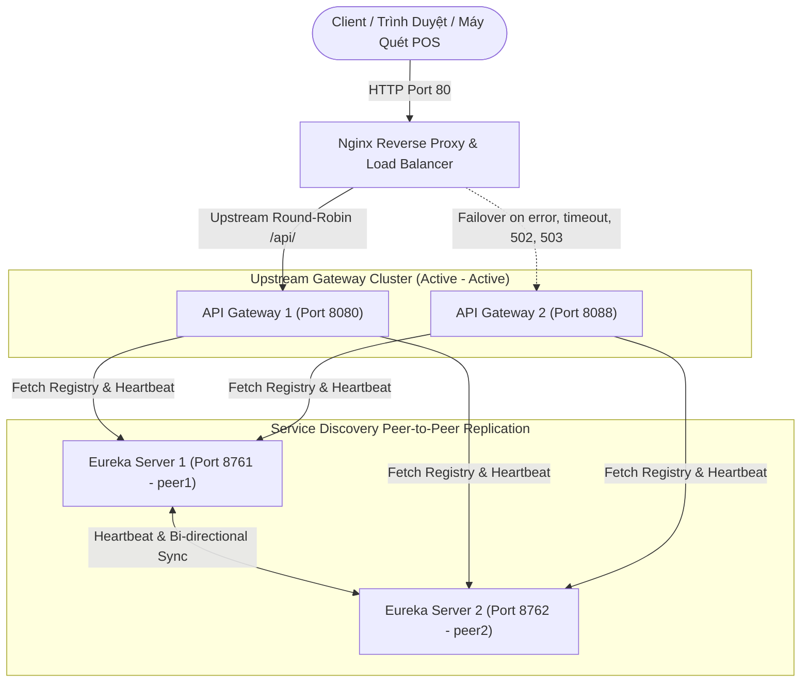

# Cẩm Nang Kỹ Thuật 01: Kiến Trúc High Availability (HA) & Nginx Load Balancing

> **Mục tiêu cẩm nang:** Tài liệu chuyên sâu ghi nhận kiến trúc sẵn sàng cao (HA) đa tầng, nguyên lý chịu lỗi (Fault Tolerance), cấu hình Nginx Reverse Proxy Upstream Failover và cơ chế Eureka Peer-to-Peer Replication. Dùng làm tài liệu tham khảo và áp dụng thực tế khi đi làm / thực tập backend.

---

## 1. Bản Chất Cốt Lõi Của Kiến Trúc High Availability (HA)

### 1.1. Ba Nguyên Tắc Vàng
1. **Loại bỏ Single Point of Failure (SPOF):** Không bao giờ để bất kỳ mắt xích nào chỉ có 1 node duy nhất (Cổng vào, Service Registry, Microservice, Database, Message Queue).
2. **Dự phòng tin cậy (Redundancy):** Luôn duy trì số lượng node dự phòng sẵn sàng nhận tải ($N \ge 2$).
3. **Chuyển đổi dự phòng tự động (Automated Failover):** Khi 1 node sập (cháy phần cứng, tràn RAM OOM, mất mạng), hệ thống tự động điều hướng sang node khác trong thời gian mili-giây mà khách hàng không gặp lỗi 500 hay timeout.

---

## 2. Cấu Hình Nginx Edge Reverse Proxy & Upstream Failover

### 2.1. Sơ Đồ Kiến Trúc Luồng Nginx Load Balancer & Eureka Peer Replication


### 2.2. Cấu hình thực tế trong dự án (`nginx/nginx.conf`)
Nginx đứng ở cổng `80`, phân phối lưu lượng giữa các bản sao Gateway (`8080`, `8088`) và Frontend (`3000`, `3001`):

```nginx
events {
    worker_connections 1024;
}

http {
    # Cụm Gateway Backend (Active - Active)
    upstream gateway_cluster {
        server host.docker.internal:8080 max_fails=3 fail_timeout=5s;
        server host.docker.internal:8088 max_fails=3 fail_timeout=5s;
    }

    # Cụm Frontend Static Server
    upstream frontend_cluster {
        server host.docker.internal:3000 max_fails=3 fail_timeout=5s;
        server host.docker.internal:3001 max_fails=3 fail_timeout=5s;
    }

    server {
        listen 80;
        server_name localhost;

        # Định tuyến toàn bộ API sang cụm Gateway
        location /api/ {
            proxy_pass http://gateway_cluster;
            proxy_set_header Host $host;
            proxy_set_header X-Real-IP $remote_addr;
            proxy_set_header X-Forwarded-For $proxy_add_x_forwarded_for;

            # MẤU CHỐT FAILOVER: Tự động thử node tiếp theo nếu node hiện tại lỗi hoặc timeout
            proxy_next_upstream error timeout http_502 http_503;
            proxy_connect_timeout 2s;
            proxy_read_timeout 5s;
        }

        # Định tuyến trang tĩnh Web Portal
        location / {
            proxy_pass http://frontend_cluster;
            proxy_set_header Host $host;
            proxy_set_header X-Real-IP $remote_addr;
            proxy_next_upstream error timeout http_502;
        }
    }
}
```

### 2.2. Giải Thích Các Tham Số Sống Còn Của Nginx
* **`max_fails=3 fail_timeout=5s`**: Nếu một máy chủ bị lỗi 3 lần liên tiếp trong vòng 5 giây, Nginx sẽ tạm thời đánh dấu máy chủ đó là "chết" trong 5 giây tiếp theo và không gửi traffic tới nữa.
* **`proxy_next_upstream error timeout http_502 http_503`**: Khi Gateway 1 bị sập hoặc nghẽn mạng quá thời gian `proxy_connect_timeout`, Nginx **ngay lập tức đẩy request đó sang Gateway 2** mà không trả lỗi về cho trình duyệt. Khách hàng hoàn toàn không cảm nhận được sự cố.
* **`extra_hosts: ["host.docker.internal:host-gateway"]`**: Khai báo trong `docker-compose.yaml` để container Nginx có thể giao tiếp thông suốt với các Spring Boot service đang chạy trên máy chủ host (Windows/Mac/Linux).

---

## 3. Cấu Hình Service Registry HA (Eureka Peer-to-Peer Replication)

Thay vì chạy 1 Eureka duy nhất (SPOF), ta cấu hình 2 node Eureka ngang hàng: **Node 1 (Port 8761)** và **Node 2 (Port 8762)** sao chép danh bạ dịch vụ lẫn nhau theo cơ chế Active - Active Bi-directional Replication.

### 3.1. Cấu hình Profile Node 1 (`service-registry/src/main/resources/application-peer1.properties`)
```properties
spring.application.name=service-registry
server.port=8761
eureka.instance.hostname=localhost
eureka.instance.instance-id=service-register:8761
# Đăng ký và lấy danh bạ từ Node 2 (dùng IP 127.0.0.1 để phân biệt hostname)
eureka.client.register-with-eureka=true
eureka.client.fetch-registry=true
eureka.client.service-url.defaultZone=http://127.0.0.1:8762/eureka/
```

### 3.2. Cấu hình Profile Node 2 (`service-registry/src/main/resources/application-peer2.properties` & `application.properties`)
Khi chạy cổng 8762, node 2 đặt hostname là `127.0.0.1` và trỏ peer về `localhost:8761`:
```properties
spring.application.name=service-registry
server.port=8762
eureka.instance.hostname=127.0.0.1
eureka.instance.instance-id=service-register:8762
# Đăng ký và lấy danh bạ từ Node 1 (dùng hostname localhost)
eureka.client.register-with-eureka=true
eureka.client.fetch-registry=true
eureka.client.service-url.defaultZone=http://localhost:8761/eureka/
```

### 3.3. Cấu hình Client trỏ vào danh sách dự phòng (Tất cả Microservices)
Trong file `application.properties` của tất cả các service (`api-gateway`, `shipment-service`, `tracking-service`,...):
```properties
# Khai báo cả 2 node ngăn cách bằng dấu phẩy
eureka.client.service-url.defaultZone=http://localhost:8761/eureka/,http://localhost:8762/eureka/
```
* **Cách Eureka Client hoạt động:** Service sẽ ưu tiên gửi heartbeat và lấy danh bạ từ node đầu tiên (`8761`). Nếu node này không phản hồi sau timeout, client tự động chuyển tiếp sang node thứ hai (`8762`) mà không làm gián đoạn luồng định tuyến.

### 3.4. Bẫy Kỹ Thuật: Eureka Peer Sync 1 Chiều & Cơ Chế `PeerEurekaNodes.isInstanceURL()`

#### A. Bản chất lỗi trong mã nguồn Netflix Eureka
Trong mã nguồn Eureka Server (`com.netflix.eureka.cluster.PeerEurekaNodes`):
```java
// Logic kiểm tra xem URL peer có phải là chính bản thân node hiện tại hay không:
public boolean isInstanceURL(String url, InstanceInfo instance) {
    String hostName = hostFromUrl(url); // Chỉ trích xuất HOST từ chuỗi URL (BỎ QUA PORT!)
    String myInfoComparator = instance.getHostName(); // Lấy hostname của node hiện tại
    return hostName.equalsIgnoreCase(myInfoComparator); // So sánh chuỗi thô
}
```
> [!WARNING]
> **Điểm mấu chốt:** Phương thức `isInstanceURL()` **hoàn toàn bỏ qua số cổng (Port)** khi so khớp. Nó chỉ so sánh chuỗi tên miền / IP giữa URL trong `defaultZone` và `eureka.instance.hostname` của chính nó!

#### B. Ma trận phân tích sự cố Sync 1 chiều khi chạy trên cùng một máy (Localhost)

| Node | Cấu hình lúc bị lỗi | Cơ chế nhận diện của Eureka | Hậu quả thực tế |
| :--- | :--- | :--- | :--- |
| **Node 1 (8761)** | `hostname = localhost`<br>`defaultZone = http://127.0.0.1:8762/eureka/` | So sánh: `localhost` vs `127.0.0.1` $\rightarrow$ **Khác nhau** | Nhận diện 8762 là **Peer hợp lệ** $\rightarrow$ Replicate 8761 sang 8762 **thành công**. |
| **Node 2 (8762)**<br>*(khi để `localhost`)* | `hostname = localhost`<br>`defaultZone = http://localhost:8761/eureka/` | So sánh: `localhost` vs `localhost` $\rightarrow$ **Giống nhau**! | Tự coi 8761 là **chính bản thân nó** $\rightarrow$ Hủy replication $\rightarrow$ **8762 KHÔNG BAO GIỜ replicate sang 8761**! |

* **Hiện tượng quan sát:** 
  * Trên Eureka Dashboard của node 8762: Mục `DS Replicas` không có 8761, hoặc 8761 bị đánh dấu vào `unavailable-replicas`.
  * Các microservice đăng ký vào 8761 thì 8762 nhìn thấy, nhưng service nào kết nối vào 8762 thì 8761 hoàn toàn mù tịt (Sync 1 chiều).

#### C. Giải pháp giải quyết triệt để
* Thiết lập cặp đối ứng chéo:
  * **Node 1 (8761):** `eureka.instance.hostname=localhost` $\rightarrow$ `defaultZone=http://127.0.0.1:8762/eureka/`
  * **Node 2 (8762):** `eureka.instance.hostname=127.0.0.1` $\rightarrow$ `defaultZone=http://localhost:8761/eureka/`
* Cả `localhost` và `127.0.0.1` đều trỏ về máy loopback, nhưng về mặt xử lý chuỗi trong Java thì `localhost` $\ne$ `127.0.0.1`, giúp cả 2 node nhận diện đúng đối tác là một peer độc lập và thiết lập luồng replication 2 chiều hoàn chỉnh.
* *(Ghi chú môi trường Production)*: Trong Docker/K8s hoặc production thực tế, ta sử dụng domain riêng (ví dụ `eureka-1.internal`, `eureka-2.internal`) qua DNS mạng nội bộ nên không cần mẹo IP loopback này.

---

## 4. Boilerplate Template Tái Sử Dụng Cho Dự Án Mới

### File `docker-compose-nginx-ha.yaml` Mẫu
```yaml
services:
  nginx-edge:
    image: nginx:alpine
    container_name: app-nginx-edge
    ports:
      - "80:80"
    volumes:
      - ./nginx.conf:/etc/nginx/nginx.conf:ro
    extra_hosts:
      - "host.docker.internal:host-gateway"
    restart: always
```

---

## 5. Checklist Phỏng Vấn Kiến Trúc (Interview Questions & Answers)

* **Q: "Sự khác biệt giữa Client-side Load Balancing và Server-side Load Balancing?"**
  * *Trả lời:* 
    * **Server-side (Nginx, AWS ALB):** Client gửi request tới Nginx, Nginx tự chọn instance backend rồi chuyển tiếp. Client không cần biết có bao nhiêu instance phía sau.
    * **Client-side (Spring Cloud LoadBalancer):** API Gateway hoặc Service gọi tự giữ danh sách các instance (lấy từ Eureka) và tự quyết định thuật toán Round-Robin để gọi trực tiếp tới instance đích.
* **Q: "Tại sao Eureka không bị vấn đề Não phân liệt (Split-Brain) nghiêm trọng như ZooKeeper hay etcd?"**
  * *Trả lời:* Eureka chọn triết lý **AP (Availability & Partition Tolerance)** trong định lý CAP. Khi xảy ra chia cắt mạng, mỗi node Eureka vẫn tiếp tục phục vụ các instance đang kết nối tới nó và bật chế độ **Self-Preservation** (không vội xóa instance khi quá hạn heartbeat), ưu tiên hệ thống luôn sẵn sàng nhận truy vấn thay vì khóa chặt dữ liệu.
* **Q: "Khi dựng cụm Eureka HA trên cùng một máy chủ (Localhost) khác port, tại sao thường bị lỗi chỉ đồng bộ 1 chiều hoặc node bị đưa vào unavailable-replicas? Cách xử lý như thế nào?"**
  * *Trả lời:* Trong `PeerEurekaNodes.isInstanceURL()`, Eureka chỉ so sánh chuỗi `hostname` mà bỏ qua `port`. Nếu cả 2 node đều cấu hình `hostname=localhost` và trỏ `defaultZone` tới `localhost:<port_khác>`, node sẽ tự coi peer URL đó chính là bản thân nó và loại bỏ khỏi danh sách replication. Để khắc phục khi test local, ta dùng cặp đối ứng chuỗi khác nhau: một node dùng `localhost` trỏ sang `127.0.0.1`, node còn lại dùng `127.0.0.1` trỏ về `localhost` (hoặc cấu hình các alias riêng trong file `/etc/hosts` như `peer1`, `peer2`).
