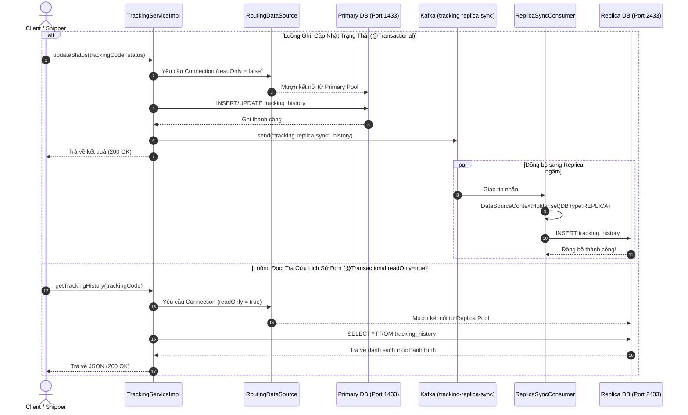

# Cẩm Nang Kỹ Thuật 02: Phân Tách Luồng Đọc - Ghi CSDL (Database Read-Write Splitting) & Boilerplate Code

> **Mục tiêu cẩm nang:** Hướng dẫn chi tiết kỹ thuật tách luồng CSDL Master - Replica (Primary - Standby) trong Spring Boot 3.x sử dụng `AbstractRoutingDataSource`. Bao gồm code mẫu thực tế của dự án Waybill, cơ chế đồng bộ ngầm qua Kafka, và bộ **Generic Boilerplate Template** độc lập để bạn có thể copy-paste vào bất kỳ dự án công ty nào sau này khi đi thực tập/đi làm.

---

## 1. Tại Sao Phải Phân Tách Đọc - Ghi (Read-Write Splitting)?

Trong các hệ thống thương mại điện tử, mạng xã hội hay bưu chính:
* **Tỷ lệ truy cập:** $80\% - 90\%$ lưu lượng là các truy vấn ĐỌC (`SELECT`), chỉ có $10\% - 20\%$ là các thao tác GHI (`INSERT`, `UPDATE`, `DELETE`).
* **Vấn đề nghẽn cổ chai:** Nếu dùng chung 1 CSDL, các câu lệnh ghi sẽ lock dòng/bảng, khiến hàng ngàn khách hàng đang tra cứu đơn hàng bị treo và chờ đợi.
* **Giải pháp:**
  * Toàn bộ thao tác GHI gửi về **Primary DB** (Cổng 1433).
  * Toàn bộ thao tác ĐỌC gửi về **Replica DB** (Cổng 2433).
  * Dữ liệu từ Primary được đồng bộ sang Replica.

```mermaid
flowchart TB
    Service["Spring Boot Service (TrackingServiceImpl)"]
    Proxy["LazyConnectionDataSourceProxy (Hoãn mượn Connection)"]
    Router{"RoutingDataSource\n(determineCurrentLookupKey)"}
    PrimaryPool[("HikariCP Pool: PRIMARY\n(SQL Server Port 1433)")]
    ReplicaPool[("HikariCP Pool: REPLICA\n(SQL Server Port 2433)")]
    KafkaTopic[("Kafka Topic: tracking-replica-sync")]
    SyncConsumer["ReplicaSyncConsumer (Ngầm)"]

    Service -->|Thực thi Query| Proxy
    Proxy --> Router
    Router -->|@Transactional WRITE| PrimaryPool
    Router -->|@Transactional readOnly=true| ReplicaPool

    PrimaryPool -.->|Lưu thành công| KafkaTopic
    KafkaTopic -->|Consume event| SyncConsumer
    SyncConsumer -->|DataSourceContextHolder = REPLICA| ReplicaPool
```

### 1.1. Sơ Đồ Trình Tự Thực Thi & Đồng Bộ Bất Đồng Bộ


---

## 2. Các Thành Phần Cốt Lõi Trong Dự Án Waybill Platform

### 2.1. Định nghĩa Kiểu CSDL (`DBType.java`)
```java
package org.app.trackingservice.config;

public enum DBType {
    PRIMARY,
    REPLICA
}
```

### 2.2. Ngữ Cảnh ThreadLocal (`DataSourceContextHolder.java`)
Mỗi request trong Spring Boot chạy trên 1 luồng riêng biệt (`Thread`). Dùng `ThreadLocal` giúp lưu trữ ngữ cảnh CSDL của luồng đó mà không sợ bị xung đột đa luồng:
```java
package org.app.trackingservice.config;

public class DataSourceContextHolder {
    private static final ThreadLocal<DBType> CONTEXT = new ThreadLocal<>();

    public static void set(DBType dbType) {
        CONTEXT.set(dbType);
    }

    public static DBType get() {
        return CONTEXT.get();
    }

    public static void clear() {
        CONTEXT.remove(); // BẮT BUỘC clear để tránh rò rỉ bộ nhớ trong ThreadPool
    }
}
```

### 2.3. Bộ Định Tuyến Động (`RoutingDataSource.java`)
Kế thừa từ `AbstractRoutingDataSource` của Spring JDBC. Phương thức `determineCurrentLookupKey()` sẽ quyết định xem câu query chuẩn bị mượn Connection từ Pool nào:
```java
package org.app.trackingservice.config;

import lombok.extern.slf4j.Slf4j;
import org.jspecify.annotations.Nullable;
import org.springframework.jdbc.datasource.lookup.AbstractRoutingDataSource;
import org.springframework.transaction.support.TransactionSynchronizationManager;

@Slf4j
public class RoutingDataSource extends AbstractRoutingDataSource {

    @Override
    protected @Nullable Object determineCurrentLookupKey() {
        // 1. Kiểm tra nếu có lệnh ép thủ công từ Context (Dùng cho Consumer ngầm ghi đè vào Replica)
        DBType manualType = DataSourceContextHolder.get();
        if (manualType != null) {
            return manualType;
        }

        // 2. Tự động nhận diện qua cờ readOnly của Spring Transaction
        boolean isReadOnly = TransactionSynchronizationManager.isCurrentTransactionReadOnly();
        if (isReadOnly) {
            log.info(">>> [DATABASE ROUTING] SELECT (Read-only) ĐIỀU HƯỚNG TỚI REPLICA (Port 2433)");
            return DBType.REPLICA;
        } else {
            log.info(">>> [DATABASE ROUTING] WRITE (Read-Write) ĐIỀU HƯỚNG TỚI PRIMARY (Port 1433)");
            return DBType.PRIMARY;
        }
    }
}
```

### 2.4. Cấu Hình Bean DataSource & Hikari Pool (`DataSourceConfig.java`)
```java
package org.app.trackingservice.config;

import com.zaxxer.hikari.HikariDataSource;
import org.springframework.beans.factory.annotation.Qualifier;
import org.springframework.boot.autoconfigure.jdbc.DataSourceProperties;
import org.springframework.boot.context.properties.ConfigurationProperties;
import org.springframework.context.annotation.Bean;
import org.springframework.context.annotation.Configuration;
import org.springframework.context.annotation.Primary;
import org.springframework.jdbc.datasource.LazyConnectionDataSourceProxy;

import javax.sql.DataSource;
import java.util.HashMap;
import java.util.Map;

@Configuration
public class DataSourceConfig {

    @Bean
    @ConfigurationProperties("spring.datasource.primary")
    public DataSourceProperties primaryProperties() {
        return new DataSourceProperties();
    }

    @Bean
    public DataSource primaryDataSource() {
        return primaryProperties().initializeDataSourceBuilder()
                .type(HikariDataSource.class)
                .build();
    }

    @Bean
    @ConfigurationProperties("spring.datasource.replica")
    public DataSourceProperties replicaProperties() {
        return new DataSourceProperties();
    }

    @Bean
    public DataSource replicaDataSource() {
        return replicaProperties().initializeDataSourceBuilder()
                .type(HikariDataSource.class)
                .build();
    }

    @Bean
    public DataSource routingDataSource(
            @Qualifier("primaryDataSource") DataSource primary,
            @Qualifier("replicaDataSource") DataSource replica) {
        RoutingDataSource routingDataSource = new RoutingDataSource();

        Map<Object, Object> targetDataSources = new HashMap<>();
        targetDataSources.put(DBType.PRIMARY, primary);
        targetDataSources.put(DBType.REPLICA, replica);

        routingDataSource.setTargetDataSources(targetDataSources);
        routingDataSource.setDefaultTargetDataSource(primary); // Mặc định là Primary
        return routingDataSource;
    }

    /**
     * CỰC KỲ QUAN TRỌNG: LazyConnectionDataSourceProxy
     * Trì hoãn việc lấy Connection từ DataSource cho đến khi câu lệnh SQL đầu tiên thực sự được thực thi.
     * Nếu không có bean này, Spring Transaction sẽ mượn Connection TRƯỚC KHI determineCurrentLookupKey() được gọi,
     * dẫn đến việc luôn luôn lấy Connection của DataSource mặc định!
     */
    @Bean
    @Primary
    public DataSource dataSource(@Qualifier("routingDataSource") DataSource routingDataSource) {
        return new LazyConnectionDataSourceProxy(routingDataSource);
    }
}
```

### 2.5. Cấu Hình `application.properties`
```properties
# 1. CSDL PRIMARY (Chuyên Ghi - Port 1433)
spring.datasource.primary.jdbc-url=jdbc:sqlserver://localhost:1433;databaseName=tracking_db;encrypt=true;trustServerCertificate=true;
spring.datasource.primary.driver-class-name=com.microsoft.sqlserver.jdbc.SQLServerDriver
spring.datasource.primary.username=sa
spring.datasource.primary.password=sa

# 2. CSDL REPLICA (Chuyên Đọc - Port 2433)
spring.datasource.replica.jdbc-url=jdbc:sqlserver://127.0.0.1:2433;databaseName=tracking_db;encrypt=true;trustServerCertificate=true;
spring.datasource.replica.driver-class-name=com.microsoft.sqlserver.jdbc.SQLServerDriver
spring.datasource.replica.username=sa
spring.datasource.replica.password=Replica@123456
# Cấu hình Pool Hikari chuyên biệt cho việc đọc
spring.datasource.replica.hikari.minimum-idle=5
spring.datasource.replica.hikari.maximum-pool-size=15
```

---

## 3. Cơ Chế Đồng Bộ Ngầm Qua Kafka (Event-Driven Replication)

Khi ứng dụng không sử dụng tính năng đồng bộ phần cứng đắt đỏ của SQL Server Always-On, ta áp dụng mô hình **Application-level Event-Driven Replication**:

1. **Tại `TrackingServiceImpl.java` (Luồng Ghi):**
```java
@Transactional // Read-Write: ghi vào Primary
public TrackingHistory updateStatus(String trackingCode, UpdateStatusRequest request, ...) {
    // 1. Lưu vào Primary DB (Port 1433)
    TrackingHistory saved = trackingHistoryRepository.save(history);
    
    // 2. Bắn sự kiện sang Kafka để đồng bộ sang Replica
    kafkaTemplate.send("tracking-replica-sync", saved.getTrackingCode(), saved);
    
    // 3. Cập nhật Redis Cache thời gian thực
    redisTemplate.opsForValue().set("shipment-status:" + trackingCode, newStatus.name(), Duration.ofDays(7));
    return saved;
}
```

2. **Tại `ReplicaSyncConsumer.java` (Luồng Nhận Đồng Bộ):**
```java
@Service
@Slf4j
@RequiredArgsConstructor
public class ReplicaSyncConsumer {
    private final TrackingHistoryRepository trackingHistoryRepository;

    @KafkaListener(topics = "tracking-replica-sync", groupId = "tracking-replica-sync-group")
    public void handleSyncToReplica(TrackingHistory history) {
        try {
            // Ép luồng này ghi thẳng vào REPLICA DB (Port 2433)
            DataSourceContextHolder.set(DBType.REPLICA);
            history.setId(null); // Tạo ID mới trên bảng replica
            trackingHistoryRepository.save(history);
            log.info("Đã đồng bộ đơn {} sang Replica DB thành công!", history.getTrackingCode());
        } catch (Exception e) {
            log.error("Lỗi đồng bộ sang Replica: {}", e.getMessage());
        } finally {
            DataSourceContextHolder.clear(); // Giải phóng ThreadLocal
        }
    }
}
```

---

## 4. Generic Boilerplate Template (Dùng Độc Lập Cho Mọi Dự Án Spring Boot)

Khi đi làm tại công ty sau này, bạn chỉ cần copy 4 file sau vào package `config.datasource` của bất kỳ dự án nào (chỉ cần đổi tên database):

📁 `common/datasource/`
* `DatabaseEnvironment.java` (Enum chứa `MASTER`, `SLAVE`)
* `RoutingContext.java` (Class chứa `ThreadLocal`)
* `DynamicRoutingDataSource.java` (Class kế thừa `AbstractRoutingDataSource`)
* `DynamicDataSourceConfiguration.java` (Configuration Bean cấu hình 2 Pool + `LazyConnectionDataSourceProxy`)

> 💡 **Quy tắc sử dụng trong Service:**
> * Muốn ĐỌC từ Slave/Replica: Gắn `@Transactional(readOnly = true)` trên đầu phương thức Service.
> * Muốn GHI vào Master/Primary: Gắn `@Transactional` trên đầu phương thức Service.

---

## 5. Những "Cạm Bẫy" Kỹ Thuật Khi Đi Phỏng Vấn (Interview Traps)

1. **"Tại sao nhất định phải bọc `LazyConnectionDataSourceProxy`?"**
   * *Trả lời:* Mặc định Spring `@Transactional` sẽ mượn một `Connection` ngay khi vừa bước vào phương thức, lúc đó Spring chưa kịp biết câu lệnh SQL tiếp theo là gì nên nó luôn bốc Connection từ DataSource mặc định (Primary). Bọc `LazyConnectionDataSourceProxy` sẽ hoãn việc mượn kết nối cho đến khi câu SQL đầu tiên thực sự được phát lệnh, giúp `determineCurrentLookupKey()` phát hiện chính xác cờ `readOnly`.
2. **"Hiện tượng Replication Lag (Độ trễ đồng bộ) xử lý thế nào?"**
   * *Trả lời:* Nếu dữ liệu vừa ghi vào Primary mà Replica chưa kịp sync xong (vài mili-giây), nếu người dùng F5 tra cứu ngay sẽ bị thiếu dữ liệu. 
   * **Cách giải quyết trong dự án của chúng ta:** Sử dụng tầng **Redis Cache-Aside**. Khi vừa ghi xong, ta ghi đè trạng thái mới vào Redis ngay. Lệnh đọc sẽ kiểm tra Redis trước, trúng Cache (Cache HIT trong 1-2ms) và trả về ngay mà không cần chạm xuống Replica DB!
