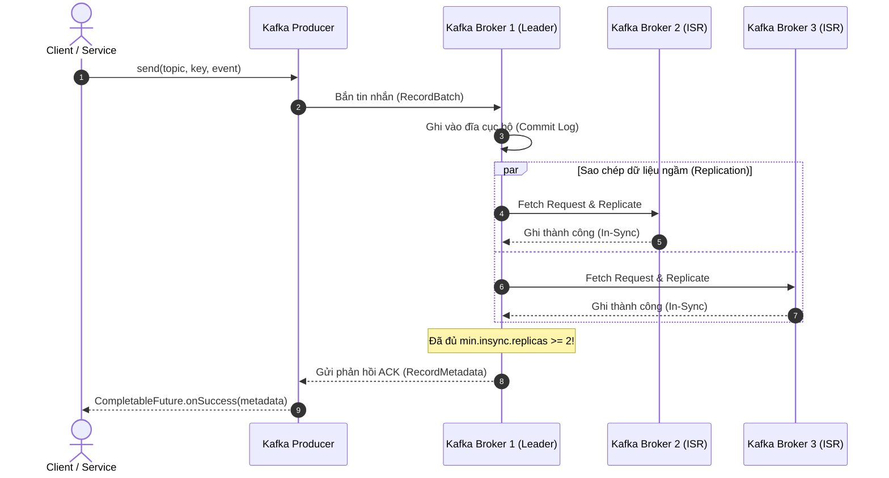
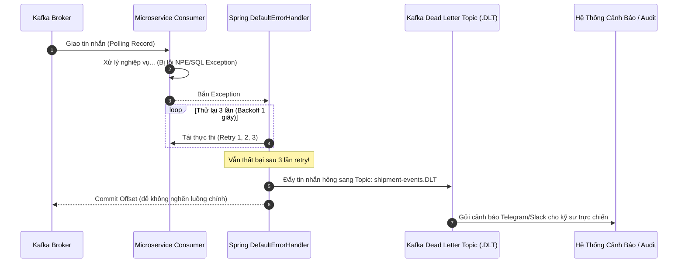

# Cẩm Nang Kỹ Thuật 03: Cụm Apache Kafka KRaft Cluster & Event Streaming HA

> **Mục tiêu cẩm nang:** Hướng dẫn toàn diện về kiến trúc cụm Apache Kafka KRaft (không ZooKeeper), cơ chế Quorum, cấu hình Docker Compose 3 Brokers, **sơ đồ mô phỏng luồng tin nhắn toàn trình** và **bộ mã nguồn Boilerplate Java chuẩn Production** (Producer async callback, Consumer Error Handling & Dead Letter Topic DLT).

---

## 1. Cuộc Cách Mạng KRaft (Kafka Raft Metadata Mode)

Trước đây, Apache Kafka bắt buộc phải có cụm Apache ZooKeeper đi kèm để lưu metadata, bầu chọn Leader và quản lý Broker. Điều này dẫn đến:
* **Kiến trúc cồng kềnh (Dual-system overhead):** Phải vận hành, giám sát và cấu hình 2 hệ thống độc lập.
* **Thời gian phục hồi chậm (Slow failover):** Khi Controller chết, việc tải lại hàng triệu metadata từ ZooKeeper mất nhiều phút.

Từ Kafka 3.3+, **KRaft Mode** chính thức ra đời:
* Kafka tự tích hợp thuật toán đồng thuận Raft ngay trong lõi Broker.
* Loại bỏ hoàn toàn ZooKeeper. Thời gian phục hồi Controller khi có sự cố giảm từ hàng phút xuống **dưới 1 giây**.

---

## 2. Nguyên Lý Bầu Cử Quá Bán (Quorum Rule) & Chống Split-Brain

### 2.1. Công thức Quorum
Để một cụm KRaft đưa ra quyết định (ghi nhận log metadata mới, bầu chọn Leader mới), nó phải nhận được sự đồng thuận của **đa số tuyệt đối**:

$$\text{Quorum Majority} = \left\lfloor \frac{N}{2} \right\rfloor + 1$$

| Tổng Số Node ($N$) | Đa số tối thiểu cần để sống (Quorum) | Số Node tối đa được phép chết ($F$) |
| :---: | :---: | :---: |
| **1** | 1 node ($100\%$) | **0** node (SPOF) |
| **2** | 2 node ($100\%$) | **0** node (Chết 1 là sập cả cụm) |
| **3** *(Dự án của bạn)* | **2 node** ($66.7\%$) | **1** node chết $\rightarrow$ Cụm vẫn sống |
| **5** | **3 node** ($60\%$) | **2** node chết $\rightarrow$ Cụm vẫn sống |

---

## 3. Mô Phỏng Luồng Hoạt Động (Kafka Streaming Lifecycle Simulation)

### 3.1. Luồng Gửi Tin Cậy (Producer `acks=all` với Quorum 3 Node)


### 3.2. Luồng Xử Lý Lỗi Consumer & Hàng Đợi Thư Chết (Dead Letter Topic - DLT)


---

## 4. Cấu Hình Docker Compose Chuẩn Cụm 3-Broker KRaft

```yaml
services:
  kafka-1:
    image: apache/kafka:latest
    container_name: waybill-kafka-1
    ports:
      - "9092:9092"
    environment:
      KAFKA_NODE_ID: 1
      KAFKA_PROCESS_ROLES: broker,controller
      KAFKA_KRAFT_CLUSTER_ID: "4L622nShTUiBenVKWIRCkg"
      KAFKA_LISTENERS: INTERNAL://:29092,CONTROLLER://:9093,EXTERNAL://:9092
      KAFKA_ADVERTISED_LISTENERS: INTERNAL://kafka-1:29092,EXTERNAL://localhost:9092
      KAFKA_LISTENER_SECURITY_PROTOCOL_MAP: INTERNAL:PLAINTEXT,CONTROLLER:PLAINTEXT,EXTERNAL:PLAINTEXT
      KAFKA_CONTROLLER_LISTENER_NAMES: CONTROLLER
      KAFKA_INTER_BROKER_LISTENER_NAME: INTERNAL
      KAFKA_CONTROLLER_QUORUM_VOTERS: 1@kafka-1:9093,2@kafka-2:9093,3@kafka-3:9093
      KAFKA_OFFSETS_TOPIC_REPLICATION_FACTOR: 3
      KAFKA_TRANSACTION_STATE_LOG_REPLICATION_FACTOR: 3
      KAFKA_TRANSACTION_STATE_LOG_MIN_ISR: 2
    restart: always
```

---

## 5. Boilerplate Code Java Tái Sử Dụng (Production-Ready)

### 5.1. Generic Kafka Producer Service (Kèm Async Callback)
Class này có thể copy vào bất kỳ dự án Spring Boot nào để bắn tin bất đồng bộ có kèm log chi tiết:

```java
package com.common.kafka.producer;

import lombok.RequiredArgsConstructor;
import lombok.extern.slf4j.Slf4j;
import org.springframework.kafka.core.KafkaTemplate;
import org.springframework.kafka.support.SendResult;
import org.springframework.stereotype.Service;

import java.util.concurrent.CompletableFuture;

@Service
@Slf4j
@RequiredArgsConstructor
public class GenericKafkaProducer {

    private final KafkaTemplate<String, Object> kafkaTemplate;

    /**
     * Bắn event có Key (đảm bảo các event cùng key luôn vào đúng 1 partition theo thứ tự)
     */
    public <T> CompletableFuture<SendResult<String, Object>> sendEvent(String topic, String key, T payload) {
        log.info(">>> [KAFKA PRODUCER] Đang gửi message tới topic: [{}] với Key: [{}]", topic, key);

        CompletableFuture<SendResult<String, Object>> future = kafkaTemplate.send(topic, key, payload);

        future.whenComplete((result, ex) -> {
            if (ex == null) {
                log.info(">>> [KAFKA PRODUCER] Gửi THÀNH CÔNG tới Topic: [{}], Partition: [{}], Offset: [{}]",
                        result.getRecordMetadata().topic(),
                        result.getRecordMetadata().partition(),
                        result.getRecordMetadata().offset());
            } else {
                log.error(">>> [KAFKA PRODUCER] Gửi THẤT BẠI tới Topic: [{}] do lỗi: {}", topic, ex.getMessage(), ex);
                // Có thể lưu vào DB outbox hoặc bắn cảnh báo
            }
        });

        return future;
    }
}
```

### 5.2. Kafka Consumer Configuration với Dead Letter Topic (DLT) Tự Động
Thiết lập cơ chế tự động thử lại (Retry 3 lần) và tự động tạo topic `.DLT` nếu xử lý thất bại:

```java
package com.common.kafka.consumer;

import lombok.extern.slf4j.Slf4j;
import org.apache.kafka.common.TopicPartition;
import org.springframework.context.annotation.Bean;
import org.springframework.context.annotation.Configuration;
import org.springframework.kafka.core.KafkaOperations;
import org.springframework.kafka.listener.DeadLetterPublishingRecoverer;
import org.springframework.kafka.listener.DefaultErrorHandler;
import org.springframework.util.backoff.FixedBackOff;

@Configuration
@Slf4j
public class KafkaConsumerConfig {

    @Bean
    public DefaultErrorHandler errorHandler(KafkaOperations<Object, Object> operations) {
        // 1. Cấu hình gửi sang Dead Letter Topic (.DLT) khi vượt số lần retry
        DeadLetterPublishingRecoverer recoverer = new DeadLetterPublishingRecoverer(operations,
                (record, ex) -> {
                    log.error(">>> [KAFKA ERROR] Đẩy tin nhắn offset [{}] sang Dead Letter Topic do lỗi: {}", 
                            record.offset(), ex.getMessage());
                    return new TopicPartition(record.topic() + ".DLT", record.partition());
                });

        // 2. Thử lại tối đa 3 lần, mỗi lần cách nhau 1000ms (1 giây)
        FixedBackOff backOff = new FixedBackOff(1000L, 3L);

        DefaultErrorHandler errorHandler = new DefaultErrorHandler(recoverer, backOff);
        
        // Không retry nếu là lỗi deserialize JSON sai cú pháp
        errorHandler.addNotRetryableExceptions(org.springframework.kafka.support.serializer.DeserializationException.class);

        return errorHandler;
    }
}
```

### 5.3. Consumer lắng nghe Dead Letter Queue để xử lý hậu kiểm
```java
package com.common.kafka.consumer;

import lombok.extern.slf4j.Slf4j;
import org.apache.kafka.clients.consumer.ConsumerRecord;
import org.springframework.kafka.annotation.KafkaListener;
import org.springframework.stereotype.Component;

@Component
@Slf4j
public class DeadLetterQueueListener {

    @KafkaListener(topics = "shipment-events.DLT", groupId = "dlt-monitoring-group")
    public void handleDltMessages(ConsumerRecord<String, Object> record) {
        log.warn("[CẢNH BÁO CRITICAL] Nhận tin nhắn từ DLT! Key: {}, Payload: {}, Nguyên nhân thất bại",
                record.key(), record.value());
        // Ghi vào bảng 'failed_messages' để admin kiểm tra thủ công
    }
}
```

---

## 6. Cấu Hình `application.properties` Đầy Đủ Cho Mọi Microservice

```properties
# 1. Cụm Kafka đa node dự phòng
spring.kafka.bootstrap-servers=localhost:9092,localhost:9094,localhost:9096

# 2. PRODUCER AN TOÀN
spring.kafka.producer.acks=all
spring.kafka.producer.properties.enable.idempotence=true
spring.kafka.producer.retries=5
spring.kafka.producer.properties.retry.backoff.ms=300
spring.kafka.producer.key-serializer=org.apache.kafka.common.serialization.StringSerializer
spring.kafka.producer.value-serializer=org.springframework.kafka.support.serializer.JsonSerializer

# 3. CONSUMER CHỊU LỖI
spring.kafka.consumer.group-id=tracking-group
spring.kafka.consumer.auto-offset-reset=earliest
spring.kafka.consumer.key-deserializer=org.apache.kafka.common.serialization.StringDeserializer
spring.kafka.consumer.value-deserializer=org.springframework.kafka.support.serializer.ErrorHandlingDeserializer
spring.kafka.consumer.properties.spring.deserializer.value.delegate.class=org.springframework.kafka.support.serializer.JsonDeserializer
spring.kafka.consumer.properties.spring.json.trusted.packages=*
```

---

## 7. Checklist Phỏng Vấn Kafka Chuyên Sâu

1. **"Tại sao phải gán Message Key khi gửi Kafka?"**
   * *Trả lời:* Mặc định nếu không có Key, Kafka sẽ chia ngẫu nhiên tin nhắn vào các Partition (Round-Robin). Điều này làm mất **thứ tự thời gian (Order of execution)**. Khi truyền `key = trackingCode`, tất cả sự kiện của cùng 1 đơn hàng (`CREATED` $\rightarrow$ `IN_TRANSIT` $\rightarrow$ `DELIVERED`) được băm (hash) và luôn luôn nằm trên **cùng một Partition duy nhất**, đảm bảo Consumer xử lý đúng trình tự thời gian.
2. **"Làm sao tránh hiện tượng Consumer bị treo khi gặp Poison Pill (Tin rác)?"**
   * *Trả lời:* Dùng `ErrorHandlingDeserializer` bọc ngoài `JsonDeserializer` kết hợp `DeadLetterPublishingRecoverer`. Khi gặp gói tin lỗi cú pháp, Spring Kafka sẽ không quăng lỗi gây restart consumer liên tục, mà tự động chuyển tiếp gói tin đó sang Topic `.DLT` và tiếp tục đọc các tin nhắn tiếp theo trong queue.
