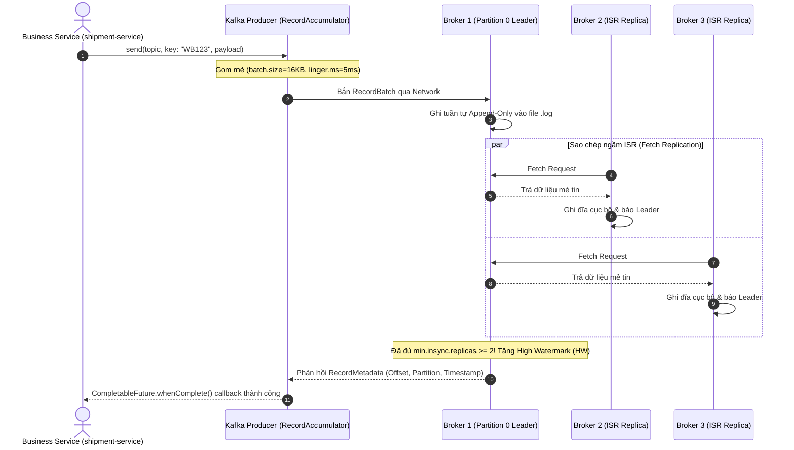
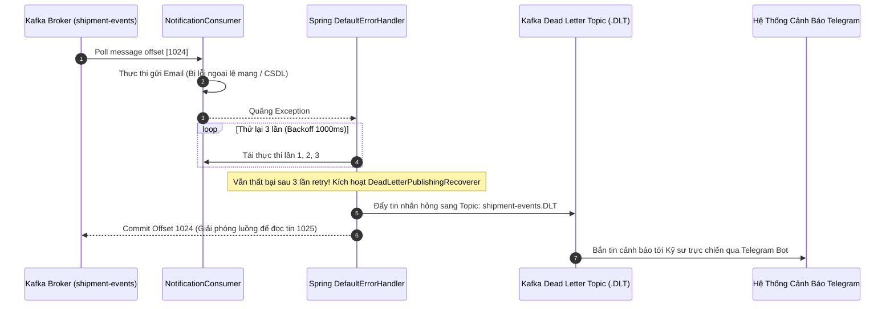

# Cẩm Nang Kỹ Thuật 03: Cụm Apache Kafka KRaft Cluster & Kiến Trúc Event Streaming Chuyên Sâu (Deep-Dive Internals)

> **Mục tiêu cẩm nang:** Cung cấp tài liệu lý thuyết nền tảng và thực chiến chuyên sâu về **Apache Kafka**: Từ cuộc cách mạng **KRaft Consensus (không ZooKeeper)**, giải phẫu tầng lưu trữ đĩa cứng **Append-Only Commit Log & Sparse Index**, kỹ thuật **Zero-Copy Optimization** ở tầng Linux Kernel, cơ chế phân vùng và băm Key (`MurmurHash2`), bảo đảm độ tin cậy **Idempotent Producer & Exactly-Once Semantics (EOS)**, cơ chế **Cooperative Sticky Rebalance** trong Consumer Group, chính sách **Log Compaction & Tombstone**, sơ đồ luồng dữ liệu toàn trình, cấu hình Docker Compose cụm 3-Broker HA, cùng bộ mã nguồn **Boilerplate Production-Ready** và checklist 10 câu hỏi phỏng vấn hóc búa nhất.

---

## 1. Cuộc Cách Mạng KRaft (Kafka Raft Metadata Mode)

### 1.1. So Sánh: ZooKeeper Cũ vs KRaft Mode Mới

Trong hơn một thập kỷ, Apache Kafka bắt buộc phải phụ thuộc vào một hệ thống phân tán thứ hai là **Apache ZooKeeper** để quản lý metadata cụm, lưu trữ trạng thái Broker và bầu chọn Controller Leader. Mô hình cũ này tồn tại các nhược điểm nghiêm trọng:

```
┌──────────────────────────────────────┐        ┌──────────────────────────────────────┐
│       KIẾN TRÚC ZOOKEEPER CŨ         │        │           KIẾN TRÚC KRAFT MỚI        │
├──────────────────────────────────────┤        ├──────────────────────────────────────┤
│  [Controller] ◄──RPC──► [ZooKeeper]  │        │  [Broker 1 (Active Controller)]      │
│       ▲                     ▲        │        │           ▲              ▲           │
│       │                     │        │        │      Raft Consensus (Internal Log)   │
│  [Broker 1]            [Broker 2]    │        │           ▼              ▼           │
│                                      │        │  [Broker 2]             [Broker 3]   │
│ • Hai hệ thống phân tán độc lập      │        │ • Một hệ thống duy nhất (Single Engine)│
│ • Giới hạn 200.000 partitions/cluster│        │ • Hỗ trợ hàng triệu partitions       │
│ • Failover Controller mất 2 - 10 phút│        │ • Failover Controller dưới 500ms     │
└──────────────────────────────────────┘        └──────────────────────────────────────┘
```

1. **Gánh nặng vận hành kép (Dual-System Operational Overhead):** Quản trị viên phải cài đặt, cấp phát tài nguyên, giám sát bảo mật và sao lưu cho cả 2 hệ thống độc lập (ZooKeeper Quorum + Kafka Brokers).
2. **Nút thắt cổ chai Metadata (Metadata Bottleneck):** Mọi thay đổi về Topic, Partition, Leader đều phải ghi vào ZooKeeper rồi đồng bộ ngược lại Controller. Khi cụm vượt quá $200.000$ partitions, ZooKeeper bị quá tải bộ nhớ và lag đồng bộ.
3. **Thời gian phục hồi Controller cực chậm (Slow Failover):** Khi Controller Broker bị chết, Controller mới được bầu lên phải đọc tuần tự hàng triệu node dữ liệu từ ZooKeeper nạp vào RAM. Trong suốt thời gian này ($2 - 10$ phút), toàn bộ cụm bị "đóng băng", không thể tạo topic mới hay xử lý failover partition.

### 1.2. Đột Phá Kiến Trúc Của KRaft (KIP-500)
Từ phiên bản Apache Kafka 3.3+ (và chính thức loại bỏ ZooKeeper trong Kafka 4.0):
* **Sự đồng thuận Raft nội tại:** Metadata của cụm được lưu trữ dưới dạng một **Internal Topic đặc biệt mang tên `@metadata`** (Partition 0 đơn lẻ).
* **Metadata Quorum:** Một nhóm các Broker được chỉ định đóng vai trò **Controller Quorum Voters**. Một Broker được bầu làm **Active Controller Leader**, các Controller còn lại đóng vai trò Standby.
* **Thời gian phục hồi tức thì ($< 500\text{ms}$):** Khi Active Controller bị sập, các Standby Controller đã có sẵn bản sao metadata log trong RAM thông qua Raft replication, việc tiếp quản quyền điều hành diễn ra ngay lập tức mà không cần đọc lại dữ liệu.

---

## 2. Nguyên Lý Bầu Cử Quá Bán (Quorum Rule) & Chống Split-Brain

### 2.1. Công Thức Toán Học Quorum
Để một cụm KRaft đưa ra quyết định (ghi nhận log metadata mới, bầu chọn Controller Leader), nó phải nhận được sự đồng thuận của **đa số tuyệt đối (Strict Majority)**:

$$\text{Quorum Majority} = \left\lfloor \frac{N}{2} \right\rfloor + 1$$

Trong đó:
* $N$: Tổng số Controller Quorum Voters được cấu hình trong `KAFKA_CONTROLLER_QUORUM_VOTERS`.
* Số node tối đa được phép chết đồng thời mà cụm vẫn tiếp tục hoạt động là: $F = \left\lfloor \frac{N - 1}{2} \right\rfloor$.

| Tổng Số Node ($N$) | Đa số tối thiểu cần sống (Quorum) | Số Node tối đa được phép chết ($F$) | Đánh Giá Độ Tin Cậy |
| :---: | :---: | :---: | :--- |
| **1** | 1 node ($100\%$) | **0** node | **SPOF (Single Point of Failure)** - Chỉ dùng cho máy Dev cá nhân. |
| **2** | 2 node ($100\%$) | **0** node | **Tệ hại:** Chết 1 node là sập cả cụm. Không có khả năng chịu lỗi. |
| **3** *(Cụm dự án của bạn)* | **2 node** ($66.7\%$) | **1** node chết | **Chuẩn Production nhỏ:** Cho phép 1 node bảo trì/chết mà cụm vẫn sống. |
| **5** | **3 node** ($60\%$) | **2** node chết | **Chuẩn Enterprise lớn:** Cho phép chết 2 node đồng thời. |

### 2.2. Cơ Chế Chống Split-Brain (Phân Rã Não)
Hiện tượng Split-Brain xảy ra khi đường mạng giữa các node bị chia cắt (Network Partition) thành 2 phân vùng cô lập. Nếu không có luật Quorum, cả 2 bên sẽ tự nhận mình là cụm chính và bầu ra 2 Leader độc lập, dẫn đến ghi đè và phá hủy tính toàn vẹn dữ liệu.
* **Với cụm 3 node:** Khi bị chia cắt thành nhóm 2 node và nhóm 1 node:
  * Nhóm 2 node: Đạt Quorum ($2 \ge 2$) $\rightarrow$ Tiếp tục bầu Leader và ghi log an toàn.
  * Nhóm 1 node: Không đạt Quorum ($1 < 2$) $\rightarrow$ Tự động chuyển sang chế độ Read-Only/Chờ kết nối, từ chối mọi lệnh ghi.

---

## 3. Kiến Trúc Tầng Lưu Trữ Cốt Lõi (Storage Engine & Disk Internals)

Một hiểu lầm kinh điển: *"Lưu dữ liệu trên đĩa cứng (Disk) chắc chắn chậm hơn lưu trên RAM"*. Apache Kafka chứng minh điều ngược lại nhờ thiết kế lưu trữ cơ bản:

```
┌────────────────────────────────────────────────────────────────────────┐
│                        TỐC ĐỘ TRUY XUẤT ĐĨA CỨNG                       │
├────────────────────────────────────────────────────────────────────────┤
│ Random Disk Access (Quét ngẫu nhiên nhiều cung từ):   ~ 100 KB/s - 1 MB/s│
│ Random Memory Access (Đọc bộ nhớ ngẫu nhiên):          ~ 100 MB/s - 1 GB/s│
│ Sequential Disk Access (GHI NỐI ĐUÔI TUẦN TỰ):         ~ 600 MB/s+        │
└────────────────────────────────────────────────────────────────────────┘
```

### 3.1. Bản Chất Append-Only Commit Log
Mỗi Partition trong Kafka thực chất là một thư mục trên đĩa chứa một chuỗi các file log nối tiếp nhau (**Append-Only Log**):
* Tin nhắn mới luôn được ghi thêm vào **cuối file** (Tail of log).
* Đầu đọc đĩa không phải nhảy vị trí cơ học (Seek Time = 0), tốc độ ghi đạt mức thông lượng tối đa của phần cứng đĩa cứng (ngang ngửa tốc độ ghi tuần tự của RAM).
* Dữ liệu một khi đã ghi là **bất biến (Immutable)**: Không bao giờ có thao tác sửa (`UPDATE`) hoặc xóa tại chỗ (`DELETE`).

### 3.2. Cấu Trúc Segment File (`.log`, `.index`, `.timeindex`)
Một Partition không lưu toàn bộ dữ liệu vào một file duy nhất (sẽ gây phình to hàng trăm GB khó quản lý). Thay vào đó, nó được chia nhỏ thành nhiều **Segments**:

```
/var/lib/kafka/data/shipment-events-0/
├── 00000000000000000000.log         (Chứa nội dung binary byte của tin nhắn)
├── 00000000000000000000.index       (Sparse Index: Offset -> Vị trí byte trong file .log)
├── 00000000000000000000.timeindex   (Time Index: Timestamp -> Offset)
├── 00000000000010543200.log         (Segment kế tiếp khi file cũ đạt 1GB)
├── 00000000000010543200.index
└── 00000000000010543200.timeindex
```

1. **Segment Roll:** Khi file `.log` hiện tại đạt dung lượng $1\text{GB}$ (`segment.bytes`) hoặc quá thời gian $7\text{ ngày}$ (`segment.ms`), Kafka đóng file đó lại thành Read-Only và tạo một Segment mới với tên file chính là **Offset đầu tiên** của segment đó.
2. **Sparse Index (Chỉ Mục Thưa):**  
   Kafka không đánh chỉ mục cho từng tin nhắn (gây tốn RAM). Cứ mỗi $4\text{KB}$ dữ liệu được ghi vào `.log` (`index.interval.bytes`), Kafka mới ghi 1 dòng vào file `.index`:
   > *Ví dụ: Offset 1000 nằm ở vị trí byte 4096; Offset 1050 nằm ở vị trí byte 8192.*
3. **Thuật Toán Tìm Kiếm Nhị Phân (Binary Search):**  
   Khi Consumer yêu cầu đọc tin nhắn tại Offset $1025$:
   * Kafka tìm Segment chứa Offset $1025$ trong RAM qua cây nhị phân tên file.
   * Quét file `.index` bằng thuật toán Binary Search để tìm mốc gần nhất phía trước (Offset $1000$ tại byte $4096$).
   * Nhảy thẳng tới byte $4096$ trong file `.log` và quét tuần tự vài tin nhắn để lấy ra đúng Offset $1025$. Thời gian tìm kiếm chỉ mất **dưới $1\text{ms}$**!

### 3.3. Cơ Chế Tối Ưu Hóa Zero-Copy (`sendfile` Linux System Call)
Trong các ứng dụng Java truyền thống, việc đọc một file từ đĩa gửi qua mạng đòi hỏi **4 lần copy dữ liệu** và **4 lần chuyển đổi ngữ cảnh (Context Switches)**:

```
[TRUYỀN THỐNG: 4 COPIES + 4 CONTEXT SWITCHES]
Đĩa cứng ──(1. DMA Copy)──► OS PageCache ──(2. CPU Copy)──► User Buffer (JVM RAM)
                                                                    │
Network NIC ◄──(4. DMA Copy)── Socket Buffer ◄──(3. CPU Copy)───────┘

[ZERO-COPY KAFKA: 2 COPIES + 2 CONTEXT SWITCHES]
Đĩa cứng ──(1. DMA Copy)──► OS PageCache ────────────────────────┐
                                                                 │ (sendfile system call)
Network NIC ◄────────────────(2. DMA Copy)───────────────────────┘
```

* **Cơ chế của Kafka:** Sử dụng phương thức `FileChannel.transferTo()` của Java NIO, tương ứng với lệnh gọi hệ thống **`sendfile()`** trong nhân Linux.
* Dữ liệu từ OS PageCache được chuyển thẳng ra card mạng (NIC Buffer) thông qua DMA (Direct Memory Access), **hoàn toàn không copy dữ liệu vào bộ nhớ của JVM**.
* **Lợi ích:** CPU hầu như không phải làm việc (CPU load $< 5\%$), không phát sinh rác Garbage Collection trong JVM, thông lượng mạng đạt mức bão hòa băng thông vật lý ($10\text{Gbps}+$).

---

## 4. Cơ Chế Phân Vùng, Định Tuyến & Đảm Bảo Thứ Tự (Partitions & Key Hashing)

### 4.1. Thuật Toán Băm Khóa MurmurHash2
Khi Producer gửi một bản tin mang cặp `(Key, Value)`:

$$\text{Partition ID} = \text{toPositive}(\text{MurmurHash2}(\text{Key})) \pmod{\text{Total Partitions}}$$

* **Đặc tính sống còn:** Tất cả các bản tin có **cùng một Key** được bảo đảm $100\%$ luôn luôn được đưa vào **cùng một Partition duy nhất**.
* **Quy tắc thứ tự trong Kafka:**  
  > **QUY TẮC VÀNG:** Kafka **CHỈ ĐẢM BẢO THỨ TỰ (ORDERING) TRONG CÙNG MỘT PARTITION**, tuyệt đối **KHÔNG ĐẢM BẢO THỨ TỰ TRÊN TOÀN BỘ TOPIC** (giữa các Partition khác nhau).

### 4.2. Chiến Lược Chọn Key Trong Nghiệp Vụ Bưu Chính
Để trạng thái đơn hàng không bị lộn xộn (ví dụ: bưu tá vừa quét `DELIVERED` mà Consumer lại nhận `PICKED_UP` sau):
* Với Topic `tracking-status-events` và `shipment-lifecycle-events`: **Key bắt buộc phải là `trackingCode`** (ví dụ `WB26090172`). Toàn bộ hành trình của đơn này sẽ nằm trên 1 Partition và được 1 Consumer duy nhất đọc tuần tự từ đầu đến cuối.
* Với Topic `trip-events`: **Key bắt buộc phải là `tripId`** để bảo đảm thứ tự xuất bến, kiểm tra tải trọng, niêm phong Seal và dỡ hàng.
* Khi `Key = null`: Kafka áp dụng **Sticky Partitioner** (từ Kafka 2.4+), gom toàn bộ các tin nhắn không key vào một partition cho đến khi đầy batch mới nhảy sang partition khác, giảm thiểu tối đa số lượng request mạng nhỏ lẻ.

---

## 5. Producer Internals & Đảm Bảo Độ Tin Cậy Tuyệt Đối (Zero Data Loss & EOS)

### 5.1. Kiến Trúc 2 Luồng & Bộ Đệm RecordAccumulator

```
[Application Thread] ── send() ──► [Serializer] ──► [Partitioner] ──► [RecordAccumulator (RAM Buffer)]
                                                                               │
                                                                         batch.size & linger.ms
                                                                               │
                                                                               ▼
[Broker Cluster] ◄────── acks=all ─────── Network I/O ◄────────────── [Sender Background Thread]
```

1. **`batch.size` (Mặc định 16KB):** Dung lượng bộ nhớ đệm tối đa cho một partition batch trước khi gửi đi.
2. **`linger.ms` (Mặc định 0ms, khuyến nghị 5ms - 20ms):** Thời gian luồng Sender chủ động nán lại vài mili-giây để chờ thêm các tin nhắn tiếp theo cùng gom vào một mẻ (Batching), giúp thông lượng tăng gấp $5 - 10$ lần mà độ trễ hầu như không thay đổi.

### 5.2. Ba Cấp Độ Xác Nhận Xuất Bản (`acks`)
* **`acks = 0` (Fire-and-Forget):** Producer bắn tin nhắn ra socket mạng và coi như xong ngay lập tức, không chờ Broker phản hồi. Throughput cao nhất nhưng nguy cơ mất dữ liệu rất lớn.
* **`acks = 1` (Leader Acknowledged):** Producer chờ cho đến khi Partition Leader ghi nhận tin nhắn vào đĩa cục bộ. Rủi ro: Nếu Leader vừa ghi xong mà bị mất điện đột ngột trước khi kịp replicate sang các Follower, tin nhắn đó sẽ bị **mất vĩnh viễn** khi cụm bầu Follower lên làm Leader mới.
* **`acks = all` (hoặc `-1` - Chuẩn Doanh Nghiệp):** Producer chỉ nhận kết quả thành công khi Partition Leader **VÀ toàn bộ các bản sao trong danh sách ISR (In-Sync Replicas)** đã ghi dữ liệu vào đĩa thành công. Kết hợp với `min.insync.replicas = 2`, đảm bảo an toàn tuyệt đối không bao giờ mất tin nhắn.

### 5.3. Idempotent Producer (`enable.idempotence = true`)
Trong môi trường mạng không ổn định, Producer gửi tin nhắn số 1 thành công nhưng mạng bị ngắt đúng lúc Broker gửi lại gói ACK. Producer hiểu nhầm là thất bại và tự động gửi lại tin nhắn số 1 (Network Retry) $\rightarrow$ Dẫn đến **trùng lặp dữ liệu (Duplicate Record)** trong CSDL!

Khi bật `enable.idempotence = true`:
1. Mỗi Producer được gán một mã định danh duy nhất toàn cầu gọi là **Producer ID (PID)**.
2. Với mỗi Partition, Producer duy trì một số thứ tự tăng dần liên tục gọi là **Sequence Number** (0, 1, 2, 3...).
3. Broker lưu vết cặp `(PID, Sequence Number)` cao nhất đã nhận trên từng Partition.
4. Nếu Broker nhận được một bản tin có `Sequence Number` nhỏ hơn hoặc bằng số đã lưu, Broker lập tức **bỏ qua bản tin trùng lặp đó** nhưng vẫn gửi lại phản hồi ACK thành công cho Producer. Đảm bảo tính toán vẹn dữ liệu chính xác tuyệt đối.

---

## 6. Consumer Internals, Consumer Groups & Cơ Chế Rebalance

### 6.1. Quy Luật Phân Phối Partition Trong Consumer Group
* Một Topic có $M$ Partitions được đọc bởi một Consumer Group gồm $N$ Consumers:
  * Nếu $N < M$: Một số Consumer sẽ gánh nhiều Partition cùng lúc.
  * Nếu $N = M$: Tỷ lệ vàng $1:1$, mỗi Consumer quản lý độc quyền đúng 1 Partition.
  * Nếu $N > M$: **Các Consumer dư thừa ($N - M$) sẽ rơi vào trạng thái ngồi chơi (Idle)** vì một Partition không bao giờ được cấp phát cho 2 Consumer cùng nhóm tại một thời điểm!

### 6.2. Cơ Chế Tái Cân Bằng (Rebalancing): Eager vs Cooperative Sticky

Khi một Consumer trong nhóm bị chết (hoặc scale-up thêm pod mới), cụm kích hoạt quá trình **Rebalance** để phân chia lại Partition.

```
[EAGER REBALANCE CŨ: STOP-THE-WORLD]
1. TẤT CẢ Consumer dừng đọc, trả lại 100% Partition đang giữ.
2. Toàn bộ hệ thống bị nghẽn (Pause Consumption) trong vài giây đến vài phút!
3. Coordinator tính toán lại và phân bổ lại toàn bộ từ đầu.

[COOPERATIVE STICKY REBALANCE MỚI: INCREMENTAL]
1. Chỉ thu hồi đúng Partition của Consumer bị chết hoặc Partition cần chuyển giao.
2. Các Consumer khác VẪN TIẾP TỤC ĐỌC DỮ LIỆU BÌNH THƯỜNG trên các Partition không bị ảnh hưởng.
3. Không gây gián đoạn hệ thống (Zero Stop-the-World).
```

* Kích hoạt trong Spring Boot:  
  `spring.kafka.consumer.properties.partition.assignment.strategy=org.apache.kafka.clients.consumer.CooperativeStickyAssignor`

---

## 7. Cơ Chế Quản Lý Vòng Đời Dữ Liệu: Log Retention & Log Compaction

Kafka cung cấp 2 chính sách dọn dẹp dữ liệu cũ (`cleanup.policy`):

### 7.1. Log Deletion (`cleanup.policy = delete`)
* Dữ liệu cũ tự động bị xóa bỏ khi vượt ngưỡng thời gian `retention.ms` (mặc định 7 ngày) hoặc vượt ngưỡng dung lượng `retention.bytes`. Thích hợp cho các dòng sự kiện thông thường (metrics, audit logs).

### 7.2. Log Compaction (`cleanup.policy = compact`)
Thay vì xóa theo thời gian, Kafka giữ lại **giá trị mới nhất (Latest State)** của mỗi Key:

```
[TRƯỚC KHI COMPACT]
Offset:    0          1          2          3          4          5
Record:  (K1, V1)   (K2, V1)   (K1, V2)   (K3, V1)   (K2, V2)   (K1, null)
                                                                    ▲
                                                           (Tombstone Record)

[SAU KHI COMPACT]
Record:             (K3, V1)   (K2, V2)   [K1 bị xóa sổ hoàn toàn]
```

* **Tombstone Record:** Khi Producer gửi một bản tin có `Key = K1` và `Value = null`, Kafka hiểu đây là lệnh xóa (Tombstone). Sau khi chạy Log Cleaner Thread, mọi vết tích lịch sử của `K1` sẽ được dọn dẹp sạch sẽ khỏi đĩa cứng.
* **Ứng dụng trong dự án:** Dùng cho Topic `tracking-replica-sync`. Khi bảng vận đơn có hàng triệu thay đổi, Replica DB chỉ cần đọc bản ghi mới nhất của từng `trackingCode` để đồng bộ trạng thái cuối cùng mà không cần tua lại toàn bộ lịch sử trung gian.

---

## 8. Sơ Đồ Mô Phỏng Luồng Hoạt Động Toàn Trình (Mermaid Sequence Diagrams)

### 8.1. Luồng Gửi Tin Cậy (Producer `acks=all` với Quorum 3 Node)

```mermaid
sequenceDiagram
    autonumber
    actor Client as Business Service (shipment-service)
    participant Producer as Kafka Producer (RecordAccumulator)
    participant Leader as Broker 1 (Partition 0 Leader)
    participant Follower2 as Broker 2 (ISR Replica)
    participant Follower3 as Broker 3 (ISR Replica)

    Client->>Producer: send(topic, key: "WB123", payload)
    Note over Producer: Gom mẻ (batch.size=16KB, linger.ms=5ms)
    Producer->>Leader: Bắn RecordBatch qua Network
    Leader->>Leader: Ghi tuần tự Append-Only vào file .log

    par Sao chép ngầm ISR (Fetch Replication)
        Follower2->>Leader: Fetch Request
        Leader-->>Follower2: Trả dữ liệu mẻ tin
        Follower2->>Follower2: Ghi đĩa cục bộ & báo Leader
    and
        Follower3->>Leader: Fetch Request
        Leader-->>Follower3: Trả dữ liệu mẻ tin
        Follower3->>Follower3: Ghi đĩa cục bộ & báo Leader
    end

    Note over Leader: Đã đủ min.insync.replicas >= 2! Tăng High Watermark (HW)
    Leader-->>Producer: Phản hồi RecordMetadata (Offset, Partition, Timestamp)
    Producer-->>Client: CompletableFuture.whenComplete() callback thành công
```

### 8.2. Luồng Xử Lý Lỗi Consumer & Hàng Đợi Thư Chết (Dead Letter Topic - DLT)

```mermaid
sequenceDiagram
    autonumber
    participant Broker as Kafka Broker (shipment-events)
    participant Consumer as NotificationConsumer
    participant ErrorHandler as Spring DefaultErrorHandler
    participant DLT as Kafka Dead Letter Topic (.DLT)
    participant Alert as Hệ Thống Cảnh Báo Telegram

    Broker->>Consumer: Poll message offset [1024]
    Consumer->>Consumer: Thực thi gửi Email (Bị lỗi ngoại lệ mạng / CSDL)
    Consumer-->>ErrorHandler: Quăng Exception
    
    loop Thử lại 3 lần (Backoff 1000ms)
        ErrorHandler->>Consumer: Tái thực thi lần 1, 2, 3
    end
    
    Note over ErrorHandler: Vẫn thất bại sau 3 lần retry! Kích hoạt DeadLetterPublishingRecoverer
    ErrorHandler->>DLT: Đẩy tin nhắn hỏng sang Topic: shipment-events.DLT
    ErrorHandler-->>Broker: Commit Offset 1024 (Giải phóng luồng để đọc tin 1025)
    DLT->>Alert: Bắn tin cảnh báo tới Kỹ sư trực chiến qua Telegram Bot
```

---

## 9. Cấu Hình Docker Compose Chuẩn Cụm 3-Broker KRaft HA

Toàn bộ 3 node Kafka KRaft vận hành độc lập, không sử dụng ZooKeeper:

```yaml
services:
  kafka-1:
    image: apache/kafka:latest
    container_name: waybill-kafka-1
    ports:
      - "9092:9092"
    environment:
      KAFKA_NODE_ID: 1
      KAFKA_PROCESS_ROLES: broker,controller
      KAFKA_KRAFT_CLUSTER_ID: "4L622nShTUiBenVKWIRCkg"
      KAFKA_LISTENERS: INTERNAL://:29092,CONTROLLER://:9093,EXTERNAL://:9092
      KAFKA_ADVERTISED_LISTENERS: INTERNAL://kafka-1:29092,EXTERNAL://localhost:9092
      KAFKA_LISTENER_SECURITY_PROTOCOL_MAP: INTERNAL:PLAINTEXT,CONTROLLER:PLAINTEXT,EXTERNAL:PLAINTEXT
      KAFKA_CONTROLLER_LISTENER_NAMES: CONTROLLER
      KAFKA_INTER_BROKER_LISTENER_NAME: INTERNAL
      KAFKA_CONTROLLER_QUORUM_VOTERS: 1@kafka-1:9093,2@kafka-2:9093,3@kafka-3:9093
      KAFKA_OFFSETS_TOPIC_REPLICATION_FACTOR: 3
      KAFKA_TRANSACTION_STATE_LOG_REPLICATION_FACTOR: 3
      KAFKA_TRANSACTION_STATE_LOG_MIN_ISR: 2
    restart: always

  kafka-2:
    image: apache/kafka:latest
    container_name: waybill-kafka-2
    ports:
      - "9094:9094"
    environment:
      KAFKA_NODE_ID: 2
      KAFKA_PROCESS_ROLES: broker,controller
      KAFKA_KRAFT_CLUSTER_ID: "4L622nShTUiBenVKWIRCkg"
      KAFKA_LISTENERS: INTERNAL://:29092,CONTROLLER://:9093,EXTERNAL://:9094
      KAFKA_ADVERTISED_LISTENERS: INTERNAL://kafka-2:29092,EXTERNAL://localhost:9094
      KAFKA_LISTENER_SECURITY_PROTOCOL_MAP: INTERNAL:PLAINTEXT,CONTROLLER:PLAINTEXT,EXTERNAL:PLAINTEXT
      KAFKA_CONTROLLER_LISTENER_NAMES: CONTROLLER
      KAFKA_INTER_BROKER_LISTENER_NAME: INTERNAL
      KAFKA_CONTROLLER_QUORUM_VOTERS: 1@kafka-1:9093,2@kafka-2:9093,3@kafka-3:9093
      KAFKA_OFFSETS_TOPIC_REPLICATION_FACTOR: 3
      KAFKA_TRANSACTION_STATE_LOG_REPLICATION_FACTOR: 3
      KAFKA_TRANSACTION_STATE_LOG_MIN_ISR: 2
    restart: always

  kafka-3:
    image: apache/kafka:latest
    container_name: waybill-kafka-3
    ports:
      - "9096:9096"
    environment:
      KAFKA_NODE_ID: 3
      KAFKA_PROCESS_ROLES: broker,controller
      KAFKA_KRAFT_CLUSTER_ID: "4L622nShTUiBenVKWIRCkg"
      KAFKA_LISTENERS: INTERNAL://:29092,CONTROLLER://:9093,EXTERNAL://:9096
      KAFKA_ADVERTISED_LISTENERS: INTERNAL://kafka-3:29092,EXTERNAL://localhost:9096
      KAFKA_LISTENER_SECURITY_PROTOCOL_MAP: INTERNAL:PLAINTEXT,CONTROLLER:PLAINTEXT,EXTERNAL:PLAINTEXT
      KAFKA_CONTROLLER_LISTENER_NAMES: CONTROLLER
      KAFKA_INTER_BROKER_LISTENER_NAME: INTERNAL
      KAFKA_CONTROLLER_QUORUM_VOTERS: 1@kafka-1:9093,2@kafka-2:9093,3@kafka-3:9093
      KAFKA_OFFSETS_TOPIC_REPLICATION_FACTOR: 3
      KAFKA_TRANSACTION_STATE_LOG_REPLICATION_FACTOR: 3
      KAFKA_TRANSACTION_STATE_LOG_MIN_ISR: 2
    restart: always
```

---

## 10. Boilerplate Code Java Chuẩn Production (Copy-Paste Ready)

### 10.1. Generic Kafka Producer Kèm Async Callback & Metrics
```java
package org.app.common.kafka.producer;

import lombok.RequiredArgsConstructor;
import lombok.extern.slf4j.Slf4j;
import org.springframework.kafka.core.KafkaTemplate;
import org.springframework.kafka.support.SendResult;
import org.springframework.stereotype.Service;

import java.util.concurrent.CompletableFuture;

@Service
@Slf4j
@RequiredArgsConstructor
public class GenericKafkaProducer {

    private final KafkaTemplate<String, Object> kafkaTemplate;

    public <T> CompletableFuture<SendResult<String, Object>> sendEvent(String topic, String key, T payload) {
        log.info(">>> [KAFKA PRODUCER] Gửi tin nhắn tới Topic: [{}] với Key: [{}]", topic, key);

        CompletableFuture<SendResult<String, Object>> future = kafkaTemplate.send(topic, key, payload);

        future.whenComplete((result, ex) -> {
            if (ex == null) {
                log.info(">>> [KAFKA PRODUCER SUCCESS] Gửi thành công tới Topic: [{}], Partition: [{}], Offset: [{}]",
                        result.getRecordMetadata().topic(),
                        result.getRecordMetadata().partition(),
                        result.getRecordMetadata().offset());
            } else {
                log.error(">>> [KAFKA PRODUCER ERROR] Gửi THẤT BẠI tới Topic: [{}] do lỗi: {}", 
                        topic, ex.getMessage(), ex);
            }
        });

        return future;
    }
}
```

---

### 10.2. Cấu Hình Consumer Kháng Lỗi (ErrorHandler + Dead Letter Topic)
```java
package org.app.common.kafka.config;

import lombok.extern.slf4j.Slf4j;
import org.apache.kafka.common.TopicPartition;
import org.springframework.context.annotation.Bean;
import org.springframework.context.annotation.Configuration;
import org.springframework.kafka.core.KafkaOperations;
import org.springframework.kafka.listener.DeadLetterPublishingRecoverer;
import org.springframework.kafka.listener.DefaultErrorHandler;
import org.springframework.util.backoff.FixedBackOff;

@Configuration
@Slf4j
public class KafkaConsumerErrorConfig {

    @Bean
    public DefaultErrorHandler errorHandler(KafkaOperations<Object, Object> operations) {
        // 1. Tự động chuyển hướng bản tin lỗi sang topic có đuôi .DLT
        DeadLetterPublishingRecoverer recoverer = new DeadLetterPublishingRecoverer(operations,
                (record, ex) -> {
                    log.error(">>> [KAFKA DLT RECOVERER] Bản tin Offset [{}] tại Topic [{}] bị lỗi. Đang chuyển sang DLT!",
                            record.offset(), record.topic());
                    return new TopicPartition(record.topic() + ".DLT", record.partition());
                });

        // 2. Thử lại 3 lần, mỗi lần cách nhau 1000ms
        FixedBackOff backOff = new FixedBackOff(1000L, 3L);
        DefaultErrorHandler errorHandler = new DefaultErrorHandler(recoverer, backOff);

        // 3. Không retry vô ích nếu là lỗi Deserialize JSON sai cú pháp (Poison Pill)
        errorHandler.addNotRetryableExceptions(
                org.springframework.kafka.support.serializer.DeserializationException.class
        );

        return errorHandler;
    }
}
```

---

## 11. Checklist 10 Câu Hỏi Phỏng Vấn Chuyên Sâu Về Apache Kafka

### Câu 1: Cơ chế Zero-Copy trong Kafka hoạt động như thế nào và tại sao nó lại giúp tăng tốc độ truyền dữ liệu vượt trội?
> **Trả lời:**  
> Trong mô hình truyền thống, việc gửi dữ liệu từ đĩa qua mạng tốn 4 lần sao chép bộ nhớ và 4 lần chuyển ngữ cảnh (Context Switch). Kafka sử dụng lệnh gọi hệ thống Linux `sendfile()` (thông qua Java NIO `FileChannel.transferTo()`), chuyển trực tiếp các byte dữ liệu từ OS PageCache sang Network Interface Card (NIC Buffer) qua cơ chế DMA mà không copy vào bộ nhớ JVM. Điều này triệt tiêu hoàn toàn gánh nặng CPU copy và giải phóng hoàn toàn Garbage Collection.

### Câu 2: Sự khác biệt giữa `High Watermark (HW)` và `Log End Offset (LEO)` là gì?
> **Trả lời:**  
> * **LEO (Log End Offset):** Là offset của bản tin tiếp theo sẽ được ghi vào log của một Partition cụ thể (kể cả trên Leader hay Follower).
> * **HW (High Watermark):** Là offset của bản tin cuối cùng đã được replicate thành công sang **toàn bộ các replica trong ISR (In-Sync Replicas)**.
> * Consumer **chỉ được phép đọc dữ liệu tới mốc HW**. Mọi bản tin nằm giữa HW và LEO đều bị ẩn với Consumer để phòng ngừa trường hợp Leader chết thì các dữ liệu chưa kịp replicate sẽ bị thất thoát (tránh Dirty Read).

### Câu 3: Làm thế nào để đảm bảo thứ tự xử lý dữ liệu nghiêm ngặt trong Kafka?
> **Trả lời:**  
> Kafka chỉ bảo đảm thứ tự tuần tự trong cùng một Partition. Để đảm bảo thứ tự:
> 1. Gán `Key` cho bản tin (ví dụ `trackingCode`). Các bản tin cùng key luôn vào đúng 1 partition.
> 2. Cấu hình Producer: `max.in.flight.requests.per.connection = 1` (hoặc $\le 5$ khi bật `enable.idempotence = true`) để ngăn hiện tượng bản tin sau nhảy cóc bản tin trước khi xảy ra mạng thử lại (retry).

### Câu 4: Phân biệt `Eager Rebalance` và `Cooperative Sticky Rebalance` trong Consumer Group?
> **Trả lời:**  
> * **Eager Rebalance:** Khi có biến động nhóm, toàn bộ Consumer phải dừng đọc (Stop-The-World), thu hồi tất cả Partition và phân bổ lại từ đầu, gây nghẽn dòng dữ liệu tạm thời.
> * **Cooperative Sticky Rebalance:** Tiếp cận theo hướng cuốn chiếu (Incremental). Chỉ thu hồi những Partition cần di chuyển giữa các Consumer, các Partition khác vẫn tiếp tục được đọc bình thường, loại bỏ hoàn toàn hiện tượng nghẽn Stop-The-World.

### Câu 5: Idempotent Producer hoạt động như thế nào để ngăn chặn ghi trùng lặp bản tin?
> **Trả lời:**  
> Producer được Broker cấp một `Producer ID (PID)` và gán một `Sequence Number` tăng dần liên tục cho từng bản tin trên từng Partition. Broker lưu vết số thứ tự cao nhất đã nhận. Nếu mạng bị lag khiến Producer gửi lại một bản tin có số thứ tự cũ, Broker tự động nhận diện và loại bỏ bản ghi trùng lặp nhưng vẫn gửi trả ACK thành công.

### Câu 6: Log Compaction là gì và bản tin Tombstone có vai trò gì trong cơ chế này?
> **Trả lời:**  
> Log Compaction là chính sách dọn dẹp dữ liệu giữ lại bản ghi mới nhất cho từng Key và xóa các bản ghi cũ. Một bản tin **Tombstone** có `Key` cụ thể và `Value = null`. Khi Log Cleaner quét qua, nó hiểu đây là lệnh xóa và sẽ loại bỏ vĩnh viễn Key đó khỏi Segment log sau khoảng thời gian `delete.retention.ms`.

### Câu 7: Poison Pill trong Kafka là gì và cách phòng chống trong ứng dụng Spring Boot?
> **Trả lời:**  
> Poison Pill là bản tin bị lỗi định dạng (ví dụ JSON sai cú pháp). Khi Consumer đọc phải, `JsonDeserializer` quăng Exception trước khi bản tin vào được method `@KafkaListener`, gây crash và khởi động lại consumer liên tục (vòng lặp vô tận).  
> **Giải pháp:** Sử dụng `ErrorHandlingDeserializer` bọc bên ngoài. Nó bắt ngoại lệ deserialize và chuyển tiếp bản tin lỗi sang `DefaultErrorHandler` để đẩy vào Dead Letter Topic (`.DLT`) mà không làm gián đoạn luồng đọc.

### Câu 8: Khi nào một Follower bị trục xuất khỏi danh sách ISR (In-Sync Replicas)?
> **Trả lời:**  
> Một Follower bị loại khỏi ISR khi nó không gửi yêu cầu Fetch dữ liệu tới Leader trong khoảng thời gian cấu hình bởi `replica.lag.time.max.ms` (mặc định 30 giây). Nguyên nhân có thể do Follower bị crash, mạng bị lag hoặc quá trình Garbage Collection (Full GC) bị treo quá lâu.

### Câu 9: Sự kết hợp giữa `acks = all` và `min.insync.replicas` hoạt động như thế nào?
> **Trả lời:**  
> Khi `acks = all`, Leader chỉ xác nhận gửi thành công khi dữ liệu đã được ghi vào tất cả các node trong ISR. Nếu số node trong ISR bị giảm xuống thấp hơn giá trị `min.insync.replicas` (ví dụ còn 1 node trong khi yêu cầu tối thiểu là 2), Leader sẽ từ chối nhận bản tin mới và quăng lỗi `NotEnoughReplicasException` để bảo toàn tính toàn vẹn dữ liệu.

### Câu 10: Tại sao nên sử dụng Kafka thay vì RabbitMQ trong bài toán Tracking bưu chính?
> **Trả lời:**  
> Tracking bưu chính đòi hỏi xử lý hàng triệu sự kiện quét mã mỗi ngày. Kafka có thông lượng cực lớn ($1.000.000+$ msg/s nhờ Zero-Copy và Sequential Disk I/O), lưu trữ log bất biến lâu dài và cho phép nhiều Consumer Group độc lập cùng đọc một luồng dữ liệu (Tracking Service, Notification Service, Analytics Report) mà không làm tăng tải của Broker. Ngược lại, RabbitMQ là hàng đợi xóa tin sau khi đọc, không hỗ trợ Replay và không tối ưu cho bài toán Event Sourcing quy mô lớn.
