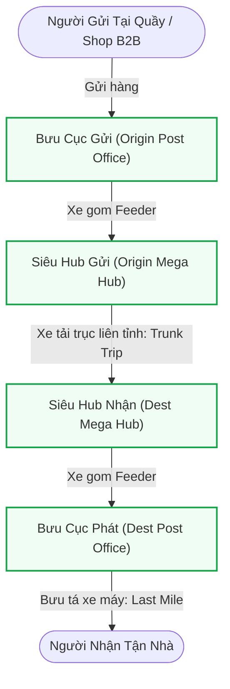
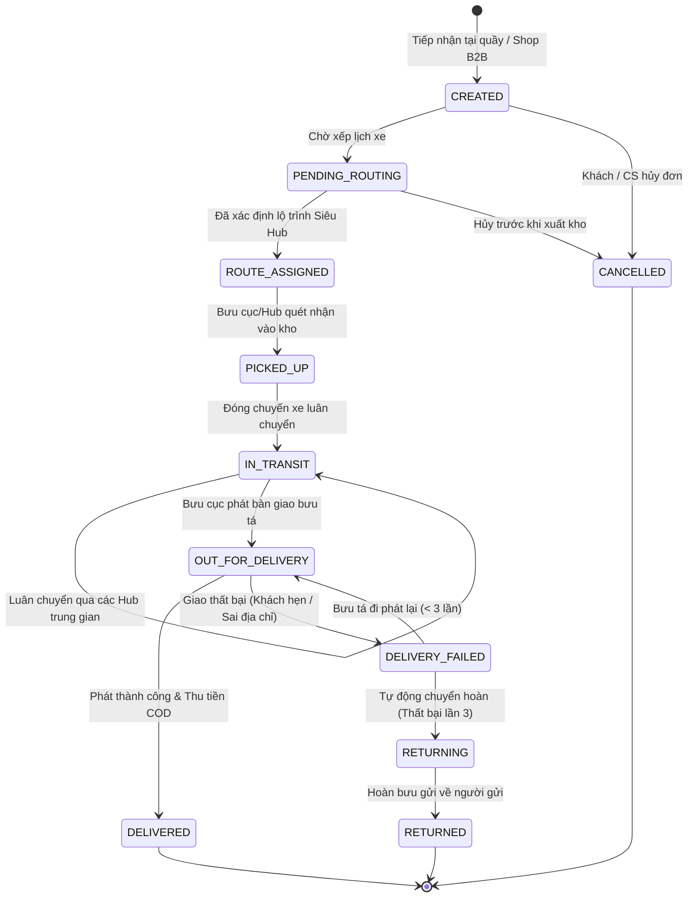

# Cẩm Nang Kỹ Thuật 04: Nghiệp Vụ Logistics Bưu Chính & Phân Quyền Ngữ Cảnh Trạm (Station Context RBAC)

> **Mục tiêu cẩm nang:** Tổng hợp toàn diện logic nghiệp vụ vận tải bưu chính toàn trình (Trips Management, Tải trọng xe, Kho bãi Hub & Bưu cục), máy trạng thái 11 bước và giải pháp bảo mật nâng cao **Station Context Binding** (Ràng buộc ngữ cảnh trạm làm việc) trong môi trường phân tán.

---

## 1. Bản Đồ Nghiệp Vụ Vận Tải Bưu Chính Thực Tế

Khác với các ứng dụng giao đồ ăn đơn chặng (Point-to-point), hệ thống bưu chính quy mô quốc gia (như VNPT Post, Viettel Post, EMS) vận hành theo mô hình mạng lưới **Hub-and-Spoke (Trục nan hoa đa chặng)**:



---

## 2. Quản Lý Chuyến Xe Trục Đa Chặng (Multi-Leg Trips & Manifests)

### 2.1. Kiểm Soát Tải Trọng Phương Tiện (Load Capacity Bar)
* Mỗi phương tiện vận tải có một mức tải trọng cho phép ($W_{\text{max}}$ tính bằng kg) ghi trên đăng kiểm.
* **Quy tắc an toàn đường bộ:** Khi xếp các bưu kiện lên xe, hệ thống cộng dồn tổng khối lượng:
  $$W_{\text{total}} = \sum_{i=1}^{n} w_i$$
* **Trực quan hóa mức tải (Load Bar):**
  * **Xanh lá ($< 80\%$):** Xe còn nhiều chỗ trống, sẵn sàng xếp thêm kiện.
  * **Vàng cam ($80\% - 99\%$):** Đạt mức tối ưu chi phí nhiên liệu.
  * **Đỏ cảnh báo ($\ge 100\%$):** Xe đã đầy tải hoặc quá tải. Hệ thống cảnh báo hoặc chặn không cho xếp thêm đơn để tránh bị phạt lỗi quá tải trên quốc lộ.

### 2.2. Niêm Phong Bảo An (Seal Number)
* Trước khi xe tải xuất bến rời Hub, điều phối viên bắt buộc phải chốt mã số niêm chì (**Seal Number**).
* Khi xe cập bến Hub đích, thủ kho chỉ được dỡ hàng khi mã niêm phong thực tế trên thùng xe trùng khớp $100\%$ với mã Seal trên bảng kê điện tử (Manifest).

---

## 3. Máy Trạng Thái Bưu Gửi 11 Bước & Tự Động Chuyển Hoàn (Auto-Returning)



### 3.1. Các Mốc Trạng Thái Bất Biến
1. `CREATED`: Đơn vừa tạo tại quầy hoặc trên Web Shop.
2. `PENDING_ROUTING`: Chờ thuật toán ghép tuyến.
3. `ROUTE_ASSIGNED`: Đã xác định lộ trình qua các Hub.
4. `PICKED_UP`: Hub/Bưu cục quét nhận hàng vào kho.
5. `IN_TRANSIT`: Hàng đang di chuyển trên xe tải luân chuyển.
6. `ARRIVED_DEST_HUB`: Hàng đã cập bến Hub phát.
7. `OUT_FOR_DELIVERY`: Bưu tá đã xuất phát đi giao.
8. `DELIVERED`: *(Điểm dừng)* Giao thành công, thu tiền COD.
9. `DELIVERY_FAILED`: Giao thất bại kèm lý do cụ thể.
10. `RETURNING`: Đang trên đường chuyển hoàn về Shop.
11. `RETURNED`: *(Điểm dừng)* Hoàn tất trả hàng cho Shop.
12. `CANCELLED`: *(Điểm dừng)* Khách/CS hủy đơn hợp lệ.

### 3.2. Logic Tự Động Chuyển Hoàn Khi Thất Bại 3 Lần
Trích đoạn code thực tế tại `TrackingServiceImpl.java`:
```java
if (newStatus == ShipmentStatus.DELIVERY_FAILED) {
    long failedCount = trackingHistoryRepository.countByTrackingCodeAndStatus(
        trackingCode, 
        ShipmentStatus.DELIVERY_FAILED.name()
    );

    // Nếu đã thất bại 3 lần -> Tự động ép chuyển hoàn
    if (failedCount >= 3) {
        newStatus = ShipmentStatus.RETURNING;
        request.setStatus(ShipmentStatus.RETURNING.name());
        request.setNote("Giao thất bại lần 3 - Hệ thống tự động kích hoạt chuyển hoàn về người gửi");
    }
}
```

---

## 4. Bảo Mật Ngữ Cảnh Trạm (Station Context RBAC)

### 4.1. Bài Toán Thực Tế
Trong một doanh nghiệp có 500 bưu cục:
* Nhân viên A có vai trò `ROLE_POST_OFFICE_STAFF` tại **Bưu cục Hoàn Kiếm (Hà Nội)**.
* Nhân viên B có vai trò `ROLE_POST_OFFICE_STAFF` tại **Bưu cục Quận 1 (TP.HCM)**.
* Nếu chỉ kiểm tra quyền dựa trên `@PreAuthorize("hasRole('POST_OFFICE_STAFF')")`, nhân viên A hoàn toàn có thể vô tình hoặc cố ý quét xuất hàng/nhận hàng của các đơn hàng đang nằm tại TP.HCM!

### 4.2. Giải Pháp: Station Context Binding
1. **Gắn trạm vào Token / Profile:** Khi nhân viên đăng nhập, `auth-service` nhúng mã bưu cục/kho làm việc (`stationId`, `stationType`) vào payload của JWT Token.
2. **Cửa ngõ Gateway trích xuất:** `JwtAuthenticationFilter` giải mã Token, bóc tách và đẩy xuống Header nội bộ:
   * `X-User-Station-Id`: `PO_HN_HOANKIEM`
   * `X-User-Station-Type`: `POST_OFFICE`
3. **Kiểm tra chéo tại Service:** Trước khi cho phép quét mã, microservice so sánh:
   ```java
   if (!shipment.getCurrentStationId().equals(currentStaffStationId)) {
       throw new ForbiddenException("Bưu phẩm không nằm tại bưu cục bạn đang phụ trách!");
   }
   ```

---

## 5. Checklist Phỏng Vấn Nghiệp Vụ & Bảo Mật

1. **"Lỗ hổng IDOR (Insecure Direct Object Reference) trong hủy đơn là gì và dự án xử lý thế nào?"**
   * *Trả lời:* IDOR là khi một chủ shop thay đổi mã đơn trên URL `POST /api/shipments/WAYBILL_999/cancel` để cố tình hủy đơn của shop khác. Hệ thống khắc phục bằng cách: Gateway bóc tách `X-User-Id` từ JWT Token đã ký bí mật; Service khi nhận lệnh hủy sẽ truy vấn DB và bắt buộc `shipment.getCustomerId() == xUserId` mới cho phép hủy.
2. **"Tại sao các trạng thái cuối (DELIVERED, CANCELLED, RETURNED) phải là Bất Biến (Immutable)?"**
   * *Trả lời:* Để bảo đảm tính toàn vẹn tài chính và pháp lý. Một khi tiền COD đã quyết toán hoặc hàng đã bàn giao, việc cho phép quét thêm trạng thái mới sẽ làm sai lệch sổ sách kế toán, phát sinh rủi ro gian lận tiền bạc giữa bưu tá và bưu cục.
