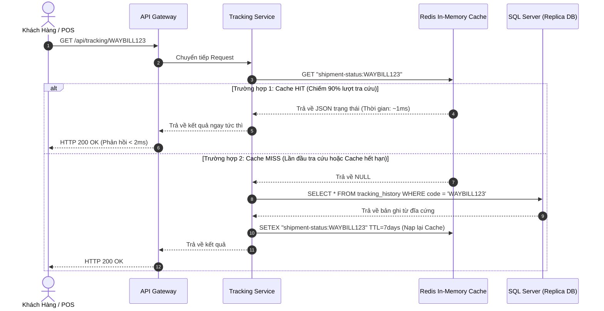
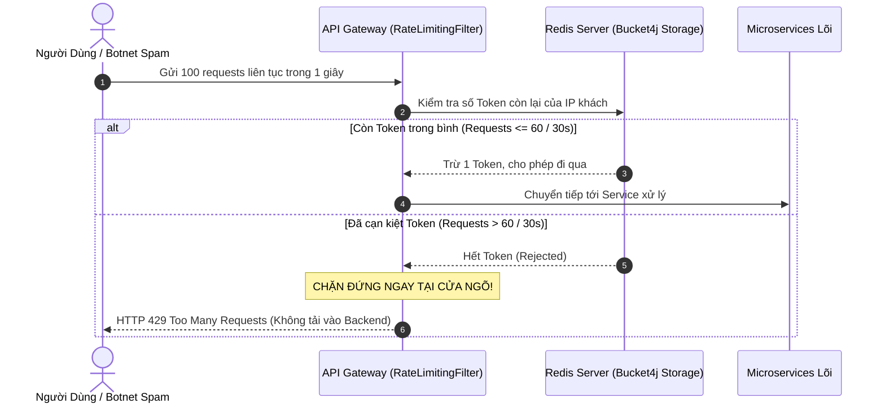
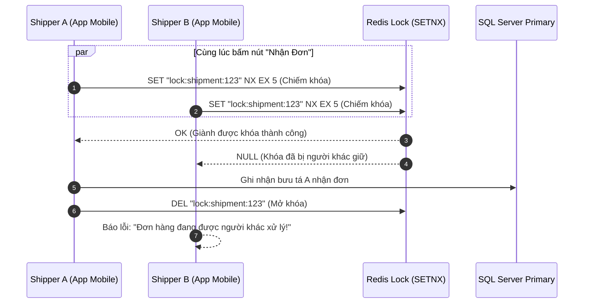

# Cẩm Nang Kỹ Thuật 05: Redis Caching, Distributed Rate Limiter & Boilerplate Code

> **Mục tiêu cẩm nang:** Hướng dẫn chi tiết các mẫu thiết kế (Design Patterns) phân tán với Redis trong Spring Boot: **Cache-Aside Pattern**, **Token Bucket Rate Limiting (Bucket4j)** và **Distributed Lock**. Bao gồm sơ đồ mô phỏng luồng toàn trình và bộ mã nguồn Boilerplate Java độc lập để bạn áp dụng khi đi làm / thực tập backend.

---

## 1. Các Vai Trò Sống Còn Của Redis Trong Hệ Thống Phân Tán

Trong dự án Waybill Platform, Redis (Port `6379`) không chỉ là nơi lưu cache thông thường, mà đóng vai trò là **"lá chắn thép"** đa nhiệm:
1. **Tầng tăng tốc tra cứu (< 2ms):** Gánh $90\%$ tải đọc mã vận đơn, giải phóng áp lực cho SQL Server.
2. **Cửa ngõ chống DDoS & Spam (Gateway Rate Limiter):** Thuật toán Token Bucket giới hạn 60 requests/30 giây theo từng địa chỉ IP.
3. **Bộ đệm an ninh:** Lưu trữ mã OTP quên mật khẩu (TTL 15 phút) và Blacklist danh sách tài khoản bị khóa tạm thời.

---

## 2. Sơ Đồ Mô Phỏng Luồng Hoạt Động (Simulation Flows)

### 2.1. Luồng Cache-Aside Tra Cứu Vận Đơn (< 2ms vs Database Fallback)


### 2.2. Luồng Chống DDoS Bằng Token Bucket (Bucket4j-Redis) Tại Gateway


### 2.3. Luồng Khóa Phân Tán (Redis Distributed Lock - Tránh Race Condition)
Khi 2 shipper cùng lúc quét nhận 1 đơn hàng trên 2 máy khác nhau:


---

## 3. Bộ Mã Nguồn Boilerplate Java Tái Sử Dụng (Generic Templates)

### 3.1. Cấu Hình RedisTemplate Đa Dụng (`RedisConfig.java`)
Cấu hình serializer JSON chuẩn Jackson, không bị lỗi byte nhị phân khó đọc trong Redis CLI:

```java
package com.common.redis.config;

import com.fasterxml.jackson.annotation.JsonAutoDetect;
import com.fasterxml.jackson.annotation.PropertyAccessor;
import com.fasterxml.jackson.databind.ObjectMapper;
import com.fasterxml.jackson.databind.jsontype.impl.LsfTypeValidator;
import org.springframework.context.annotation.Bean;
import org.springframework.context.annotation.Configuration;
import org.springframework.data.redis.connection.RedisConnectionFactory;
import org.springframework.data.redis.core.RedisTemplate;
import org.springframework.data.redis.serializer.Jackson2JsonRedisSerializer;
import org.springframework.data.redis.serializer.StringRedisSerializer;

@Configuration
public class GenericRedisConfig {

    @Bean
    public RedisTemplate<String, Object> redisTemplate(RedisConnectionFactory connectionFactory) {
        RedisTemplate<String, Object> template = new RedisTemplate<>();
        template.setConnectionFactory(connectionFactory);

        // Serializer cho Key dạng String
        StringRedisSerializer stringSerializer = new StringRedisSerializer();
        template.setKeySerializer(stringSerializer);
        template.setHashKeySerializer(stringSerializer);

        // Serializer cho Value dạng JSON
        ObjectMapper objectMapper = new ObjectMapper();
        objectMapper.setVisibility(PropertyAccessor.ALL, JsonAutoDetect.Visibility.ANY);
        Jackson2JsonRedisSerializer<Object> jsonSerializer = new Jackson2JsonRedisSerializer<>(objectMapper, Object.class);

        template.setValueSerializer(jsonSerializer);
        template.setHashValueSerializer(jsonSerializer);

        template.afterPropertiesSet();
        return template;
    }
}
```

### 3.2. Generic Cache Service (Hỗ Trợ Pattern `getOrFetch`)
Đây là công cụ cực kỳ tiện lợi: Bạn chỉ cần truyền Key, thời gian sống TTL và hàm gọi Database, Service sẽ tự động lấy Cache nếu có, hoặc gọi DB rồi tự nạp Cache nếu thiếu:

```java
package com.common.redis.service;

import lombok.RequiredArgsConstructor;
import lombok.extern.slf4j.Slf4j;
import org.springframework.data.redis.core.RedisTemplate;
import org.springframework.stereotype.Service;

import java.time.Duration;
import java.util.Optional;
import java.util.function.Supplier;

@Service
@Slf4j
@RequiredArgsConstructor
public class GenericCacheService {

    private final RedisTemplate<String, Object> redisTemplate;

    /**
     * Mẫu Cache-Aside hoàn chỉnh: Tự động tra cache -> nếu MISS thì gọi hàm DB -> nạp lại cache
     */
    @SuppressWarnings("unchecked")
    public <T> T getOrFetch(String key, Duration ttl, Class<T> clazz, Supplier<T> dbFallback) {
        try {
            Object cachedValue = redisTemplate.opsForValue().get(key);
            if (cachedValue != null) {
                log.info("🎯 [CACHE HIT] Tìm thấy dữ liệu trong Redis với Key: [{}]", key);
                return (T) cachedValue;
            }
        } catch (Exception e) {
            log.warn("⚠️ Lỗi kết nối Redis, fallback đọc trực tiếp từ CSDL: {}", e.getMessage());
        }

        log.warn("💨 [CACHE MISS] Không có trong Redis, đang truy vấn CSDL cho Key: [{}]", key);
        T dbData = dbFallback.get();

        if (dbData != null) {
            try {
                redisTemplate.opsForValue().set(key, dbData, ttl);
                log.info("💾 Đã nạp dữ liệu mới vào Redis thành công với TTL: {}s", ttl.toSeconds());
            } catch (Exception e) {
                log.error("Không thể ghi dữ liệu vào Redis: {}", e.getMessage());
            }
        }

        return dbData;
    }

    /**
     * Xóa cache khi có cập nhật dữ liệu (Cache Eviction)
     */
    public void evict(String key) {
        try {
            redisTemplate.delete(key);
            log.info("🗑️ Đã xóa cache Key: [{}]", key);
        } catch (Exception e) {
            log.error("Lỗi khi xóa cache: {}", e.getMessage());
        }
    }
}
```

### 3.3. Generic Distributed Lock Helper (`DistributedLockService.java`)
Ngăn chặn Race Condition trong môi trường nhiều máy chủ chạy song song:

```java
package com.common.redis.lock;

import lombok.RequiredArgsConstructor;
import lombok.extern.slf4j.Slf4j;
import org.springframework.data.redis.core.StringRedisTemplate;
import org.springframework.stereotype.Service;

import java.time.Duration;

@Service
@Slf4j
@RequiredArgsConstructor
public class DistributedLockService {

    private final StringRedisTemplate stringRedisTemplate;

    /**
     * Cố gắng chiếm khóa bằng lệnh SETNX (Set if Not eXists) kèm thời gian tự giải phóng (tránh Deadlock)
     */
    public boolean acquireLock(String lockKey, String lockValue, Duration timeout) {
        Boolean success = stringRedisTemplate.opsForValue().setIfAbsent(lockKey, lockValue, timeout);
        return Boolean.TRUE.equals(success);
    }

    /**
     * Giải phóng khóa an toàn (Chỉ xóa nếu giá trị khóa trùng khớp với người chiếm)
     */
    public void releaseLock(String lockKey, String lockValue) {
        String currentValue = stringRedisTemplate.opsForValue().get(lockKey);
        if (lockValue.equals(currentValue)) {
            stringRedisTemplate.delete(lockKey);
            log.info("🔓 Đã mở khóa thành công cho Key: [{}]", lockKey);
        }
    }
}
```

---

## 4. Cấu Hình `application.properties` Mẫu

```properties
# Kết nối Redis đơn hoặc cụm
spring.data.redis.host=localhost
spring.data.redis.port=6379
spring.data.redis.timeout=2000ms

# Tối ưu hóa Connection Pool Lettuce
spring.data.redis.lettuce.pool.max-active=16
spring.data.redis.lettuce.pool.max-idle=8
spring.data.redis.lettuce.pool.min-idle=2
spring.data.redis.lettuce.pool.max-wait=1000ms
```

---

## 5. Tam Đại Hiểm Họa Cache & Cách Phòng Thủ Khi Đi Phỏng Vấn

1. **Cache Avalanche (Tuyết lở Cache):**
   * *Hiện tượng:* Hàng loạt Key quan trọng cùng hết hạn vào một thời điểm (ví dụ: đúng 0h đêm). Hàng triệu request đồng loạt đâm thẳng xuống CSDL khiến DB sập nguồn.
   * *Giải pháp:* Khi đặt TTL, cộng thêm một khoảng thời gian ngẫu nhiên (Jitter): `TTL = 7 ngày + Random(10 đến 60 phút)`.
2. **Cache Penetration (Xuyên thủng Cache):**
   * *Hiện tượng:* Kẻ xấu liên tục tra cứu mã vận đơn không hề tồn tại trong hệ thống (`WAYBILL_HACK_999`). Redis không có, DB cũng không có, request liên tục đâm vào DB.
   * *Giải pháp:* Nạp giá trị rỗng (`NULL`) vào Redis với TTL ngắn (ví dụ: 2 phút), hoặc sử dụng **Bloom Filter** để lọc các Key không hợp lệ trước khi chạm vào Cache.
3. **Cache Breakdown (Sập điểm nóng Cache):**
   * *Hiện tượng:* Một Key cực hot (ví dụ: mã bưu phẩm của người nổi tiếng đang được 100.000 người theo dõi) vừa hết hạn. Ngay mili-giây đó, cả 100.000 request cùng đổ xuống DB để nạp lại cache.
   * *Giải pháp:* Sử dụng **Redis Distributed Lock (Mutex Lock)**. Chỉ cho phép 1 luồng duy nhất được quyền truy vấn DB để nạp lại Cache; các luồng còn lại chờ 50ms rồi đọc lại từ Redis.
