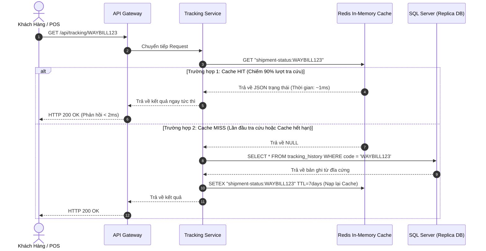
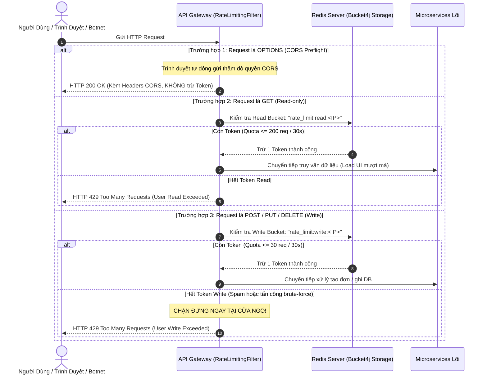
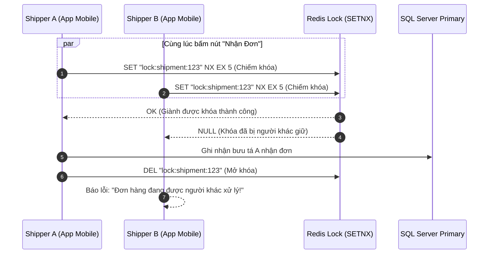

# Cẩm Nang Kỹ Thuật 05: Redis Caching, Distributed Rate Limiter & Boilerplate Code

> **Mục tiêu cẩm nang:** Hướng dẫn chi tiết các mẫu thiết kế (Design Patterns) phân tán với Redis trong Spring Boot: **Cache-Aside Pattern**, **Token Bucket Rate Limiting (Bucket4j)** và **Distributed Lock**. Bao gồm sơ đồ mô phỏng luồng toàn trình và bộ mã nguồn Boilerplate Java độc lập để bạn áp dụng khi đi làm / thực tập backend.

---

## 1. Các Vai Trò Sống Còn Của Redis Trong Hệ Thống Phân Tán

Trong dự án Waybill Platform, Redis (Port `6379`) không chỉ là nơi lưu cache thông thường, mà đóng vai trò là **"lá chắn thép"** đa nhiệm:
1. **Tầng tăng tốc tra cứu (< 2ms):** Gánh $90\%$ tải đọc mã vận đơn, giải phóng áp lực cho SQL Server.
2. **Cửa ngõ chống DDoS & Spam (Gateway Rate Limiter):** Thuật toán Token Bucket giới hạn 60 requests/30 giây theo từng địa chỉ IP.
3. **Bộ đệm an ninh:** Lưu trữ mã OTP quên mật khẩu (TTL 15 phút) và Blacklist danh sách tài khoản bị khóa tạm thời.

---

## 2. Sơ Đồ Mô Phỏng Luồng Hoạt Động (Simulation Flows)

### 2.1. Luồng Cache-Aside Tra Cứu Vận Đơn (< 2ms vs Database Fallback)


### 2.2. Luồng Chống DDoS Bằng Token Bucket Phân Tầng (Bucket4j-Redis) Tại Gateway
Thay vì áp dụng cào bằng 1 hạn mức duy nhất cho mọi loại request, hệ thống phân tách rõ ràng giữa **Yêu cầu đọc dữ liệu (`GET`)**, **Yêu cầu ghi dữ liệu (`POST/PUT/DELETE`)**, và **Yêu cầu thăm dò CORS (`OPTIONS`)**:



### 2.3. Luồng Khóa Phân Tán (Redis Distributed Lock - Tránh Race Condition)
Khi 2 shipper cùng lúc quét nhận 1 đơn hàng trên 2 máy khác nhau:


---

## 3. Bộ Mã Nguồn Boilerplate Java Tái Sử Dụng (Generic Templates)

### 3.1. Cấu Hình RedisTemplate Đa Dụng (`RedisConfig.java`)
Cấu hình serializer JSON chuẩn Jackson, không bị lỗi byte nhị phân khó đọc trong Redis CLI:

```java
package com.common.redis.config;

import com.fasterxml.jackson.annotation.JsonAutoDetect;
import com.fasterxml.jackson.annotation.PropertyAccessor;
import com.fasterxml.jackson.databind.ObjectMapper;
import com.fasterxml.jackson.databind.jsontype.impl.LsfTypeValidator;
import org.springframework.context.annotation.Bean;
import org.springframework.context.annotation.Configuration;
import org.springframework.data.redis.connection.RedisConnectionFactory;
import org.springframework.data.redis.core.RedisTemplate;
import org.springframework.data.redis.serializer.Jackson2JsonRedisSerializer;
import org.springframework.data.redis.serializer.StringRedisSerializer;

@Configuration
public class GenericRedisConfig {

    @Bean
    public RedisTemplate<String, Object> redisTemplate(RedisConnectionFactory connectionFactory) {
        RedisTemplate<String, Object> template = new RedisTemplate<>();
        template.setConnectionFactory(connectionFactory);

        // Serializer cho Key dạng String
        StringRedisSerializer stringSerializer = new StringRedisSerializer();
        template.setKeySerializer(stringSerializer);
        template.setHashKeySerializer(stringSerializer);

        // Serializer cho Value dạng JSON
        ObjectMapper objectMapper = new ObjectMapper();
        objectMapper.setVisibility(PropertyAccessor.ALL, JsonAutoDetect.Visibility.ANY);
        Jackson2JsonRedisSerializer<Object> jsonSerializer = new Jackson2JsonRedisSerializer<>(objectMapper, Object.class);

        template.setValueSerializer(jsonSerializer);
        template.setHashValueSerializer(jsonSerializer);

        template.afterPropertiesSet();
        return template;
    }
}
```

### 3.2. Generic Cache Service (Hỗ Trợ Pattern `getOrFetch`)
Đây là công cụ cực kỳ tiện lợi: Bạn chỉ cần truyền Key, thời gian sống TTL và hàm gọi Database, Service sẽ tự động lấy Cache nếu có, hoặc gọi DB rồi tự nạp Cache nếu thiếu:

```java
package com.common.redis.service;

import lombok.RequiredArgsConstructor;
import lombok.extern.slf4j.Slf4j;
import org.springframework.data.redis.core.RedisTemplate;
import org.springframework.stereotype.Service;

import java.time.Duration;
import java.util.Optional;
import java.util.function.Supplier;

@Service
@Slf4j
@RequiredArgsConstructor
public class GenericCacheService {

    private final RedisTemplate<String, Object> redisTemplate;

    /**
     * Mẫu Cache-Aside hoàn chỉnh: Tự động tra cache -> nếu MISS thì gọi hàm DB -> nạp lại cache
     */
    @SuppressWarnings("unchecked")
    public <T> T getOrFetch(String key, Duration ttl, Class<T> clazz, Supplier<T> dbFallback) {
        try {
            Object cachedValue = redisTemplate.opsForValue().get(key);
            if (cachedValue != null) {
                log.info("[CACHE HIT] Tìm thấy dữ liệu trong Redis với Key: [{}]", key);
                return (T) cachedValue;
            }
        } catch (Exception e) {
            log.warn("Lỗi kết nối Redis, fallback đọc trực tiếp từ CSDL: {}", e.getMessage());
        }

        log.warn("[CACHE MISS] Không có trong Redis, đang truy vấn CSDL cho Key: [{}]", key);
        T dbData = dbFallback.get();

        if (dbData != null) {
            try {
                redisTemplate.opsForValue().set(key, dbData, ttl);
                log.info("Đã nạp dữ liệu mới vào Redis thành công với TTL: {}s", ttl.toSeconds());
            } catch (Exception e) {
                log.error("Không thể ghi dữ liệu vào Redis: {}", e.getMessage());
            }
        }

        return dbData;
    }

    /**
     * Xóa cache khi có cập nhật dữ liệu (Cache Eviction)
     */
    public void evict(String key) {
        try {
            redisTemplate.delete(key);
            log.info("Đã xóa cache Key: [{}]", key);
        } catch (Exception e) {
            log.error("Lỗi khi xóa cache: {}", e.getMessage());
        }
    }
}
```

### 3.3. Generic Distributed Lock Helper (`DistributedLockService.java`)
Ngăn chặn Race Condition trong môi trường nhiều máy chủ chạy song song:

```java
package com.common.redis.lock;

import lombok.RequiredArgsConstructor;
import lombok.extern.slf4j.Slf4j;
import org.springframework.data.redis.core.StringRedisTemplate;
import org.springframework.stereotype.Service;

import java.time.Duration;

@Service
@Slf4j
@RequiredArgsConstructor
public class DistributedLockService {

    private final StringRedisTemplate stringRedisTemplate;

    /**
     * Cố gắng chiếm khóa bằng lệnh SETNX (Set if Not eXists) kèm thời gian tự giải phóng (tránh Deadlock)
     */
    public boolean acquireLock(String lockKey, String lockValue, Duration timeout) {
        Boolean success = stringRedisTemplate.opsForValue().setIfAbsent(lockKey, lockValue, timeout);
        return Boolean.TRUE.equals(success);
    }

    /**
     * Giải phóng khóa an toàn (Chỉ xóa nếu giá trị khóa trùng khớp với người chiếm)
     */
    public void releaseLock(String lockKey, String lockValue) {
        String currentValue = stringRedisTemplate.opsForValue().get(lockKey);
        if (lockValue.equals(currentValue)) {
            stringRedisTemplate.delete(lockKey);
            log.info("Đã mở khóa thành công cho Key: [{}]", lockKey);
        }
    }
}
```

### 3.4. Bộ Lọc Rate Limiting Phân Tầng Theo HTTP Method & Xử Lý An Toàn CORS
Mã nguồn triển khai thực tế tại API Gateway kết hợp Bucket4j và Redis Lettuce, phân tách rạch ròi giữa Read Quota và Write Quota, bảo vệ thông suốt cho CORS:

#### File `RateLimitService.java` (`api-gateway/src/main/java/org/app/apigateway/service/RateLimitService.java`)
```java
package org.app.apigateway.service;

import io.github.bucket4j.Bandwidth;
import io.github.bucket4j.Bucket;
import io.github.bucket4j.BucketConfiguration;
import io.github.bucket4j.Refill;
import io.github.bucket4j.distributed.proxy.ProxyManager;
import io.lettuce.core.RedisClient;
import lombok.RequiredArgsConstructor;
import org.springframework.stereotype.Service;

import java.time.Duration;

@Service
@RequiredArgsConstructor
public class RateLimitService {

    private final RedisClient redisClient;
    private final ProxyManager<String> proxyManager;

    /**
     * Cấp Bucket độc lập theo IP và theo HTTP Method:
     * - Request GET: Dùng bucket rate_limit:read:<ip> (200 req / 30s)
     * - Request POST/PUT/DELETE: Dùng bucket rate_limit:write:<ip> (30 req / 30s)
     */
    public Bucket resolveBucket(String ip, String httpMethod) {
        boolean isRead = "GET".equalsIgnoreCase(httpMethod);
        String redisKey = (isRead ? "rate_limit:read:" : "rate_limit:write:") + ip;
        
        return proxyManager.builder().build(
            redisKey, 
            isRead ? this::getReadConfiguration : this::getWriteConfiguration
        );
    }

    /**
     * Hạn mức Read: 200 requests / 30s -> Thoải mái tải danh sách, chuyển tab, nạp dữ liệu
     */
    private BucketConfiguration getReadConfiguration() {
        Bandwidth limit = Bandwidth.classic(200, Refill.greedy(200, Duration.ofSeconds(30)));
        return BucketConfiguration.builder().addLimit(limit).build();
    }

    /**
     * Hạn mức Write: 30 requests / 30s -> Chống spam tạo đơn, chống brute-force đăng nhập
     */
    private BucketConfiguration getWriteConfiguration() {
        Bandwidth limit = Bandwidth.classic(30, Refill.greedy(30, Duration.ofSeconds(30)));
        return BucketConfiguration.builder().addLimit(limit).build();
    }

    /**
     * Global Bucket áp dụng trên toàn bộ Gateway: Nâng lên 1000 requests / 60s
     */
    public Bucket resolveGlobalBucket() {
        return proxyManager.builder().build("rate_limit:global", this::getGlobalConfiguration);
    }

    public BucketConfiguration getGlobalConfiguration() {
        Bandwidth limit = Bandwidth.classic(1000, Refill.greedy(1000, Duration.ofSeconds(60)));
        return BucketConfiguration.builder().addLimit(limit).build();
    }
}
```

#### File `RateLimitingFilter.java` (`api-gateway/src/main/java/org/app/apigateway/filter/RateLimitingFilter.java`)
```java
package org.app.apigateway.filter;

import io.github.bucket4j.Bucket;
import io.github.bucket4j.ConsumptionProbe;
import jakarta.servlet.FilterChain;
import jakarta.servlet.ServletException;
import jakarta.servlet.http.HttpServletRequest;
import jakarta.servlet.http.HttpServletResponse;
import lombok.extern.slf4j.Slf4j;
import org.app.apigateway.service.RateLimitService;
import org.springframework.core.Ordered;
import org.springframework.core.annotation.Order;
import org.springframework.http.HttpStatus;
import org.springframework.stereotype.Component;
import org.springframework.web.filter.OncePerRequestFilter;

import java.io.IOException;

@Component
@Order(Ordered.HIGHEST_PRECEDENCE + 1)
@Slf4j
public class RateLimitingFilter extends OncePerRequestFilter {

    private final RateLimitService rateLimitService;

    public RateLimitingFilter(RateLimitService rateLimitService) {
        this.rateLimitService = rateLimitService;
    }

    @Override
    protected void doFilterInternal(HttpServletRequest request, HttpServletResponse response, FilterChain filterChain) 
            throws ServletException, IOException {
        
        // 1. QUAN TRỌNG: Bypass hoàn toàn request OPTIONS (CORS Preflight)
        // Nếu RateLimit chặn OPTIONS, trình duyệt sẽ báo lỗi đỏ "Blocked by CORS policy"
        if ("OPTIONS".equalsIgnoreCase(request.getMethod())) {
            filterChain.doFilter(request, response);
            return;
        }

        String clientIP = getClientIP(request);
        String method = request.getMethod();

        // 2. Tiêu thụ token từ Bucket tương ứng (Read vs Write)
        Bucket userBucket = rateLimitService.resolveBucket(clientIP, method);
        ConsumptionProbe userProbe = userBucket.tryConsumeAndReturnRemaining(1);

        if (!userProbe.isConsumed()) {
            long waitForRefill = Math.max(1, userProbe.getNanosToWaitForRefill() / 1_000_000_000);
            response.setStatus(HttpStatus.TOO_MANY_REQUESTS.value());
            response.setHeader("Retry-After", String.valueOf(waitForRefill));
            response.setContentType("application/json;charset=UTF-8");
            response.getWriter().write("{\"status\": 429, \"error\": \"User Limit Exceeded\", \"message\": \"Bạn đã gửi quá nhiều yêu cầu (" + method + "). Vui lòng thử lại sau!\"}");
            return;
        }

        // 3. Kiểm tra Global Bucket (Bảo vệ toàn hệ thống khỏi quá tải)
        Bucket globalBucket = rateLimitService.resolveGlobalBucket();
        ConsumptionProbe globalProbe = globalBucket.tryConsumeAndReturnRemaining(1);

        if (!globalProbe.isConsumed()) {
            long waitForRefill = Math.max(1, globalProbe.getNanosToWaitForRefill() / 1_000_000_000);
            response.setStatus(HttpStatus.TOO_MANY_REQUESTS.value());
            response.setHeader("Retry-After", String.valueOf(waitForRefill));
            response.setContentType("application/json;charset=UTF-8");
            response.getWriter().write("{\"status\": 429, \"error\": \"System Overload\", \"message\": \"Hệ thống đang quá tải! Vui lòng chờ vài giây để phục vụ tiếp!\"}");
            return;
        }

        response.setHeader("X-Rate-Limit-Remaining", String.valueOf(userProbe.getRemainingTokens()));
        response.setHeader("X-Global-Rate-Limit-Remaining", String.valueOf(globalProbe.getRemainingTokens()));
        filterChain.doFilter(request, response);
    }

    private String getClientIP(HttpServletRequest request) {
        String xfHeader = request.getHeader("X-Forwarded-For");
        if (xfHeader == null || xfHeader.isEmpty()) {
            return request.getRemoteAddr();
        }
        return xfHeader.split(",")[0].trim();
    }
}
```

---

## 4. Cấu Hình `application.properties` Mẫu

```properties
# Kết nối Redis đơn hoặc cụm
spring.data.redis.host=localhost
spring.data.redis.port=6379
spring.data.redis.timeout=2000ms

# Tối ưu hóa Connection Pool Lettuce
spring.data.redis.lettuce.pool.max-active=16
spring.data.redis.lettuce.pool.max-idle=8
spring.data.redis.lettuce.pool.min-idle=2
spring.data.redis.lettuce.pool.max-wait=1000ms
```

---

## 5. Tam Đại Hiểm Họa Cache & Bí Kíp Phỏng Vấn Kiến Trúc

1. **Cache Avalanche (Tuyết lở Cache):**
   * *Hiện tượng:* Hàng loạt Key quan trọng cùng hết hạn vào một thời điểm (ví dụ: đúng 0h đêm). Hàng triệu request đồng loạt đâm thẳng xuống CSDL khiến DB sập nguồn.
   * *Giải pháp:* Khi đặt TTL, cộng thêm một khoảng thời gian ngẫu nhiên (Jitter): `TTL = 7 ngày + Random(10 đến 60 phút)`.
2. **Cache Penetration (Xuyên thủng Cache):**
   * *Hiện tượng:* Kẻ xấu liên tục tra cứu mã vận đơn không hề tồn tại trong hệ thống (`WAYBILL_HACK_999`). Redis không có, DB cũng không có, request liên tục đâm vào DB.
   * *Giải pháp:* Nạp giá trị rỗng (`NULL`) vào Redis với TTL ngắn (ví dụ: 2 phút), hoặc sử dụng **Bloom Filter** để lọc các Key không hợp lệ trước khi chạm vào Cache.
3. **Cache Breakdown (Sập điểm nóng Cache):**
   * *Hiện tượng:* Một Key cực hot (ví dụ: mã bưu phẩm của người nổi tiếng đang được 100.000 người theo dõi) vừa hết hạn. Ngay mili-giây đó, cả 100.000 request cùng đổ xuống DB để nạp lại cache.
   * *Giải pháp:* Sử dụng **Redis Distributed Lock (Mutex Lock)**. Chỉ cho phép 1 luồng duy nhất được quyền truy vấn DB để nạp lại Cache; các luồng còn lại chờ 50ms rồi đọc lại từ Redis.
4. **Cái Bẫy CORS Preflight Khi Dùng Custom Filter & Bí Kíp Tránh Lỗi "Blocked by CORS Policy" Giả:**
   * *Hiện tượng:* Trình duyệt báo lỗi màu đỏ rực trong Console: `Access to fetch at '...' has been blocked by CORS policy: Response to preflight request doesn't pass access control check`. Lập trình viên kiểm tra cấu hình CORS thì thấy đã bật đủ `CorsFilter` nhưng vẫn không chạy được.
   * *Nguyên nhân cốt lõi:* Với mọi request API có đính kèm header tùy biến (như `Authorization: Bearer <token>`), trình duyệt luôn tự động gửi ngầm một request phương thức **`OPTIONS` (CORS Preflight)** trước để thăm dò. Nếu Gateway gắn Custom Filter (Rate Limiting, JWT Filter) có thứ tự ưu tiên cao (`@Order(Ordered.HIGHEST_PRECEDENCE + 1)`):
     - Khi hết token, Filter chặn đứng request `OPTIONS` và trả về mã `429 Too Many Requests`.
     - Vì request `OPTIONS` bị trả về lỗi trước khi chạm tới `CorsFilter`, response không chứa header `Access-Control-Allow-Origin` $\rightarrow$ Trình duyệt hiểu nhầm là server từ chối CORS!
   * *Giải pháp vàng:* Luôn đặt dòng kiểm tra `if ("OPTIONS".equalsIgnoreCase(request.getMethod())) { filterChain.doFilter(request, response); return; }` ở dòng đầu tiên của mọi Custom Filter tại Gateway.
