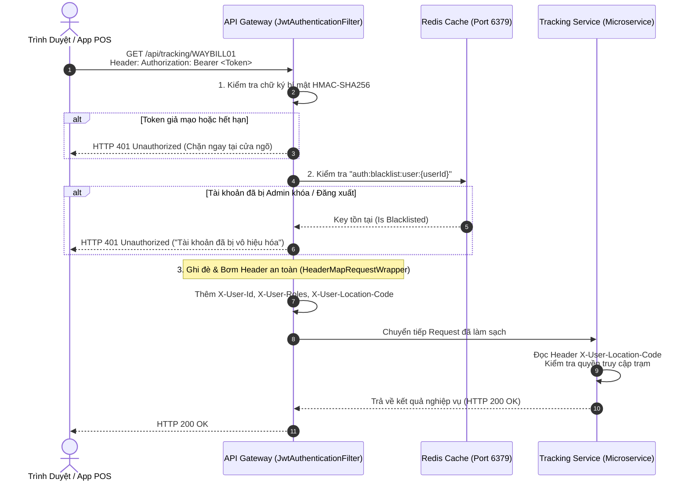
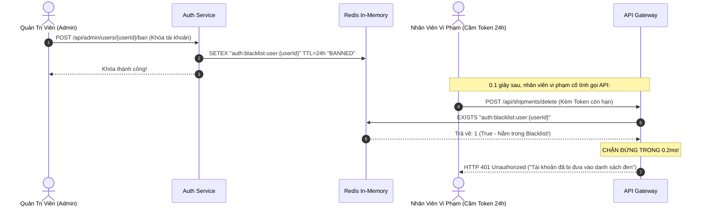

# Cẩm Nang Kỹ Thuật 06: Bảo Mật Microservices Với Stateless JWT, Redis Blacklist & RBAC

> **Mục tiêu cẩm nang:** Hướng dẫn toàn diện kiến trúc bảo mật phân tán Zero-Trust cho hệ thống Microservices: **Xác thực JWT phi trạng thái**, **Cơ chế Blacklist tức thời qua Redis (< 0.5ms)**, **Chống giả mạo Header (Header Spoofing)**, phân quyền **RBAC & Station Context**, kèm **sơ đồ mô phỏng luồng** và **bộ mã nguồn Boilerplate Java chuẩn Production**.

---

## 1. Bản Chất Bảo Mật Trong Kiến Trúc Microservices

Trong hệ thống phân tán, mô hình lưu phiên truyền thống (`HttpSession` trên RAM máy chủ) bộc lộ 2 nhược điểm chết người:
* **Không thể Scale-out:** Khi có 10 instance Gateway chạy song song, người dùng gửi request vào Gateway 1 thì Gateway 2 không có Session $\rightarrow$ Phải đồng bộ RAM tốn kém (Session Sticky).
* **Quá tải cho Service lõi:** Nếu mỗi Microservice bên trong đều phải tự giải mã JWT và gọi Database để kiểm tra quyền hạn $\rightarrow$ CSDL bị nghẽn truy vấn phân quyền.

### Giải Pháp Của VNPT Waybill Platform: "Bảo Vệ Tại Cửa Ngõ - Tin Cậy Bên Trong (Perimeter Defense)"
1. **API Gateway đóng vai trò "Cảnh sát cửa khẩu":** Chỉ có Gateway chịu trách nhiệm giải mã chữ ký bí mật HMAC-SHA256 của JWT và kiểm tra danh sách đen (Blacklist) trong Redis.
2. **Gắn thẻ định danh nội bộ (Header Enrichment):** Sau khi xác thực hợp lệ, Gateway bóc tách thông tin và đính kèm vào HTTP Header nội bộ:
   * `X-User-Id`: ID người dùng.
   * `X-User-Roles`: Danh sách vai trò (`ROLE_ADMIN`, `ROLE_HUB_OPERATOR`,...).
   * `X-User-Permissions`: Danh sách quyền hạn chi tiết.
   * `X-User-Location-Code`: Mã trạm/bưu cục làm việc (`PO_HN_HOANKIEM`, `HUB_DANANG`,...).
3. **Microservices bên trong chạy siêu tốc:** Các service con (`shipment-service`, `tracking-service`) chỉ việc đọc thông tin từ Header do Gateway gửi sang, không tốn tài nguyên giải mã token nữa.

---

## 2. Sơ Đồ Mô Phỏng Luồng Hoạt Động (Security Simulation Flows)

### 2.1. Luồng Xác Thực Cửa Ngõ & Bơm Header Nội Bộ (Gateway Authentication Flow)


### 2.2. Luồng Khóa Tài Khoản Tức Thì (< 0.5ms) Bằng Redis Blacklist
Một nhược điểm kinh điển của JWT là **không thể thu hồi (Stateless Token Revocation)** trước khi hết hạn (ví dụ Token cấp có hạn 24h thì nhân viên nghỉ việc vẫn vào được hệ thống). Chúng ta giải quyết triệt để bài toán này bằng Redis:



---

## 3. Bộ Mã Nguồn Boilerplate Java Tái Sử Dụng (Production-Ready)

### 3.1. Dịch Vụ Tạo & Giải Mã JWT (`GenericJwtService.java`)
```java
package com.common.security.jwt;

import io.jsonwebtoken.Claims;
import io.jsonwebtoken.Jwts;
import io.jsonwebtoken.security.Keys;
import org.springframework.beans.factory.annotation.Value;
import org.springframework.stereotype.Service;

import javax.crypto.SecretKey;
import java.nio.charset.StandardCharsets;
import java.util.Date;
import java.util.List;
import java.util.Map;

@Service
public class GenericJwtService {

    @Value("${app.jwt.secret:9a7b8c6d5e4f3a2b1c0d9e8f7a6b5c4d3e2f1a0b9c8d7e6f5a4b3c2d1e0f9a8b}")
    private String secretKey;

    @Value("${app.jwt.expiration-ms:86400000}") // 24 giờ
    private Long expirationTime;

    private SecretKey getSigningKey() {
        return Keys.hmacShaKeyFor(secretKey.getBytes(StandardCharsets.UTF_8));
    }

    /**
     * Phát hành Token kèm Custom Claims (userId, roles, locationCode)
     */
    public String generateToken(String username, String userId, List<String> roles, String locationCode) {
        Date now = new Date();
        Date expiryDate = new Date(now.getTime() + expirationTime);

        return Jwts.builder()
                .subject(username)
                .claim("userId", userId)
                .claim("roles", roles)
                .claim("locationCode", locationCode != null ? locationCode : "")
                .issuedAt(now)
                .expiration(expiryDate)
                .signWith(getSigningKey())
                .compact();
    }

    /**
     * Giải mã và xác thực chữ ký của Token
     */
    public Claims extractClaims(String token) {
        return Jwts.parser()
                .verifyWith(getSigningKey())
                .build()
                .parseSignedClaims(token)
                .getPayload();
    }
}
```

### 3.2. Cửa Ngõ Gateway Filter Ghi Đè Header An Toàn (`JwtAuthenticationFilter.java`)
```java
package com.common.gateway.filter;

import com.common.gateway.util.HeaderMapRequestWrapper;
import com.common.security.jwt.GenericJwtService;
import io.jsonwebtoken.Claims;
import jakarta.servlet.FilterChain;
import jakarta.servlet.ServletException;
import jakarta.servlet.http.HttpServletRequest;
import jakarta.servlet.http.HttpServletResponse;
import lombok.RequiredArgsConstructor;
import lombok.extern.slf4j.Slf4j;
import org.springframework.data.redis.core.StringRedisTemplate;
import org.springframework.security.authentication.UsernamePasswordAuthenticationToken;
import org.springframework.security.core.authority.SimpleGrantedAuthority;
import org.springframework.security.core.context.SecurityContextHolder;
import org.springframework.stereotype.Component;
import org.springframework.web.filter.OncePerRequestFilter;

import java.io.IOException;
import java.util.ArrayList;
import java.util.List;

@Component
@Slf4j
@RequiredArgsConstructor
public class JwtAuthenticationFilter extends OncePerRequestFilter {

    private final GenericJwtService jwtService;
    private final StringRedisTemplate redisTemplate;

    @Override
    protected void doFilterInternal(HttpServletRequest request, HttpServletResponse response, FilterChain filterChain)
            throws ServletException, IOException {

        String authHeader = request.getHeader("Authorization");

        if (authHeader == null || !authHeader.startsWith("Bearer ")) {
            filterChain.doFilter(request, response);
            return;
        }

        String token = authHeader.substring(7);

        try {
            Claims claims = jwtService.extractClaims(token);
            String email = claims.getSubject();
            String userId = String.valueOf(claims.get("userId"));
            String locationCode = String.valueOf(claims.get("locationCode"));

            // 1. KIỂM TRA BLACKLIST REDIS (< 0.5ms)
            if (userId != null && !userId.isBlank()) {
                String blacklistKey = "auth:blacklist:user:" + userId;
                Boolean isBanned = redisTemplate.hasKey(blacklistKey);
                if (Boolean.TRUE.equals(isBanned)) {
                    log.warn("Tài khoản UserId [{}] nằm trong danh sách đen Redis!", userId);
                    response.setStatus(HttpServletResponse.SC_UNAUTHORIZED);
                    response.setContentType("application/json;charset=UTF-8");
                    response.getWriter().write("{\"error\": \"Tài khoản đã bị vô hiệu hóa hoặc đăng xuất.\"}");
                    return;
                }
            }

            // 2. TRÍCH XUẤT AUTHORITIES
            @SuppressWarnings("unchecked")
            List<String> roles = claims.get("roles", List.class);
            List<SimpleGrantedAuthority> authorities = new ArrayList<>();
            if (roles != null) {
                roles.forEach(role -> authorities.add(new SimpleGrantedAuthority(
                        role.startsWith("ROLE_") ? role : "ROLE_" + role)));
            }

            UsernamePasswordAuthenticationToken authentication =
                    new UsernamePasswordAuthenticationToken(email, null, authorities);
            SecurityContextHolder.getContext().setAuthentication(authentication);

            // 3. MẤU CHỐT BẢO MẬT: BỌC REQUEST ĐỂ GHI ĐÈ HEADER NỘI BỘ
            // Tuyệt đối không tin tưởng header do client bên ngoài tự ý đính kèm lên!
            HeaderMapRequestWrapper requestWrapper = new HeaderMapRequestWrapper(request);
            requestWrapper.addHeader("X-User-Id", userId != null ? userId : "");
            requestWrapper.addHeader("X-User-Email", email != null ? email : "");
            requestWrapper.addHeader("X-User-Roles", roles != null ? String.join(",", roles) : "");
            requestWrapper.addHeader("X-User-Location-Code", locationCode != null ? locationCode : "");

            filterChain.doFilter(requestWrapper, response);

        } catch (Exception e) {
            log.error("Token không hợp lệ hoặc đã hết hạn: {}", e.getMessage());
            SecurityContextHolder.clearContext();
            filterChain.doFilter(request, response);
        }
    }
}
```

### 3.3. Bộ Bọc Request Để Thêm/Sửa Header (`HeaderMapRequestWrapper.java`)
Trong chuẩn Servlet API của Java, đối tượng `HttpServletRequest` mặc định bị **khóa bất biến (Immutable)** không cho phép thêm hay sửa Header. Ta kế thừa `HttpServletRequestWrapper` để mở quyền ghi đè header an toàn:

```java
package com.common.gateway.util;

import jakarta.servlet.http.HttpServletRequest;
import jakarta.servlet.http.HttpServletRequestWrapper;

import java.util.*;

public class HeaderMapRequestWrapper extends HttpServletRequestWrapper {

    private final Map<String, String> customHeaders = new HashMap<>();

    public HeaderMapRequestWrapper(HttpServletRequest request) {
        super(request);
    }

    public void addHeader(String name, String value) {
        this.customHeaders.put(name, value);
    }

    @Override
    public String getHeader(String name) {
        String headerValue = customHeaders.get(name);
        if (headerValue != null) {
            return headerValue;
        }
        return super.getHeader(name);
    }

    @Override
    public Enumeration<String> getHeaderNames() {
        Set<String> set = new HashSet<>(customHeaders.keySet());
        Enumeration<String> e = super.getHeaderNames();
        while (e.hasMoreElements()) {
            set.add(e.nextElement());
        }
        return Collections.enumeration(set);
    }

    @Override
    public Enumeration<String> getHeaders(String name) {
        if (customHeaders.containsKey(name)) {
            return Collections.enumeration(Collections.singletonList(customHeaders.get(name)));
        }
        return super.getHeaders(name);
    }
}
```

### 3.4. Cấu Hình Spring Security 6.x / Spring Boot 3.x (`SecurityConfig.java`)
```java
package com.common.gateway.config;

import com.common.gateway.filter.JwtAuthenticationFilter;
import lombok.RequiredArgsConstructor;
import org.springframework.context.annotation.Bean;
import org.springframework.context.annotation.Configuration;
import org.springframework.http.HttpMethod;
import org.springframework.security.config.Customizer;
import org.springframework.security.config.annotation.web.builders.HttpSecurity;
import org.springframework.security.config.annotation.web.configuration.EnableWebSecurity;
import org.springframework.security.config.annotation.web.configurers.AbstractHttpConfigurer;
import org.springframework.security.config.http.SessionCreationPolicy;
import org.springframework.security.web.SecurityFilterChain;
import org.springframework.security.web.authentication.UsernamePasswordAuthenticationFilter;

@Configuration
@EnableWebSecurity
@RequiredArgsConstructor
public class SecurityConfig {

    private final JwtAuthenticationFilter jwtFilter;

    @Bean
    public SecurityFilterChain securityFilterChain(HttpSecurity http) throws Exception {
        return http
                // 1. Tắt CSRF vì ứng dụng là Stateless REST API (dùng JWT, không dùng Cookie Session)
                .csrf(AbstractHttpConfigurer::disable)
                .cors(Customizer.withDefaults())
                // 2. Chế độ STATELESS: Không lưu phiên vào RAM máy chủ
                .sessionManagement(session -> session.sessionCreationPolicy(SessionCreationPolicy.STATELESS))
                // 3. Quy tắc phân quyền theo URL
                .authorizeHttpRequests(auth -> auth
                        .requestMatchers("/api/auth/**").permitAll()
                        .requestMatchers(HttpMethod.GET, "/api/tracking/**").permitAll()
                        .requestMatchers(HttpMethod.GET, "/api/shipments/*").permitAll()
                        .requestMatchers("/api/admin/**").hasRole("ADMIN")
                        .requestMatchers("/api/audits/**").hasAnyRole("CS", "ADMIN")
                        .anyRequest().authenticated()
                )
                // 4. Đặt JwtFilter trước UsernamePasswordAuthenticationFilter
                .addFilterBefore(jwtFilter, UsernamePasswordAuthenticationFilter.class)
                .build();
    }
}
```

### 3.5. Trình Tiện Ích Đọc Ngữ Cảnh Người Dùng Ở Các Microservices Con
Ở các service con (như `shipment-service`, `tracking-service`), bạn không cần parse JWT nữa, chỉ cần gọi `UserContextHolder`:

```java
package com.common.context;

import jakarta.servlet.http.HttpServletRequest;
import org.springframework.web.context.request.RequestContextHolder;
import org.springframework.web.context.request.ServletRequestAttributes;

public class UserContextHolder {

    public static String getUserId() {
        return getHeader("X-User-Id");
    }

    public static String getStationLocation() {
        return getHeader("X-User-Location-Code");
    }

    public static String getRoles() {
        return getHeader("X-User-Roles");
    }

    private static String getHeader(String headerName) {
        ServletRequestAttributes attrs = (ServletRequestAttributes) RequestContextHolder.getRequestAttributes();
        if (attrs != null) {
            HttpServletRequest request = attrs.getRequest();
            return request.getHeader(headerName);
        }
        return "";
    }
}
```

---

## 4. Checklist Phỏng Vấn Bảo Mật Microservices (Interview Questions & Answers)

1. **"Tại sao trong ứng dụng REST API dùng JWT, chúng ta lại tắt tính năng CSRF (`csrf.disable()`)?"**
   * *Trả lời:* Tấn công CSRF (Cross-Site Request Forgery) lợi dụng cơ chế trình duyệt tự động đính kèm Cookie (Session Cookie) khi người dùng bấm vào một liên kết độc hại từ trang web khác. Khi sử dụng JWT, Token được lưu trữ ở `localStorage` hoặc `sessionStorage` của client và chỉ được gửi thông qua Header `Authorization: Bearer <Token>`. Trình duyệt **không bao giờ tự động đính kèm Header này** khi gửi request từ website lạ, do đó nguy cơ tấn công CSRF tự động bị triệt tiêu $\rightarrow$ Việc tắt CSRF giúp tối ưu hiệu năng và không cần token CSRF phức tạp.
2. **"Lỗ hổng Header Spoofing là gì và hệ thống của bạn phòng chống ra sao?"**
   * *Trả lời:* Header Spoofing là trường hợp kẻ tấn công cố tình tự gửi request kèm header giả mạo (ví dụ: `X-User-Roles: ROLE_ADMIN` hoặc `X-User-Location-Code: PO_HAIPHONG`). Trong dự án của chúng tôi: Toàn bộ Microservices con nằm trong mạng nội bộ phía sau Gateway; và tại `JwtAuthenticationFilter`, chúng tôi sử dụng `HeaderMapRequestWrapper` để **ghi đè triệt để (Overwrite)** các header này bằng dữ liệu đã được xác thực từ chữ ký mật HMAC-SHA256 của JWT. Mọi giá trị do client tự ý gắn từ ngoài Internet đều bị Gateway xóa bỏ.
3. **"Ưu nhược điểm của việc Blacklist JWT qua Redis so với việc lưu Token trong DB?"**
   * *Trả lời:*
     * **Lưu trong SQL Server:** Mỗi request đều phải SELECT CSDL $\rightarrow$ Làm chậm hệ thống, mất bản chất phi trạng thái của JWT.
     * **Lưu trong Redis In-Memory:** Lệnh `EXISTS` trong Redis chỉ mất **0.2ms - 0.5ms**. Đồng thời, Key trong Redis được đặt `TTL` bằng đúng thời gian còn lại của Token, nên Redis sẽ tự động dọn dẹp bộ nhớ (Auto-expire) mà không cần viết cron-job dọn rác thủ công.
