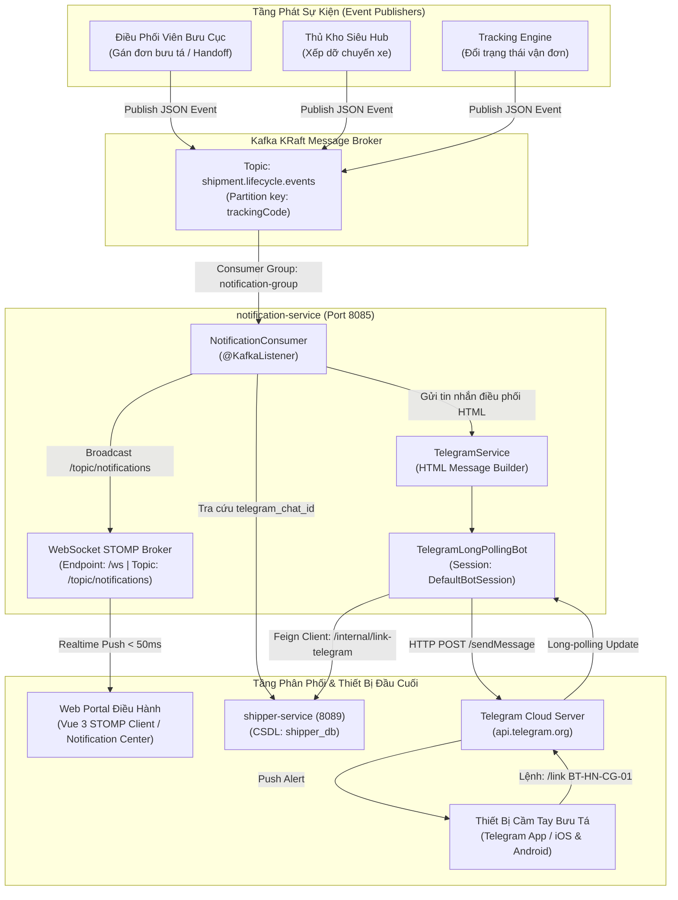
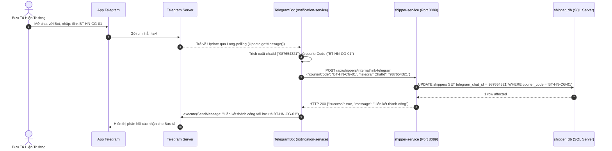

# Cẩm Nang Kỹ Thuật 07: Điều Phối Bưu Tá Qua Telegram Bot & Thông Báo Thời Gian Thực (WebSocket / STOMP)

> **Mục tiêu cẩm nang:** Phân tích chuyên sâu kiến trúc thông báo đa kênh (Omni-channel Notifications) trong hệ thống bưu chính toàn trình: từ việc tích hợp **Telegram Long-Polling Bot** để điều phối bưu tá tức thời không cần hạ tầng IP tĩnh, kết nối liên dịch vụ qua **Feign Client**, cho đến **WebSocket STOMP Message Broker** đẩy sự kiện real-time lên Web Portal với độ trễ dưới 50ms.

---

## 1. Bài Toán Nghiệp Vụ: Đưa Lệnh Điều Phối Tới Bưu Tá Hiện Trường

Trong vận hành bưu chính chặng cuối (Last-Mile Delivery), bài toán cốt lõi là **thời gian phản hồi (Response Time)** khi bưu phẩm cập bến bưu cục phát:
1. **Thách thức truyền thống:** Bưu tá (Shipper) thường xuyên di chuyển ngoài đường bằng xe máy, không thể liên tục mở laptop hoặc duy trì màn hình web portal. Nếu sử dụng SMS Brandname truyền thống, chi phí vận hành sẽ rất lớn (300 - 500 VNĐ / tin), đồng thời tin nhắn SMS không hỗ trợ định dạng giàu (Rich Text, HTML, vị trí bản đồ, mã vận đơn tương tác).
2. **Giải pháp hiện đại:** Tận dụng hệ sinh thái OTT như **Telegram Bot API** để gửi thông báo điều phối tự động miễn phí, bảo mật mã hóa đầu cuối, hiển thị đầy đủ thông tin: Người nhận, Địa chỉ, Số điện thoại (click-to-call), Tiền thu hộ COD và Ghi chú phát hàng.
3. **Song hành Web Portal:** Tại văn phòng bưu cục và kho trung chuyển, điều phối viên cần nắm bắt biến động vận đơn ngay trên giao diện qua kênh **WebSocket (STOMP)** mà không cần F5 trình duyệt.



---

## 2. Kiến Trúc Telegram Bot: Long-Polling vs. Webhook Trade-Off

Khi xây dựng Telegram Bot trong kiến trúc Microservices, có hai cơ chế nhận dữ liệu từ máy chủ Telegram:

| Tiêu Chí Kỹ Thuật | Webhook Architecture | Long-Polling Architecture (Lựa Chọn Dự Án) |
| :--- | :--- | :--- |
| **Yêu cầu mạng** | Bắt buộc phải có **Public IP tĩnh / Domain** và chứng chỉ **HTTPS/SSL** hợp lệ được Telegram tin cậy. | Hoạt động hoàn hảo **phía sau NAT / Firewall**, mạng nội bộ (Intranet / On-Premise) và môi trường phát triển Localhost mà không cần public IP hay cấu hình ngrok. |
| **Bảo mật mạng** | Phải mở port công khai trên tường lửa vào container `notification-service`, tăng diện tích tấn công (Attack Surface). | Tường lửa chỉ cần cho phép **Outbound Traffic (Egress)** tới `api.telegram.org:443`, chặn đứng 100% Inbound traffic từ bên ngoài. |
| **Độ phức tạp hạ tầng**| Cần cấu hình reverse proxy (Nginx/Ingress) định tuyến webhook endpoint, quản lý SSL certificate rotation. | Zero-configuration hạ tầng: Khởi chạy Spring Boot là Bot tự động kết nối và nhận update. |
| **Độ trễ (Latency)** | Tức thời ($< 100$ms khi có sự kiện). | Gần như tức thời ($100 - 300$ms) vì connection HTTP được giữ mở liên tục (Long-poll timeout $30 - 60$s). |
| **Khả năng Scale ngang** | Dễ dàng scale nhiều instance sau Load Balancer. | Nếu chạy nhiều instance cùng lúc với cùng 1 Bot Token, Telegram sẽ báo lỗi conflict `409 Conflict: terminated by other long poll or webhook`. Cần dùng Leader Election hoặc cấu hình instance chuyên biệt. |

### Cơ Chế Đăng Ký Khởi Chạy Tự Động (Graceful Lifecycle Registration)
Dự án sử dụng pattern `ApplicationReadyEvent` kết hợp kiểm tra an toàn token placeholder để tránh làm treo ứng dụng trong môi trường CI/CD không có kết nối Telegram:

```java
@Slf4j
@Component
@RequiredArgsConstructor
public class TelegramBotRegistrar {

    private final TelegramBot telegramBot;

    @Value("${telegram.bot.enabled:false}")
    private boolean enabled;

    @Value("${telegram.bot.token:placeholder_token}")
    private String botToken;

    @EventListener(ApplicationReadyEvent.class)
    public void register() {
        if (!enabled || isPlaceholder(botToken)) {
            log.info("[TELEGRAM] Long-polling bot chưa kích hoạt (enabled={}, token placeholder={}). Bỏ qua đăng ký.",
                    enabled, isPlaceholder(botToken));
            return;
        }
        try {
            TelegramBotsApi botsApi = new TelegramBotsApi(DefaultBotSession.class);
            botsApi.registerBot(telegramBot);
            log.info("[TELEGRAM] Đã đăng ký bot long-polling thành công với session DefaultBotSession.");
        } catch (TelegramApiException e) {
            log.error("[TELEGRAM] Đăng ký bot long-polling thất bại: {}", e.getMessage(), e);
        }
    }

    private boolean isPlaceholder(String token) {
        return token == null || token.isBlank() || "placeholder_token".equalsIgnoreCase(token);
    }
}
```

---

## 3. Luồng Liên Kết Tài Khoản Bưu Tá (`/link`) Qua Feign Client

Để bảo vệ quyền riêng tư và linh hoạt phân công nhân sự, hệ thống không lưu cứng số điện thoại hay tài khoản mạng xã hội của bưu tá vào code. Thay vào đó, hệ thống xây dựng cơ chế **định danh động qua `telegram_chat_id`**:



### Mã Nguồn Xử Lý Lệnh Tại `TelegramBot.java`:
```java
@Component
@RequiredArgsConstructor
@Slf4j
public class TelegramBot extends TelegramLongPollingBot {

    private final ShipperClient shipperClient;

    @Value("${telegram.bot.username}")
    private String botUsername;

    @Value("${telegram.bot.token}")
    private String botToken;

    @Override
    public void onUpdateReceived(Update update) {
        if (update.getMessage() == null || !update.getMessage().hasText()) return;

        String text = update.getMessage().getText().trim();
        String chatId = update.getMessage().getChatId().toString();

        if (text.startsWith("/link") || text.startsWith("/start")) {
            handleLinkCommand(chatId, text);
        } else {
            sendReply(chatId, "Xin chào! Tôi là bot điều phối bưu chính VNPT.\n"
                    + "Để nhận đơn hàng tự động, vui lòng dùng lệnh:\n"
                    + "`/link <MÃ_BƯU_TÁ>`\n"
                    + "Ví dụ: `/link BT-HN-CG-01`");
        }
    }

    private void handleLinkCommand(String chatId, String text) {
        String[] parts = text.split("\\s+");
        if (parts.length < 2) {
            sendReply(chatId, "Vui lòng nhập kèm mã bưu tá hợp lệ.\nVí dụ: `/link BT-HN-CG-01`");
            return;
        }
        String courierCode = parts[1].trim().toUpperCase();
        try {
            Map<String, Object> result = shipperClient.linkTelegram(
                Map.of("courierCode", courierCode, "telegramChatId", chatId)
            );
            boolean success = Boolean.TRUE.equals(result.get("success"));
            if (success) {
                sendReply(chatId, "*Liên kết thành công!*\n"
                        + "Tài khoản này đã được gắn với bưu tá: *" + courierCode + "*.\n"
                        + "Bạn sẽ nhận được thông báo ngay khi có bưu gửi mới được bàn giao.");
            } else {
                sendReply(chatId, "Không tìm thấy mã bưu tá *" + courierCode + "* trong cơ sở dữ liệu!");
            }
        } catch (Exception e) {
            log.error("[TELEGRAM BOT] Lỗi gọi shipper-service: {}", e.getMessage(), e);
            sendReply(chatId, "Hệ thống đang bảo trì kết nối bưu tá. Vui lòng thử lại sau.");
        }
    }
}
```

---

## 4. Mẫu Định Dạng Thông Báo Điều Phối Đơn Hàng (HTML Template)

Khi bưu cục bàn giao kiện hàng cho bưu tá (`OUT_FOR_DELIVERY`), `NotificationConsumer` trong `notification-service` sẽ tự động ghép dữ liệu từ `ShipmentDetailResponse` và `ShipperLookupResponse` để tạo bản tin HTML trực quan, tối ưu cho mắt đọc của bưu tá:

```java
private String buildShipperNotificationHtml(
        ShipmentLifecycleEvent event,
        ShipmentDetailResponse shipment, 
        ShipperLookupResponse shipper) {
    
    String receiverName = (shipment != null && shipment.getReceiverName() != null) 
            ? shipment.getReceiverName() : "Theo phiếu gửi";
    String receiverPhone = (shipment != null && shipment.getReceiverPhone() != null) 
            ? shipment.getReceiverPhone() : "Chưa cập nhật";
    String receiverAddress = (shipment != null && shipment.getReceiverAddress() != null) 
            ? shipment.getReceiverAddress() : "Theo địa chỉ bưu gửi";
    String codText = (shipment != null && shipment.getCodAmount() != null)
            ? String.format("%,.0f VNĐ", shipment.getCodAmount()) : "0 VNĐ";

    return "<b>BẠN CÓ ĐƠN HÀNG MỚI ĐƯỢC PHÂN CÔNG!</b>\n\n"
            + "<b>Bưu tá:</b> " + shipper.getFullName() + " (" + shipper.getCourierCode() + ")\n"
            + "<b>Mã vận đơn:</b> <code>" + event.getTrackingCode() + "</code>\n"
            + "<b>Bưu cục xuất phát:</b> " + (event.getLocationCode() != null ? event.getLocationCode() : "N/A") + "\n"
            + "------------------------------------\n"
            + "<b>Người nhận:</b> " + receiverName + "\n"
            + "<b>SĐT:</b> " + receiverPhone + "\n"
            + "<b>Địa chỉ phát:</b> " + receiverAddress + "\n"
            + "<b>Tiền thu hộ COD:</b> " + codText + "\n"
            + "<b>Ghi chú:</b> " + (event.getNote() != null ? event.getNote() : "Không có") + "\n\n"
            + "⚡ <i>Vui lòng kiểm tra hàng hoá và tiến hành phát đúng quy trình!</i>";
}
```

---

## 5. Kiến Trúc WebSocket & STOMP Cho Web Portal

Tại màn hình điều hành Web Portal, việc liên tục gửi HTTP Polling (ví dụ: `setInterval` mỗi 3s) sẽ gây lãng phí băng thông và tài nguyên CPU máy chủ nghiêm trọng khi có hàng nghìn nhân viên đăng nhập cùng lúc. Hệ thống tích hợp chuẩn **WebSocket với giao thức STOMP (Simple Text Oriented Messaging Protocol)**:

### 5.1. Cấu Hình STOMP Endpoint (`WebSocketConfig.java`)
```java
@Configuration
@EnableWebSocketMessageBroker
public class WebSocketConfig implements WebSocketMessageBrokerConfigurer {

    @Override
    public void registerStompEndpoints(StompEndpointRegistry registry) {
        registry.addEndpoint("/ws", "/api/notifications/ws")
                .setAllowedOriginPatterns("*")
                .withSockJS();
    }

    @Override
    public void configureMessageBroker(MessageBrokerRegistry registry) {
        registry.enableSimpleBroker("/topic");
        registry.setApplicationDestinationPrefixes("/app");
    }
}
```

### 5.2. Thách Thức Khi Scale Ngang Đa Node (The Multi-Node WebSocket Problem)
Khi scale `notification-service` lên từ 2 instance trở lên (môi trường High Availability hoặc Kubernetes Cluster):
1. **SimpleBroker là In-Memory:** `registry.enableSimpleBroker("/topic")` duy trì phiên kết nối WebSocket hoàn toàn trong bộ nhớ RAM của từng node riêng biệt. Node A không thể biết những Client nào đang kết nối vào Node B.
2. **Kafka Partition Distribution:** Khi có sự kiện cập nhật trạng thái đơn hàng từ topic `tracking-status-events`, do cả 2 node dùng chung `groupId = "notification-group"`, Kafka sẽ chỉ điều phối message tới **duy nhất 1 node** (ví dụ Node A).
3. **Mất thông báo thời gian thực:** Nếu người dùng đang mở trang tra cứu và kết nối WebSocket của họ được giữ ở Node B, trong khi Node A nhận event từ Kafka và phát ra broker của nó, thì **Client tại Node B sẽ hoàn toàn không nhận được cập nhật**.

```mermaid
flowchart TD
    subgraph Kafka [" Kafka Broker "]
        Event["tracking-status-events\n(ShipmentStatusUpdatedEvent)"]
    end

    subgraph Cluster [" Cụm notification-service (Đa Node) "]
        NodeA["Node 1 (Nhận Event từ Kafka)"]
        NodeB["Node 2 (Không nhận từ Kafka)"]
    end

    subgraph RedisSync [" Redis In-Memory Pub/Sub Bridge "]
        RedisChannel["Channel: ws-tracking-channel"]
    end

    subgraph Clients [" Trình Duyệt Người Dùng (Clients) "]
        Client1["Client 1 (Cắm vào Node 1)"]
        Client2["Client 2 (Cắm vào Node 2)"]
    end

    Event -->|Phân phối Partition| NodeA
    NodeA -->|Publish Event JSON| RedisChannel
    RedisChannel -->|Broadcast Subscriber| NodeA
    RedisChannel -->|Broadcast Subscriber| NodeB
    NodeA -->|STOMP Push /topic/tracking/{code}| Client1
    NodeB -->|STOMP Push /topic/tracking/{code}| Client2
```

### 5.3. Giải Pháp: Redis Pub/Sub Message Bridge (`RedisPubSubConfig.java`)
Thay vì cài đặt thêm các Message Broker cồng kềnh (như RabbitMQ STOMP Relay), hệ thống tận dụng trực tiếp hạ tầng Redis sẵn có để làm cầu nối phân tán (Broadcast Bridge) giữa các node:

```java
@Slf4j
@Configuration
public class RedisPubSubConfig {

    public static final String TRACKING_WS_TOPIC = "ws-tracking-channel";

    @Bean
    public RedisMessageListenerContainer redisMessageListenerContainer(
            RedisConnectionFactory connectionFactory,
            MessageListener trackingMessageListener) {
        RedisMessageListenerContainer container = new RedisMessageListenerContainer();
        container.setConnectionFactory(connectionFactory);
        container.addMessageListener(trackingMessageListener, new ChannelTopic(TRACKING_WS_TOPIC));
        return container;
    }

    @Bean
    public MessageListener trackingMessageListener(
            SimpMessagingTemplate messagingTemplate,
            ObjectMapper objectMapper) {
        return (message, pattern) -> {
            try {
                ShipmentStatusUpdatedEvent event = objectMapper.readValue(message.getBody(), ShipmentStatusUpdatedEvent.class);
                messagingTemplate.convertAndSend("/topic/tracking/" + event.getTrackingCode(), event);
                log.info("[WEBSOCKET-CLUSTER] Node đã broadcast thành công event cho đơn: {}", event.getTrackingCode());
            } catch (Exception e) {
                log.error("[WEBSOCKET-CLUSTER] Lỗi parse/broadcast tin nhắn từ Redis: {}", e.getMessage(), e);
            }
        };
    }
}
```

### 5.4. Luồng Phát Tán Sự Kiện Hai Tầng (Two-Tier Event Broadcast)
Trong `NotificationConsumer`:
```java
@KafkaListener(topics = "tracking-status-events", groupId = "notification-group")
public void handleStatusUpdatedEvent(ShipmentStatusUpdatedEvent event) {
    publishTrackingWsEvent(event);
    String status = event.getStatus();
    log.info("[NOTIFICATION] Nhận event cập nhật trạng thái: {} -> {}", event.getTrackingCode(), status);
}

private void publishTrackingWsEvent(ShipmentStatusUpdatedEvent event) {
    try {
        String eventJson = objectMapper.writeValueAsString(event);
        stringRedisTemplate.convertAndSend(RedisPubSubConfig.TRACKING_WS_TOPIC, eventJson);
        log.info("[WEBSOCKET-PUBSUB] Đã đẩy sự kiện realtime lên Redis channel: {}", event.getTrackingCode());
    } catch (Exception ex) {
        log.error("[WEBSOCKET-PUBSUB] Lỗi publish sự kiện lên Redis, fallback sang local broker: {}", ex.getMessage(), ex);
        messagingTemplate.convertAndSend("/topic/tracking/" + event.getTrackingCode(), event);
    }
}
```

---

## 6. Xử Lý Sự Cố & Khả Năng Chịu Lỗi (Fault Tolerance & Resilience)

1. **Telegram API Rate Limit (30 msg/s):**  
   Telegram giới hạn mỗi bot không được gửi quá 30 tin nhắn mỗi giây tới nhiều người dùng khác nhau, và không quá 1 tin/giây tới cùng 1 chat.  
   *Giải pháp:* Trong `notification-service`, khi Kafka đẩy tải cao (ví dụ: bưu cục bàn giao hàng loạt 500 đơn), các tin nhắn được xếp vào hàng đợi nội bộ và điều tiết qua Token Bucket Rate Limiter trước khi gọi `telegramBot.execute()`.
2. **Khai Tử Lỗi Kafka Consumer (Dead Letter Topic - `.DLT`):**  
   Nếu Telegram trả về lỗi `403 Forbidden` (người dùng đã block bot) hoặc `400 Bad Request` (chat ID không tồn tại), consumer sẽ không retry vô hạn làm nghẽn partition. Lỗi được ghi nhận vào bảng `notification_logs` với trạng thái `FAILED` và gửi event sang topic `notification-service.DLT` để giám sát.
3. **Mạng Chập Chờn & Socket Tự Động Kết Nối Lại (Auto-Reconnect):**  
   Thư viện `stompjs` trên Frontend Vue 3 được cấu hình `reconnectDelay: 5000` (thử kết nối lại sau 5 giây với Exponential Backoff), đồng thời duy trì Polling dự phòng chu kỳ 30 giây trong trường hợp tường lửa khách hàng chặn cổng WebSocket (Port 80/443 Upgrade header).

---

## 7. Bộ Câu Hỏi Phỏng Vấn Kỹ Thuật Thực Chiến (Senior / Lead Level)

### Câu 1: Vì sao bạn chọn cơ chế Long-Polling cho Telegram Bot thay vì Webhook trong kiến trúc này?
> **Câu trả lời mẫu:**  
> Trong môi trường doanh nghiệp bưu chính, các dịch vụ lõi như `notification-service` thường được triển khai trên hạ tầng On-Premise hoặc Private Cloud (VPC) phía sau tường lửa nghiêm ngặt và không có IP Public trực tiếp.  
> Nếu dùng Webhook, chúng tôi buộc phải mở port Inbound, cấu hình Domain công khai có chứng chỉ SSL hợp lệ và đối mặt với rủi ro an ninh mạng từ Internet.  
> Cơ chế Long-Polling sử dụng thư viện `DefaultBotSession` mở kết nối HTTP Outbound từ bên trong microservice tới `api.telegram.org:443`. Tường lửa chỉ cần cho phép Egress traffic, hoàn toàn miễn nhiễm với tấn công Inbound, đồng thời hoạt động mượt mà trên môi trường Docker Compose nội bộ mà không cần phụ thuộc ngrok.

### Câu 2: Nếu scale ngang `notification-service` lên 3 replicas, Long-Polling Bot sẽ gặp vấn đề gì và giải quyết ra sao?
> **Câu trả lời mẫu:**  
> Khi 3 instance của `notification-service` cùng chạy và gọi `getUpdates` với cùng 1 Bot Token, Telegram Cloud sẽ phản hồi lỗi `409 Conflict: terminated by other long poll`.  
> Để xử lý bài toán này trong môi trường High Availability (HA), chúng tôi có 3 phương án:
> 1. **Leader Election:** Sử dụng Spring Cloud Cluster / ShedLock hoặc Redis Distributed Lock (`SETNX`) để chỉ duy nhất 1 pod giữ vai trò "Leader" chạy Long-Polling nhận lệnh `/link`, trong khi cả 3 pods vẫn chia sẻ nhiệm vụ Kafka Consumer gửi tin nhắn ra ngoài (`sendMessage` độc lập không bị conflict).
> 2. **Tách biệt Service:** Đưa `TelegramBot` polling sang một microservice riêng quy mô nhỏ (singleton instance), còn `notification-service` chỉ giữ logic gửi tin.
> 3. **Chuyển sang Webhook có Load Balancer:** Khi triển khai lên Kubernetes Production có Ingress Controller, chuyển sang Webhook định tuyến tới Nginx để Nginx cân bằng tải tới các pod backend.

### Câu 3: So sánh WebSocket (STOMP) và Server-Sent Events (SSE) trong bài toán thông báo đơn hàng của Web Portal?
> **Câu trả lời mẫu:**  
> * **Server-Sent Events (SSE):** Chỉ hỗ trợ giao tiếp 1 chiều (Server-to-Client), hoạt động trên nền HTTP/1.1 hoặc HTTP/2 tiêu chuẩn, tự động reconnect tốt và cấu hình rất nhẹ. Rất phù hợp nếu chỉ cần bắn tin từ Server xuống màn hình.
> * **WebSocket (STOMP):** Là giao thức 2 chiều (Full-Duplex TCP). STOMP bổ sung thêm cấu trúc khung tin nhắn (Frame) có Header, Command (`SUBSCRIBE`, `SEND`, `MESSAGE`) và hỗ trợ cơ chế Topic / Queue phân luồng chuyên nghiệp.  
> *Lý do chọn WebSocket STOMP:* Hệ thống bưu chính cần cơ chế trao đổi 2 chiều: Client subscribe theo từng kênh bưu cục cụ thể (`/topic/post-office/{code}`), gửi ACK xác nhận đã nhận tin, và chuẩn bị cho tính năng chat hỗ trợ tác nghiệp nội bộ giữa điều phối viên và kho bãi trong tương lai.

### Câu 4: Vì sao kiến trúc WebSocket với Spring `enableSimpleBroker` bị lỗi khi scale lên 2 node, và giải pháp tối ưu là gì?
> **Câu trả lời mẫu:**  
> `enableSimpleBroker` là In-Memory Message Broker cục bộ trong RAM của từng JVM. Khi triển khai 2 node đằng sau Load Balancer:
> 1. Client A kết nối WebSocket tới Node 1, Client B kết nối tới Node 2.
> 2. Sự kiện từ Kafka topic chỉ được chia cho 1 node duy nhất tiêu thụ do cùng chung một `groupId`. Nếu Node 1 nhận event, nó chỉ broadcast cho Client A trên RAM của nó; Client B ở Node 2 sẽ bị mất thông báo hoàn toàn.
> 3. **Giải pháp:** Sử dụng **Redis Pub/Sub làm Message Bridge**. Node nhận được event từ Kafka sẽ publish bản tin lên Redis channel chung. Tất cả các node trong cluster đều đăng ký subscriber kênh này và đẩy bản tin xuống các client đang kết nối cục bộ của mình. Nhờ đó 100% client ở mọi node đều nhận được cập nhật thời gian thực mà không cần duy trì external broker phức tạp.
