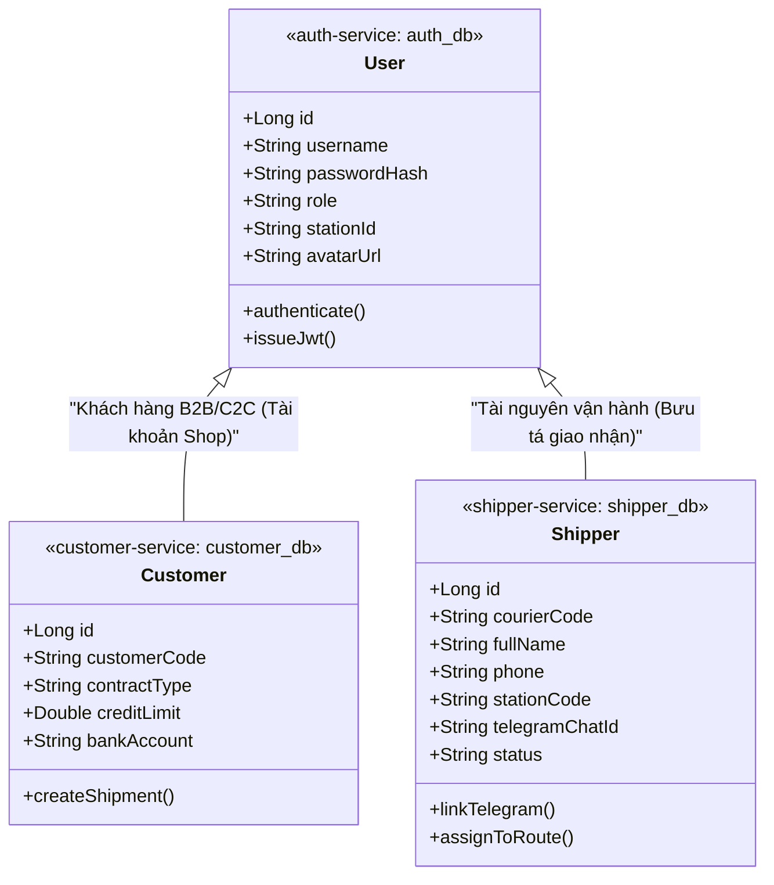
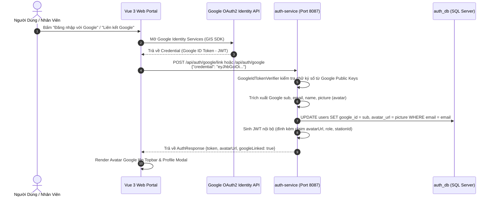
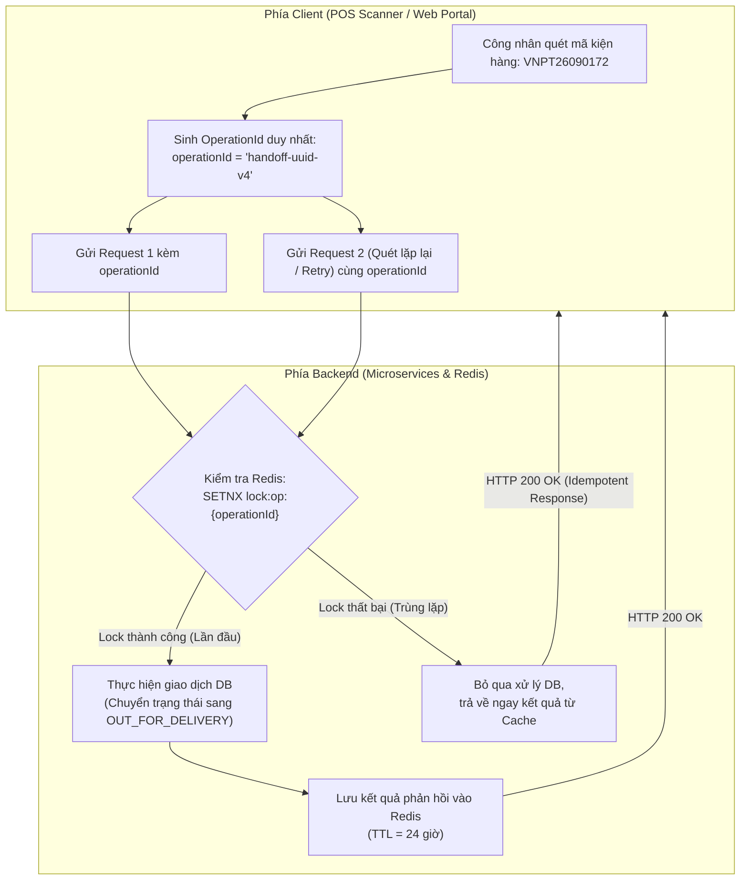

# Cẩm Nang Kỹ Thuật 08: Quản Trị Đội Ngũ Bưu Tá (Shipper Service), Định Danh Đa Nguồn (Google OAuth2) & Bất Khả Xâm Phạm (Idempotency)

> **Mục tiêu cẩm nang:** Phân tích chuyên sâu 3 trụ cột kỹ thuật nâng cao trong nền tảng bưu chính VNPT: Phân tách vi dịch vụ quản lý bưu tá (`shipper-service`) theo **Domain-Driven Design (DDD)**, mô hình xác thực đa nguồn **Google OAuth2 Identity & Avatar Stateless JWT**, cơ chế **Idempotency (OperationId)** chống lỗi quét đúp mã vạch trong logistics, và thuật toán **Automated Consolidator Scheduler với mốc Cut-off Buffer**.

---

## 1. Domain Bưu Tá Trong Bưu Chính: Vì Sao Tách Biệt `shipper-service`?

Trong giai đoạn đầu phát triển phần mềm, nhiều nhóm kỹ sư thường gộp chung toàn bộ con người vào bảng `users` trong `auth-service`. Tuy nhiên, trong mô hình Logistics & Supply Chain quy mô lớn, **Bưu tá (Courier / Shipper)** mang bản chất hoàn toàn khác biệt với **Người dùng hệ thống (User)** hay **Khách hàng gửi hàng (Customer)**:



### So Sánh Vòng Đời & Trách Nhiệm (Separation of Concerns)

| Tiêu Chí | User / Account (`auth-service`) | Bưu Tá / Shipper (`shipper-service`) |
| :--- | :--- | :--- |
| **Bản chất nghiệp vụ** | Tài khoản định danh, thông tin đăng nhập, phân quyền RBAC và token JWT. | **Tài nguyên vận tải hữu hình**: xe máy, túi bưu gửi, địa bàn phụ trách, trạng thái đi ca. |
| **Vòng đời (Lifecycle)** | Kéo dài theo tài khoản hệ thống (Active, Locked, Deleted). | Gắn với ca làm việc thực địa, có thể bật/tắt nhận đơn (`ACTIVE`/`INACTIVE`), chuyển đổi bưu cục công tác (`stationCode`). |
| **Liên kết kênh giao tiếp** | Email, mật khẩu, Google Identity Token. | Kênh thông báo tức thời hiện trường: `telegram_chat_id`, số điện thoại hotline bưu tá. |
| **Cơ sở dữ liệu độc lập** | `auth_db` (Port 1433) | `shipper_db` (Port 1433) - Quản lý bởi Flyway migration độc lập. |

### Cấu Trúc Bảng CSDL Bưu Tá (`V1__create_shippers.sql` & `V2__seed_shippers.sql`)
```sql
CREATE TABLE shippers (
    id               BIGINT IDENTITY(1,1) NOT NULL PRIMARY KEY,
    courier_code     NVARCHAR(100) NOT NULL,
    full_name        NVARCHAR(255) NOT NULL,
    phone            NVARCHAR(20)  NULL,
    telegram_chat_id NVARCHAR(100) NULL,
    station_code     NVARCHAR(50)  NULL,
    status           NVARCHAR(20)  NOT NULL CONSTRAINT DF_shippers_status DEFAULT 'ACTIVE',
    created_at       DATETIME2     NULL,
    CONSTRAINT uq_shippers_courier_code UNIQUE (courier_code)
);
```

---

## 2. Xác Thực Đa Nguồn (Google OAuth2 Identity) & Phân Tách Hồ Sơ Cá Nhân

Hệ thống cho phép nhân viên và khách hàng đăng nhập linh hoạt qua tài khoản nội bộ (Username/Password) hoặc tài khoản **Google Workspace / Gmail**:



### 2.1. Tối Ưu Hóa Stateless JWT: Claim `avatarUrl`
Thay vì yêu cầu Frontend mỗi khi hiển thị lại phải gọi API `GET /api/auth/me` hoặc truy vấn ngược máy chủ Google (gây nghẽn mạng và tăng độ trễ giao diện), `JwtServiceImpl` đóng gói trực tiếp đường dẫn avatar vào Payload của JWT Token:

```java
// JwtServiceImpl.java
public String generateToken(UserDetails userDetails, String role, String stationId, String avatarUrl) {
    Map<String, Object> claims = new HashMap<>();
    claims.put("role", role);
    claims.put("stationId", stationId);
    if (avatarUrl != null && !avatarUrl.isBlank()) {
        claims.put("avatarUrl", avatarUrl);
    }
    return buildToken(claims, userDetails, jwtExpiration);
}
```
*Lợi ích:* Giao diện chỉ cần giải mã Base64 phần Payload của JWT trong RAM để hiển thị ảnh đại diện Google với độ trễ **0ms**, đồng thời ảnh được cache tự động tại trình duyệt.

### 2.2. Phân Tách Hồ Sơ: Khách Hàng (Customer) vs. Nhân Viên Bưu Chính (Staff)
Để bảo đảm an toàn dữ liệu và phòng chống giả mạo quyền hạn (Privilege Escalation):
* **Hồ sơ Khách Hàng (`ROLE_CUSTOMER`):** Người dùng được phép tự do chỉnh sửa Họ và tên, Số điện thoại và Địa chỉ kho gửi/nhận hàng qua `PUT /api/auth/me`.
* **Hồ sơ Nhân Viên Nội Bộ (`ROLE_ADMIN`, `ROLE_POST_OFFICE_STAFF`, `ROLE_HUB_STAFF`, `ROLE_SHIPPER`):** Khóa cứng trường Bưu cục công tác (`stationId`) và Vai trò (`role`). Nhân viên tuyệt đối không thể tự ý chuyển quyền hay đổi trạm làm việc trong trang cá nhân; mọi thay đổi trạm bắt buộc phải do Quản trị viên chỉ định tại màn hình Quản trị nhân sự.

---

## 3. Cơ Chế Idempotency & OperationId: Chống Quét Đúp Mã Vạch Trong Logistics

### 3.1. Bài Toán Thực Địa: Double-Scanning & Network Retry
Trong tác nghiệp phân loại bưu gửi tại Siêu Hub và Bưu cục:
1. **Quét mã vạch liên tục (Double-Scanning):** Công nhân dùng máy quét mã vạch POS cầm tay quét kiện hàng. Nếu ngón tay vô tình bóp cò quét 2 lần liên tiếp trong 200ms, trình duyệt sẽ bắn 2 request `POST /api/routing/trips/{tripId}/manifests` lên server.
2. **Mạng 4G/Wifi kho bãi chập chờn:** Khi bưu tá bấm "Bàn giao bưu tá" trên điện thoại tại vùng sóng yếu, request đầu tiên đã tới server và cập nhật CSDL thành công, nhưng kết nối mạng bị rớt trước khi client nhận được HTTP 200. Trình duyệt hoặc ứng dụng tự động thực hiện **HTTP Retry** (cơ chế *At-Least-Once Delivery*).
3. **Hậu quả nếu không có Idempotency:** Vận đơn bị xếp 2 lần vào 2 chuyến xe khác nhau, bảng kê tài chính COD bị cộng dồn gấp đôi, hoặc gây xung đột khóa ngoại trong CSDL.



### 3.2. Triển Khai Bộ Tạo OperationId Tại Client (`routingService.js`)
Mọi thao tác thay đổi trạng thái vật lý đều được đóng gói kèm một mã `operationId` duy nhất chuẩn UUID v4:

```javascript
// routingService.js
const createOperationId = (prefix = 'operation') => {
    const safePrefix = String(prefix || 'operation').replace(/[^a-zA-Z0-9_-]/g, '-');
    const cryptoSource = typeof crypto !== 'undefined' ? crypto : null;
    if (cryptoSource && typeof cryptoSource.randomUUID === 'function') {
        return `${safePrefix}-${cryptoSource.randomUUID()}`;
    }
    return `${safePrefix}-${Date.now().toString(36)}-${Math.random().toString(36).slice(2, 10)}`;
};

const ensureOperationId = (payload, prefix = 'operation') => {
    const result = payload && typeof payload === 'object' ? { ...payload } : {};
    if (!result.operationId || !String(result.operationId).trim()) {
        result.operationId = createOperationId(prefix);
    }
    return result;
};
```

---

## 4. Bộ Lập Lịch Gom Đơn Tự Động (Automated Consolidator) & Mốc Giờ Cut-off

Trong vận tải bưu chính, xe tải chạy theo biểu đồ giờ cố định (Fixed Schedule). Doanh nghiệp không thể đợi xếp hàng đến khi xe đầy $100\%$ mới xuất bến vì sẽ làm trễ toàn bộ chuỗi cung ứng liên tỉnh:

### 4.1. Mốc Chặn Giờ (Cut-off Buffer)
* Mỗi chuyến xe có một mốc giờ xuất bến kế hoạch ($T_{\text{departure}}$).
* **Quy tắc Cut-off Buffer:** Trước giờ xuất bến một khoảng thời gian đệm $T_{\text{buffer}}$ (mặc định 30 phút), chuyến xe tự động chuyển sang trạng thái **ĐÓNG SỔ (CUT_OFF)**:
  $$T_{\text{cutoff}} = T_{\text{departure}} - T_{\text{buffer}}$$
* **Ý nghĩa thực tế:** Sau mốc $T_{\text{cutoff}}$, hệ thống từ chối mọi yêu cầu xếp thêm bưu kiện mới vào chuyến xe này. Khoảng thời gian 30 phút đệm là bắt buộc để:
  1. Thủ kho in bảng kê điện tử (Manifest) giấy tờ đi đường.
  2. Nhân viên bốc xếp chèn lót hàng nặng dưới, hàng nhẹ trên.
  3. Đóng cửa thùng xe và bấm số niêm phong chì (**Seal Number**).

```javascript
// Tính toán mốc Cut-off tự động trên TripsView.js
const getCalculatedCutoffText = (scheduledDepartureTime, bufferMinutes = 30) => {
    if (!scheduledDepartureTime) return 'Chưa ấn định';
    try {
        const depTime = new Date(scheduledDepartureTime).getTime();
        const cutoffTime = new Date(depTime - (bufferMinutes * 60 * 1000));
        return cutoffTime.toLocaleTimeString('vi-VN', { hour: '2-digit', minute: '2-digit' }) 
            + ' ' + cutoffTime.toLocaleDateString('vi-VN', { day: '2-digit', month: '2-digit' });
    } catch {
        return 'N/A';
    }
};
```

### 4.2. Thuật Toán Gom Đơn Tự Động Theo Ngưỡng Tải Trọng (Ready Threshold %)
Bộ lập lịch tự động (`ScheduledConsolidator`) chạy định kỳ quét các bưu gửi đang chờ tại kho bãi:
1. **Kiểm tra mức tải:** Khi tổng khối lượng các kiện hàng chờ chuyển về cùng tuyến đạt ngưỡng $\ge 80\%$ tải trọng xe tải ($W_{\text{current}} / W_{\text{max}} \ge 0.8$), hệ thống tự động khởi tạo bảng kê và gán toàn bộ kiện vào chuyến xe.
2. **Kích hoạt thủ công 1-Click:** Điều phối viên có thể bấm "Gom Đơn Tự Động Toàn Mạng" để ép hệ thống gom toàn bộ kiện đạt chuẩn mà không cần chờ tới chu kỳ quét tiếp theo.

---

## 5. Bộ Câu Hỏi Phỏng Vấn Kỹ Thuật Thực Chiến (Senior / Lead Level)

### Câu 1: Tại sao nên tách `shipper-service` thành một microservice độc lập thay vì lưu chung trong `auth-service` hay `customer-service`?
> **Câu trả lời mẫu:**  
> Áp dụng nguyên lý Single Responsibility (SRP) và Bounded Context trong Domain-Driven Design (DDD):
> 1. **Về mặt nghiệp vụ:** Bưu tá (Courier) là nguồn lực vận hành giao vận (Operations Resource), gắn liền với ca kíp làm việc thực địa, bưu cục địa bàn (`stationCode`), tình trạng đi tuyến (`ACTIVE`/`INACTIVE`) và phương tiện di chuyển. Khách hàng (`customer-service`) là đối tác thương mại có hợp đồng B2B, hạn mức công nợ và chiết khấu cước. `auth-service` chỉ giữ vai trò Identity Provider quản lý thông tin đăng nhập và cấp phát JWT.
> 2. **Về mặt kỹ thuật:** Tần suất truy vấn và biến động dữ liệu bưu tá rất cao (tra cứu vị trí, cập nhật trạng thái nhận đơn, gán `telegram_chat_id`). Việc tách riêng CSDL `shipper_db` giúp tối ưu hóa Connection Pool độc lập, không làm ảnh hưởng đến hiệu năng xác thực của hệ thống khi có hàng nghìn bưu tá cùng làm việc vào giờ cao điểm.

### Câu 2: Trình bày giải pháp xử lý Idempotency cho các API POST/PUT nhạy cảm trong hệ thống bưu chính?
> **Câu trả lời mẫu:**  
> Các thao tác vật lý trong bưu chính (như quét mã vạch nhập kho, gán đơn lên xe tải, bàn giao bưu tá) không có tính Idempotent tự nhiên theo chuẩn HTTP (khác với GET hay PUT ghi đè toàn phần).  
> Chúng tôi áp dụng pattern **Idempotency Key / OperationId**:
> 1. Phía Client (Trình duyệt Web / Thiết bị POS cầm tay) tự động sinh một mã `operationId` chuẩn UUID v4 khi người dùng kích hoạt thao tác (ví dụ: `handoff-uuid-v4`). Mã này được gửi kèm trong Body hoặc Header `X-Operation-Id`.
> 2. Tại Gateway hoặc Business Service, chúng tôi dùng Redis kiểm tra tính độc nhất qua lệnh nguyên tử `SET lock:op:{operationId} 1 NX EX 86400` (TTL 24 giờ).
> 3. Nếu lệnh trả về `1` (lần đầu thực hiện), request được chuyển tiếp vào Service để ghi nhận CSDL, sau đó lưu kết quả phản hồi vào Redis.
> 4. Nếu lệnh trả về `0` (trùng lặp do quét đúp hoặc mạng retry), hệ thống bỏ qua toàn bộ xử lý nghiệp vụ CSDL và trả về ngay kết quả đã lưu trong Redis với mã HTTP 200. Đảm bảo dù mạng chập chờn gửi lại 10 lần thì CSDL vẫn chỉ cập nhật đúng 1 lần duy nhất.

### Câu 3: Việc nhúng `avatarUrl` trực tiếp vào JWT Token mang lại lợi ích gì và cần lưu ý rủi ro gì?
> **Câu trả lời mẫu:**  
> * **Lợi ích:** Kiến trúc Stateless hoàn hảo. Giao diện Web Single Page App (Vue 3) giải mã Token cục bộ bằng JavaScript để lấy ảnh đại diện Google hiển thị ngay lập tức trên Navbar, loại bỏ hoàn toàn các lượt gọi API dư thừa lên server backend hoặc Google API.  
> * **Rủi ro và giải pháp khắc phục:**
>   1. **Kích thước Token (Token Size):** Đường dẫn URL quá dài sẽ làm tăng kích thước Header `Authorization` trong mỗi HTTP request. Do đó, chỉ lưu URL ảnh đã được rút gọn của Google, không nhúng dữ liệu Base64 thô của ảnh vào Token.
>   2. **Dữ liệu lỗi thời (Stale Data):** Khi người dùng đổi ảnh đại diện trên Google, JWT đã phát hành vẫn chứa URL cũ cho tới khi token hết hạn. Giải pháp là cung cấp nút "Làm Mới Hồ Sơ" để người dùng yêu cầu cấp lại Token mới (`refresh token`) khi cần đồng bộ tức thời.
