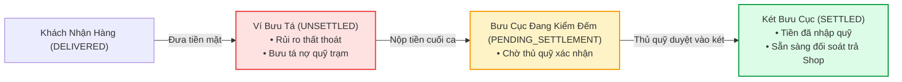
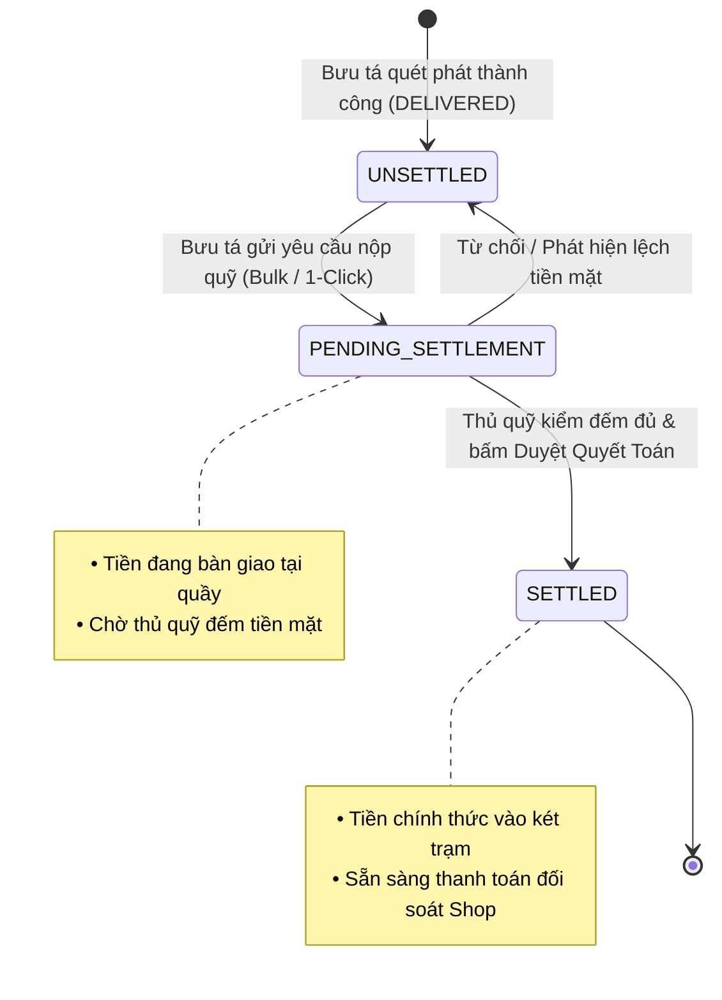
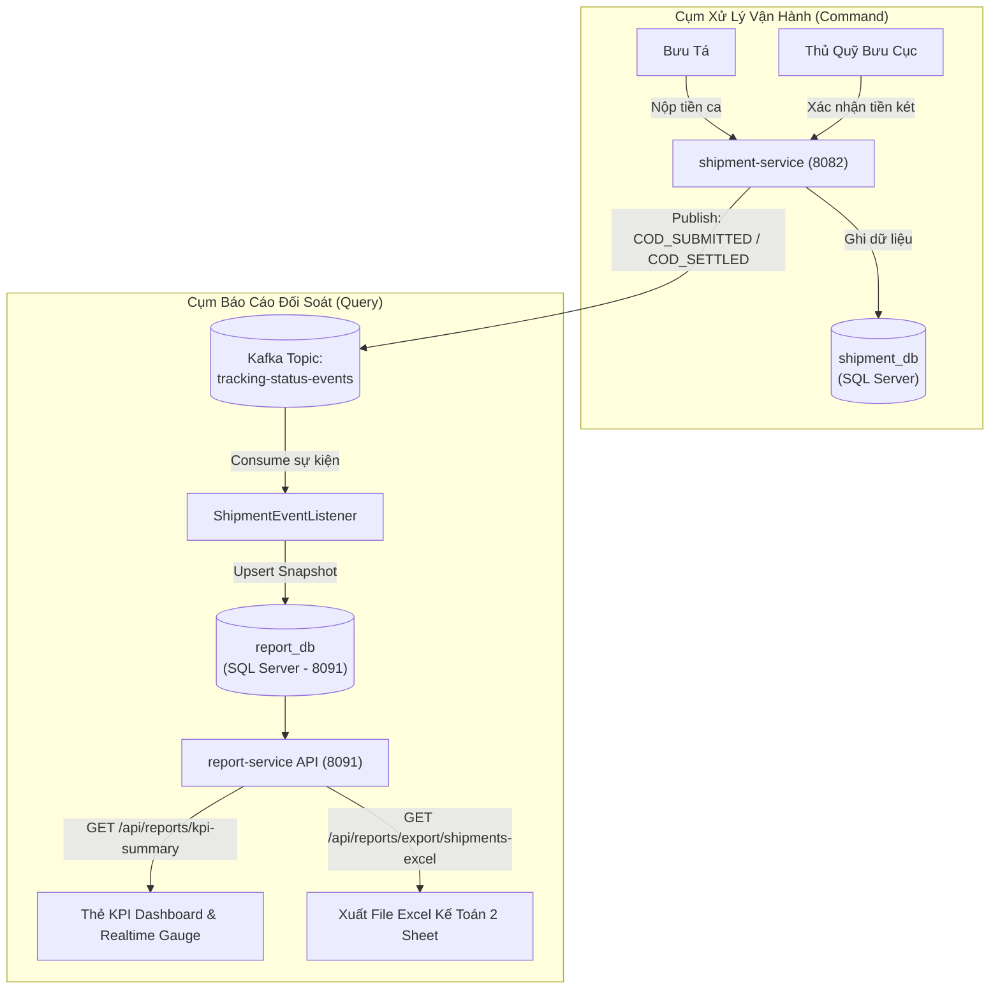

# Cẩm Nang Kỹ Thuật 09: Quyết Toán Thu Hộ COD & Báo Cáo Đối Soát Dòng Tiền Toàn Trình (COD Settlement & Financial Reconciliation)

> **Mục tiêu cẩm nang:** Phân tích chuyên sâu kiến trúc quản trị dòng tiền thu hộ (COD - Cash On Delivery), máy trạng thái quyết toán 3 pha (`UNSETTLED` -> `PENDING_SETTLEMENT` -> `SETTLED`), cơ chế bàn giao tiền mặt thực tế từ bưu tá về két quỹ bưu cục, mô hình đồng bộ sự kiện Event-Driven sang `report-service` (Port 8091), và giải pháp xuất báo cáo tài chính Excel 2 Sheet đạt chuẩn kế toán kiểm toán bưu chính.

---

## 1. Bài Toán Nghiệp Vụ: Phân Định Rạch Ròi Giữa "Giao Hàng Thành Công" & "Tiền Đã Vào Két"

Trong ngành bưu chính chuyển phát (như VNPT Post, Viettel Post, EMS), bài toán quản trị dòng tiền thu hộ (COD) là xương sống tài chính của doanh nghiệp. Rất nhiều kỹ sư mới vào ngành thường mắc sai lầm nghiêm trọng: **Đồng nhất trạng thái `DELIVERED` (Giao thành công) với việc dòng tiền đã hoàn tất**.



### 1.1. Thực Tế Hiện Trường Logistics Bưu Chính
1. **Tiền mặt trong túi bưu tá không phải tiền trong tài khoản công ty:** Khi đơn hàng chuyển sang `DELIVERED`, bưu tá mới chỉ vừa nhận tiền mặt từ tay người nhận. Lúc này, bưu tá đang tạm giữ tiền (nợ quỹ trạm) và tiếp tục chạy xe trên đường. Rủi ro rơi tiền, gian lận hoặc cướp giật hoàn toàn có thể xảy ra.
2. **Quy trình nộp quỹ cuối ca (Turn-in / Cash Drop):** Kết thúc ca phát (thường vào 12h00 trưa hoặc 18h00 chiều), bưu tá bắt buộc phải quay về Bưu cục chủ quản, mở ứng dụng bấm **"Nộp quỹ ca phát"**, đồng thời rút tiền mặt bàn giao tận tay cho **Thủ quỹ / Kiểm soát viên bưu cục**.
3. **Thủ quỹ bưu cục kiểm đếm & ghi sổ két trạm:** Thủ quỹ bưu cục đếm tiền mặt thực tế. Nếu số tiền mặt trùng khớp 100% với bảng kê điện tử, thủ quỹ bấm **"Xác nhận duyệt quyết toán"**. Tiền lúc này mới chính thức được ghi nhận vào két quỹ của Bưu cục (`SETTLED`).
4. **Đối soát trả Shop B2B (Reconciliation):** Định kỳ (hàng tuần hoặc hàng tháng theo hợp đồng), bộ phận Kế toán tổng hợp toàn bộ các đơn `SETTLED` để chuyển khoản trả lại tiền hàng cho Chủ Shop sau khi cấn trừ cước vận chuyển.

---

## 2. Máy Trạng Thái Quyết Toán COD 3 Pha (COD Settlement Lifecycle)

Để giải quyết triệt để rủi ro thất thoát tiền bạc, hệ thống thiết kế một máy trạng thái tài chính chạy song song nhưng độc lập với trạng thái vận chuyển:



### Chi Tiết Ý Nghĩa Từng Trạng Thái:

| Mã Trạng Thái | Tên Tiếng Việt Hiển Thị | Trách Nhiệm Dòng Tiền | Vị Trí Tiền Mặt Thực Tế |
| :--- | :--- | :--- | :--- |
| `UNSETTLED` | **Chưa nộp quỹ bưu cục** | Bưu tá đang tạm giữ, nợ quỹ trạm. | Nằm trong ví / túi xách cá nhân của bưu tá. |
| `PENDING_SETTLEMENT` | **Chờ bưu cục xác nhận** | Bưu tá đã lập bảng kê nộp, đang chờ thủ quỹ kiểm đếm. | Đang đặt trên bàn quầy kiểm soát viên bưu cục. |
| `SETTLED` | **Đã quyết toán vào quỹ** | Bưu cục đã tiếp nhận tiền vào két sắt an toàn. | Đã nhập két trạm / tài khoản ngân hàng bưu cục. |

---

## 3. Thiết Kế Cơ Sở Dữ Liệu & API Contracts

### 3.1. Database Migration: Bảng `shipments` (`V5__add_cod_settlement_fields.sql`)

```sql
-- Migration bổ sung các trường tài chính vào CSDL shipment_db
ALTER TABLE shipments ADD cod_settlement_status NVARCHAR(50) NOT NULL 
    CONSTRAINT DF_shipments_cod_settlement DEFAULT 'UNSETTLED';

ALTER TABLE shipments ADD cod_submitted_at DATETIME2 NULL;
ALTER TABLE shipments ADD cod_settled_at DATETIME2 NULL;
ALTER TABLE shipments ADD cod_confirmed_by NVARCHAR(100) NULL;

-- Index tăng tốc truy vấn đối soát ca phát của bưu tá và bưu cục
CREATE INDEX idx_shipments_cod_settlement 
    ON shipments (current_station_id, cod_settlement_status, assigned_shipper_code);
```

### 3.2. API 1: Bưu Tá Nộp Quỹ Ca Phát (Submit COD Settlement)
* **Endpoint:** `POST /api/shipments/cod/submit-settlement`
* **Quyền hạn:** `ROLE_SHIPPER`, `ROLE_ADMIN`
* **Request Body:**
```json
{
  "shipmentCodes": [
    "VNPT492817281",
    "VNPT819283712"
  ]
}
```
* **Xử lý phía Backend (`ShipmentServiceImpl.java`):**
  1. Kiểm tra từng mã vận đơn: Phải đạt trạng thái `DELIVERED`, có `codAmount > 0` và trạng thái hiện tại là `UNSETTLED`.
  2. Cập nhật `cod_settlement_status = 'PENDING_SETTLEMENT'`, `cod_submitted_at = LocalDateTime.now()`.
  3. Bắn sự kiện Kafka lên topic `tracking-status-events` với payload `COD_SUBMITTED` để thông báo bưu cục và đẩy sang `report-service`.

### 3.3. API 2: Thủ Quỹ Bưu Cục Xác Nhận Duyệt Quyết Toán (Confirm Settlement)
* **Endpoint:** `POST /api/shipments/cod/confirm-settlement`
* **Quyền hạn:** `ROLE_POST_OFFICE_STAFF`, `ROLE_ADMIN`
* **Request Body:**
```json
{
  "shipmentCodes": [
    "VNPT492817281",
    "VNPT819283712"
  ]
}
```
* **Xử lý Backend:**
  1. Kiểm tra Station Context Binding: Bưu phẩm phải thuộc trạm bưu cục của nhân viên đang đăng nhập (`X-User-Station-Id`).
  2. Cập nhật `cod_settlement_status = 'SETTLED'`, `cod_settled_at = LocalDateTime.now()`, `cod_confirmed_by = authentication.getName()`.
  3. Bắn sự kiện Kafka `COD_SETTLED` sang `report-service` và `notification-service` để gửi thông báo biến động số dư.

---

## 4. Kiến Trúc Phân Tách Vi Dịch Vụ Báo Cáo Đối Soát (`report-service` Port 8091)

### 4.1. Vì Sao Phải Tách Riêng `report-service` Theo CQRS?
Nếu để trực tiếp các truy vấn phân tích tài chính (`SUM(cod_amount)`, `GROUP BY station_code`, `COUNT(status)`) chạy trên `shipment_db` hoặc `tracking_db`, hệ thống sẽ gặp các hiểm họa:
* **Khóa bảng / Nghẽn kết nối Hikari:** Các truy vấn báo cáo quét toàn bảng (Full Table Scan) sẽ chiếm giữ kết nối DB, gây treo luồng quét mã barcode và tạo đơn của bưu tá tại hiện trường.
* **Nguyên lý CQRS (Command Query Responsibility Segregation):** Tách bạch tối đa giữa tầng Xử lý Giao dịch nghiệp vụ (Command - Write) và tầng Truy vấn Phân tích / Báo cáo (Query - Read).



### 4.2. Thiết Kế Báo Cáo Excel 2 Sheet Chuẩn Kiểm Toán
Theo chuẩn kế toán tài chính VNPT, một file đối soát tài chính hợp lệ bắt buộc phải có 2 phân hệ rõ ràng:

1. **Sheet 1: Tổng Quan Tài Chính & Vận Hành (Executive KPI Dashboard):**
   * Tiêu đề thương hiệu: **TỔNG CÔNG TY DỊCH VỤ BƯU CHÍNH VNPT - BÁO CÁO ĐỐI SOÁT COD & VẬN HÀNH TOÀN TRÌNH**.
   * Bảng số liệu tổng hợp:
     * Tổng số lượng bưu gửi toàn mạng.
     * Doanh thu cước vận chuyển B2B.
     * Tổng tiền thu hộ COD phát sinh.
     * **Tiền COD đã quyết toán vào quỹ bưu cục (`SETTLED`).**
     * **Tiền COD bưu tá đang giữ / nợ quỹ trạm (`UNSETTLED` + `PENDING_SETTLEMENT`).**
     * Tỷ lệ giao hàng thành công đạt chuẩn SLA (%).
   * Phân bổ tỷ lệ theo từng trạng thái vận đơn.

2. **Sheet 2: Bảng Kê Chi Tiết Vận Đơn (Detailed Waybills Registry):**
   * Liệt kê từng dòng bưu phẩm: Mã vận đơn, Người gửi, Người nhận, Cước phí, Tiền thu hộ COD, Trạng thái vận chuyển, **Trạng thái quyết toán COD**, Ngày tạo, Ngày bàn giao tiền.
   * Định dạng tài chính: Số tiền format có dấu phân cách hàng nghìn (`#,##0 đ`), chữ in hoa, căn chỉnh tự động độ rộng cột (Auto-fit columns).

---

## 5. Thiết Kế Trải Nghiệm Giao Diện 60fps & Micro-Interactions

Để tối ưu hóa trải nghiệm làm việc cho bưu tá và giao dịch viên, giao diện Web Portal áp dụng tiêu chuẩn thiết kế B2B Logistics hiện đại:

### 5.1. Hiệu Ứng Trạng Thái Sống Động (Live Pulse Dot)
* Các đơn hàng có tiền COD đang chờ duyệt (`PENDING_SETTLEMENT`) được gắn huy hiệu có **chấm tròn nhấp nháy liên tục (CSS Ping Animation)** màu vàng hổ phách (`amber-500`):
```css
@keyframes ping {
  75%, 100% {
    transform: scale(2);
    opacity: 0;
  }
}
.live-pulse-dot {
  animation: ping 1.5s cubic-bezier(0, 0, 0.2, 1) infinite;
}
```
* Giúp thủ quỹ bưu cục khi nhìn vào màn hình là lập tức nhận biết có bưu tá vừa về trạm và cần kiểm đếm tiền ngay.

### 5.2. Chuyển Động Chuyển Tab Mượt Mà (Smooth Micro-Transitions)
* Khi bấm nộp tiền hoặc duyệt tiền, toàn bộ thẻ card được trang bị `transition-all duration-300 ease-in-out`.
* Nút bấm thao tác chuyển trạng thái tức thì sang hiệu ứng Spinner quay tròn (`animate-spin`), ngăn chặn người dùng nhấp đúp (Double-Click) gây gửi nhiều request trùng lặp.
* Modal chi tiết mở ra mượt mà với lớp kính mờ hậu cảnh (`backdrop-blur-sm bg-black/40`), tôn lên tính chuyên nghiệp của hệ thống bưu chính số.

---

## 6. Checklist Phỏng Vấn Nghiệp Vụ Tài Chính Logistics & Kế Toán Bưu Cục

1. **"Tại sao không cập nhật luôn trạng thái `SETTLED` khi bưu tá vừa bấm `DELIVERED`?"**
   * *Trả lời:* Đây là nguyên tắc phân ly trách nhiệm trong kiểm soát tài chính. `DELIVERED` phản ánh việc khách hàng đã nhận bưu kiện vật lý. Tiền mặt lúc này nằm trong túi cá nhân của bưu tá. Nếu ghi nhận `SETTLED` ngay, kế toán sẽ tính tiền đã vào két công ty. Nếu bưu tá gặp rủi ro trên đường về hoặc biển thủ, công ty sẽ chịu tổn thất mà không có căn cứ đối soát. Do đó bắt buộc phải có bước kiểm đếm của thủ quỹ bưu cục.

2. **"Làm thế nào để xử lý tình huống bưu tá nộp thiếu tiền mặt so với COD trên hệ thống?"**
   * *Trả lời:* Thủ quỹ không bấm "Duyệt quyết toán". Thay vào đó, giao diện hỗ trợ từ chối hoặc bưu cục lập biên bản sai lệch (Discrepancy Ticket). Hệ thống giữ trạng thái `PENDING_SETTLEMENT` hoặc trả về `UNSETTLED` kèm ghi chú nợ tiền, tự động khóa quyền nhận ca phát tiếp theo của bưu tá đó cho đến khi giải trình xong.

3. **"Tại sao lại dùng Apache POI tạo file Excel nhiều Sheet thay vì xuất CSV đơn giản?"**
   * *Trả lời:* CSV chỉ chứa văn bản thuần không có định dạng số tiền, không có màu sắc cảnh báo, và đặc biệt **không hỗ trợ nhiều Sheet**. Kế toán doanh nghiệp bưu chính bắt buộc cần Sheet 1 làm tờ trình tổng quan cho ban giám đốc ký duyệt, và Sheet 2 làm phụ lục chi tiết lưu trữ phục vụ cơ quan thuế và kiểm toán độc lập.

4. **"Nếu Kafka Broker bị treo lúc bưu cục bấm duyệt quyết toán thì sao?"**
   * *Trả lời:* Giao dịch duyệt quyết toán được bảo vệ bởi `@Transactional` trong `shipment-service`. Dữ liệu ghi vào SQL Server Primary thành công. Sự kiện Kafka nếu gửi thất bại sẽ được ghi nhận vào bảng Outbox hoặc retry theo cơ chế Exponential Backoff, đảm bảo nguyên lý At-Least-Once Delivery. `report-service` được thiết kế Idempotent, nhận lại sự kiện trùng lặp vẫn đảm bảo tính đúng đắn của số dư.
