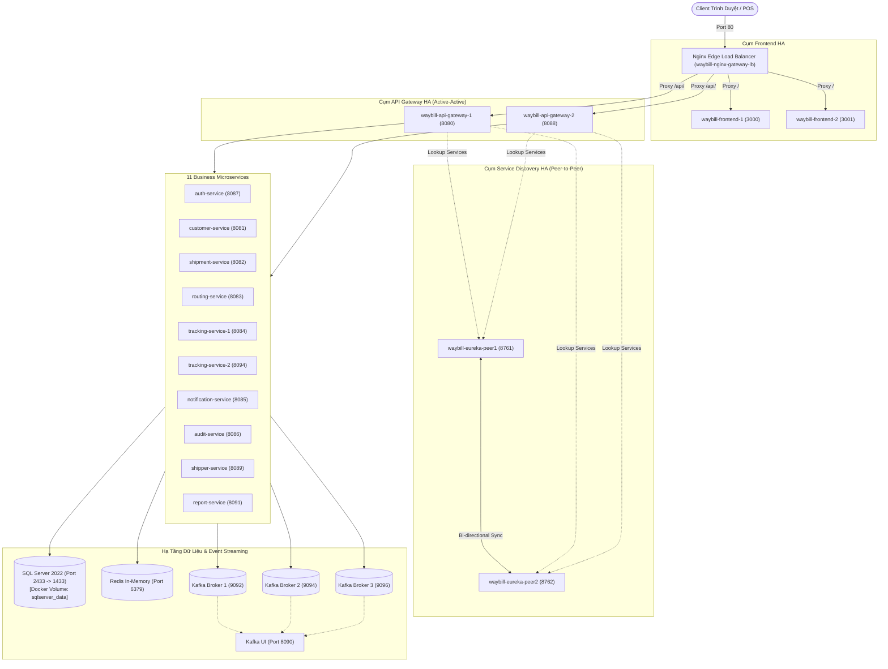

# Cẩm Nang 10 - Container Hóa Toàn Trình & Điều Phối Cụm Microservices HA (Docker, Docker Hub & Compose)

Tài liệu này tổng hợp toàn bộ quy trình thực chiến từ đóng gói mã nguồn (Java 21 Spring Boot & Node.js Frontend), quản trị kho ảnh (Docker Hub Registry), điều phối cụm 23 Containers qua Docker Compose, cùng toàn bộ mã nguồn Boilerplate độc lập cho các cụm hạ tầng: **Kafka KRaft 3-Broker**, **Redis In-Memory**, **SQL Server Persistent Volume**, **Eureka Peer-to-Peer HA**, và **Nginx Edge Failover**.

---

## 1. Bản Chất & Lý Thuyết Nền Tảng Cốt Lõi Của Docker

### 1.1. Container Khác Gì So Với Máy Ảo (Virtual Machine - VM)?
* **Máy ảo (VM - VMware, VirtualBox):** Mỗi máy ảo bắt buộc phải cài đặt một hệ điều hành riêng biệt đầy đủ (**Guest OS**) bao gồm cả Kernel, chiếm dụng từ 5GB - 20GB dung lượng ổ đĩa và hàng GB RAM ngay khi vừa bật máy. Mọi giao tiếp phần cứng phải đi qua tầng giả lập **Hypervisor**.
* **Container (Docker):** Không hề cài lại hệ điều hành! Container chỉ là **một tiến trình (Process) bị cô lập** chạy trực tiếp trên máy chủ và **dùng chung Nhân hệ điều hành (OS Kernel)** với máy host thông qua 2 tính năng cốt lõi của Linux:
  - **`cgroups` (Control Groups):** Giới hạn tài nguyên (CPU, RAM, I/O) mà container được phép sử dụng.
  - **`namespaces`:** Cô lập không gian mạng (Network), tiến trình (PID), người dùng (UID), và cây thư mục (Mount).
* **Kết quả:** Container khởi động chỉ trong **vài trăm mili-giây** (thay vì vài phút như VM), chiếm cực ít RAM và ổ đĩa.

### 1.2. Phân Biệt: Image vs Container
* **Docker Image (Khuôn đúc / Class):** Là một gói đóng băng tĩnh (Read-Only), chứa toàn bộ mã nguồn, thư viện runtime (Java JRE, Node.js), công cụ hệ thống và các tệp cấu hình cần thiết để ứng dụng có thể chạy được.
* **Docker Container (Sản phẩm đúc ra / Object Instance):** Là một thể hiện sống (Live Instance) được sinh ra từ Image. Khi container chạy, Docker sẽ gắn thêm một tầng ghi chép mỏng có thể sửa đổi (**Read-Write Layer**) lên trên cùng của Image theo cơ chế **Copy-on-Write (CoW)**.

### 1.3. Giải Mã Chi Tiết Các Chỉ Thị Trong Dockerfile
Bảng quy chuẩn ý nghĩa các từ khóa khi viết `Dockerfile`:

| Chỉ thị (Instruction) | Mục đích & Ý nghĩa | Ví dụ thực tế |
|:---|:---|:---|
| **`FROM`** | Khai báo Base Image nền tảng để bắt đầu xây dựng | `FROM eclipse-temurin:21-jre-alpine` |
| **`WORKDIR`** | Thiết lập thư mục làm việc mặc định bên trong container | `WORKDIR /app` |
| **`COPY`** | Sao chép tệp/thư mục từ máy tính host vào bên trong container | `COPY target/*.jar app.jar` |
| **`ADD`** | Tương tự COPY nhưng hỗ trợ tự giải nén file `.tar.gz` và tải từ URL | `ADD archive.tar.gz /app/` |
| **`RUN`** | Chạy lệnh trong quá trình **Build Image** (ví dụ cài package) | `RUN apk update && apk add curl` |
| **`ENV`** | Định nghĩa biến môi trường sử dụng cả khi build lẫn khi chạy | `ENV JAVA_OPTS="-Xmx512m"` |
| **`EXPOSE`** | Khai báo cổng mạng container dự kiến lắng nghe (tính chất tài liệu) | `EXPOSE 8080` |
| **`ENTRYPOINT`** | Lệnh cố định bắt buộc chạy khi khởi động container | `ENTRYPOINT ["java", "-jar", "app.jar"]` |
| **`CMD`** | Tham số mặc định truyền vào ENTRYPOINT (có thể ghi đè lúc chạy) | `CMD ["--spring.profiles.active=prod"]` |

> 💡 **Bí kíp phỏng vấn: `ENTRYPOINT` khác gì `CMD`?**
> - `ENTRYPOINT` định nghĩa **chương trình thực thi chính** (Exec binary), khó bị ghi đè.
> - `CMD` chỉ định nghĩa **tham số mặc định**. Nếu người dùng gõ lệnh `docker run my-image --port=9000`, phần `--port=9000` sẽ ghi đè lên `CMD`, nhưng `ENTRYPOINT` vẫn được giữ nguyên để chạy!

### 1.4. Mạng Trong Docker (Docker Networking & Embedded DNS)
* **Bridge Network (Mặc định):** Mạng ảo nội bộ do Docker dựng ra. Các container gắn chung một Bridge Network sẽ được cấp dải IP riêng (vd: `172.19.0.x`).
* **Docker Embedded DNS:** Đây là "phép màu" giúp Microservices giao tiếp: Bên trong mạng Docker, Docker tích hợp sẵn một máy chủ DNS tự động phân giải **Service Name / Container Name** thành IP nội bộ. Vì vậy `customer-service` chỉ cần gọi `http://sqlserver-replica:1433` mà không cần biết IP thật của SQL Server!
* **Host Network:** Container dùng chung thẳng card mạng và cổng của máy host (không có lớp NAT/cô lập mạng).

### 1.5. Quản Lý Dữ Liệu: Bind Mount vs Named Volume
* **Bind Mount (`./frontend:/usr/share/nginx/html`):** Gắn thẳng một thư mục trên ổ cứng máy host vào container. Sửa file ở máy host thì trong container thay đổi tức thì (thích hợp cho môi trường Dev).
* **Named Volume (`sqlserver_data:/var/opt/mssql`):** Được Docker quản lý riêng biệt tại vùng lưu trữ tối ưu của hệ điều hành. Chuyên dụng cho Database Production vì tốc độ I/O cao, an toàn, và **dữ liệu được bảo toàn vĩnh viễn kể cả khi gõ `docker compose down`**.

---

## 2. Bảng Tra Cứu Toàn Bộ Cú Pháp Lệnh Docker Thực Chiến (CLI Cheat Sheet)

### 2.1. Quản Trị Docker Images
```bash
# Xem danh sách tất cả Docker images trên máy
docker images

# Build một image từ Dockerfile trong thư mục hiện tại
docker build -t <username>/<image-name>:<tag> .

# Gán thêm tag mới cho một image đã có
docker tag my-app:latest khanhnv26/my-app:1.0

# Đẩy image lên Docker Hub
docker push khanhnv26/my-app:1.0

# Kéo một image từ Docker Hub về máy
docker pull khanhnv26/customer-service:1.0

# Xóa một image khỏi máy tính
docker rmi <image-id-hoặc-tên>

# Xem lịch sử các layer cấu thành nên image
docker history <tên-image>
```

### 2.2. Quản Trị Containers (Vận Hành & Debug)
```bash
# Xem danh sách các container đang chạy
docker ps

# Xem danh sách tất cả container (kể cả những con đã tắt/bị lỗi crash)
docker ps -a

# Khởi chạy một container mới từ image (chạy ngầm, mở cổng)
docker run -d --name my-web -p 8080:80 nginx:alpine

# Tạm dừng / Bật lại / Khởi động lại một container
docker stop <container-name>
docker start <container-name>
docker restart <container-name>

# Xóa một container (thêm -f nếu muốn ép xóa container đang chạy)
docker rm -f <container-name>

# Xem log thời gian thực của container (theo dõi lỗi Spring Boot)
docker logs -f --tail 100 <container-name>

# Chui vào bên trong terminal của container để khám phá / kiểm tra file
docker exec -it <container-name> sh
# (hoặc dùng bash nếu container có cài bash):
docker exec -it <container-name> bash

# Xem mức tiêu thụ tài nguyên thực tế (RAM %, CPU %) của tất cả containers
docker stats

# Sao chép file từ máy host vào trong container và ngược lại
docker cp ./my-file.txt <container-name>:/tmp/my-file.txt
```

### 2.3. Điều Phối Cụm Qua Docker Compose
```bash
# Khởi động toàn bộ các service chạy ngầm (Detached mode)
docker compose up -d

# Khởi động riêng một hoặc một vài service cụ thể
docker compose up -d <service-name>

# Khởi động lại và ép build lại image mới nếu có sửa Dockerfile
docker compose up -d --build

# Xem trạng thái hoạt động của các service trong file compose
docker compose ps

# Xem log đồng loạt của toàn bộ cụm hoặc một service cụ thể
docker compose logs -f
docker compose logs -f <service-name>

# Khởi động lại một service trong cụm
docker compose restart <service-name>

# Tạm dừng cụm mà KHÔNG XÓA container
docker compose stop

# DỪNG VÀ XÓA TOÀN BỘ container & mạng (Dữ liệu trong Named Volume vẫn còn)
docker compose down

# CẢNH BÁO NGUY HIỂM: Dừng và XÓA SẠCH cả Named Volume (Mất sạch CSDL)
docker compose down -v
```

### 2.4. Dọn Dẹp Giải Phóng Ổ Đĩa (Disk Space Cleanup)
```bash
# Dọn dẹp các container đã tắt, mạng không dùng và dangling images
docker system prune

# Dọn dẹp triệt để (xóa sạch toàn bộ image không dùng, giải phóng hàng chục GB ổ đĩa)
docker system prune -a --volumes
```

---

## 3. Sơ Đồ Điều Phối Hạ Tầng Cụm Container (23 Containers)



---

## 2. Chuẩn Hóa Dockerfile Cho Từng Thành Phần

### 2.1. Template Dockerfile Chuẩn Cho Spring Boot (Java 21 LTS - Alpine)
* Áp dụng cho: `auth-service`, `customer-service`, `shipment-service`, `routing-service`, `tracking-service`, `notification-service`, `audit-service`, `shipper-service`, `report-service`, `service-registry`, `api-gateway`.
* Base image: `eclipse-temurin:21-jre-alpine` (Dung lượng siêu nhẹ ~150MB so với >500MB của JDK chuẩn).

```dockerfile
# File: <tên-service>/Dockerfile
FROM eclipse-temurin:21-jre-alpine

LABEL authors="Khanhnv26"
WORKDIR /app

# Copy artifact build từ thư mục target (hỗ trợ cả .jar và .war của Spring Boot)
COPY target/*.war app.war 2>/dev/null || COPY target/*.jar app.jar

# Biến JVM tối ưu bộ nhớ cho môi trường container
ENV JAVA_OPTS="-XX:+UseContainerSupport -XX:MaxRAMPercentage=75.0"

# Cổng mặc định khai báo (tùy chỉnh theo service)
EXPOSE 8080

ENTRYPOINT ["sh", "-c", "java $JAVA_OPTS -jar app.*ar"]
```

### 2.2. Template Dockerfile Cho Frontend Web (Node.js Alpine)
* Áp dụng cho: `frontend` (Phục vụ web tĩnh qua `server.js` hoặc Nginx).

```dockerfile
# File: frontend/Dockerfile
FROM node:20-alpine

LABEL authors="Khanhnv26"
WORKDIR /app

# server.js dùng thư viện tích hợp sẵn của Node (http, fs, path), không cần node_modules nặng
COPY server.js ./
COPY frontend/ ./frontend/

EXPOSE 3000 3001

CMD ["node", "server.js", "3000"]
```

---

## 3. Quy Trình Build & Đẩy (Push) Lên Docker Hub

### 3.1. Các Bước Thực Hiện
```bash
# 1. Đăng nhập Docker Hub trên máy tính
docker login -u <username>

# 2. Build Docker Image với tag chuẩn: <username>/<service-name>:<version>
docker build -t khanhnv26/service-registry:1.0 -f service-registry/Dockerfile ./service-registry

# 3. Đẩy Image lên Registry công khai / riêng tư
docker push khanhnv26/service-registry:1.0
```

### 3.2. Bí Quyết Layer Caching & Mounted Layers
Khi đẩy 11 microservices cùng dùng chung base image `eclipse-temurin:21-jre-alpine`:
- Docker Hub sẽ tự động nhận diện các layer hệ điều hành và JRE runtime đã tồn tại (`Layer already exists` hoặc `Mounted from...`).
- Quá trình upload các service tiếp theo chỉ tốn vài giây để đẩy đúng layer file `.jar`/`.war` mới (~30-50MB), giúp tiết kiệm đến **80% băng thông và thời gian build**.

---

## 4. Boilerplate Hoàn Chỉnh: `docker-compose.yaml` Hạ Tầng & Microservices

Dưới đây là file cấu hình mẫu độc lập đầy đủ, sẵn sàng chạy ngay trên bất kỳ máy chủ nào:

```yaml
version: '3.8'

services:
  # =========================================================================
  # 1. CỤM KAFKA KRAFT 3-BROKER HA CLUSTER (KHÔNG DÙNG ZOOKEEPER)
  # =========================================================================
  kafka-1:
    image: apache/kafka:latest
    container_name: waybill-kafka-1
    ports:
      - "9092:9092"
    environment:
      KAFKA_NODE_ID: 1
      KAFKA_PROCESS_ROLES: broker,controller
      KAFKA_KRAFT_CLUSTER_ID: "4L622nShTUiBenVKWIRCkg"
      KAFKA_LISTENERS: INTERNAL://:29092,CONTROLLER://:9093,EXTERNAL://:9092
      KAFKA_ADVERTISED_LISTENERS: INTERNAL://kafka-1:29092,EXTERNAL://localhost:9092
      KAFKA_LISTENER_SECURITY_PROTOCOL_MAP: INTERNAL:PLAINTEXT,CONTROLLER:PLAINTEXT,EXTERNAL:PLAINTEXT
      KAFKA_CONTROLLER_LISTENER_NAMES: CONTROLLER
      KAFKA_INTER_BROKER_LISTENER_NAME: INTERNAL
      KAFKA_CONTROLLER_QUORUM_VOTERS: 1@kafka-1:9093,2@kafka-2:9093,3@kafka-3:9093
      KAFKA_OFFSETS_TOPIC_REPLICATION_FACTOR: 3
      KAFKA_TRANSACTION_STATE_LOG_REPLICATION_FACTOR: 3
      KAFKA_TRANSACTION_STATE_LOG_MIN_ISR: 2
    restart: always

  kafka-2:
    image: apache/kafka:latest
    container_name: waybill-kafka-2
    ports:
      - "9094:9094"
    environment:
      KAFKA_NODE_ID: 2
      KAFKA_PROCESS_ROLES: broker,controller
      KAFKA_KRAFT_CLUSTER_ID: "4L622nShTUiBenVKWIRCkg"
      KAFKA_LISTENERS: INTERNAL://:29092,CONTROLLER://:9093,EXTERNAL://:9094
      KAFKA_ADVERTISED_LISTENERS: INTERNAL://kafka-2:29092,EXTERNAL://localhost:9094
      KAFKA_LISTENER_SECURITY_PROTOCOL_MAP: INTERNAL:PLAINTEXT,CONTROLLER:PLAINTEXT,EXTERNAL:PLAINTEXT
      KAFKA_CONTROLLER_LISTENER_NAMES: CONTROLLER
      KAFKA_INTER_BROKER_LISTENER_NAME: INTERNAL
      KAFKA_CONTROLLER_QUORUM_VOTERS: 1@kafka-1:9093,2@kafka-2:9093,3@kafka-3:9093
      KAFKA_OFFSETS_TOPIC_REPLICATION_FACTOR: 3
      KAFKA_TRANSACTION_STATE_LOG_REPLICATION_FACTOR: 3
      KAFKA_TRANSACTION_STATE_LOG_MIN_ISR: 2
    restart: always

  kafka-3:
    image: apache/kafka:latest
    container_name: waybill-kafka-3
    ports:
      - "9096:9096"
    environment:
      KAFKA_NODE_ID: 3
      KAFKA_PROCESS_ROLES: broker,controller
      KAFKA_KRAFT_CLUSTER_ID: "4L622nShTUiBenVKWIRCkg"
      KAFKA_LISTENERS: INTERNAL://:29092,CONTROLLER://:9093,EXTERNAL://:9096
      KAFKA_ADVERTISED_LISTENERS: INTERNAL://kafka-3:29092,EXTERNAL://localhost:9096
      KAFKA_LISTENER_SECURITY_PROTOCOL_MAP: INTERNAL:PLAINTEXT,CONTROLLER:PLAINTEXT,EXTERNAL:PLAINTEXT
      KAFKA_CONTROLLER_LISTENER_NAMES: CONTROLLER
      KAFKA_INTER_BROKER_LISTENER_NAME: INTERNAL
      KAFKA_CONTROLLER_QUORUM_VOTERS: 1@kafka-1:9093,2@kafka-2:9093,3@kafka-3:9093
      KAFKA_OFFSETS_TOPIC_REPLICATION_FACTOR: 3
      KAFKA_TRANSACTION_STATE_LOG_REPLICATION_FACTOR: 3
      KAFKA_TRANSACTION_STATE_LOG_MIN_ISR: 2
    restart: always

  kafka-ui:
    image: provectuslabs/kafka-ui:latest
    container_name: waybill-kafka-ui
    ports:
      - "8090:8080"
    environment:
      KAFKA_CLUSTERS_0_NAME: waybill-ha-cluster
      KAFKA_CLUSTERS_0_BOOTSTRAPSERVERS: kafka-1:29092,kafka-2:29092,kafka-3:29092
    depends_on:
      - kafka-1
      - kafka-2
      - kafka-3
    restart: always

  # =========================================================================
  # 2. CỤM HẠ TẦNG DỮ LIỆU: REDIS & SQL SERVER (CÓ VOLUME PERSISTENCE)
  # =========================================================================
  redis:
    image: redis:alpine
    container_name: redis
    ports:
      - "6379:6379"
    restart: always

  sqlserver-replica:
    image: mcr.microsoft.com/mssql/server:2022-latest
    container_name: waybill-sqlserver-replica
    ports:
      - "2433:1433"
    environment:
      SA_PASSWORD: "Replica@123456"
      ACCEPT_EULA: "Y"
    volumes:
      - sqlserver_data:/var/opt/mssql # MẤU CHỐT: Dữ liệu vĩnh viễn không bao giờ mất
    restart: always

  # =========================================================================
  # 3. CỤM EUREKA SERVICE REGISTRY HA (PEER-TO-PEER REPLICATION)
  # =========================================================================
  eureka-peer1:
    image: khanhnv26/service-registry:1.0
    container_name: waybill-eureka-peer1
    ports:
      - "8761:8761"
    environment:
      - SERVER_PORT=8761 # BẮT BUỘC dùng SERVER_PORT thay vì biến tự chế
      - EUREKA_INSTANCE_HOSTNAME=eureka-peer1
      - EUREKA_CLIENT_SERVICE_URL_DEFAULTZONE=http://eureka-peer2:8762/eureka/
    restart: always

  eureka-peer2:
    image: khanhnv26/service-registry:1.0
    container_name: waybill-eureka-peer2
    ports:
      - "8762:8762"
    environment:
      - SERVER_PORT=8762
      - EUREKA_INSTANCE_HOSTNAME=eureka-peer2
      - EUREKA_CLIENT_SERVICE_URL_DEFAULTZONE=http://eureka-peer1:8761/eureka/
    restart: always

  # =========================================================================
  # 4. CỤM FRONTEND WEB CLUSTER & NGINX EDGE LOAD BALANCER
  # =========================================================================
  frontend-1:
    image: khanhnv26/frontend:1.0
    container_name: waybill-frontend-1
    ports:
      - "3000:3000"
    environment:
      - PORT=3000
    command: ["node", "server.js", "3000"]
    restart: always

  frontend-2:
    image: khanhnv26/frontend:1.0
    container_name: waybill-frontend-2
    ports:
      - "3001:3001"
    environment:
      - PORT=3001
    command: ["node", "server.js", "3001"]
    restart: always

  nginx-gateway-lb:
    image: nginx:alpine
    container_name: waybill-nginx-gateway-lb
    ports:
      - "80:80"
    volumes:
      - ./nginx/nginx.conf:/etc/nginx/nginx.conf:ro
      - ./frontend:/usr/share/nginx/html:ro
    depends_on:
      - frontend-1
      - frontend-2
      - api-gateway-1
      - api-gateway-2
    restart: always

  # =========================================================================
  # 5. CỤM API GATEWAY HA (ACTIVE-ACTIVE)
  # =========================================================================
  api-gateway-1:
    image: khanhnv26/api-gateway:1.0
    container_name: waybill-api-gateway-1
    ports:
      - "8080:8080"
    environment:
      - SERVER_PORT=8080
      - SPRING_DATA_REDIS_HOST=redis
      - EUREKA_CLIENT_SERVICE_URL_DEFAULTZONE=http://eureka-peer1:8761/eureka/,http://eureka-peer2:8762/eureka/
    depends_on:
      - eureka-peer1
      - eureka-peer2
      - redis
    restart: always

  api-gateway-2:
    image: khanhnv26/api-gateway:1.0
    container_name: waybill-api-gateway-2
    ports:
      - "8088:8088"
    environment:
      - SERVER_PORT=8088
      - SPRING_DATA_REDIS_HOST=redis
      - EUREKA_CLIENT_SERVICE_URL_DEFAULTZONE=http://eureka-peer1:8761/eureka/,http://eureka-peer2:8762/eureka/
    depends_on:
      - eureka-peer1
      - eureka-peer2
      - redis
    restart: always

  # =========================================================================
  # 6. CỤM TRACKING SERVICE HA (PORT 8084 & 8094) VỚI READ-WRITE SPLITTING
  # =========================================================================
  tracking-service:
    image: khanhnv26/tracking-service:1.0
    container_name: waybill-tracking-service-1
    ports:
      - "8084:8084"
    environment:
      - SERVER_PORT=8084
      - SPRING_DATASOURCE_PRIMARY_JDBC_URL=jdbc:sqlserver://sqlserver-replica:1433;databaseName=tracking_db;encrypt=true;trustServerCertificate=true;
      - SPRING_DATASOURCE_PRIMARY_USERNAME=sa
      - SPRING_DATASOURCE_PRIMARY_PASSWORD=Replica@123456
      - SPRING_DATASOURCE_REPLICA_JDBC_URL=jdbc:sqlserver://sqlserver-replica:1433;databaseName=tracking_db;encrypt=true;trustServerCertificate=true;
      - SPRING_DATASOURCE_REPLICA_USERNAME=sa
      - SPRING_DATASOURCE_REPLICA_PASSWORD=Replica@123456
      - SPRING_DATA_REDIS_HOST=redis
      - SPRING_KAFKA_BOOTSTRAP_SERVERS=kafka-1:29092,kafka-2:29092,kafka-3:29092
      - EUREKA_CLIENT_SERVICE_URL_DEFAULTZONE=http://eureka-peer1:8761/eureka/,http://eureka-peer2:8762/eureka/
      - SPRING_JPA_HIBERNATE_DDL_AUTO=validate
    depends_on:
      - sqlserver-replica
      - redis
      - eureka-peer1
      - eureka-peer2
      - kafka-1
      - kafka-2
      - kafka-3
    restart: always

  tracking-service-2:
    image: khanhnv26/tracking-service:1.0
    container_name: waybill-tracking-service-2
    ports:
      - "8094:8094"
    environment:
      - SERVER_PORT=8094
      - SPRING_DATASOURCE_PRIMARY_JDBC_URL=jdbc:sqlserver://sqlserver-replica:1433;databaseName=tracking_db;encrypt=true;trustServerCertificate=true;
      - SPRING_DATASOURCE_PRIMARY_USERNAME=sa
      - SPRING_DATASOURCE_PRIMARY_PASSWORD=Replica@123456
      - SPRING_DATASOURCE_REPLICA_JDBC_URL=jdbc:sqlserver://sqlserver-replica:1433;databaseName=tracking_db;encrypt=true;trustServerCertificate=true;
      - SPRING_DATASOURCE_REPLICA_USERNAME=sa
      - SPRING_DATASOURCE_REPLICA_PASSWORD=Replica@123456
      - SPRING_DATA_REDIS_HOST=redis
      - SPRING_KAFKA_BOOTSTRAP_SERVERS=kafka-1:29092,kafka-2:29092,kafka-3:29092
      - EUREKA_CLIENT_SERVICE_URL_DEFAULTZONE=http://eureka-peer1:8761/eureka/,http://eureka-peer2:8762/eureka/
      - SPRING_JPA_HIBERNATE_DDL_AUTO=validate
    depends_on:
      - sqlserver-replica
      - redis
      - eureka-peer1
      - eureka-peer2
      - kafka-1
      - kafka-2
      - kafka-3
    restart: always

# Khai báo volume lưu trữ dữ liệu vĩnh cửu
volumes:
  sqlserver_data:
```

---

## 5. Các Bẫy Kỹ Thuật Thực Chiến (Troubleshooting Lessons Learned)

### 5.1. Bẫy Biến Môi Trường `server.port` trong Spring Boot
* **Hiện tượng:** Khai báo `ports: ["8761:8761"]` và biến `EUREKA_SERVER_PORT=8761`. Container báo chạy nhưng gọi vào báo `Connection aborted / refused`.
* **Nguyên nhân:** Spring Boot chỉ nhận diện biến môi trường chuẩn **`SERVER_PORT`** (tương ứng `server.port`). Tên biến tùy chế `EUREKA_SERVER_PORT` bị bỏ qua khiến Tomcat vẫn lắng nghe cổng mặc định `8762` bên trong container.
* **Khắc phục:** Luôn đặt đúng tên biến là `SERVER_PORT=<cổng>`.

### 5.2. Bẫy Hardcoded `localhost` Khi Chuyển Sang Mạng Docker
* **Hiện tượng:** Ứng dụng chạy trên máy host kết nối được Redis/Kafka, nhưng khi đóng gói vào Docker thì báo lỗi `Connection refused: localhost:6379`.
* **Nguyên nhân:** Trong Docker, `localhost` đại diện cho chính container đó, không phải máy host hay container lân cận.
* **Khắc phục:** 
  - Thay `localhost` bằng Service Name trong docker-compose: `redis`, `kafka-1:29092`, `sqlserver-replica:1433`.
  - Trong Java code, sử dụng `@Value("${spring.data.redis.host:localhost}")` để linh hoạt nhận cấu hình từ biến môi trường.

### 5.3. Bẫy Thứ Tự Flyway Migration vs Bảng Khởi Tạo
* **Hiện tượng:** Service khởi động lỗi `Invalid object name 'customers'` hoặc `'shipments'` do script Flyway chạy `ALTER TABLE` trước khi Hibernate sinh bảng.
* **Khắc phục:**
  - Nạp thủ công các bảng cốt lõi vào database trước bằng `sqlcmd`.
  - Thiết lập `SPRING_JPA_HIBERNATE_DDL_AUTO=update` trong Docker Compose để Hibernate hỗ trợ tự động bổ sung cột.

### 5.4. Bẫy Mất Dữ Liệu Khi Dùng `docker compose down`
* **Hiện tượng:** Nạp dữ liệu vào database xong xuôi, hôm sau gõ `docker compose down` rồi bật lại thì dữ liệu mất sạch.
* **Khắc phục:** Bắt buộc gắn Named Volume (`volumes: - sqlserver_data:/var/opt/mssql`) vào service database.

---

## 6. Checklist Câu Hỏi Phỏng Vấn Tuyển Dụng (DevOps & Microservices)

1. **Câu hỏi:** *Sự khác nhau giữa `docker compose stop` và `docker compose down` là gì?*
   * *Trả lời:* `stop` chỉ tạm dừng các container đang chạy mà không xóa container hay mạng nội bộ; dữ liệu và trạng thái được giữ nguyên. `down` sẽ dừng và **xóa hoàn toàn các container, mạng nội bộ**. Nếu không cấu hình `volume` gắn ngoài, toàn bộ dữ liệu ghi trong container sẽ bị xóa sạch vĩnh viễn.

2. **Câu hỏi:** *Làm thế nào để hai container Spring Boot giao tiếp được với nhau trong Docker Compose mà không cần mở cổng ra máy host?*
   * *Trả lời:* Docker Compose tự động tạo một mạng cầu nối (User-defined Bridge Network). Các container trong cùng mạng có thể gọi nhau trực tiếp thông qua **Service Name** (ví dụ: `http://auth-service:8087`) nhờ cơ chế Docker Embedded DNS mà không cần phải bind port ra ngoài máy host.

3. **Câu hỏi:** *Tại sao lại dùng `eclipse-temurin:21-jre-alpine` thay vì JDK đầy đủ để đóng gói ứng dụng production?*
   * *Trả lời:* Môi trường production chỉ cần chạy ứng dụng (Runtime) chứ không cần các công cụ biên dịch (`javac`, `javadoc`). JRE Alpine giúp giảm kích thước image từ >600MB xuống chỉ còn ~150MB, giảm bề mặt tấn công bảo mật (Attack Surface), và tăng tốc độ kéo/đẩy image qua mạng CI/CD.
