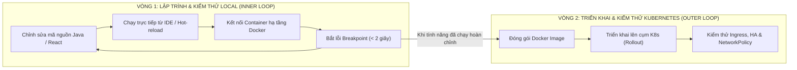

# Cẩm Nang 12 - Điều Phối Toàn Trình Cụm Microservices Trên Kubernetes (K8s Architecture, Networking, Persistence & Troubleshooting)

Tài liệu này tổng hợp toàn bộ kiến thức lý thuyết chuyên sâu, kiến trúc triển khai, cơ chế mạng, giải pháp lưu trữ bền vững (PVC) và kinh nghiệm xử lý sự cố (Troubleshooting War Stories) khi đưa hệ thống **Mini-Waybill Platform** (12 vi dịch vụ nghiệp vụ Spring Boot, API Gateway, Node.js Frontend, Kafka KRaft, Redis, RabbitMQ, MinIO và SQL Server 2022) từ Docker Compose lên vận hành trên **Kubernetes (K8s)**.

---

## 1. Bản Chất & Lý Thuyết Nền Tảng Cốt Lõi Của Kubernetes

### 1.1. Container Orchestration Là Gì & Tại Sao Phải Rời Bỏ Docker Compose?
Trong giai đoạn phát triển sơ khai (Local Dev), Docker Compose là công cụ tuyệt vời để bật/tắt toàn bộ dịch vụ trên một máy tính cá nhân duy nhất. Tuy nhiên, khi hệ thống bước vào môi trường Staging và Production đa máy chủ (Multi-Node), Docker Compose hoàn toàn bất lực trước các bài toán phân tán:

| Tiêu chí kỹ thuật | Docker Compose (Single-Host) | Kubernetes (Distributed Cluster) |
| :--- | :--- | :--- |
| **Phạm vi quản trị** | Giới hạn trên **duy nhất 1 máy chủ** (Single Node). | Quản trị cụm gồm **hàng trăm đến hàng nghìn máy chủ** (Multi-Node Cluster). |
| **Tự phục hồi (Self-Healing)** | Chỉ restart container cục bộ. Nếu máy chủ vật lý bị cháy/hỏng RAM, toàn bộ hệ thống sập. | Tự phát hiện Node chết, tự động di dời và lập lịch tái tạo Pods sang các Node khỏe mạnh khác chỉ trong vài giây. |
| **Nâng cấp phiên bản** | Gián đoạn dịch vụ (Downtime) khi pull image mới và recreate container. | **Zero-Downtime Rolling Update**: Bật Pod mới $\rightarrow$ Kiểm tra sẵn sàng (Readiness Probe) $\rightarrow$ Chuyển traffic $\rightarrow$ Tắt Pod cũ. |
| **Cân bằng tải nội bộ** | Phụ thuộc vào DNS round-robin đơn sơ của Docker Engine. | Service trừu tượng hóa, tự động cập nhật Endpoints và cân bằng tải qua **iptables / IPVS** tốc độ phần cứng. |
| **Tự động co giãn (Auto-Scaling)** | Không hỗ trợ tự động. Phải gõ lệnh `docker compose scale` thủ công. | **HPA (Horizontal Pod Autoscaler)** tự động co giãn số lượng Pod dựa theo CPU, RAM, hoặc chỉ số nghiệp vụ (Custom Metrics). |
| **Mô hình quản trị** | **Imperative (Mệnh lệnh):** Gõ lệnh bắt hệ thống làm. | **Declarative (Tuyên bố):** Khai báo trạng thái mong muốn qua YAML, K8s tự động chạy vòng lặp đưa thực tế về mong muốn. |

---

### 1.2. Kiến Trúc Bên Dưới (Under The Hood): Control Plane vs Worker Nodes

Một cụm Kubernetes hoạt động theo mô hình **Master - Worker** (nay chuẩn hóa là **Control Plane** và **Worker Nodes**):

```
┌────────────────────────────────────────────────────────────────────────────────────────┐
│                                CONTROL PLANE (MASTER)                                  │
│                                                                                        │
│   ┌────────────────────────────────────────────────────────────────────────────────┐   │
│   │                      KUBE-APISERVER (Cổng REST API Trung Tâm)                  │   │
│   └───────────────▲────────────────────────▲────────────────────────▲──────────────┘   │
│                   │                        │                        │                  │
│   ┌───────────────▼──────────────┐  ┌──────▼──────────────┐  ┌──────▼──────────────┐   │
│   │             ETCD             │  │   KUBE-SCHEDULER    │  │ KUBE-CONTROLLER-MGR │   │
│   │ (Key-Value DB / Raft Quorum) │  │  (Chọn Node đặt Pod)│  │ (Vòng lặp đối soát) │   │
│   └──────────────────────────────┘  └─────────────────────┘  └─────────────────────┘   │
└───────────────────────────────────────────▲────────────────────────────────────────────┘
                                            │ (TLS / gRPC)
          ┌─────────────────────────────────┴─────────────────────────────────┐
          ▼                                                                   ▼
┌───────────────────────────────────┐               ┌───────────────────────────────────┐
│           WORKER NODE 1           │               │           WORKER NODE 2           │
│                                   │               │                                   │
│  ┌─────────────────────────────┐  │               │  ┌─────────────────────────────┐  │
│  │ KUBELET (Chỉ huy Node)      │  │               │  │ KUBELET (Chỉ huy Node)      │  │
│  └──────────────┬──────────────┘  │               │  └──────────────┬──────────────┘  │
│                 │ (CRI)           │               │                 │ (CRI)           │
│  ┌──────────────▼──────────────┐  │               │  ┌──────────────▼──────────────┐  │
│  │ CONTAINER RUNTIME (CRI-O)   │  │               │  │ CONTAINER RUNTIME (CRI-O)   │  │
│  └─────────────────────────────┘  │               │  └─────────────────────────────┘  │
│  ┌─────────────────────────────┐  │               │  ┌─────────────────────────────┐  │
│  │ KUBE-PROXY (Điều phối mạng) │  │               │  │ KUBE-PROXY (Điều phối mạng) │  │
│  └─────────────────────────────┘  │               │  └─────────────────────────────┘  │
│  ┌─────────────────────────────┐  │               │  ┌─────────────────────────────┐  │
│  │ [Pod 1] [Pod 2] [Pod 3]     │  │               │  │ [Pod 4] [Pod 5] [Pod 6]     │  │
│  └─────────────────────────────┘  │               │  └─────────────────────────────┘  │
└───────────────────────────────────┘               └───────────────────────────────────┘
```

#### A. Các thành phần của Control Plane (Bộ Não Điều Khiển):
1. **`kube-apiserver` (Cửa ngõ trung tâm):**
   * Là thành phần duy nhất tiếp nhận mọi yêu cầu từ lập trình viên (`kubectl`), Web UI, và các Node.
   * Xử lý xác thực (Authentication), phân quyền (Authorization RBAC), và kiểm duyệt schema (Admission Control).
   * **Đặc tính:** Hoàn toàn **Stateless (vô trạng thái)**, có thể scale ngang nhiều instance để đạt tính sẵn sàng cao.
2. **`etcd` (Bộ nhớ dữ liệu cụm):**
   * Cơ sở dữ liệu phân tán dạng Key-Value cực nhanh và nhất quán (Consistent), sử dụng thuật toán đồng thuận **Raft Consensus**.
   * Lưu trữ toàn bộ trạng thái (State) của cụm: từ Pod, Service, Secret, ConfigMap cho đến Node metrics.
   * **Nguyên tắc bảo mật:** `etcd` không bao giờ mở mạng ra ngoài; **chỉ duy nhất `kube-apiserver` được phép đọc/ghi vào `etcd`**.
3. **`kube-scheduler` (Người phân công công việc):**
   * Lắng nghe các Pod mới được tạo mà chưa được gán Node (`nodeName` rỗng).
   * Thực hiện thuật toán 2 pha để chọn Node tối ưu:
     * **Pha 1 - Filtering (Lọc):** Loại bỏ các Node không đủ CPU/RAM, Node bị đánh dấu lỗi (`Taints`), hoặc không khớp điều kiện phần cứng.
     * **Pha 2 - Scoring (Chấm điểm):** Chấm điểm các Node còn lại dựa trên độ phân tán tải (Spread across racks/zones) để chọn ra Node có điểm số cao nhất.
4. **`kube-controller-manager` (Người giám sát thực thi):**
   * Tập hợp hàng loạt các tiến trình điều khiển chạy nền (Reconciliation Controllers):
     * *Node Controller:* Giám sát trạng thái Node (phát hiện Node mất kết nối sau 40s).
     * *Deployment & ReplicaSet Controller:* Đảm bảo số lượng Pod thực tế luôn đủ số lượng khai báo.
     * *EndpointSlice Controller:* Cập nhật danh sách IP Pod vào Service tương ứng.

#### B. Các thành phần của Worker Node (Nơi Thực Thi Ứng Dụng):
1. **`kubelet` (Đại tá chỉ huy tại chỗ):**
   * Chạy trực tiếp như một dịch vụ hệ thống (systemd service) trên mỗi Worker Node.
   * Nhận chỉ thị `PodSpec` từ `kube-apiserver`, giao tiếp với Container Runtime qua giao thức chuẩn **CRI (Container Runtime Interface)** để kéo Image, bật/tắt container.
   * Định kỳ thăm dò sức khỏe container (Liveness, Readiness, Startup Probes) và báo cáo về Control Plane.
2. **`kube-proxy` (Cảnh sát giao thông mạng):**
   * Chạy trên từng Worker Node, chịu trách nhiệm hiện thực hóa khái niệm trừu tượng `Service`.
   * Cài đặt và cập nhật các bảng định tuyến **`iptables`** hoặc **`IPVS`** trên nhân Linux (Kernel space), giúp gói tin gửi tới Virtual IP của Service được chuyển tiếp (DNAT) chính xác đến IP của Pod đích.
3. **Container Runtime (Môi trường thực thi container):**
   * Phần mềm trực tiếp khởi chạy container theo chuẩn OCI (Open Container Initiative), phổ biến nhất là **`containerd`** và **`CRI-O`** (K8s đã loại bỏ Docker shim từ bản 1.24 để tối ưu hiệu năng).

---

### 1.3. Mô Hình Khai Báo (Declarative Model) & Vòng Lặp Đối Soát (Reconciliation Loop)

Điểm tinh hoa nhất làm nên sức mạnh của Kubernetes là triết lý: **Declarative Infrastructure (Hạ tầng khai báo)**.

* **Trạng thái mong muốn (Desired State):** Được lập trình viên mô tả trong file `.yaml` (Ví dụ: `replicas: 2`).
* **Trạng thái thực tế (Actual State):** Số lượng Pod đang thực sự sống trên các Worker Node.

Kubernetes liên tục vận hành **Vòng Lặp Đối Soát (The Reconciliation Loop)** không ngừng nghỉ:

$$\text{Quan Sát (Observe)} \longrightarrow \text{So Sánh Sai Lệch (Diff)} \longrightarrow \text{Hành Động Khắc Phục (Act)}$$

```
                   ┌────────────────────────────────────────┐
                   │    Khai báo YAML: Desired State = 2    │
                   └───────────────────┬────────────────────┘
                                       │
                                       ▼
             ┌────────────────────────────────────────────────────┐
             │            VÒNG LẶP ĐỐI SOÁT LIÊN TỤC              │
             │                                                    │
             │  1. OBSERVE : Đếm số Pod đang chạy -> Actual = 2   │
             │  2. DIFF    : Desired (2) == Actual (2) -> OK!     │
             └─────────────────────────┬──────────────────────────┘
                                       │
                         [Sự cố: 1 Pod bị chết đột ngột]
                                       │
                                       ▼
             ┌────────────────────────────────────────────────────┐
             │  1. OBSERVE : Đếm số Pod đang chạy -> Actual = 1   │
             │  2. DIFF    : Desired (2) != Actual (1) -> LỆCH!   │
             │  3. ACT     : Ra lệnh tạo ngay 1 Pod mới thay thế  │
             └────────────────────────────────────────────────────┘
```

👉 Nhờ cơ chế này, bạn không bao giờ phải thức dậy lúc nửa đêm để "bật lại server" khi một tiến trình Java bị tràn bộ nhớ (Out Of Memory) hay lỗi phần cứng.

---

### 1.4. Cơ Chế Phân Cấp Bộ Điều Khiển (Controller Hierarchy)

Trong Kubernetes, bạn **không bao giờ nên tạo Pod trực tiếp (Naked Pod)**. Hệ thống quản lý theo mô hình phân cấp 3 tầng chặt chẽ:

```
[ Deployment: Quản lý chiến lược nâng cấp, rollback, version ]
      │
      ▼ (sở hữu & quản lý)
[ ReplicaSet: Đảm bảo số lượng bản sao chính xác ]
      │
      ▼ (sở hữu & quản lý)
[ Pod: Thể hiện thực thi chứa Container ]
```

1. **Tại sao không tạo Pod trần (Naked Pod)?**  
   Nếu bạn tạo Pod trần bằng lệnh `kubectl run`, khi Node chứa Pod đó bị sập hoặc Pod bị lỗi chết, **sẽ không có ai tạo lại Pod đó**. Pod sẽ chết vĩnh viễn!
2. **Tại sao cần Deployment bọc ngoài ReplicaSet?**  
   ReplicaSet chỉ biết duy trì số lượng Pod (scale ngang). Khi bạn muốn nâng cấp ứng dụng từ phiên bản `v1` lên `v2`:
   * Deployment tạo ra một **ReplicaSet mới (`v2`)** với `replicas = 1`.
   * Chờ Pod `v2` khởi động xong và vượt qua kiểm tra sức khỏe.
   * Deployment giảm ReplicaSet cũ (`v1`) từ 2 xuống 1, và tăng ReplicaSet `v2` lên 2.
   * Tiếp tục cho đến khi ReplicaSet cũ còn 0 Pod và ReplicaSet mới có 2 Pods.
   * **Nếu phiên bản `v2` bị lỗi nghiêm trọng:** Bạn chỉ cần gõ `kubectl rollout undo deployment`, Deployment sẽ ngay lập tức đảo ngược lưu lượng về ReplicaSet `v1` cũ chỉ trong **1 giây**!

---

### 1.5. Vòng Đời Của Một Pod & Máy Trạng Thái (Pod Lifecycle & State Machine)

Một Pod trong K8s trải qua máy trạng thái (State Machine) nghiêm ngặt từ lúc được sinh ra đến khi kết thúc:

```
[Pod Tạo Mới] ──► PENDING ──► CONTAINER_CREATING ──► RUNNING ──► SUCCEEDED / FAILED
                     │                                   │
                     ▼                                   ▼
             (Thiếu tài nguyên /                  (Lỗi ứng dụng /
              Lỗi PVC Storage)                   CrashLoopBackOff)
```

#### A. Chi tiết các giai đoạn (Pod Phases):
* **`Pending`:** Yêu cầu tạo Pod đã được API Server chấp thuận và ghi vào `etcd`, nhưng Pod chưa được gán Node (đang chờ Scheduler) hoặc đang tải dữ liệu ổ đĩa (PVC).
* **`ContainerCreating`:** Node đã nhận Pod, `kubelet` đang kéo Docker image từ Registry và thiết lập mạng (CNI), gắn Volume.
* **`Running`:** Tất cả các container trong Pod đã được khởi chạy thành công. Ít nhất 1 container đang chạy hoặc đang trong quá trình restart.
* **`Succeeded`:** Tất cả container trong Pod đã chạy xong nhiệm vụ và thoát thành công với mã lỗi `0` (thường gặp trong Kubernetes `Job` hoặc `CronJob`).
* **`Failed`:** Tất cả container đã kết thúc và có ít nhất 1 container bị thoát với mã lỗi khác `0`.

#### B. Bốn Mã Lỗi Kinh Điển Trong Phỏng Vấn & Thực Tế:

1. **`CrashLoopBackOff`:**
   * *Bản chất:* Container khởi động lên nhưng bị crash (tắt) ngay lập tức. K8s thử khởi động lại container, nhưng nó tiếp tục crash. K8s sẽ tăng dần thời gian chờ giữa các lần thử (Back-off delay: 10s, 20s, 40s... tối đa 5 phút).
   * *Nguyên nhân thường gặp:* Thiếu biến môi trường, sai file cấu hình, Database chưa sẵn sàng, hoặc lỗi xung đột cổng mạng.
2. **`ImagePullBackOff` / `ErrImagePull`:**
   * *Bản chất:* `kubelet` không thể kéo được Docker Image về Worker Node.
   * *Nguyên nhân:* Gõ sai tên Image, sai tag version, mạng chập chờn, hoặc Image nằm trong Private Registry mà quên cấu hình `imagePullSecrets`.
3. **`OOMKilled` (Exit Code 137):**
   * *Bản chất:* Tiến trình ứng dụng (ví dụ Java JVM) sử dụng vượt quá ngưỡng bộ nhớ trần được khai báo trong `resources.limits.memory`.
   * *Cơ chế:* Hệ điều hành Linux Kernel kích hoạt tiến trình **OOM Killer (Out Of Memory Killer)** bắn tín hiệu `SIGKILL` (9) để hạ gục container ngay lập tức nhằm bảo vệ an toàn cho máy chủ vật lý.
4. **`Pending` kéo dài:**
   * *Nguyên nhân:* Cụm Worker Nodes không còn đủ CPU/RAM đáp ứng mức `requests` của Pod, hoặc PVC yêu cầu một StorageClass không tồn tại.

#### C. Quy Trình Tắt Êm (Graceful Shutdown):
Khi một Pod bị xóa hoặc thay thế trong quá trình Rolling Update:
1. K8s lập tức **gỡ bỏ IP của Pod ra khỏi Service Endpoints** $\rightarrow$ Pod không nhận thêm request mới nào từ Gateway.
2. K8s gửi tín hiệu **`SIGTERM` (15)** vào container.
3. Ứng dụng Spring Boot bắt tín hiệu này, dừng nhận request mới, hoàn tất nốt các transaction/request đang xử lý dở dang và giải phóng connection pool.
4. K8s đếm ngược thời gian **`terminationGracePeriodSeconds`** (mặc định là 30 giây).
5. Nếu sau 30 giây mà ứng dụng vẫn chưa tắt hẳn, K8s sẽ bắn tín hiệu cưỡng chế **`SIGKILL` (9)** để dọn sạch tài nguyên.

---

### 1.6. Mô Hình Mạng Kubernetes (K8s Networking Model & CNI)

Mạng trong Kubernetes được thiết kế theo triết lý phẳng, tuân thủ **4 nguyên tắc vàng**:

1. **Nguyên tắc IP-per-Pod:** Mỗi Pod sở hữu một địa chỉ IP thực duy nhất trong cụm. Tất cả các container trong cùng một Pod chia sẻ chung Network Namespace (bao gồm cả IP, dải port và loopback `localhost`).
2. **Giao tiếp không cần NAT (No-NAT Communication):** Mọi Pod đều có thể gọi trực tiếp tới mọi Pod khác trên bất kỳ Worker Node nào mà **không cần thông qua Network Address Translation (NAT)**.
3. **Agent-to-Pod Communication:** `kubelet` trên một Node có thể giao tiếp trực tiếp với mọi Pod trên chính Node đó.
4. **Địa chỉ nhất quán:** Địa chỉ IP mà Pod tự nhìn thấy ở chính nó chính là địa chỉ IP mà các Pod khác nhìn thấy khi giao tiếp với nó.

* **CNI (Container Network Interface):** Kubernetes không tự cài đặt mạng vật lý mà đưa ra chuẩn CNI. Các plugin phổ biến như **Flannel** (mạng ảo đơn giản), **Calico** (hiệu năng cao, bảo mật NetworkPolicy chặt chẽ), hoặc **Cilium** (dựa trên công nghệ cách mạng eBPF của nhân Linux).
* **Cơ chế CoreDNS:** Trong cụm K8s, một dịch vụ DNS nội bộ (CoreDNS) luôn chạy ngầm để tự động biên dịch tên Service thành Virtual IP, giúp loại bỏ hoàn toàn việc phải hardcode địa chỉ IP.

---

### 1.7. Chiến Lược Quản Trị Tài Nguyên: Requests vs Limits & QoS Classes

Để đảm bảo các container không "tranh giành" tài nguyên dẫn đến treo máy, K8s yêu cầu khai báo 2 thông số sống còn:

```yaml
resources:
  requests:
    memory: "256Mi"
    cpu: "100m"      # 100 milli-CPU = 0.1 vCPU Core
  limits:
    memory: "512Mi"
    cpu: "500m"      # 500 milli-CPU = 0.5 vCPU Core
```

* **`requests` (Mức sàn - Cam kết tối thiểu):**
  * Là lượng tài nguyên mà K8s **đảm bảo cấp phát độc quyền** cho Pod.
  * `kube-scheduler` dùng thông số `requests` để tìm Node có đủ chỗ trống để đặt Pod. Nếu không Node nào còn đủ 256Mi RAM trống, Pod sẽ rơi vào trạng thái `Pending`.
* **`limits` (Mức trần - Giới hạn tối đa):**
  * Là ngưỡng tài nguyên tối đa mà Pod được phép chạm tới trong lúc cao điểm (Spike).
  * **Đối với CPU (Compressible Resource - Tài nguyên có thể nén):** Nếu container vượt quá CPU limit, hệ thống sẽ **bóp nghẹt xung nhịp (CPU Throttling)** làm ứng dụng chạy chậm lại, nhưng **không bị kill**.
  * **Đối với Memory (Incompressible Resource - Tài nguyên không nén):** Nếu container ngốn RAM vượt quá Memory limit, nó sẽ bị hệ thống **hạ gục ngay lập tức (`OOMKilled`)**.

#### Ba Hạng Chất Lượng Dịch Vụ (Quality of Service - QoS Classes):
Khi máy chủ Worker Node bị cạn kiệt tài nguyên cục bộ, K8s sẽ tiến hành trục xuất (Evict) các Pod theo thứ tự ưu tiên dựa trên QoS:

1. **`Guaranteed` (An toàn nhất):** Khi `requests` bằng đúng `limits` cho cả CPU và RAM. Pod này được bảo vệ tối đa, chỉ bị kill khi không còn lựa chọn nào khác.
2. **`Burstable` (Linh hoạt - Mặc định dự án):** Khi `requests` nhỏ hơn `limits`. Cho phép mượn thêm tài nguyên khi rảnh rỗi.
3. **`BestEffort` (Nguy hiểm nhất):** Không khai báo cả `requests` lẫn `limits`. Khi máy chủ thiếu RAM, Pod loại này sẽ bị **tiêu diệt đầu tiên**!

---

### 1.8. Cơ Chế Lưu Trữ Đa Tầng: StorageClass, PV và PVC

Để tách biệt trách nhiệm giữa **Kỹ sư Hạ tầng (SysAdmin/DevOps)** và **Lập trình viên (Developer)**, K8s chia lưu trữ thành 3 tầng trừu tượng:

```
[StorageClass (Nhà máy sản xuất ổ đĩa Cloud: AWS gp3, VNPT BlockStorage)]
                               │ (Dynamic Provisioning)
                               ▼
[PersistentVolume - PV (Ổ cứng vật lý thực tế được tạo ra)]
                               ▲
                               │ (Gắn kết - Bound)
[PersistentVolumeClaim - PVC (Hợp đồng thuê ổ cứng của Developer)]
                               ▲
                               │ (Mount đường dẫn /var/opt/mssql)
[Pod Database (SQL Server 2022)]
```

* **`PersistentVolume (PV)`:** Là mảnh ổ cứng thực tế (Physical Storage) trong trung tâm dữ liệu hoặc ổ đĩa ảo trên Cloud (EBS, Persistent Disk).
* **`PersistentVolumeClaim (PVC)`:** Là "phiếu yêu cầu cấp phát" do lập trình viên viết ra trong file YAML (Ví dụ: "Cấp cho tôi 5GB ổ đĩa, chế độ đọc ghi đơn `ReadWriteOnce`").
* **Chế độ truy cập (Access Modes):**
  * **`ReadWriteOnce (RWO)`:** Ổ đĩa chỉ cho phép **duy nhất 1 Node** gắn kết đọc/ghi tại một thời điểm (Bắt buộc cho các Database quan hệ như SQL Server, MySQL, Postgres).
  * **`ReadOnlyMany (ROX)`:** Cho phép nhiều Node cùng gắn kết chỉ để đọc dữ liệu.
  * **`ReadWriteMany (RWX)`:** Cho phép nhiều Node cùng đọc và ghi đồng thời (Cần các hệ thống tệp chia sẻ mạng như NFS, Ceph, AWS EFS).

---

## 2. Kiến Trúc Triển Khai Cụm K8s Của Mini-Waybill Platform

### 2.1. Sơ Đồ Bố Cục Kiến Trúc Chuẩn Hóa Cụm Kubernetes (`namespace: waybill`)

```mermaid
graph TB
    subgraph Host_Layer["MÁY CHỦ WINDOWS (HOST) & CLIENT"]
        Browser["Trình duyệt Web / Client Apps<br/>(https://waybill.vn)"]
        AdminSSMS["Công cụ Quản trị DB<br/>(SSMS / DBeaver / DataGrip)"]
        OllamaEngine["Ollama AI Engine (host.docker.internal:11434)<br/>Mô hình: qwen2.5:3b"]
    end

    subgraph K8s_Cluster["CỤM KUBERNETES CHUẨN HÓA (PRODUCTION-LIGHTWEIGHT)"]
        subgraph Ingress_Layer["TẦNG TIẾP NHẬN DUY NHẤT (SINGLE ENTRYPOINT)"]
            Ingress["Ingress NGINX Controller (TLS Termination)<br/>Cổng ngoại vi: 80 (Redirect), 443 (TLS)"]
        end

        subgraph Security_Border["VÙNG BẢO MẬT ZERO-TRUST (NETWORK POLICIES)"]
            subgraph Gateway_Tier["TẦNG ĐIỀU PHỐI VÀ GIAO DIỆN"]
                FrontendPod["Pod: frontend (Vue 3 SPA + Node.js)<br/>Service: ClusterIP :80"]
                GatewayPod["Pods: api-gateway (Spring Cloud Gateway)<br/>2 Replicas (HA) + PodAntiAffinity<br/>Service: ClusterIP :8080"]
                EurekaPod["Pod: eureka-peer1<br/>Netflix Eureka Service Registry (:8761)"]
            end

            subgraph Microservice_Mesh["TẦNG MICROSERVICES NGHIỆP VỤ (13 DỊCH VỤ - CLUSTERIP ONLY)"]
                ShipmentSvc["Pods: shipment-service (:8082)<br/>2 Replicas (HA) + HPA"]
                CustomerSvc["Pods: customer-service (:8081)<br/>2 Replicas (HA) + HPA"]
                SupportSvc["Pods: support-service (:8093)<br/>2 Replicas (HA)"]
                AuthSvc["Pod: auth-service (:8087)"]
                RoutingSvc["Pod: routing-service (:8083)"]
                TrackingSvc["Pod: tracking-service (:8084)"]
                NotificationSvc["Pod: notification-service (:8085)"]
                AuditSvc["Pod: audit-service (:8086)"]
                ShipperSvc["Pod: shipper-service (:8089)"]
                ReportSvc["Pod: report-service (:8091)"]
                PaymentSvc["Pod: payment-service (:8095)"]
                RatingSvc["Pod: rating-service (:8092)"]
            end

            subgraph Middleware_Mesh["TẦNG HẠ TẦNG TRUNG GIAN & BROKER (CLUSTERIP ONLY)"]
                RedisPod["Pod: redis (:6379)<br/>Distributed Caching (ClusterIP)"]
                KafkaPod["Pod: kafka (:9092)<br/>Event Streaming Bus (ClusterIP)"]
                RabbitPod["Pod: rabbitmq (:5672, :15672)<br/>Task Queue (ClusterIP)"]
                MinioPod["Pod: minio (:9000, :9001)<br/>S3 Storage (ClusterIP)"]
            end

            subgraph Data_Tier["TẦNG DỮ LIỆU ĐƯỢC BẢO VỆ (NETWORK POLICY ISOLATED)"]
                SqlPod["Pod: sqlserver-replica (:1433)<br/>12 CSDL Độc Lập (ClusterIP Only)"]
                PVC_SQL["PVC: sqlserver-pvc (5Gi)"]
                PVC_Minio["PVC: minio-pvc (5Gi)"]
                PVC_Rabbit["PVC: rabbitmq-pvc (1Gi)"]
            end
        end
    end

    Browser -->|HTTPS :443 (HTTP :80 Redirect)| Ingress
    Ingress -->|/| FrontendPod
    Ingress -->|/api| GatewayPod

    AdminSSMS -.->|Kênh an toàn: scripts/db-connect.ps1| SqlPod

    GatewayPod --> EurekaPod
    GatewayPod --> ShipmentSvc
    GatewayPod --> CustomerSvc
    GatewayPod --> SupportSvc
    GatewayPod --> AuthSvc
    GatewayPod --> RoutingSvc
    GatewayPod --> TrackingSvc
    GatewayPod --> NotificationSvc
    GatewayPod --> AuditSvc
    GatewayPod --> ShipperSvc
    GatewayPod --> ReportSvc
    GatewayPod --> PaymentSvc
    GatewayPod --> RatingSvc

    Microservice_Mesh -.-> EurekaPod
    Microservice_Mesh -->|Được bảo vệ bởi NetworkPolicy| SqlPod
    Microservice_Mesh -->|Được bảo vệ bởi NetworkPolicy| RedisPod
    Microservice_Mesh --> KafkaPod
    Microservice_Mesh --> RabbitPod
    SupportSvc --> MinioPod
    SupportSvc -->|host.docker.internal:11434| OllamaEngine

    SqlPod --> PVC_SQL
    MinioPod --> PVC_Minio
    RabbitPod --> PVC_Rabbit
```

### 2.2. Quy Chuẩn Tổ Chức Thư Mục Manifest (`k8s/`)
Toàn bộ manifest được tổ chức theo cấu trúc phân tầng sạch sẽ, đánh số thứ tự khởi động:

```
k8s/
├── 00-namespaces/                    # Namespace; secrets được tạo từ cấu hình local
├── 01-infrastructure/                # Cụm dịch vụ nền tảng (Chạy đầu tiên)
│   ├── redis.yaml                    # In-Memory Cache (Port 6379)
│   ├── eureka.yaml                   # Service Registry Eureka Peer 1 (Port 8761)
│   ├── kafka.yaml                    # Kafka KRaft Broker đơn lẻ (Port 9092)
│   ├── rabbitmq.yaml                 # Hàng đợi SLA của support-service
│   ├── minio.yaml                    # Object storage cho tệp hỗ trợ
│   ├── sqlserver.yaml                # SQL Server 2022 + PVC 5GB
│   └── sqlserver-init-job.yaml       # Tạo các database ứng dụng
├── 02-services/                      # 12 Microservices nghiệp vụ, Gateway và Frontend
│   ├── customer-service.yaml         # 2 Replicas (Port 8081)
│   ├── auth-service.yaml             # Stateless JWT & RBAC (Port 8087)
│   ├── shipment-service.yaml         # Quản lý vận đơn & sinh mã (Port 8082)
│   ├── routing-service.yaml          # Điều phối 22 Hub & 40 Trips (Port 8083)
│   ├── tracking-service.yaml         # Tra cứu thời gian thực & Cache (Port 8084)
│   ├── notification-service.yaml     # Xử lý thông báo Kafka Event (Port 8085)
│   ├── audit-service.yaml            # Ghi log kiểm toán nghiệp vụ (Port 8086)
│   ├── shipper-service.yaml          # Tác nghiệp bưu tá phát hàng (Port 8089)
│   ├── report-service.yaml           # Báo cáo doanh thu & đối soát COD (Port 8091)
│   ├── support-service.yaml          # Ticket, RabbitMQ và MinIO (Port 8093)
│   ├── rating-service.yaml           Đánh giá bưu phẩm và dịch vụ (Port 8092)
│   ├── payment-service.yaml          # Thanh toán và đối soát (Port 8095)
│   ├── api-gateway.yaml              # Cổng định tuyến API Spring Cloud (Port 8080)
│   └── frontend.yaml                 # Node.js Server & Web UI (Port 80/3000)
├── 03-ingress/                       # Định tuyến Frontend, API và MinIO
└── kustomization.yaml                # Cấu hình local: image tags, probes, ClusterIP
```

---

## 3. Mạng Trong Kubernetes (Networking & Service Exposure)

### 3.1. Phân Biệt Các Loại Service Trong K8s

| Kiểu Service | Phạm vi truy cập | Mục đích sử dụng | Ứng dụng trong dự án |
| :--- | :--- | :--- | :--- |
| **`ClusterIP`** *(Mặc định)* | Chỉ nội bộ bên trong cụm K8s | Microservices giao tiếp với nhau an toàn | `auth`, `customer`, `shipment`, `routing`, `kafka`... |
| **`NodePort`** | Mở cổng cố định (30000-32767) trên tất cả Worker Nodes | Truy cập từ bên ngoài máy cụm mà không cần Load Balancer | Thích hợp môi trường On-Premise/Bare-Metal |
| **`LoadBalancer`** | Tự động cấp phát IP/Cổng từ nhà cung cấp Cloud | Mở dịch vụ ra ngoài cụm khi môi trường có load balancer | Không dùng trong Minikube overlay; SQL truy cập qua port-forward |
| **`Ingress`** | Bộ định tuyến L7 (HTTP/HTTPS) dựa trên Domain và URI Path | Cổng HTTP(S) cho người dùng | `waybill.vn`, `api.waybill.vn`, `storage.waybill.vn` |

### 3.2. Cơ Chế CoreDNS: Pod Nói Chuyện Với Pod Như Thế Nào?
Trong mạng ảo K8s, mỗi Pod có một địa chỉ IP riêng (ví dụ `10.1.0.33`), nhưng địa chỉ này sẽ thay đổi mỗi khi Pod restart. Để ổn định kết nối:
1. Kubernetes cấp cho mỗi Service một tên miền nội bộ: `<service-name>.<namespace>.svc.cluster.local`.
2. CoreDNS tự động phân giải tên ngắn `<service-name>` (ví dụ `http://kafka:9092`, `http://redis:6379`) thành IP ảo của Service.
3. Vì vậy, các microservices **hoàn toàn không cần biết IP thật** của nhau, chỉ cần gọi theo tên Service!

### 3.3. Cơ Chế Reverse Proxy Của Pod Frontend
Pod `frontend` chạy một tiến trình Node.js nhẹ (`server.js`):
* **Phục vụ tĩnh:** Mọi request tải trang HTML/CSS/JS (`GET /`, `GET /login.html`) được đọc từ thư mục `/app/frontend` và trả về ngay.
* **Reverse Proxy:** Mọi request bắt đầu bằng `/api/` (ví dụ `POST /api/auth/login`) được Node.js chuyển tiếp ngầm tới `http://api-gateway:8080`. Trình duyệt của khách hàng không bị lỗi chặn CORS và không cần biết IP của Gateway bên trong K8s.

---

### 3.4. Điểm Khác Biệt Khi Chạy Trên Docker Desktop Kubernetes
Trong môi trường Kubernetes tích hợp của Docker Desktop trên Windows:
* **Cơ chế chia sẻ Docker Engine:** Kubernetes chạy trực tiếp trên cùng Docker Engine của máy host. Khi biên dịch Docker image cục bộ (`khanhnv26/<service>:latest`), Kubernetes lập tức nhìn thấy image mà không cần thực hiện lệnh load thủ công.
* **Cơ chế bind cổng LoadBalancer tự động:** Các Service khai báo kiểu `LoadBalancer` (`frontend`, `api-gateway`, `sqlserver-replica`) sẽ tự động được Docker Desktop kết nối thẳng ra `localhost` trên Windows mà không cần chạy tiến trình tunnel.
* **Phân giải địa chỉ máy Host (`host.docker.internal`):** Các Pod bên trong cụm kết nối tới các dịch vụ đang chạy trên Windows (như Ollama tại cổng 11434) thông qua tên miền `host.docker.internal`.

---

### 3.5. Chuẩn Hóa An Ninh Zero-Trust, Ingress SSL/TLS & Quản Trị Tên Miền Cụm

Trong giai đoạn chuẩn hóa lên môi trường Production, hạ tầng mạng của hệ thống được tái cấu trúc toàn diện dựa trên 5 trụ cột bảo mật & điều phối lưu lượng then chốt:

#### 3.5.1. Kiến Trúc Single Entrypoint & Domain-Based Routing (`*.waybill.vn`)
Thay vì để client mở cổng rời rạc hoặc sử dụng địa chỉ IP thô, hệ thống chuẩn hóa toàn bộ luồng truy cập qua một cửa ngõ L7 duy nhất: **Ingress NGINX Controller**:
* **SSL/TLS Termination tại biên (Edge):** Ingress Controller lắng nghe trên cổng 443 (HTTPS), thực hiện giải mã SSL/TLS trước khi chuyển tiếp gói tin dạng HTTP thuần (Layer 7) đến các Service `ClusterIP` nội bộ. Điều này giúp giảm tải mã hóa/giải mã cho các container nghiệp vụ bên trong.
* **Tự động chuyển hướng HTTP $\rightarrow$ HTTPS:** Mọi truy vấn gửi tới cổng 80 (HTTP) đều được Ingress NGINX tự động phản hồi mã chuyển hướng `308 Permanent Redirect` (hoặc `301`) sang `https://...`.
* **Ma trận định tuyến tên miền và dịch vụ đích:**

| Tên miền (Domain FQDN) | Namespace | Service Đích | Port Đích | Giao Thức & Chức Năng |
| :--- | :--- | :--- | :--- | :--- |
| `https://waybill.vn` | `waybill` | `frontend` | 80 | **Frontend SPA Portal** (HTML5 History Mode, Clean URLs, tĩnh + proxy) |
| `https://api.waybill.vn` | `waybill` | `api-gateway` | 8080 | **API Gateway HA** (Spring Cloud Gateway, bảo vệ JWT, Rate Limiter) |
| `https://storage.waybill.vn` | `waybill` | `minio` | 9000 | **MinIO S3 Storage** (Public asset, tệp đính kèm ticket khiếu nại) |
| `https://grafana.waybill.vn` | `monitor` | `grafana` | 3000 | **Grafana Dashboard** (Giám sát trực quan CPU, RAM, JVM, HTTP Metrics) |
| `https://dashboard.waybill.vn` | `kubernetes-dashboard` | `kubernetes-dashboard` | 443 | **Kubernetes Dashboard** (Giao diện đồ họa quản trị Pods, Events cụm) |

* **Lý do lựa chọn Domain-Based Routing thay vì IP/Localhost:**
  1. *Đồng nhất Cookie & State:* Tránh hiện tượng xung đột cookie giữa các ứng dụng chạy chung `localhost` khác cổng.
  2. *Mô phỏng Production thực tế:* Phù hợp với kiến trúc Cloud hiện đại (AWS ALB / Cloudflare / VNPT Cloud) sử dụng Subdomain cho từng năng lực nghiệp vụ.
  3. *Tương thích chuẩn OAuth 2.0:* Các IdP lớn như Google bắt buộc định danh nguồn gốc HTTPS trên custom domain.

#### 3.5.2. Triển Khai Thực Tế: Chứng Chỉ SSL/TLS Wildcard Với `mkcert` & Kubernetes TLS Secrets
Để triển khai HTTPS hoàn toàn "xanh" trên trình duyệt (không gặp cảnh báo đỏ `NET::ERR_CERT_AUTHORITY_INVALID`), giải pháp sử dụng công cụ **`mkcert`** tạo Certificate Authority (CA) cục bộ tin cậy:

* **Bản chất của `mkcert`:** `mkcert` tự động tạo một Root CA riêng trong máy và cài đặt (trust) Root CA đó vào kho lưu trữ hệ điều hành (Windows Certificate Store) cùng các trình duyệt (Chrome, Edge, Firefox). Bất kỳ chứng chỉ SSL nào do Root CA này ký đều được trình duyệt xác thực là bảo mật 100%.

* **Quy trình 5 bước thiết lập chứng chỉ & nạp vào Kubernetes:**

1. **Cài đặt `mkcert` trên Windows:**
   ```powershell
   choco install mkcert
   # Hoặc cài qua Scoop / tải file binary từ GitHub Releases
   ```

2. **Cài đặt Root CA vào hệ thống:**
   ```powershell
   mkcert -install
   ```
   *(Windows sẽ hiển thị hộp thoại xác nhận thêm Root CA vào "Trusted Root Certification Authorities", chọn Yes).*

3. **Sinh cặp chứng chỉ Wildcard & Domain gốc:**
   ```powershell
   mkcert waybill.vn "*.waybill.vn"
   ```
   Lệnh sinh ra 2 file chứng chỉ đạt chuẩn X.509:
   * `waybill.vn+1.pem`: Chứa chuỗi chứng chỉ SSL (Certificate Bundle bao gồm domain gốc và wildcard).
   * `waybill.vn+1-key.pem`: Chứa Private Key (Khóa bí mật RSA/ECDSA).

4. **Tạo Kubernetes TLS Secrets trên cả 3 Namespaces:**
   > ⚠️ **Quy tắc cô lập Namespace của K8s Ingress:** Ingress Controller chỉ có thể đọc Secret nằm **trong cùng Namespace** với tài nguyên Ingress đó. Do dịch vụ ứng dụng, giám sát và dashboard nằm ở 3 namespace tách biệt, ta cần tạo TLS Secret tương ứng trên từng namespace:
   ```powershell
   # 1. Namespace nghiệp vụ bưu chính (waybill)
   kubectl create secret tls waybill-tls --cert=waybill.vn+1.pem --key=waybill.vn+1-key.pem -n waybill

   # 2. Namespace giám sát (monitor)
   kubectl create secret tls monitoring-tls --cert=waybill.vn+1.pem --key=waybill.vn+1-key.pem -n monitor

   # 3. Namespace quản trị cụm (kubernetes-dashboard)
   kubectl create secret tls dashboard-tls --cert=waybill.vn+1.pem --key=waybill.vn+1-key.pem -n kubernetes-dashboard
   ```

5. **Cấu hình phân giải DNS cục bộ trên máy tính (`hosts` file):**
   Mở `C:\Windows\System32\drivers\etc\hosts` bằng Notepad (Run as Administrator) và trỏ các domain về IP máy chủ Ingress (hoặc `127.0.0.1` trên Docker Desktop):
   ```text
   127.0.0.1 waybill.vn api.waybill.vn storage.waybill.vn grafana.waybill.vn dashboard.waybill.vn
   ```

* **Mẫu cấu hình Kubernetes Ingress có kích hoạt TLS (`k8s/03-ingress/waybill-ingress.yaml`):**
```yaml
apiVersion: networking.k8s.io/v1
kind: Ingress
metadata:
  name: waybill-ingress
  namespace: waybill
  annotations:
    kubernetes.io/ingress.class: nginx
    nginx.ingress.kubernetes.io/ssl-redirect: "true"
    nginx.ingress.kubernetes.io/proxy-body-size: "50m"
spec:
  tls:
    - hosts:
        - waybill.vn
        - api.waybill.vn
        - storage.waybill.vn
      secretName: waybill-tls
  rules:
    - host: waybill.vn
      http:
        paths:
          - path: /
            pathType: Prefix
            backend:
              service:
                name: frontend
                port:
                  number: 80
    - host: api.waybill.vn
      http:
        paths:
          - path: /
            pathType: Prefix
            backend:
              service:
                name: api-gateway
                port:
                  number: 8080
    - host: storage.waybill.vn
      http:
        paths:
          - path: /
            pathType: Prefix
            backend:
              service:
                name: minio
                port:
                  number: 9000
```

#### 3.5.3. Bắt Buộc HTTPS Cho Google OAuth Identity Services Trên Custom Domain
Trong kiến trúc bảo mật của `auth-service` và `frontend`, hệ thống tích hợp luồng đăng nhập nhanh bằng Google Identity Services (GIS).
* **Ràng buộc bảo mật của Google:** Google chỉ cho phép sử dụng giao thức `http://` duy nhất với hostname nguyên bản là `http://localhost`. Ngay khi chuyển sang tên miền tùy chỉnh (Custom Domain) như `waybill.vn`, thư viện Google Client API (`accounts.google.com/gsi/client`) sẽ chặn hoàn toàn quá trình khởi tạo nút bấm đăng nhập nếu giao thức không phải là `https://`.
* **Cấu hình trên Google Cloud Console:**
  Tại trang **APIs & Services $\rightarrow$ Credentials $\rightarrow$ OAuth 2.0 Client IDs**:
  * **Authorized JavaScript origins:** Khai báo chính xác `https://waybill.vn`.
  * **Authorized redirect URIs:** Bổ sung `https://waybill.vn/login` (khi cần redirect callback).
* Nhờ cơ chế Ingress SSL/TLS Termination với `mkcert`, ứng dụng Frontend chạy mượt mà nút đăng nhập Google One-Tap và OAuth Button ngay trên môi trường local cluster mà không vi phạm chính sách bảo mật của Google.

#### 3.5.4. Đóng Cổng Ngoại Vi Database Và Cache (ClusterIP Isolation)
* Chuyển `sqlserver-replica` và `redis` về `type: ClusterIP`. Ngăn chặn hoàn toàn việc mở cổng cơ sở dữ liệu và cache ra Internet hoặc mạng LAN công cộng.
* Toàn bộ 12 microservices kết nối với SQL Server qua DNS nội bộ bảo vệ: `sqlserver-replica.waybill.svc.cluster.local:1433`.
* Khi quản trị viên hoặc DevOps cần dùng SSMS, DBeaver, DataGrip từ máy tính Windows để kiểm tra dữ liệu, sử dụng script bảo mật mở kênh port-forwarding có kiểm soát:
  ```powershell
  powershell -ExecutionPolicy Bypass -File scripts/db-connect.ps1
  ```

#### 3.5.5. Phân Vùng Mạng Theo Mô Hình Zero-Trust (Kubernetes NetworkPolicy)
Áp dụng file khai báo `k8s/01-infrastructure/network-policies.yaml` nhằm thực thi nguyên tắc "Least Privilege" (Đặc quyền tối thiểu) ở tầng mạng ảo K8s:
* **Bảo vệ SQL Server:** Chỉ các Pod mang nhãn microservice nghiệp vụ (`shipment-service`, `customer-service`, `auth-service`, `report-service`,...) mới được phép bắt tay TCP tới cổng 1433.
* **Bảo vệ Redis:** Chỉ các Pod có nhu cầu caching và phân tầng token (`api-gateway`, `shipment-service`, `customer-service`) mới được gửi truy vấn tới cổng 6379.
* **Cách ly Pod Frontend:** Pod `frontend` chỉ được phép giao tiếp duy nhất với `api-gateway` (cổng 8080) và nhận request từ Ingress Controller; bị từ chối truy cập trực tiếp vào Database, Redis hay các microservices tầng dưới.

---

## 4. Lưu Trữ Bền Vững (Persistence) & Quản Trị Đa Môi Trường

### 4.1. Cơ Chế PVC Của SQL Server Trong K8s
* Pod thông thường là **Stateless (vô trạng thái)**: khi Pod bị xóa, mọi dữ liệu sinh ra bên trong container sẽ biến mất hoàn toàn.
* Để chạy Database, ta dùng **PersistentVolumeClaim (PVC)** `sqlserver-pvc` dung lượng 5GB.
* Khi Pod `sqlserver-replica` bị restart hoặc nâng cấp, K8s sẽ **gắn lại (re-attach) đúng ổ đĩa này** vào container tại thư mục `/var/opt/mssql`. Dữ liệu các bảng vận đơn, tài khoản, chuyến xe được bảo toàn 100%.

### 4.2. Bản Chất Độc Lập Giữa 3 Môi Trường Dữ Liệu
Hệ thống hiện tại có 3 vùng cơ sở dữ liệu hoàn toàn độc lập:

| Môi trường | Cổng kết nối ngoài | Vùng lưu trữ | Khi nào sử dụng? |
| :--- | :--- | :--- | :--- |
| **Local Windows** | `localhost:1433` | Ổ cứng máy chủ Windows | Khi lập trình nhanh từng service bằng IntelliJ/VSCode |
| **Docker Compose** | `localhost:1433` | Docker Volume `sqlserver-data` | Khi chạy kiểm thử cụm container truyền thống |
| **Kubernetes** | Port-forward `localhost:2433` | PVC `sqlserver-pvc` | Khi chạy 22 Pods theo manifest hiện tại trên cụm K8s |

> ⚠️ **Quy tắc vận hành:** Thao tác tạo đơn trên Web K8s **chỉ ghi vào PVC của K8s (cổng 2433)**, không tự động đồng bộ sang Local hay Docker Compose. Khi muốn chuyển đổi môi trường, dùng script tự động hóa:
> ```powershell
> .\scripts\sync-db-to-k8s.ps1
> ```

---

## 5. Bốn Bẫy Kỹ Thuật Thực Chiến & Cách Khắc Phục (Troubleshooting War Stories)

Trong quá trình triển khai K8s cho hệ thống Microservices, 4 sự cố phức tạp sau đã phát sinh và được xử lý triệt để:

### 5.1. Bẫy 1: Xung Đột Giữa Eureka Discovery Service & K8s CoreDNS
* **Hiện tượng:** Toàn bộ Pods đều đăng ký thành công lên Eureka Server (trạng thái UP), nhưng khi `api-gateway` định tuyến request sang `auth-service` thì văng lỗi:
  `java.net.UnknownHostException: auth-service-5984bc6f88-vkcb2`
* **Nguyên nhân cốt lõi:** Mặc định, Spring Cloud Eureka Client đăng ký tên định danh bằng **Hostname của máy** (`eureka.instance.hostname`). Trong K8s, Hostname của container chính là tên Pod (`auth-service-xxxx`). Tên Pod này là ngẫu nhiên và CoreDNS của K8s không thể phân giải được nếu không cấu hình Headless Service.
* **Giải pháp chuẩn:** Ép tất cả các microservices đăng ký lên Eureka bằng **Địa chỉ IP nội bộ của Pod** thay vì Hostname:
  ```yaml
  - name: EUREKA_INSTANCE_PREFER_IP_ADDRESS
    value: "true"
  ```

### 5.2. Bẫy 2: Lỗi Client-Side Gọi Sai Cổng Gateway (Cổng 80 vs 8080)
* **Hiện tượng:** Mở trình duyệt `http://localhost`, giao diện hiển thị đẹp nhưng khi bấm Đăng nhập thì văng thông báo đỏ:
  `Lỗi Kết Nối: Không thể kết nối đến máy chủ Gateway (8080)`
* **Nguyên nhân:**
  1. Trong file `frontend/js/api.js`, logic cũ viết:
     `const API_BASE_URL = window.location.port === '3000' ? '' : 'http://localhost:8080';`
  2. Khi người dùng truy cập `http://localhost` (mặc định cổng 80), `window.location.port` trả về chuỗi rỗng `""` $\rightarrow$ code tự ép gọi trực tiếp sang `http://localhost:8080`.
  3. Lúc đó Service `api-gateway` đang là `ClusterIP`, cổng 8080 chưa mở ra ngoài máy host Windows.
* **Giải pháp 2 lớp triệt để:**
  1. Chuyển Service `api-gateway` sang `type: LoadBalancer` trên cổng 8080 (vừa sửa lỗi, vừa giúp mở Postman test API độc lập).
  2. Sửa `api.js` nhận diện cả cổng `80`, `3000` và `""` để ưu tiên gọi tương đối `/api/...` qua Node.js Reverse Proxy.

### 5.3. Bẫy 3: `shipment-service` Thiếu Cấu Hình Host Redis
* **Hiện tượng:** Đăng nhập thành công, nhưng khi vào màn hình "Khởi Tạo Vận Đơn" bấm tạo đơn thì văng lỗi:
  `Unable to connect to Redis`
* **Nguyên nhân:** Trong `shipment-service/pom.xml` có khai báo `spring-boot-starter-session-data-redis`. Thư viện này tự động kích hoạt kết nối Lettuce tới `localhost:6379`. Nhưng bên trong container của `shipment-service`, `localhost` không hề có Redis chạy! File `shipment-service.yaml` trước đó bị thiếu biến môi trường trỏ sang K8s Service.
* **Giải pháp:** Bổ sung cấu hình vào manifest `shipment-service.yaml`:
  ```yaml
  - name: SPRING_DATA_REDIS_HOST
    value: "redis"
  - name: SPRING_DATA_REDIS_PORT
    value: "6379"
  ```

### 5.4. Bẫy 4: Kafka Consumer Bootstrap Servers Bị Ghi Đè Ngầm
* **Hiện tượng:** `notification-service` không nhận được các sự kiện tạo vận đơn từ Kafka, log liên tục báo:
  `Connection to node -1 (localhost/127.0.0.1:9092) could not be established.`
* **Nguyên nhân:** Trong `notification-service/src/main/resources/application.properties` có dòng:
  `spring.kafka.consumer.bootstrap-servers=localhost:9092`
  Trong cơ chế cấu hình của Spring Boot, biến `consumer.bootstrap-servers` có độ ưu tiên cao hơn biến tổng `spring.kafka.bootstrap-servers`. Dù trong YAML đã truyền `SPRING_KAFKA_BOOTSTRAP_SERVERS="kafka:9092"`, phần Consumer vẫn cố bám lấy `localhost:9092`.
* **Giải pháp:** Bổ sung biến môi trường đặc thù cho Consumer:
  ```yaml
  - name: SPRING_KAFKA_CONSUMER_BOOTSTRAP_SERVERS
    value: "kafka:9092"
  ```

---

## 6. Lộ Trình Triển Khai Production Thực Tế (Cloud Migration Roadmap)

Để nâng cấp từ cụm K8s máy tính cá nhân lên cụm Cloud Production doanh nghiệp (VNPT Smart Cloud, AWS EKS, Google GKE), thực hiện theo 6 bước chuẩn hóa:

```
[BƯỚC 1: HẠ TẦNG]        Thuê cụm K8s Cloud Managed (2-3 Worker Nodes, mỗi node 4GB-8GB RAM)
       │
[BƯỚC 2: DATABASE]       Chuyển SQL Server sang Cloud Managed DB (AWS RDS / VNPT Cloud DB Multi-AZ)
       │
[BƯỚC 3: REGISTRY]       Đẩy Docker Images có gắn thẻ version (v1.0.0) lên Harbor / AWS ECR
       │
[BƯỚC 4: INGRESS & SSL]  Cài đặt NGINX Ingress Controller + Cert-Manager (Cấp chứng chỉ HTTPS tự động)
       │
[BƯỚC 5: BẢO MẬT]        Chuyển toàn bộ mật khẩu, chuỗi kết nối vào Kubernetes Secrets mã hóa
       │
[BƯỚC 6: CI/CD]          Thiết lập GitHub Actions tự động kiểm thử, đóng gói và Rolling Deploy qua GitOps
```

---

## 7. Sổ Tay Tra Cứu Lệnh `kubectl` Thực Chiến (Cheat Sheet)

### 7.1. Kiểm Tra Trạng Thái & Giám Sát Cụm
```powershell
# Xem toàn bộ Pods trong namespace waybill
kubectl get pods -n waybill

# Xem thông tin chi tiết các Services và cổng đang mở ra localhost
kubectl get svc -n waybill

# Theo dõi trạng thái thay đổi của Pods theo thời gian thực (Watch mode)
kubectl get pods -n waybill -w

# Xem lượng tiêu thụ CPU / RAM của từng Pod (Yêu cầu Metrics Server)
kubectl top pods -n waybill
```

### 7.2. Xem Log & Debug Sự Cố
```powershell
# Xem log thời gian thực của một Pod bất kỳ
kubectl logs -f <tên-pod> -n waybill

# Xem log theo nhãn ứng dụng (Label selector)
kubectl logs -f -l app=api-gateway -n waybill
kubectl logs -f -l app=shipment-service -n waybill

# Xem 100 dòng log gần nhất
kubectl logs --tail=100 deployment/tracking-service -n waybill

# Xem sự kiện vòng đời (Events) khi Pod bị lỗi Pending hoặc CrashLoopBackOff
kubectl describe pod <tên-pod> -n waybill
```

### 7.3. Cập Nhật, Restart & Điều Phối
```powershell
# Build image bằng runtime của Minikube, nạp image và restart deployment
.\scripts\rebuild-and-deploy.ps1 -Service shipment-service

# Khởi động lại (Rolling Restart) một deployment mà không làm gián đoạn hệ thống
kubectl rollout restart deployment/frontend -n waybill
kubectl rollout restart deployment/shipment-service -n waybill

# Kiểm tra tiến độ rollout
kubectl rollout status deployment/frontend -n waybill

# Mở Eureka Dashboard tạm thời từ K8s ra máy host
kubectl port-forward svc/eureka-peer1 8761:8761 -n waybill

# Mở SQL Server tạm thời từ K8s ra máy host
kubectl port-forward svc/sqlserver-replica 2433:2433 -n waybill
```

> Trên Minikube, dùng `.\scripts\minikube-up.ps1` để triển khai đúng thứ tự và tạo secrets/config từ `.env.minikube`. Không apply cả thư mục `k8s/01-infrastructure/` trực tiếp vì thư mục có thể chứa manifest tuỳ chọn ngoài luồng ứng dụng mặc định.

### 7.4. Truy Cập Bên Trong Container
```powershell
kubectl exec -it <tên-pod> -n waybill -- sh
kubectl cp frontend/js/api.js waybill/<tên-pod-frontend>:/app/frontend/js/api.js
```

### 7.5. Quản Trị Ingress & Chứng Chỉ SSL/TLS (Ingress & TLS Secrets)
```powershell
# Liệt kê toàn bộ Ingress trên tất cả namespaces
kubectl get ingress -A

# Xem chi tiết cấu hình định tuyến và sự kiện (Events) của Ingress
kubectl describe ingress waybill-ingress -n waybill
kubectl describe ingress monitoring-ingress -n monitor
kubectl describe ingress kubernetes-dashboard -n kubernetes-dashboard

# Kiểm tra danh sách TLS Secrets trên 3 namespaces
kubectl get secret -A | Select-String "tls"

# Xem thông tin chứng chỉ bên trong K8s Secret (PowerShell):
# kubectl get secret waybill-tls -n waybill -o jsonpath="{.data['tls\.crt']}" | base64 -d | openssl x509 -text -noout

# Cập nhật/Tạo lại nhanh TLS Secret khi cấp mới chứng chỉ (idempotent)
kubectl create secret tls waybill-tls --cert=waybill.vn+1.pem --key=waybill.vn+1-key.pem -n waybill --dry-run=client -o yaml | kubectl apply -f -
kubectl create secret tls monitoring-tls --cert=waybill.vn+1.pem --key=waybill.vn+1-key.pem -n monitor --dry-run=client -o yaml | kubectl apply -f -
kubectl create secret tls dashboard-tls --cert=waybill.vn+1.pem --key=waybill.vn+1-key.pem -n kubernetes-dashboard --dry-run=client -o yaml | kubectl apply -f -

# Kiểm thử bắt tay HTTPS và kiểm tra phản hồi từ CLI
curl -Iv https://waybill.vn
curl -Iv https://api.waybill.vn/actuator/health
```

---

## 8. Quy Trình Phát Triển 2 Vòng (Inner Loop vs Outer Loop) & Triển Khai Thực Tế

Đây là quy trình tiêu chuẩn áp dụng trong các công ty công nghệ lớn: phân tách rõ ràng giữa giai đoạn viết mã kiểm thử cục bộ (nhanh, nhẹ, có debug) và giai đoạn triển khai lên Kubernetes (chuẩn hóa, chịu lỗi, sẵn sàng demo).



---

### 8.1. Vòng Lặp Nội Bộ (Inner Loop): Làm Việc Hàng Ngày Trên Máy Tính Cá Nhân

Trong vòng lặp này, Kubernetes trên Docker Desktop có thể tạm tắt để máy tính tiết kiệm 6 - 8 GB RAM và giữ nhiệt độ máy mát mẻ.

#### 1. Cấu hình các container hạ tầng Docker đang phục vụ máy Local:
Các container hạ tầng chạy ngầm trong Docker cung cấp đầy đủ các cổng cho ứng dụng trên máy tính Windows kết nối:

| Hạ tầng | Tên Container | Cổng kết nối từ Windows Host | Thông tin đăng nhập |
| :--- | :--- | :--- | :--- |
| **SQL Server** | `waybill-sqlserver-replica` | `localhost:2433` (hoặc `1433`) | User: `sa`, Pass: `Admin@123456` |
| **Redis** | `redis` | `localhost:6379` | Không mật khẩu |
| **Kafka** | `waybill-kafka-1` | `localhost:9092` | KRaft Broker độc lập |
| **RabbitMQ** | `mini-waybill-rabbitmq` | `localhost:5672` (Web UI: `15672`) | User: `admin`, Pass: `admin` |
| **MinIO** | `waybill-minio` | `localhost:9000` (Web UI: `9001`) | User: `minioadmin`, Pass: `minioadmin` |

#### 2. Lệnh tối ưu RAM cho máy khi chạy Local:
Tắt 2 broker phụ để chỉ giữ lại 1 broker Kafka duy nhất cho máy nhẹ:
```powershell
docker stop waybill-kafka-2 waybill-kafka-3
```

#### 3. Chạy và kiểm thử mã nguồn:
- **Backend (Spring Boot):**
  Mở project trong IntelliJ IDEA, mở file Application của service cần sửa (ví dụ `ShipmentServiceApplication.java`). Bấm chuột phải chọn **Debug**. Ứng dụng khởi động trong 2 giây, kết nối thẳng vào database `localhost:2433` và Kafka `localhost:9092`.
- **Frontend (Vue 3 SPA & Node.js):**
  Mở terminal tại thư mục giao diện:
  ```powershell
  node server.js
  ```
  Truy cập `http://localhost:3000` (hoặc qua Ingress `https://waybill.vn`). Mọi route SPA (`/login`, `/tracking`, `/shipment`,...) được định tuyến mượt mà qua HTML5 History Mode và Fallback Controller.

---

### 8.2. Vòng Lặp Ngoại Vi (Outer Loop): Đóng Gói Và Đưa Lên Kubernetes

Khi một tính năng mới đã được kiểm thử chạy ổn định ở môi trường local và bạn muốn đưa lên cụm Kubernetes để kiểm thử tích hợp hoặc chuẩn bị bài báo cáo/demo:

#### Bước 1: Đóng gói Docker Image mới cho dịch vụ vừa sửa
```powershell
docker build -t khanhnv26/shipment-service:latest ./shipment-service
```

#### Bước 2: Bật lại Kubernetes trên Docker Desktop
Mở Docker Desktop Settings -> Kubernetes -> Tích chọn Enable Kubernetes -> Bấm Apply & restart.

#### Bước 3: Áp dụng toàn bộ kiến trúc chuẩn hóa
Mở PowerShell tại thư mục dự án và chạy script tự động:
```powershell
powershell -ExecutionPolicy Bypass -File scripts/deploy-standardized-k8s.ps1
```

Hoặc cập nhật riêng lẻ một dịch vụ vừa build:
```powershell
kubectl rollout restart deployment/shipment-service -n waybill
kubectl rollout status deployment/shipment-service -n waybill
```

#### Bước 4: Kiểm tra kết quả qua Ingress
Mở trình duyệt truy cập `https://waybill.vn` để kiểm chứng toàn bộ luồng nghiệp vụ trên hạ tầng Kubernetes chuẩn hóa (bao gồm xác thực Google OAuth, tra cứu bưu phẩm, phân trạm Hub, quản trị đơn và dashboard giám sát).

