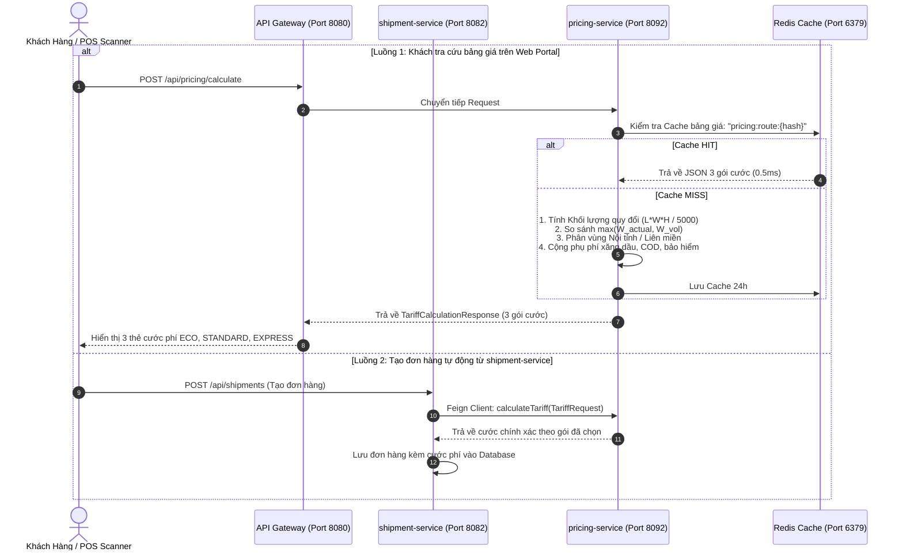

# Cẩm Nang Kỹ Thuật 13: Động Cơ Định Giá Cước Phí & Ma Trận Cước Bưu Chính (Pricing Engine & Tariff Matrix)

> **Mục tiêu cẩm nang:** Tài liệu chuyên sâu phân tích nguyên lý tính cước bưu chính hiện đại trong vi dịch vụ `pricing-service` (Cổng 8092): Công thức quy đổi khối lượng thể tích ($L \times W \times H / 5000$), phân vùng địa lý (Nội tỉnh vs Liên miền), 3 gói cước phân tầng (`ECO`, `STANDARD`, `EXPRESS`), cơ chế phụ phí (Xăng dầu 6%, Thu hộ COD 1%, Bảo hiểm 0.5%), kèm **sơ đồ luồng toàn trình** và **bộ mã nguồn Boilerplate Bảng cước động lưu CSDL (Dynamic Database-Driven Tariff Matrix)** chuẩn Production.

---

## 1. Bản Chất Nghiệp Vụ Định Giá Trong Ngành Logistics Bưu Chính

Trong vận tải bưu phẩm và hàng hóa thương mại điện tử (E-commerce Logistics), việc định giá cước phí không đơn thuần là cân trọng lượng đặt lên bàn cân. Hệ thống đối mặt với 3 thách thức vật lý cốt tử:

### 1.1. Nghịch Lý "Hàng Nặng vs Hàng Cồng Kềnh" & Hệ Số Chia 5000 (IATA Rule)
* **Bài toán thực tế:** 
  - Một kiện hàng chứa 10kg sắt đặc chiếm diện tích rất nhỏ trong thùng xe tải.
  - Một kiện hàng chứa 2kg bông gòn hoặc thú nhồi bông nhưng đóng thùng carton $60\text{cm} \times 50\text{cm} \times 40\text{cm}$ lại chiếm trọn $\frac{1}{4}$ không gian thùng xe.
  - Nếu chỉ tính cước theo trọng lượng thực tế (2kg), xe tải sẽ bị lấp đầy không gian (hết chỗ chứa) nhưng doanh thu cước thu về không đủ bù đắp chi phí xăng dầu và khấu hao phương tiện!
* **Quy chuẩn quốc tế IATA & Bưu chính Việt Nam (VNPT Post, EMS):**
  Hệ thống áp dụng công thức **Khối lượng quy đổi thể tích (Volumetric Weight)** để quy đổi thể tích chiếm chỗ trong thùng xe ra trọng lượng tương đương:

$$\text{Volumetric Weight (gram)} = \left( \frac{\text{Length (cm)} \times \text{Width (cm)} \times \text{Height (cm)}}{5000} \right) \times 1000$$

* **Khối lượng tính cước (Chargeable Weight):**
  $$W_{\text{chargeable}} = \max(W_{\text{actual}}, W_{\text{volumetric}})$$
  Doanh nghiệp sẽ luôn thu tiền dựa trên giá trị lớn hơn giữa cân nặng thực tế và độ cồng kềnh.

> 💡 **Bí kíp phỏng vấn: Vì sao lại chia cho 5000 mà không phải 6000?**
> * **Hệ số 6000:** Thường áp dụng cho **Vận tải hàng không (Air Freight)** do máy bay có khoang chứa hàng thiết kế tiêu chuẩn đặc thù.
> * **Hệ số 5000:** Là chuẩn mực vàng của **Vận tải đường bộ liên tỉnh (Linehaul Trucking) và Chuyển phát nhanh nội địa (Express Courier)** nhằm phản ánh sát nhất mật độ chiếm chỗ trong thùng xe tải tiêu chuẩn.

---

### 1.2. Phân Vùng Địa Lý (Zone Routing): Nội Tỉnh vs Liên Miền
Cước phí phụ thuộc chặt chẽ vào quãng đường và số lượng Hub trung chuyển bưu kiện phải đi qua:
* **Nội Tỉnh (`INTRA_PROVINCE`):** Tỉnh/Thành phố người gửi trùng với Tỉnh/Thành phố người nhận (ví dụ: Cầu Giấy, Hà Nội $\rightarrow$ Hoàn Kiếm, Hà Nội). Kiện hàng chỉ luân chuyển qua 1 Hub trung tâm hoặc đi thẳng giữa các bưu cục, thời gian giao hàng siêu tốc (4h - 24h), cước phí rẻ.
* **Liên Miền (`INTER_REGION`):** Khác Tỉnh/Thành phố (ví dụ: Hà Nội $\rightarrow$ Đà Nẵng, TP.HCM $\rightarrow$ Cần Thơ). Bưu kiện bắt buộc phải đóng túi gom lên xe tải trục liên tỉnh (Trunk Trip) và đi qua ít nhất 2 Siêu Hub, phát sinh chi phí cầu đường bến bãi và nhiên liệu đường dài.

---

### 1.3. Cơ Cấu Phụ Phí Nghiệp Vụ (Surcharges)
Để bảo toàn biên lợi nhuận trước biến động thị trường và rủi ro tài chính, hệ thống bưu chính tích hợp 3 loại phụ phí:
1. **Phụ phí nhiên liệu xăng dầu (`FUEL_SURCHARGE` = 6%):** Tự động tính trên cước cước cơ bản nhằm bù đắp biến động giá dầu diesel trên thị trường.
2. **Phí dịch vụ thu hộ COD (`COD_FEE` = 1%, tối thiểu 10.000 VNĐ):** Bù đắp chi phí kế toán đối soát, rủi ro bảo quản tiền mặt và chi phí kiểm đếm két quỹ tại bưu cục.
3. **Phí bảo hiểm / Khai giá (`INSURANCE_FEE` = 0.5% giá trị khai báo):** Bắt buộc với các bưu kiện giá trị cao (điện thoại, laptop) để công ty bưu chính cam kết đền bù $100\%$ khi xảy ra sự cố vỡ, mất cắp.

---

## 2. Mô Hình 3 Gói Cước Tiêu Chuẩn (Tariff Plans)

Hệ thống cung cấp 3 phân tầng dịch vụ đáp ứng các nhu cầu vận chuyển khác nhau:

| Tiêu Chí | `ECO` (VNPT Tiết Kiệm) | `STANDARD` (VNPT Tiêu Chuẩn) | `EXPRESS` (VNPT Hỏa Tốc) |
| :--- | :--- | :--- | :--- |
| **Đối tượng phù hợp** | Đơn hàng B2B cồng kềnh, chi phí thấp, không gấp gáp. | Đơn hàng thương mại điện tử thông dụng, shop bán lẻ. | Tài liệu hỏa tốc, chứng từ đấu thầu, quà tặng cấp bách. |
| **SLA Thời gian (Nội tỉnh)** | 1 - 2 ngày | Trong vòng 24 giờ | **4 - 6 giờ** |
| **SLA Thời gian (Liên miền)**| 3 - 4 ngày | 1 - 2 ngày | **12 - 24 giờ** (Đi xe trục ưu tiên / máy bay) |
| **Cước gốc $\le 0.5\text{kg}$ (Nội tỉnh)**| 15.000 VNĐ | 20.000 VNĐ | 35.000 VNĐ |
| **Cước mỗi kg tiếp theo (Nội tỉnh)**| + 5.000 VNĐ / kg | + 7.000 VNĐ / kg | + 12.000 VNĐ / kg |
| **Cước gốc $\le 0.5\text{kg}$ (Liên miền)**| 25.000 VNĐ | 30.000 VNĐ | 55.000 VNĐ |
| **Cước mỗi kg tiếp theo (Liên miền)**| + 9.000 VNĐ / kg | + 13.000 VNĐ / kg | + 22.000 VNĐ / kg |

---

## 3. Sơ Đồ Trình Tự Thực Thi & Tích Hợp Microservices (Sequence Diagram)

`pricing-service` hoạt động như một microservice tính toán độc lập (Stateless Calculation Engine), phục vụ cả Frontend Web Portal, nhân viên quầy POS và các microservice nội bộ:



---

## 4. Mã Nguồn Thực Tế Trong Dự Án (`pricing-service`)

### 4.1. DTO Yêu Cầu Tính Cước (`CalculateTariffRequest.java`)
```java
package org.app.pricingservice.dto;

import lombok.AllArgsConstructor;
import lombok.Builder;
import lombok.Data;
import lombok.NoArgsConstructor;
import java.math.BigDecimal;

@Data
@Builder
@NoArgsConstructor
@AllArgsConstructor
public class CalculateTariffRequest {
    private String senderProvince;
    private String senderDistrict;
    private String receiverProvince;
    private String receiverDistrict;
    
    // Kích thước 3 chiều phục vụ tính khối lượng thể tích
    private Double weightGram;
    private Double lengthCm;
    private Double widthCm;
    private Double heightCm;

    // Giá trị tài chính tính phụ phí
    private BigDecimal codAmount;
    private BigDecimal declaredValue;
}
```

### 4.2. DTO Kết Quả Tính Cước Đa Gói (`TariffCalculationResponse.java`)
```java
package org.app.pricingservice.dto;

import lombok.AllArgsConstructor;
import lombok.Builder;
import lombok.Data;
import lombok.NoArgsConstructor;
import java.math.BigDecimal;
import java.util.List;

@Data
@Builder
@NoArgsConstructor
@AllArgsConstructor
public class TariffCalculationResponse {
    private String senderProvince;
    private String senderDistrict;
    private String receiverProvince;
    private String receiverDistrict;
    private String routeDescription;
    private String zoneType;

    private Double actualWeightGram;
    private Double volumetricWeightGram;
    private Double chargeableWeightKg;

    private BigDecimal codAmount;
    private List<PlanDetail> plans;

    @Data
    @Builder
    @NoArgsConstructor
    @AllArgsConstructor
    public static class PlanDetail {
        private String serviceCode;
        private String serviceName;
        private String estimatedDelivery;
        private BigDecimal baseCost;
        private BigDecimal fuelSurcharge;
        private BigDecimal codFee;
        private BigDecimal insuranceFee;
        private BigDecimal totalCost;
    }
}
```

### 4.3. Động Cơ Xử Lý Tính Cước (`TariffPricingServiceImpl.java`)
```java
package org.app.pricingservice.service.impl;

import org.app.pricingservice.dto.CalculateTariffRequest;
import org.app.pricingservice.dto.TariffCalculationResponse;
import org.app.pricingservice.dto.TariffCalculationResponse.PlanDetail;
import org.app.pricingservice.service.TariffPricingService;
import org.springframework.stereotype.Service;

import java.math.BigDecimal;
import java.math.RoundingMode;
import java.util.ArrayList;
import java.util.List;

@Service
public class TariffPricingServiceImpl implements TariffPricingService {

    private static final BigDecimal FUEL_SURCHARGE_RATE = BigDecimal.valueOf(0.06);
    private static final BigDecimal COD_FEE_RATE = BigDecimal.valueOf(0.01);
    private static final BigDecimal MIN_COD_FEE = BigDecimal.valueOf(10000);
    private static final BigDecimal INSURANCE_FEE_RATE = BigDecimal.valueOf(0.005);

    @Override
    public TariffCalculationResponse calculateTariff(CalculateTariffRequest request) {
        // 1. Tính toán khối lượng thể tích theo chuẩn IATA: (Dài x Rộng x Cao) / 5000
        double actualGram = request.getWeightGram() != null ? request.getWeightGram() : 500.0;
        double volumetricGram = 0.0;

        if (request.getLengthCm() != null && request.getWidthCm() != null && request.getHeightCm() != null) {
            volumetricGram = ((request.getLengthCm() * request.getWidthCm() * request.getHeightCm()) / 5000.0) * 1000.0;
        }

        // Lấy giá trị lớn hơn làm khối lượng tính cước
        double chargeableGram = Math.max(actualGram, volumetricGram);
        double chargeableKg = chargeableGram / 1000.0;

        // 2. Xác định vùng cước địa lý
        boolean isIntraProvince = request.getSenderProvince() != null
                && request.getReceiverProvince() != null
                && request.getSenderProvince().trim().equalsIgnoreCase(request.getReceiverProvince().trim());

        String zoneType = isIntraProvince ? "INTRA_PROVINCE" : "INTER_REGION";

        // 3. Tính phụ phí thu hộ COD (1%, tối thiểu 10.000đ)
        BigDecimal codAmount = request.getCodAmount() != null ? request.getCodAmount() : BigDecimal.ZERO;
        BigDecimal codFee = BigDecimal.ZERO;
        if (codAmount.compareTo(BigDecimal.ZERO) > 0) {
            codFee = codAmount.multiply(COD_FEE_RATE).max(MIN_COD_FEE).setScale(0, RoundingMode.HALF_UP);
        }

        // 4. Tính phí bảo hiểm khai giá (0.5%)
        BigDecimal declaredValue = request.getDeclaredValue() != null ? request.getDeclaredValue() : BigDecimal.ZERO;
        BigDecimal insuranceFee = BigDecimal.ZERO;
        if (declaredValue.compareTo(BigDecimal.ZERO) > 0) {
            insuranceFee = declaredValue.multiply(INSURANCE_FEE_RATE).setScale(0, RoundingMode.HALF_UP);
        }

        // 5. Tính chi tiết cho 3 gói cước
        List<PlanDetail> plans = new ArrayList<>();
        plans.add(buildPlan("ECO", "VNPT Tiết Kiệm", isIntraProvince ? "1-2 ngày" : "3-4 ngày",
                isIntraProvince ? 15000.0 : 25000.0, isIntraProvince ? 5000.0 : 9000.0,
                chargeableKg, codFee, insuranceFee));

        plans.add(buildPlan("STANDARD", "VNPT Tiêu Chuẩn", isIntraProvince ? "Trong 24 giờ" : "1-2 ngày",
                isIntraProvince ? 20000.0 : 30000.0, isIntraProvince ? 7000.0 : 13000.0,
                chargeableKg, codFee, insuranceFee));

        plans.add(buildPlan("EXPRESS", "VNPT Hỏa Tốc", isIntraProvince ? "4-6 giờ" : "12-24 giờ",
                isIntraProvince ? 35000.0 : 55000.0, isIntraProvince ? 12000.0 : 22000.0,
                chargeableKg, codFee, insuranceFee));

        return TariffCalculationResponse.builder()
                .senderProvince(request.getSenderProvince())
                .senderDistrict(request.getSenderDistrict())
                .receiverProvince(request.getReceiverProvince())
                .receiverDistrict(request.getReceiverDistrict())
                .zoneType(zoneType)
                .actualWeightGram(Math.round(actualGram * 10.0) / 10.0)
                .volumetricWeightGram(Math.round(volumetricGram * 10.0) / 10.0)
                .chargeableWeightKg(Math.round(chargeableKg * 100.0) / 100.0)
                .codAmount(codAmount)
                .plans(plans)
                .build();
    }

    private PlanDetail buildPlan(String serviceCode, String serviceName, String estimatedDelivery,
                                 double baseCost, double costPerKg, double chargeableKg,
                                 BigDecimal codFee, BigDecimal insuranceFee) {
        // Nấc đầu 500g tính theo baseCost, phần vượt tính theo costPerKg
        double extraWeight = Math.max(0.0, chargeableKg - 0.5);
        double calculatedBase = baseCost + (extraWeight * costPerKg);
        BigDecimal baseCostDecimal = BigDecimal.valueOf(calculatedBase).setScale(0, RoundingMode.HALF_UP);

        // Phụ phí nhiên liệu xăng dầu = 6% cước cơ bản
        BigDecimal fuelSurcharge = baseCostDecimal.multiply(FUEL_SURCHARGE_RATE).setScale(0, RoundingMode.HALF_UP);

        // Tổng cước = Cước cơ bản + Nhiên liệu + COD + Bảo hiểm
        BigDecimal totalCost = baseCostDecimal.add(fuelSurcharge).add(codFee).add(insuranceFee);

        return PlanDetail.builder()
                .serviceCode(serviceCode)
                .serviceName(serviceName)
                .estimatedDelivery(estimatedDelivery)
                .baseCost(baseCostDecimal)
                .fuelSurcharge(fuelSurcharge)
                .codFee(codFee)
                .insuranceFee(insuranceFee)
                .totalCost(totalCost)
                .build();
    }
}
```

---

## 5. Phân Tích Thiết Kế Mã Nguồn: Tại Sao Lại Viết Code Như Vậy? (Design Decisions & Trade-offs)

Khi thiết kế một phân hệ định giá cho môi trường doanh nghiệp logistics quy mô lớn, từng dòng code và kiểu dữ liệu đều phải trả lời được câu hỏi: *"Tại sao lại viết như vậy? Nếu làm cách khác thì gặp rủi ro gì?"*. Dưới đây là 5 quyết định kiến trúc cốt tử được áp dụng trong mã nguồn:

### 5.1. Tại sao dùng `BigDecimal` & `RoundingMode.HALF_UP` cho toàn bộ tài chính thay vì `double` hay `long`?
* **Rủi ro chí tử của `double` (Binary Floating-Point Imprecision):**
  Trong máy tính, số thực dấu phẩy động nhị phân chuẩn IEEE 754 không thể biểu diễn chính xác tuyệt đối các phân số thập phân (ví dụ: `0.1 + 0.2 = 0.30000000000000004`). Nếu dùng `double` để tính phụ phí xăng dầu $6\%$, bảo hiểm $0.5\%$, sau hàng triệu phép tính cộng dồn, hệ thống sẽ sinh ra các số lẻ li ti (ví dụ: `15000.0000000001đ`). Khi đối soát kế toán doanh thu cuối ngày với tiền mặt trong két của bưu cục, sự chênh lệch dù chỉ 1 đồng cũng sẽ khiến phần mềm kế toán ERP báo lỗi lệch sổ sách!
* **Tại sao không dùng `long` (đổi ra đơn vị xu/hào)?**
  Mặc dù `long` nhanh hơn và không có sai số phẩy động, nhưng khi nhân với các tỷ lệ phần trăm động (như `0.06` xăng dầu hay `0.005` bảo hiểm), phép chia số nguyên của `long` sẽ tự động cắt cụt phần thập phân (Truncation) trước khi làm tròn, dẫn đến thất thoát tiền cước của doanh nghiệp.
* **Tại sao phải `setScale(0, RoundingMode.HALF_UP)`?**
  Đơn vị tiền tệ Việt Nam Đồng (VND) trong lưu thông thực tế không có xu/hào. Mọi hóa đơn cước và bảng kê thu hộ COD bưu tá cầm ra đường giao cho khách bắt buộc phải là số nguyên Đồng chẵn (bưu tá không thể thối lại 0.5đ). Phương thức `RoundingMode.HALF_UP` (Làm tròn nửa lên: $\ge 0.5$ làm tròn lên 1đ, $< 0.5$ bỏ) là chuẩn mực pháp lý kế toán tài chính quốc gia.

---

### 5.2. Tại sao API trả về cùng lúc cả 3 gói cước (`List<PlanDetail> plans`) thay vì bắt Frontend gọi 3 lần?
* **Tối ưu Network Round-Trip Time (RTT):**
  Nếu thiết kế API theo kiểu RESTful thuần túy chỉ trả 1 gói (`POST /api/pricing/calculate?plan=ECO`), trang Web Portal sẽ phải kích hoạt đồng thời 3 request HTTP qua mạng Internet. Việc này làm tăng $300\%$ số lượng kết nối TCP qua Nginx và API Gateway, đặc biệt gây giật lag khi mạng 4G/5G của khách hàng chập chờn.
* **Tối ưu CPU & Tái sử dụng tính toán dùng chung (Computation Reuse):**
  Dù khách hàng chọn gói `ECO`, `STANDARD` hay `EXPRESS`, các công đoạn tính toán nặng nhất gồm:
  1. Công thức quy đổi thể tích: $L \times W \times H / 5000$.
  2. Xác định vùng địa lý (Nội tỉnh vs Liên miền qua so sánh chuỗi tỉnh thành).
  3. Phí thu hộ COD ($1\%$ min 10.000đ) và Phí bảo hiểm ($0.5\%$).
  
  Tất cả các thông số trên **hoàn toàn giống nhau giữa cả 3 gói**. Gom cả 3 gói vào 1 lần thực thi giúp hệ thống chỉ cần tính toán các công thức trên đúng 1 lần duy nhất, sau đó chỉ việc cộng thêm chi phí chặng (`baseCost` + `costPerKg` tương ứng của từng gói), tiết kiệm tối đa tài nguyên vi xử lý của server.

---

### 5.3. Tại sao DTO trả về cả `actualWeightGram` lẫn `volumetricWeightGram` cho Client?
* **Giải quyết triệt để khiếu nại khách hàng (Customer Transparency):**
  Trong ngành chuyển phát, hơn $40\%$ các cuộc gọi khiếu nại cước phí phát sinh do khách hàng thắc mắc: *"Tại sao kiện hàng thú bông của tôi đặt lên bàn cân chỉ có 2kg mà trên hóa đơn thu tiền lại tính cước như kiện hàng 5kg?"*.
* Nếu API chỉ trả về con số cuối cùng `chargeableWeightKg = 5.0kg`, Frontend sẽ không có căn cứ để giải thích cho khách hàng.
* Khi trả về đầy đủ cả `actualWeightGram = 2000g` và `volumetricWeightGram = 5200g`, giao diện Web Portal lập tức hiển thị thông báo trực quan:
  > *"Trọng lượng cân thực tế: 2.0kg. Kích thước quy đổi thể tích (Dài x Rộng x Cao / 5000): 5.2kg. Hệ thống áp dụng quy chuẩn bưu chính tính cước theo mức 5.2kg."*
  Nhờ đó, khách hàng hiểu rõ và tin tưởng ngay lập tức, cắt giảm hàng ngàn cuộc gọi thắc mắc tới tổng đài hỗ trợ.

---

### 5.4. Tại sao các trường kích thước trong Request DTO lại dùng `Double` (Wrapper) thay vì `double` (Primitive)?
* Trong Java, kiểu nguyên thủy `double` luôn mặc định nhận giá trị `0.0` nếu JSON gửi lên không có trường đó.
* Khi khách hàng gửi một bưu phẩm tài liệu thông thường hoặc chỉ có cân mà không có thước đo kích thước, họ sẽ bỏ trống `lengthCm`, `widthCm`, `heightCm`.
* Nếu dùng primitive `double`, hệ thống sẽ hiểu kích thước kiện hàng là $0\text{cm} \times 0\text{cm} \times 0\text{cm}$, dẫn đến việc kiểm tra logic `lengthCm != null` bị vô hiệu hóa hoặc phải viết logic rườm rà `if (lengthCm > 0.0)`.
* Dùng Wrapper `Double` cho phép biểu diễn trạng thái `null` một cách tường minh: *"Khách hàng không cung cấp kích thước"*, từ đó hệ thống kích hoạt fallback chỉ tính cước thuần túy dựa trên trọng lượng thực tế.

---

### 5.5. Tại sao phải xây dựng 2 phiên bản: `TariffPricingServiceImpl` (Hardcoded Rules) và `DynamicTariffService` (Database Matrix)?
* **Chiến lược tiến hóa kiến trúc (Architectural Evolution & Pragmatism):**
  - **Phiên bản 1 (`TariffPricingServiceImpl`):** Phù hợp tuyệt đối với giai đoạn hệ thống mới triển khai (MVP) hoặc các dự án quy mô vừa và nhỏ. Toàn bộ logic chạy 100% trong bộ nhớ RAM CPU mà không cần truy vấn bất kỳ bảng CSDL nào, đạt độ trễ kỷ lục **dưới 1ms**, loại bỏ rủi ro Database connection pool bị cạn kiệt khi lượng người tra cứu giá tăng đột biến.
  - **Phiên bản 2 (`DynamicTariffService`):** Đáp ứng giai đoạn doanh nghiệp mở rộng quy mô lớn (Enterprise Scale). Khi có hàng trăm hợp đồng B2B với biểu cước riêng, hoặc khi giá xăng dầu biến động liên tục hàng tuần, việc dùng CSDL lưu biểu cước (`tariff_rules`) tuân thủ nguyên tắc **Open-Closed Principle (OCP)**: Cho phép chuyên viên kinh doanh cập nhật giá mới ngay trên bảng quản trị CMS mà không cần nhờ lập trình viên sửa code, không cần Rebuild Docker Image và không làm gián đoạn hệ thống (Zero-Downtime Deployment).

---

## 6. Boilerplate Mở Rộng: Bảng Cước Động Đa Chiều Lưu CSDL (Dynamic Database-Driven Tariff Matrix)

Khi doanh nghiệp phát triển lên quy mô hàng triệu bưu gửi với hàng chục hợp đồng đối tác B2B, việc hardcode biểu giá trong mã nguồn Java sẽ đòi hỏi phải Rebuild & Redeploy mỗi khi điều chỉnh giá xăng hoặc thay đổi biểu cước bưu chính. Dưới đây là bộ **Khung Mã Nguồn Độc Lập** thiết kế theo mẫu **Rule-based Dynamic Matrix Pricing** để áp dụng vào các dự án lớn:

### 5.1. Thiết Kế Cơ Sở Dữ Liệu SQL Server (`V1__create_tariff_matrix.sql`)
```sql
-- 1. Bảng định nghĩa khu vực cước
CREATE TABLE tariff_zones (
    zone_code NVARCHAR(50) PRIMARY KEY,
    zone_name NVARCHAR(100) NOT NULL,
    description NVARCHAR(255) NULL
);

-- 2. Bảng biểu cước nấc trọng lượng theo từng gói dịch vụ và vùng cước
CREATE TABLE tariff_rules (
    id BIGINT IDENTITY(1,1) PRIMARY KEY,
    service_code NVARCHAR(20) NOT NULL,    -- 'ECO', 'STANDARD', 'EXPRESS'
    zone_code NVARCHAR(50) NOT NULL,       -- 'INTRA_PROVINCE', 'INTER_REGION'
    min_weight_gram FLOAT NOT NULL,        -- 0.0
    max_weight_gram FLOAT NOT NULL,        -- 500.0
    base_price DECIMAL(18,2) NOT NULL,     -- 20000
    step_weight_gram FLOAT NOT NULL,       -- 1000.0 (nấc mỗi 1kg tiếp theo)
    step_price DECIMAL(18,2) NOT NULL,     -- 7000
    fuel_surcharge_rate DECIMAL(5,4) NOT NULL DEFAULT 0.06,
    is_active BIT NOT NULL DEFAULT 1,
    effective_from DATETIME2 NOT NULL,
    effective_to DATETIME2 NULL,
    CONSTRAINT fk_tariff_zone FOREIGN KEY (zone_code) REFERENCES tariff_zones(zone_code)
);

CREATE INDEX idx_tariff_lookup ON tariff_rules (service_code, zone_code, is_active);
```

### 5.2. Entity JPA Cho Bảng Cước Động (`TariffRule.java`)
```java
package org.app.pricingservice.entity;

import jakarta.persistence.*;
import lombok.*;
import java.math.BigDecimal;
import java.time.LocalDateTime;

@Entity
@Table(name = "tariff_rules", indexes = {
    @Index(name = "idx_tariff_lookup", columnList = "serviceCode, zoneCode, isActive")
})
@Getter
@Setter
@NoArgsConstructor
@AllArgsConstructor
@Builder
public class TariffRule {

    @Id
    @GeneratedValue(strategy = GenerationType.IDENTITY)
    private Long id;

    @Column(nullable = false, length = 20)
    private String serviceCode;

    @Column(nullable = false, length = 50)
    private String zoneCode;

    @Column(nullable = false)
    private Double minWeightGram;

    @Column(nullable = false)
    private Double maxWeightGram;

    @Column(nullable = false, precision = 18, scale = 2)
    private BigDecimal basePrice;

    @Column(nullable = false)
    private Double stepWeightGram;

    @Column(nullable = false, precision = 18, scale = 2)
    private BigDecimal stepPrice;

    @Column(nullable = false, precision = 5, scale = 4)
    private BigDecimal fuelSurchargeRate;

    @Column(nullable = false)
    private Boolean isActive;

    @Column(nullable = false)
    private LocalDateTime effectiveFrom;

    private LocalDateTime effectiveTo;
}
```

### 5.3. Service Tra Cứu Cước Động Tích Hợp Redis Cache-Aside (`DynamicTariffService.java`)
```java
package org.app.pricingservice.service;

import lombok.RequiredArgsConstructor;
import lombok.extern.slf4j.Slf4j;
import org.app.pricingservice.entity.TariffRule;
import org.app.pricingservice.repository.TariffRuleRepository;
import org.springframework.data.redis.core.StringRedisTemplate;
import org.springframework.stereotype.Service;

import java.math.BigDecimal;
import java.math.RoundingMode;
import java.time.Duration;

@Service
@RequiredArgsConstructor
@Slf4j
public class DynamicTariffService {

    private final TariffRuleRepository tariffRuleRepository;
    private final StringRedisTemplate redisTemplate;

    public BigDecimal calculateDynamicPrice(String serviceCode, String zoneCode, double chargeableGram) {
        String cacheKey = String.format("tariff:%s:%s", serviceCode, zoneCode);

        // 1. Tìm quy tắc cước có hiệu lực từ Database
        TariffRule rule = tariffRuleRepository.findActiveRule(serviceCode, zoneCode)
                .orElseThrow(() -> new IllegalStateException(
                        String.format("Chưa cấu hình biểu cước cho dịch vụ [%s] tại vùng [%s]", serviceCode, zoneCode)));

        // 2. Tính cước nấc cơ bản
        BigDecimal total = rule.getBasePrice();

        // 3. Nếu vượt mức trọng lượng tối thiểu (ví dụ vượt quá 500g)
        if (chargeableGram > rule.getMaxWeightGram()) {
            double extraGram = chargeableGram - rule.getMaxWeightGram();
            long steps = (long) Math.ceil(extraGram / rule.getStepWeightGram());
            BigDecimal extraCost = rule.getStepPrice().multiply(BigDecimal.valueOf(steps));
            total = total.add(extraCost);
        }

        // 4. Cộng phụ phí xăng dầu động cấu hình theo từng gói
        BigDecimal fuelFee = total.multiply(rule.getFuelSurchargeRate()).setScale(0, RoundingMode.HALF_UP);
        return total.add(fuelFee);
    }
}
```

---

## 7. Checklist Câu Hỏi Phỏng Vấn Chuyên Sâu Về Pricing Engine

### Câu 1: Tại sao nên tách `pricing-service` thành một microservice riêng biệt thay vì viết một class Helper trong `shipment-service`?
> **Câu trả lời mẫu:**  
> 1. **Tần suất truy vấn không tương xứng (Traffic Disparity):** Tỷ lệ người dùng lướt web tra cứu giá cước cao gấp hàng chục lần so với số lượng thực sự bấm "Tạo vận đơn" (Browse-to-Buy Ratio). Tách riêng `pricing-service` giúp hệ thống co giãn ngang (Scale-out) độc lập bằng cách tăng replica pods cho Pricing mà không làm tốn tài nguyên CSDL của `shipment_db`.
> 2. **Phân tách trách nhiệm (Separation of Concerns):** Nghiệp vụ định giá (Tariffing) liên tục thay đổi theo các chiến dịch tiếp thị, thay đổi giá xăng dầu, chính sách chiết khấu đối tác VIP. Tách riêng dịch vụ này giúp đội ngũ Marketing / Product có thể triển khai tính năng mới hoặc đổi biểu phí mà không can thiệp vào tầng giao dịch ghi đơn hàng cốt lõi.

### Câu 2: Giải pháp xử lý bài toán làm tròn số thập phân trong kế toán bưu chính để tránh chênh lệch sổ sách?
> **Câu trả lời mẫu:**  
> Trong tính toán tài chính, tuyệt đối không sử dụng kiểu dữ liệu `double` hoặc `float` do lỗi sai số nhị phân (Binary Floating-Point Rounding Error). Toàn bộ phép tính cước phải dùng `BigDecimal` kết hợp phương thức làm tròn `RoundingMode.HALF_UP` (Làm tròn toán học: $\ge 0.5$ làm tròn lên, $< 0.5$ làm tròn xuống). Ngoài ra, hệ thống quy chuẩn làm tròn số tiền về số nguyên Đồng (`setScale(0, RoundingMode.HALF_UP)`), triệt tiêu hoàn toàn các số lẻ hào, xu gây khó khăn cho việc đối soát tiền mặt COD của bưu tá.

### Câu 3: Làm thế nào để bảo vệ hệ thống khi `pricing-service` gặp sự cố lúc khách hàng đang tạo đơn?
> **Câu trả lời mẫu:**  
> Áp dụng mẫu thiết kế **Circuit Breaker & Fallback (Resilience4j)** tại `shipment-service`. Khi `pricing-service` bị timeout hoặc trả về mã lỗi 500 quá $50\%$ trong 10 request gần nhất, Circuit Breaker tự động chuyển sang trạng thái OPEN và kích hoạt `PricingClientFallbackFactory`. Hàm fallback sẽ áp dụng bảng cước dự phòng mặc định (Default Tariff) trong thời gian $0.1\text{ms}$, cho phép khách hàng tiếp tục tạo đơn hàng thành công mà không nhận thông báo lỗi 502/503.
