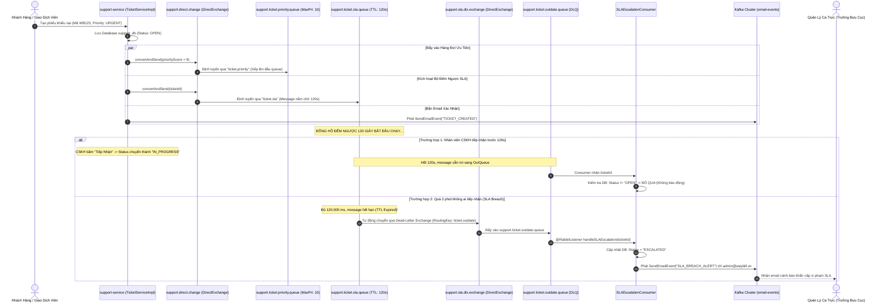

# Cẩm Nang Kỹ Thuật 15: Kiến Trúc Hàng Đợi Ưu Tiên RabbitMQ, Cơ Chế Đếm Ngược SLA Bằng Dead-Letter Exchange & Mô Hình Polyglot Messaging Trong Logistics

> **Mục tiêu cẩm nang:** Cung cấp tài liệu kỹ thuật toàn diện về giải pháp tích hợp **RabbitMQ** trong vi dịch vụ `support-service` (Cổng 8093): Phân tích mô hình kiến trúc **Polyglot Messaging (RabbitMQ + Kafka + OpenFeign)**, kỹ thuật phân tầng độ ưu tiên **Priority Queuing (Max Priority 10)**, cơ chế đếm lùi thời gian cam kết dịch vụ **SLA Countdown Timer bằng Message TTL (120s) kết hợp Dead-Letter Exchange (DLX)** mà không cần quét CSDL định kỳ, luồng xử lý khiếu nại đơn hàng đang vận chuyển (`IN_TRANSIT`), cùng **Bộ Mã Nguồn Boilerplate Độc Lập** và checklist câu hỏi phỏng vấn chuyên sâu cho kỹ sư backend phân tán.

---

## 1. Đặt Vấn Đề & Bối Cảnh Nghiệp Vụ Bưu Chính Thực Tế

Trong vận hành chuỗi cung ứng và bưu chính chuyển phát nhanh quy mô quốc gia (VNPT Post, EMS, Viettel Post):
* **Hàng ngàn sự cố phát sinh mỗi ngày:** Thùng hàng rách móp (`DAMAGED_GOODS`), thất lạc bưu phẩm giữa các Hub (`LOST_GOODS`), giao trễ cam kết (`LATE_DELIVERY`), hoặc người gửi cần hủy đơn khẩn cấp thu hồi bưu kiện (`CANCEL_REQUEST`).
* **Sự chênh lệch về mức độ nghiêm trọng:** Một khiếu nại về bưu phẩm chứa tài liệu pháp lý quan trọng hoặc đồ giá trị cao bị thất lạc đòi hỏi phải được tiếp nhận trong vòng **vài phút**; trong khi thắc mắc tra cứu địa chỉ thông thường có thể chờ hàng giờ.
* **Cam kết chất lượng dịch vụ (Service Level Agreement - SLA):** Doanh nghiệp bưu chính cam kết với khách hàng: *Mọi yêu cầu khiếu nại khẩn cấp phải có chuyên viên CSKH tiếp nhận thụ lý trong vòng tối đa 2 phút (120 giây)*. Nếu quá thời hạn này mà chưa ai tiếp nhận, hệ thống phải tự động kích hoạt cảnh báo vi phạm SLA lên cấp Trưởng bưu cục / Quản lý ca trực (`ESCALATED`).

### 1.1. Điểm Yếu Chết Người Của Giải Pháp Truyền Thống: Database Polling Cronjob
Nhiều hệ thống ban đầu giải quyết bài toán đếm lùi SLA bằng cách viết một Scheduler (Spring `@Scheduled` hoặc Quartz) chạy mỗi 10 giây:
```sql
-- TRUY VẤN NẶNG GÂY NGHẼN CƠ SỞ DỮ LIỆU
SELECT * FROM support_tickets 
WHERE status = 'OPEN' 
  AND created_at < DATEADD(second, -120, GETDATE());
```
**Hậu quả khi quy mô tăng cao (Scale-up Failure):**
1. **Quá tải I/O CSDL (Database Thrashing):** Câu lệnh quét liên tục bảng `support_tickets` gây khóa bảng (Table Lock/Index Lock), làm chậm các giao dịch ghi phiếu mới của khách hàng.
2. **Độ trễ không chính xác (Polling Lag):** Nếu cronjob chạy mỗi 30 giây một lần, thời điểm phát hiện vi phạm SLA có thể bị trễ tới 30 giây so với thực tế.
3. **Lãng phí tài nguyên CPU/RAM:** $99\%$ số lần quét CSDL trả về kết quả rỗng nếu không có vé nào hết hạn.

### 1.2. Giải Pháp Hiện Đại: Sự Kết Hợp RabbitMQ TTL + Dead-Letter Exchange
Thay vì chủ động đi "hỏi" CSDL liên tục, hệ thống biến message thành một chiếc **đồng hồ hẹn giờ tự nổ (Timer-Bomb)**:
* Khi tạo ticket, gửi một message mang ID vé vào hàng đợi tạm với **TTL = 120.000 ms (2 phút)** và cấu hình **Dead-Letter Exchange (DLX)**.
* Trong 120 giây đó, không có bất kỳ dòng code nào phải chạy, CSDL hoàn toàn nghỉ ngơi (Zero CPU/IO Overhead).
* Đúng 120 giây sau, RabbitMQ tự động đào thải (expire) message và đẩy qua DLX sang hàng đợi `support.ticket.outdate.queue`.
* Consumer thức dậy ngay lập tức, chuyển trạng thái vé sang `ESCALATED` và phát cảnh báo với độ trễ dưới **$5\text{ms}$**!

---

## 2. Mô Hình Polyglot Messaging: Phân Định Ranh Giới RabbitMQ vs Kafka vs OpenFeign

Một trong những quyết định thiết kế tinh tế nhất trong dự án là không "thần thánh hóa" một công cụ duy nhất, mà áp dụng mô hình **Polyglot Messaging (Đa giao thức nhắn tin)** theo nguyên tắc *"Đúng việc, đúng công cụ"*:

```
┌─────────────────────────────────────────────────────────────────────────────┐
│                          MINI WAYBILL PLATFORM                              │
│                                                                             │
│   ┌─────────────────────┐        OpenFeign (Sync REST)       ┌───────────┐  │
│   │   support-service   ├───────────────────────────────────►│ shipment- │  │
│   │                     │    (POST /api/shipments/cancel)    │  service  │  │
│   └──────────┬──────────┘                                    └─────┬─────┘  │
│              │                                                     │        │
│    RabbitMQ  │ (Internal Queuing)                        Kafka     │        │
│   (AMQP 0-9-1)│ • Priority Queue (1-10)               Event Backbone│        │
│              │ • SLA 120s TTL + DLX                                │        │
│              ▼                                                     ▼        │
│   ┌─────────────────────┐                            ┌───────────────────┐  │
│   │  mini-waybill-      │                            │  Apache Kafka     │  │
│   │  rabbitmq (5672)    │                            │  3-Broker Cluster │  │
│   └─────────────────────┘                            │  (Port 9092)      │  │
│                                                      └─────────┬─────────┘  │
│                                                                │            │
│                                                  ┌─────────────┴────────┐   │
│                                                  ▼                      ▼   │
│                                        ┌───────────────────┐ ┌────────────┐ │
│                                        │notification-      │ │tracking-   │ │
│                                        │service (Email)    │ │service     │ │
│                                        └───────────────────┘ └────────────┘ │
└─────────────────────────────────────────────────────────────────────────────┘
```

### So Sánh 3 Trụ Cột Giao Tiếp Trong Hệ Thống:

| Tiêu Chí | RabbitMQ (AMQP 0-9-1) | Apache Kafka (Event Streaming) | OpenFeign (HTTP REST) |
| :--- | :--- | :--- | :--- |
| **Phạm vi sử dụng** | **Nội bộ `support-service`** | **Xương sống toàn hệ thống (Backbone)** | **Giao tiếp chéo dịch vụ tức thời** |
| **Bản chất mô hình** | **Smart Broker, Dumb Consumer** (Broker quản lý hàng đợi, định tuyến, xóa tin khi đã đọc) | **Dumb Broker, Smart Consumer** (Log lưu trữ tuần tự bất biến, Consumer tự giữ Offset) | **Direct RPC / Point-to-Point** (Đồng bộ Blocking qua mạng) |
| **Tính năng Priority** | **Hỗ trợ bản địa cực mạnh (`x-max-priority`)**: Tự động chèn tin ưu tiên cao lên đầu hàng đợi. | Không hỗ trợ bản địa (phải chia nhiều topic riêng biệt: `urgent-topic`, `normal-topic`). | Không áp dụng. |
| **Tính năng Đếm lùi (Timer/TTL)** | **Hỗ trợ hoàn hảo qua Message TTL + DLX**: Tin nhắn tự chết sau $N$ giây và chuyển vào DLQ. | Rất khó thực hiện (Kafka chỉ lưu log theo thời gian retention toàn partition). | Không áp dụng. |
| **Lưu trữ & Phát lại (Replay)** | Xóa ngay sau khi Ack. Không phù hợp làm Event Sourcing. | Lưu trữ lâu dài theo ngày/tháng. Hỗ trợ Replay lại toàn bộ luồng sự kiện từ đầu. | Không lưu trữ. |
| **Độ trễ (Latency)** | Cực thấp ($\approx 1 - 2\text{ms}$) cho các tác vụ hàng đợi phức tạp. | Thông lượng cực cao (hàng trăm ngàn msg/giây), tối ưu cho batching. | Phụ thuộc vào mạng và thời gian xử lý của Service đích. |


---

## 3. Lý Thuyết Nền Tảng Chuyên Sâu Về RabbitMQ & Chuẩn Giao Thức AMQP 0-9-1

Để làm chủ RabbitMQ ở cấp độ kỹ sư thiết kế hệ thống (System Architect), lập trình viên cần hiểu sâu sắc mô hình phân lớp của chuẩn **AMQP 0-9-1 (Advanced Message Queuing Protocol)** và các cơ chế nội tại của Erlang/OTP Engine.

### 3.1. Các Khái Niệm Thực Thể Cốt Lõi Trong AMQP 0-9-1

1. **Broker (Message Broker):**  
   Máy chủ RabbitMQ đóng vai trò trung tâm lưu trữ, định tuyến và phân phối tin nhắn giữa các ứng dụng sản xuất (Producer) và ứng dụng tiêu thụ (Consumer).
2. **Connection (Kết Nối TCP):**  
   Kết nối mạng TCP/IP thực tế giữa Client và RabbitMQ Broker. Quá trình bắt tay TCP (3-way Handshake), đàm phán bảo mật TLS/SSL và xác thực tài khoản rất đắt đỏ về tài nguyên CPU và thời gian ($50 - 200\text{ms}$).
3. **Channel (Kênh Logic Ảo - Multiplexing):**  
   Đây là điểm sáng tạo kiến trúc vượt trội của AMQP: Nhiều Channel logic được ghép kênh (Multiplexed) chạy song song trên **cùng một kết nối TCP duy nhất**.  
   * Mỗi luồng (Thread) trong Spring Boot mở một Channel riêng để gửi/nhận tin nhắn mà không làm tắc nghẽn luồng khác.  
   * Tránh lãng phí socket descriptor của hệ điều hành, cho phép một Microservice duy trì hàng ngàn kênh giao tiếp đồng thời chỉ với 1 TCP connection.
4. **Virtual Host (vhost):**  
   Cơ chế phân vùng logic độc lập tương tự như Database trong hệ quản trị CSDL SQL Server hoặc Namespace trong Kubernetes. Mỗi vhost sở hữu không gian tên riêng biệt cho Exchange, Queue, Binding và danh sách phân quyền người dùng (User Permissions), giúp nhiều dự án hoặc môi trường (Dev, Staging, Prod) chia sẻ chung một cụm RabbitMQ Cluster an toàn.
5. **Exchange (Bộ Định Tuyến Tin Nhắn):**  
   Producer **tuyệt đối không bao giờ gửi tin nhắn trực tiếp vào Queue**. Producer chỉ gửi tin nhắn tới Exchange. Exchange tiếp nhận tin nhắn, bóc tách `RoutingKey` và căn cứ vào quy tắc liên kết (`Binding`) để quyết định sao chép tin nhắn vào những hàng đợi nào.
6. **Queue (Hàng Đợi Lưu Trữ):**  
   Cấu trúc dữ liệu dạng đệm (Buffer) lưu trữ các tin nhắn theo thứ tự tuần tự trong bộ nhớ RAM hoặc bền vững trên đĩa cứng cho đến khi Consumer lấy đi và gửi xác nhận tiêu thụ thành công (`Ack`).
7. **Binding (Cầu Nối Liên Kết):**  
   Mối quan hệ kết nối giữa Exchange và Queue, đi kèm một quy tắc lọc gọi là `BindingKey`.

---

### 3.2. Cấu Trúc Bản Tin AMQP (Message Anatomy)

Một bản tin RabbitMQ không chỉ là một chuỗi văn bản thô, mà được đóng gói chuẩn mực thành 3 thành phần:

```
┌────────────────────────────────────────────────────────────────────────┐
│                        RABBITMQ MESSAGE ANATOMY                        │
├────────────────────────────────────────────────────────────────────────┤
│ 1. PAYLOAD (Message Body):                                             │
│    Mảng byte nhị phân (byte[]) chứa nội dung nghiệp vụ thực tế         │
│    (thường là chuỗi JSON serialize từ DTO Java).                       │
├────────────────────────────────────────────────────────────────────────┤
│ 2. BASIC PROPERTIES (Thuộc tính giao thức AMQP chuẩn hóa):             │
│    • delivery_mode: 1 (Non-persistent, chỉ lưu RAM), 2 (Persistent)    │
│    • priority: Điểm ưu tiên của tin nhắn (0 - 255, khuyến nghị 0 - 10) │
│    • correlation_id: Mã định danh liên kết Request-Response (dùng RPC)  │
│    • reply_to: Tên hàng đợi riêng biệt để nhận phản hồi (dùng RPC)     │
│    • expiration: Thời gian sống của riêng tin nhắn này (TTL mili-giây) │
│    • content_type: Kiểu dữ liệu payload (ví dụ: application/json)      │
│    • message_id: UUID duy nhất chống trùng lặp tin nhắn (Idempotency)   │
│    • timestamp: Dấu thời gian khởi tạo tin nhắn                        │
├────────────────────────────────────────────────────────────────────────┤
│ 3. HEADERS (Bảng dữ liệu Key-Value tùy biến):                          │
│    Chứa các metadata mở rộng phục vụ định tuyến Headers Exchange        │
│    hoặc thông tin Dead-Letter (x-death, x-first-death-reason...).      │
└────────────────────────────────────────────────────────────────────────┘
```

---

### 3.3. Phân Loại 5 Kiểu Exchange & Thuật Toán Định Tuyến

RabbitMQ cung cấp 5 thuật toán định tuyến linh hoạt phục vụ mọi bài toán phân tán:

```
┌──────────────────┐    RoutingKey == BindingKey    ┌──────────────────┐
│ DIRECT EXCHANGE  ├───────────────────────────────►│  Target Queue A  │
└──────────────────┘                                └──────────────────┘

┌──────────────────┐    Broadcast tới 100% Queue    ┌──────────────────┐
│ FANOUT EXCHANGE  ├───────────────────────────────┬►│  Target Queue A  │
└──────────────────┘                               │ └──────────────────┘
                                                   │ ┌──────────────────┐
                                                   └►│  Target Queue B  │
                                                     └──────────────────┘

┌──────────────────┐    So khớp mẫu từ khóa Wildcard┌──────────────────┐
│  TOPIC EXCHANGE  ├───── hub.*.inbound ────────────►│  Regional Queue  │
└──────────────────┘     hub.#                      └──────────────────┘
```

#### 1. Direct Exchange (Định Tuyến Đích Danh 1:1)
* **Thuật toán:** So khớp chuỗi chính xác tuyệt đối: $\text{RoutingKey} == \text{BindingKey}$.
* **Ứng dụng:** Xử lý tác vụ có đích đến rõ ràng, ví dụ `support.direct.change` dẫn tin `ticket.priority` vào đúng hàng đợi ưu tiên.

#### 2. Fanout Exchange (Quảng Bá Toàn Mạng - Broadcast 1:N)
* **Thuật toán:** Hoàn toàn **bỏ qua RoutingKey**. Bất kỳ tin nhắn nào tới Fanout Exchange đều được sao chép nhân bản và đẩy vào $100\%$ các hàng đợi đang gắn kết với nó.
* **Ứng dụng:** Phát sóng bảng giá cước thay đổi tới toàn bộ các chi nhánh, xóa cache đồng loạt trên toàn bộ các server microservices.

#### 3. Topic Exchange (Định Tuyến Đa Hướng Theo Từ Khóa Wildcard)
* **Thuật toán:** Phân tích RoutingKey thành các từ phân tách bởi dấu chấm (ví dụ: `logistics.hub.danang.urgent`). Sử dụng 2 ký tự đại diện mạnh mẽ:
  * `*` (Star): Đại diện cho **đúng duy nhất 1 từ**.  
    *Ví dụ:* `logistics.hub.*.urgent` khớp với `logistics.hub.danang.urgent` nhưng không khớp với `logistics.hub.mien-trung.danang.urgent`.
  * `#` (Hash): Đại diện cho **0 hoặc nhiều từ liên tiếp**.  
    *Ví dụ:* `logistics.hub.#` khớp với mọi tin nhắn bắt đầu bằng `logistics.hub`.
* **Ứng dụng:** Định tuyến bưu gửi phân vùng địa lý, phân luồng sự cố theo tỉnh thành và độ khẩn cấp.

#### 4. Headers Exchange (Định Tuyến Bằng Thuộc Tính Metadata)
* **Thuật toán:** Bỏ qua RoutingKey, so khớp các cặp key-value trong bảng `headers` của tin nhắn với argument gắn trên Binding:
  * `x-match = all`: Tất cả các cặp header yêu cầu đều phải trùng khớp.
  * `x-match = any`: Chỉ cần tối thiểu 1 cặp header trùng khớp là hợp lệ.
* **Ứng dụng:** Khi tiêu chí định tuyến phức tạp vượt quá khả năng biểu diễn của một chuỗi text ngắn (ví dụ: kết hợp nhiều cờ định danh thiết bị, khu vực, phiên bản API).

#### 5. Default Exchange (Exchange Vô Danh - Nameless Exchange)
* **Thuật toán:** Là một Direct Exchange ngầm định được định nghĩa sẵn bởi RabbitMQ với tên rỗng (`""`). Mỗi khi một hàng đợi mới được tạo, RabbitMQ tự động liên kết nó vào Default Exchange với `BindingKey` chính là **tên của chính hàng đợi đó**.
* **Ứng dụng:** Gửi tin nhắn trực tiếp vào một Queue cụ thể mà không cần khai báo Binding tường minh: `rabbitTemplate.convertAndSend("queue_name", message)`.

---

### 3.4. Cơ Chế Đảm Bảo Độ Tin Cậy & Tính Bền Vững (Zero-Data-Loss Guarantees)

Để đạt chuẩn Enterprise không bao giờ mất tin nhắn (Zero Message Loss), RabbitMQ kết hợp 3 lớp bảo vệ:

```
[PRODUCER] ── Publisher Confirms (ack/nack) ──► [EXCHANGE]
                                                    │
                                            Durable / Persistent (Ghi đĩa)
                                                    │
                                                    ▼
[CONSUMER] ◄── Consumer Ack (manualAck) ─────── [QUEUE]
```

#### 1. Tính Bền Vững Đa Tầng (Durability & Persistence)
* **Durable Exchange & Queue:** Khi khai báo `QueueBuilder.durable(name).build()`, metadata định nghĩa của Exchange và Queue được ghi xuống đĩa cứng. Khi máy chủ RabbitMQ khởi động lại, các hàng đợi này sẽ tự động được phục hồi nguyên vẹn.
* **Persistent Message (Delivery Mode = 2):** Tin nhắn được lưu đệm trên RAM để đạt tốc độ cao, nhưng đồng thời được đồng bộ xuống file log trên đĩa cứng (Disk Storage). Nếu mất điện đột ngột, RabbitMQ phục hồi lại dữ liệu từ đĩa.

#### 2. Publisher Confirms (Xác Nhận Xuất Bản Phía Producer)
* Giải quyết rủi ro: Producer gửi tin nhắn qua mạng nhưng đúng lúc đó đường truyền bị đứt hoặc Exchange không tồn tại.
* Khi bật cờ `spring.rabbitmq.publisher-confirm-type=correlated`:
  * RabbitMQ sẽ gửi trả lại một tín hiệu `Ack` (kèm ID tin nhắn) khi tin nhắn đã được ghi an toàn vào các Queue bền vững.
  * Nếu không có Queue nào đón nhận hoặc đĩa cứng bị đầy, RabbitMQ gửi trả tín hiệu `Nack` để Producer kích hoạt cơ chế thử lại (Retry) hoặc lưu tạm vào Dead-Letter Database.

#### 3. Consumer Acknowledgements (Ack, Nack & Reject Phía Consumer)
* Mặc định nếu bật `autoAck = true`, RabbitMQ vừa đẩy tin qua TCP socket cho Consumer là lập tức xóa sổ tin nhắn khỏi RAM. Nếu Consumer đang xử lý nghiệp vụ mà bị crash đột ngột (OutOfMemory, đứt cáp, restart pod), tin nhắn sẽ **biến mất vĩnh viễn**!
* **Chuẩn Enterprise bắt buộc dùng Manual / Container-Managed Ack:**
  * `basic.ack(deliveryTag, multiple)`: Consumer xử lý lưu DB thành công mới gửi Ack. RabbitMQ an tâm xóa tin nhắn.
  * `basic.nack(deliveryTag, multiple, requeue)`: Khi xảy ra ngoại lệ không mong muốn:
    * `requeue = true`: Trả tin nhắn về đầu queue để thử lại sau.
    * `requeue = false`: Không thử lại mà đẩy ngay vào **Dead-Letter Exchange (DLX)** để cách ly phân tích lỗi.
  * `basic.reject(deliveryTag, requeue)`: Tương tự `nack` nhưng chỉ áp dụng cho 1 tin nhắn duy nhất (không hỗ trợ cờ gộp `multiple`).

---

### 3.5. Kiểm Soát Dòng Chảy & Điều Phối Công Bằng (Prefetch Count & QoS)

#### Vấn Nạn "Tham Lam" Của Thuật Toán Round-Robin Mặc Định
Mặc định, RabbitMQ phân phối tin nhắn theo thuật toán Round-Robin tuần tự. Khi có $1000$ tin nhắn đổ về và có 2 Consumer A và B:
* RabbitMQ sẽ "tống" ngay lập tức $500$ tin cho A và $500$ tin cho B vào bộ nhớ đệm socket TCP.
* Nếu $500$ tin của A toàn là vé xử lý nặng (tốn $10\text{s}$/tin) trong khi $500$ tin của B chỉ tốn $0.1\text{s}$/tin:
  * Consumer B làm xong trong nháy mắt và ngồi chơi xơi nước.
  * Consumer A bị ngập lụt hàng đợi, quá tải RAM và có nguy cơ bị Crash (Thắt cổ chai tài nguyên).

#### Giải Pháp: `basic.qos(prefetchCount)` (Fair Dispatch)
Bằng cách cấu hình `prefetchCount = 1` (hoặc con số tối ưu $10 - 50$):
* RabbitMQ **chỉ gửi tối đa $N$ tin nhắn chưa được Ack** cho một Consumer.
* Chừng nào Consumer chưa xử lý xong và gửi `basic.ack` về, RabbitMQ tuyệt đối không nhồi thêm tin nhắn mới, mà chuyển tiếp tin nhắn đó cho Consumer khác đang rảnh rỗi.
* **Kết quả:** Tối ưu hóa $100\%$ hiệu suất của toàn bộ cụm worker xử lý khiếu nại CSKH.

---

### 3.6. Kiến Trúc HA Hiện Đại: Quorum Queues (Raft Consensus) vs Classic Mirrored Queues

Trong các phiên bản RabbitMQ cũ (trước 3.8), tính sẵn sàng cao (High Availability) dựa vào **Classic Mirrored Queues** (sao chép Master-Slave). Tuy nhiên, cơ chế này tồn tại nhược điểm chí mạng: Khi mạng chập chờn, rất dễ xảy ra hiện tượng **Split-Brain (Phân rã não)** dẫn đến mất dữ liệu hoặc xung đột trạng thái.

* **Từ RabbitMQ 3.8+ và chuẩn hóa ở RabbitMQ 4.x:** Tính năng Mirrored Queues đã bị loại bỏ hoàn toàn và thay thế bằng **Quorum Queues**.
* **Nguyên lý Quorum Queues:**
  * Dựa trên thuật toán đồng thuận phân tán **Raft Consensus Protocol** (tương tự như etcd trong Kubernetes hay ZooKeeper/KRaft trong Kafka).
  * Một hàng đợi Quorum phân bổ trên một số lẻ các node (ví dụ 3 hoặc 5 node).
  * Một bản tin chỉ được coi là ghi thành công khi được đa số tối thiểu (Quorum: $\lfloor N/2 \rfloor + 1$) các node xác nhận ghi đĩa.
  * Tự động bầu chọn Leader mới trong vòng dưới $500\text{ms}$ nếu Leader hiện tại bị sự cố phần cứng, đảm bảo tính nhất quán dữ liệu nghiêm ngặt (Strict Linearizability).

---

### 3.7. Ma Trận So Sánh Toàn Diện: RabbitMQ vs Apache Kafka vs Redis Streams

| Đặc Tính Kỹ Thuật | RabbitMQ (AMQP 0-9-1) | Apache Kafka (Event Streaming) | Redis Streams (In-Memory Log) |
| :--- | :--- | :--- | :--- |
| **Kiến Trúc Lưu Trữ** | **Hàng đợi FIFO linh hoạt** (Tin nhắn bị xóa ngay khi Consumer gửi Ack). | **Append-Only Commit Log** (Dòng sự kiện tuần tự, lưu trữ vĩnh viễn theo thời gian retention). | **In-Memory Radix Tree Log** (Lưu log trên RAM, snapshot RDB/AOF định kỳ). |
| **Mô Hình Tiêu Thụ** | **Push-based** (Broker chủ động đẩy tin xuống Consumer theo hạn mức QoS). | **Pull-based** (Consumer chủ động kéo từng batch tin nhắn theo năng lực bản thân). | **Pull/Push linh hoạt** qua lệnh `XREADGROUP` và `XADD`. |
| **Cơ Chế Định Tuyến** | **Cực kỳ phức tạp và mạnh mẽ** (Direct, Topic Wildcard, Fanout, Headers). | **Đơn giản** (Chỉ dựa vào Topic Name và Partition Key). | **Đơn giản** (Dựa vào Stream Key). |
| **Hàng Đợi Ưu Tiên (Priority)** | **Hỗ trợ bản địa xuất sắc (`x-max-priority`)**. | **Không hỗ trợ** (Phải tách nhiều topic vật lý riêng). | **Không hỗ trợ** (Phải kết hợp Sorted Set `ZSET`). |
| **Đếm Ngược / Trì Hoãn (TTL/Delay)** | **Hỗ trợ hoàn hảo** (Message TTL + DLX hoặc Delayed Message Plugin). | **Không hỗ trợ** (Đòi hỏi Kafka Streams xử lý Windowing). | **Hỗ trợ qua Redis Key Expire** (nhưng không đảm bảo an toàn mất tin). |
| **Thông Lượng (Throughput)** | Trung bình - Cao ($20.000 - 100.000$ msg/s). | **Cực cao** ($1.000.000+$ msg/s, tối ưu batch I/O). | Rất cao ($100.000+$ msg/s, tối ưu RAM). |
| **Tái Hiện Dữ Liệu (Event Replay)** | **Không hỗ trợ** (Xóa tin sau khi xử lý). | **Hỗ trợ hoàn hảo** (Reset Offset để đọc lại từ đầu lịch sử). | Hỗ trợ đọc lại log cũ bằng ID thời gian. |
| **Trường Hợp Sử Dụng Điển Hình** | **Xử lý đơn hàng, điều phối bưu tá, đếm ngược SLA, phân phối công việc phức tạp.** | **Truyền vết hành trình bưu kiện (Tracking), thu thập Metrics, Event Sourcing, Big Data.** | **Leaderboard, Chatroom realtime, bộ đếm nhanh trong RAM.** |

---

## 4. Sơ Đồ Kiến Trúc RabbitMQ & Luồng Xử Lý SLA Toàn Trình



---

## 5. Kỹ Thuật Phân Tầng Hàng Đợi Ưu Tiên (Priority Queuing)

### 5.1. Cơ Chế Hoạt Động Trong RabbitMQ
Mặc định, hàng đợi RabbitMQ hoạt động theo nguyên tắc **FIFO (First-In, First-Out)**. Khi kích hoạt thuộc tính `x-max-priority: 10`, RabbitMQ sẽ tổ chức nội bộ thành 10 cây nhị phân (Binary Heap) tương ứng với các mức ưu tiên từ 1 đến 10:
* Message có thuộc tính `priority` cao hơn sẽ được tự động chèn lên phía trước các message có priority thấp hơn.
* Khi nhân viên CSKH hoặc Worker lấy vé tiếp theo ra xử lý, RabbitMQ luôn nhả vé có điểm số cao nhất trước.

### 5.2. Bảng Ma Trận Ánh Xạ Độ Ưu Tiên (Priority Scoring Matrix):

| Mức Độ Nghiệp Vụ | Điểm Số RabbitMQ | Danh Mục Khiếu Nại Điển Hình | Thời Gian Cam Kết |
| :--- | :---: | :--- | :---: |
| **`URGENT` / `CRITICAL`** | **$9$** | Bưu phẩm hư hỏng nặng, vỡ nát, mất hàng, nghi ngờ thất thoát tài sản. | $< 2$ phút |
| **`HIGH`** | **$7$** | Yêu cầu hủy đơn khẩn cấp khi xe chuẩn bị xuất bến, sai lệch số tiền COD lớn. | $< 10$ phút |
| **`NORMAL` / `MEDIUM`** | **$4$** | Chậm chỉ tiêu thời gian giao hàng (Delay), khiếu nại thái độ bưu tá. | $< 30$ phút |
| **`LOW`** | **$2$** | Khách hỏi thông tin thủ tục, yêu cầu cập nhật lại hóa đơn VAT. | Trong ngày |

---

## 6. Kỹ Thuật Đếm Lùi SLA Bằng TTL + Dead-Letter Exchange (DLX)

Cơ chế này sử dụng 3 tham số cấu hình cốt lõi của RabbitMQ trên hàng đợi `support.ticket.sla.queue`:

1. **`x-message-ttl: 120000` (Time-To-Live):**  
   Mỗi tin nhắn nằm trong hàng đợi này có tuổi thọ tối đa đúng 120 giây (2 phút). Quá thời hạn này, tin nhắn được đánh dấu là *Dead-Letter (Tin nhắn hết hạn)*.
2. **`x-dead-letter-exchange: support.sla.dlx.exchange`:**  
   Chỉ thị cho RabbitMQ biết: Khi tin nhắn trong hàng đợi này bị chết, KHÔNG ĐƯỢC XÓA BỎ, mà phải chuyển tiếp nguyên vẹn sang Exchange này.
3. **`x-dead-letter-routing-key: ticket.outdate`:**  
   Khóa định tuyến để Exchange DLX dẫn tin nhắn hết hạn vào đúng hàng đợi `support.ticket.outdate.queue`.

### Tại Sao Không Đặt Consumer Trên Hàng Đợi `support.ticket.sla.queue`?
Hàng đợi `support.ticket.sla.queue` tuyệt đối **KHÔNG CÓ CONSUMER LẮNG NGHE**. Nó đóng vai trò là một "phòng chờ ướp lạnh" (Waiting Room / Holding Queue). Tin nhắn chỉ đi vào, nằm yên đếm lùi, và khi hết giờ sẽ tự động trôi sang DLX.

---

## 7. Luồng Nghiệp Vụ Khiếu Nại Đơn Hàng Đang Vận Chuyển (`IN_TRANSIT`)

Một câu hỏi nghiệp vụ kinh điển: *Nếu đơn hàng đang nằm trên xe tải di chuyển giữa 2 Hub (`IN_TRANSIT`) mà khách nộp đơn khiếu nại thì hệ thống xử lý như thế nào?*

```
[Khách nộp khiếu nại trên UI]
           │
           ▼
[support-service ghi nhận Ticket: OPEN] ─── (Đơn hàng bên shipment-service VẪN GIỮ "IN_TRANSIT")
           │                                (Không tự ý hủy làm gãy chuyến xe đang chạy)
           ▼
[CSKH trực tổng đài nhận vé -> Thẩm định sự cố qua Chatbox]
           │
     ┌─────┴────────────────────────────────────────────────┐
     ▼                                                      ▼
[Trường hợp A: Giao trễ / Hỏi thông tin]     [Trường hợp B: Hàng vỡ hỏng / Hủy khẩn cấp]
     │                                                      │
     ▼                                                      ▼
CSKH giải thích & đóng Ticket: RESOLVED       CSKH bấm "Giải quyết": DAMAGED_GOODS
(Đơn hàng tiếp tục giao bình thường)                        │
                                                            ▼ (Feign Client POST /cancel)
                                              [shipment-service đổi trạng thái: CANCELLED]
                                                            │
                                                            ▼ (Kafka: tracking-status-events)
                                              [Tất cả các bên nhận lệnh DỪNG GIAO & GIỮ HÀNG]
                                              • tracking-service: Ghi mốc hành trình CANCELLED
                                              • Hub đích & Bưu tá: Chuyển hoàn về bưu cục gốc
                                              • Web Portal: Nhảy trạng thái realtime qua WebSocket
```

---

## 8. Bộ Mã Nguồn Boilerplate Độc Lập (Copy-Paste Ready)

Bộ mã nguồn độc lập dưới đây có thể được sử dụng trực tiếp trong bất kỳ dự án Microservices nào cần kiến trúc hàng đợi ưu tiên và đếm lùi SLA.

### 8.1. Cấu hình RabbitMQ Topology (`RabbitMQConfig.java`)
```java
package org.app.supportservice.config;

import org.springframework.amqp.core.*;
import org.springframework.amqp.support.converter.JacksonJsonMessageConverter;
import org.springframework.amqp.support.converter.MessageConverter;
import org.springframework.context.annotation.Bean;
import org.springframework.context.annotation.Configuration;

@Configuration
public class RabbitMQConfig {

    public static final String EXCHANGE_PRIMARY = "support.direct.change";
    public static final String EXCHANGE_DEAD_LETTER = "support.sla.dlx.exchange";

    public static final String QUEUE_PRIMARY = "support.ticket.priority.queue";
    public static final String QUEUE_SLA = "support.ticket.sla.queue";
    public static final String OUT_DATE_QUEUE = "support.ticket.outdate.queue";

    public static final String ROUTING_KEY_PRIMARY = "ticket.priority";
    public static final String ROUTING_KEY_SLA = "ticket.sla";
    public static final String ROUTING_KEY_OUT_DATE = "ticket.outdate";

    // 1. Direct Exchange chính phục vụ phân phối nghiệp vụ
    @Bean
    public DirectExchange supportExchange() {
        return new DirectExchange(EXCHANGE_PRIMARY);
    }

    // 2. Dead-Letter Exchange chuyên tiếp nhận message hết hạn SLA
    @Bean
    public DirectExchange slaDeadLetterExchange() {
        return new DirectExchange(EXCHANGE_DEAD_LETTER);
    }

    // 3. Hàng đợi ưu tiên (Max Priority = 10)
    @Bean
    public Queue priorityQueue() {
        return QueueBuilder.durable(QUEUE_PRIMARY)
                .maxPriority(10)
                .build();
    }

    // 4. Hàng đợi đếm lùi SLA: TTL 120s + Chuyển tiếp DLX
    @Bean
    public Queue slaQueue() {
        return QueueBuilder.durable(QUEUE_SLA)
                .ttl(120000) // 120 giây (2 phút)
                .deadLetterExchange(EXCHANGE_DEAD_LETTER)
                .deadLetterRoutingKey(ROUTING_KEY_OUT_DATE)
                .build();
    }

    // 5. Hàng đợi đón nhận tin nhắn vi phạm SLA
    @Bean
    public Queue outDateQueue() {
        return QueueBuilder.durable(OUT_DATE_QUEUE).build();
    }

    // 6. Bindings
    @Bean
    public Binding supportBinding() {
        return BindingBuilder.bind(priorityQueue()).to(supportExchange()).with(ROUTING_KEY_PRIMARY);
    }

    @Bean
    public Binding slaBinding() {
        return BindingBuilder.bind(slaQueue()).to(supportExchange()).with(ROUTING_KEY_SLA);
    }

    @Bean
    public Binding outDateBinding() {
        return BindingBuilder.bind(outDateQueue()).to(slaDeadLetterExchange()).with(ROUTING_KEY_OUT_DATE);
    }

    // 7. JSON Converter chuẩn Spring AMQP 4.x (thay thế Jackson2 đã deprecated)
    @Bean
    public MessageConverter jsonMessageConverter() {
        return new JacksonJsonMessageConverter();
    }
}
```

---

### 8.2. Gửi Message Đánh Số Ưu Tiên & Đếm Lùi SLA (`TicketServiceImpl.java`)
```java
// Đẩy vào hàng đợi ưu tiên với priority score từ 1 đến 9
int priorityScore = mapPriorityToScore(savedTicket.getPriority());
rabbitTemplate.convertAndSend(RabbitMQConfig.EXCHANGE_PRIMARY, RabbitMQConfig.ROUTING_KEY_PRIMARY, savedTicket.getId(), message -> {
    message.getMessageProperties().setPriority(priorityScore);
    return message;
});

// Đẩy vào hàng đợi SLA đếm lùi 120 giây
rabbitTemplate.convertAndSend(RabbitMQConfig.EXCHANGE_PRIMARY, RabbitMQConfig.ROUTING_KEY_SLA, savedTicket.getId());
```

---

### 8.3. Consumer Đón Nhận Sự Kiện Hết Hạn SLA (`SLAEscalationConsumer.java`)
```java
package org.app.supportservice.consumer;

import lombok.RequiredArgsConstructor;
import lombok.extern.slf4j.Slf4j;
import org.app.supportservice.config.RabbitMQConfig;
import org.app.supportservice.dto.event.SendEmailEvent;
import org.app.supportservice.entity.SupportTicket;
import org.app.supportservice.repository.SupportTicketRepository;
import org.springframework.amqp.rabbit.annotation.RabbitListener;
import org.springframework.kafka.core.KafkaTemplate;
import org.springframework.stereotype.Component;

@Component
@RequiredArgsConstructor
@Slf4j
public class SLAEscalationConsumer {

    private final SupportTicketRepository ticketRepository;
    private final KafkaTemplate<String, Object> kafkaTemplate;

    @RabbitListener(queues = RabbitMQConfig.OUT_DATE_QUEUE)
    public void handleSLAEscalation(Long ticketId) {
        log.info(">>> [SLA BREACH DETECTED] Nhận tín hiệu hết hạn SLA cho Ticket ID: {}", ticketId);
        
        SupportTicket ticket = ticketRepository.findById(ticketId)
                .orElseThrow(() -> new RuntimeException("Không tìm thấy Ticket với ID: " + ticketId));

        // Chỉ nâng hạng nếu vé vẫn chưa có nhân viên nào tiếp nhận (vẫn OPEN)
        if ("OPEN".equals(ticket.getStatus())) {
            ticket.setStatus("ESCALATED");
            ticketRepository.save(ticket);

            SendEmailEvent alertEmail = SendEmailEvent.builder()
                    .toEmail("admin@waybill.vn")
                    .subject("[CẢNH BÁO KHẨN CẤP] Vi phạm SLA Ticket: " + ticket.getTicketCode())
                    .body("Kính gửi Quản lý ca trực,\n\nKhiếu nại mã " + ticket.getTicketCode()
                            + " với tiêu đề '" + ticket.getTitle() + "' đã quá 2 phút chưa có nhân viên CSKH tiếp nhận!\n"
                            + "Hệ thống đã tự động nâng trạng thái lên ESCALATED. Đề nghị kiểm tra và xử lý ngay!")
                    .type("SLA_BREACH_ALERT")
                    .trackingCode(ticket.getTrackingCode())
                    .build();

            kafkaTemplate.send("email-events", ticket.getTicketCode(), alertEmail);
            log.info(">>> Đã phát sự kiện Kafka cảnh báo vi phạm SLA sang notification-service!");
        } else {
            log.info("Ticket [{}] đã được tiếp nhận trước khi hết hạn SLA. Trạng thái hiện tại: {}", 
                    ticket.getTicketCode(), ticket.getStatus());
        }
    }
}
```

---

### 8.4. Feign Client Kích Hoạt Hủy Đơn Chéo Service (`ShipmentClient.java`)
```java
package org.app.supportservice.client;

import org.springframework.cloud.openfeign.FeignClient;
import org.springframework.web.bind.annotation.PathVariable;
import org.springframework.web.bind.annotation.PostMapping;
import org.springframework.web.bind.annotation.RequestBody;
import org.springframework.web.bind.annotation.RequestHeader;

import java.util.Map;

@FeignClient(name = "shipment-service")
public interface ShipmentClient {

    @PostMapping("/api/shipments/{code}/cancel")
    void cancelShipment(@PathVariable("code") String trackingCode,
                        @RequestBody(required = false) Map<String, String> cancelRequest,
                        @RequestHeader(value = "X-User-Roles", required = false) String roles,
                        @RequestHeader(value = "X-User-Permissions", required = false) String permissions);
}
```

---

## 9. Phân Tích Quyết Định Kỹ Thuật (Design Decisions & Trade-offs)

### 9.1. Tại sao dùng `JacksonJsonMessageConverter` thay vì `Jackson2JsonMessageConverter`?
* **Bối cảnh Spring Boot 4.x / Spring AMQP 4.x:**
  Trong các phiên bản Spring AMQP cũ (2.x / 3.x), class có tên là `Jackson2JsonMessageConverter` (số 2 đại diện cho Jackson 2.x). Tuy nhiên, trên Spring Boot 4.1.1, Spring Framework đã deprecate class này và chuyển hoàn toàn sang tên chuẩn `JacksonJsonMessageConverter` (bỏ số 2). Việc cập nhật này giúp mã nguồn sẵn sàng tương thích dài hạn, không có warning biên dịch.

### 9.2. Tại sao kiểm tra `if ("OPEN".equals(ticket.getStatus()))` trong Consumer?
* **Xử lý race condition:**
  Tin nhắn trong `slaQueue` có TTL 120s cố định và chắc chắn sẽ rơi sang `outDateQueue`. Nếu ở giây thứ 110, nhân viên CSKH đã bấm nút **Tiếp Nhận** (`assignTicket` -> status chuyển thành `IN_PROGRESS`), thì ở giây thứ 120 khi Consumer đọc được tin nhắn, nó phải kiểm tra điều kiện này để **bỏ qua**, không ghi đè trạng thái và không gửi email cảnh báo giả (False Positive Alert).

### 9.3. Tại sao chọn RabbitMQ TTL thay vì Redis Key Expiration (`EXPIRE` + Keyspace Notifications)?
* **Độ tin cậy của Redis Keyspace:**
  Redis là bộ nhớ đệm In-Memory. Thông báo hết hạn khóa (`expired` event) trong Redis sử dụng cơ chế Pub/Sub không đảm bảo giao hàng (At-most-once delivery). Nếu đúng thời điểm key hết hạn mà service bị restart hoặc nghẽn mạng, sự kiện sẽ bị **mất vĩnh viễn** mà không thể phục hồi.
* **Độ bền vững của RabbitMQ (At-least-once delivery):**
  RabbitMQ lưu trữ message bền vững trên đĩa cứng (`durable`). Message chết trong DLQ sẽ nằm ở đó cho đến khi có Consumer kết nối vào xử lý và gửi Ack thành công, bảo đảm 100% không bao giờ bỏ sót sự cố vi phạm SLA.

---

## 10. Checklist Câu Hỏi Phỏng Vấn Chuyên Sâu Về RabbitMQ & Polyglot Messaging

### Câu 1: Cơ chế Dead-Letter Exchange (DLX) trong RabbitMQ hoạt động như thế nào? Những trường hợp nào khiến một message bị chuyển vào DLX?
> **Câu trả lời mẫu:**  
> Trong RabbitMQ, một Exchange được chỉ định làm DLX thông qua argument `x-dead-letter-exchange` trên hàng đợi. Một message được coi là "Dead-Letter" và chuyển vào DLX trong 3 trường hợp:
> 1. **Message bị từ chối (Rejected/Nacked):** Consumer gọi `basic.reject` hoặc `basic.nack` với cờ `requeue = false`.
> 2. **Hết hạn thời gian sống (TTL Expired):** Message nằm trong queue quá thời gian quy định bởi `x-message-ttl` hoặc TTL cấu hình trên từng message riêng lẻ.
> 3. **Vượt quá độ dài hàng đợi (Max Length Exceeded):** Queue bị tràn số lượng message tối đa (`x-max-length`), các message cũ nhất ở đầu queue sẽ bị đẩy sang DLX.

### Câu 2: Trong kiến trúc Microservices, tại sao dự án của bạn lại dùng cả Kafka lẫn RabbitMQ mà không chọn duy nhất một loại Message Broker?
> **Câu trả lời mẫu:**  
> Đây là mô hình **Polyglot Messaging**, xuất phát từ sự khác biệt bản chất giữa Event Streaming và Message Queuing:
> * **Kafka được dùng làm Backbone liên dịch vụ:** Doanh nghiệp bưu chính cần lưu trữ dòng sự kiện bất biến (Event Sourcing) về hành trình đơn hàng (`tracking-status-events`, `shipment-lifecycle-events`), yêu cầu thông lượng cực lớn (hàng triệu đơn/ngày) và khả năng Replay lại sự kiện cho các service mới phát triển (như `report-service`, `audit-service`).
> * **RabbitMQ được dùng cho nội bộ `support-service`:** Nơi cần các tính năng định tuyến linh hoạt mà Kafka không hỗ trợ bản địa, bao gồm **Hàng đợi ưu tiên (Priority Queue)** để xử lý vé VIP/khẩn cấp trước, và **Bộ đếm ngược vi phạm SLA bằng Message TTL + Dead-Letter Exchange**. Nếu dùng Kafka cho bài toán đếm lùi 2 phút, hệ thống sẽ phải duy trì cronjob quét database hoặc viết logic phức tạp bằng Kafka Streams.

### Câu 3: Làm thế nào để đảm bảo tính Idempotent khi xử lý message từ Dead-Letter Queue?
> **Câu trả lời mẫu:**  
> Trong hệ thống phân tán, message có thể được gửi nhiều hơn một lần (At-least-once). Để đảm bảo tính Idempotent:
> 1. Message gửi vào RabbitMQ chỉ chứa định danh duy nhất (`ticketId`).
> 2. Khi Consumer nhận `ticketId`, nó truy vấn trạng thái hiện tại trong CSDL:
>    * Nếu `status == 'OPEN'`, thực hiện cập nhật thành `'ESCALATED'` và gửi email.
>    * Nếu `status` đã là `'IN_PROGRESS'`, `'RESOLVED'` hoặc `'ESCALATED'`, Consumer ghi log bỏ qua ngay lập tức.
> 3. Sử dụng Transaction CSDL (`@Transactional`) để bảo đảm việc cập nhật trạng thái và lưu log diễn ra nguyên tử (Atomic).
