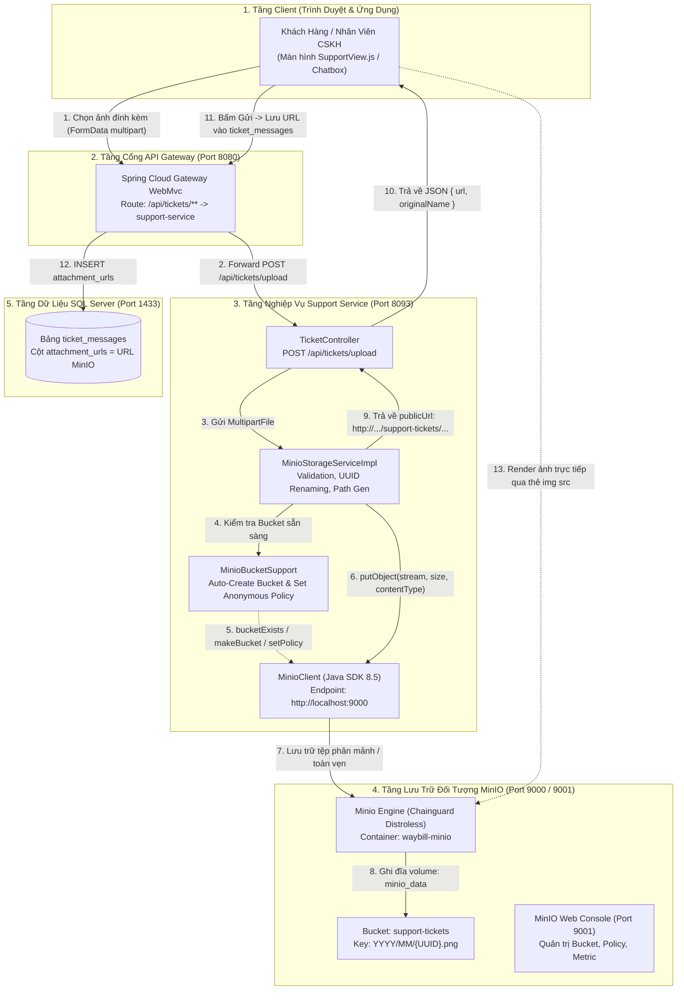
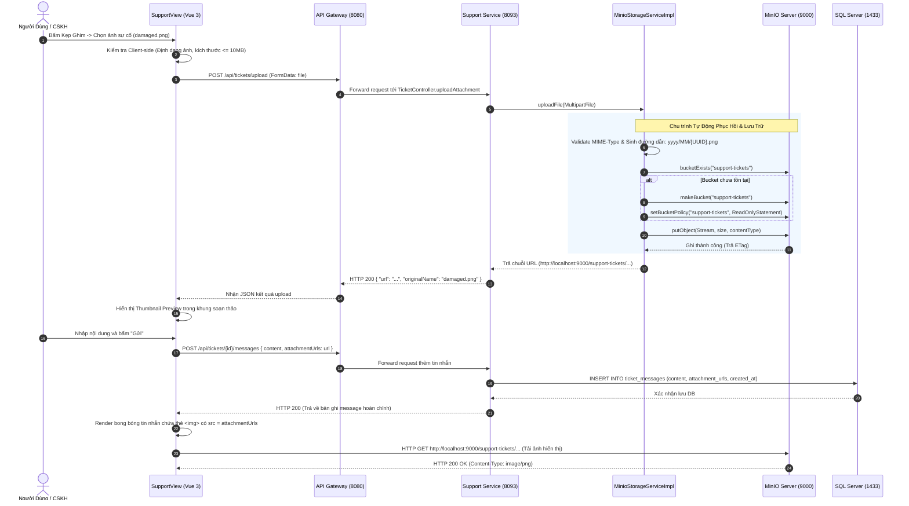

# Cẩm Nang 16: Kiến Trúc Lưu Trữ Đối Tượng MinIO (S3 Compatible), Cơ Chế Cấp Quyền & Bộ Boilerplate Độc Lập Chuẩn Doanh Nghiệp

---

## 1. Đặt Vấn Đề & Bối Cảnh Nghiệp Vụ Bưu Chính Thực Tế

Trong hệ sinh thái logistic quy mô quốc gia **VNPT Waybill Platform**, module **Hỗ Trợ & Xử Lý Khiếu Nại Bưu Gửi** (`support-service`) tiếp nhận hàng chục nghìn hồ sơ phát sinh mỗi ngày từ cả khách hàng vãng lai (Guest) lẫn đối tác doanh nghiệp B2B (Customer). Các sự cố vận hành thường gặp bao gồm:
- **Kiện hàng hư hỏng, vỡ nát (`DAMAGED_GOODS`):** Cần lưu trữ ảnh chụp hiện trường tại thời điểm bưu tá bàn giao hoặc tại bưu cục phát.
- **Hàng hóa thất lạc (`LOST_SHIPMENT`, `LOST_GOODS`):** Cần đính kèm hóa đơn GTGT, chứng từ nguồn gốc xuất xứ và biên bản bàn giao kiểm đếm giữa các trạm trung chuyển (Hub).
- **Yêu cầu hủy đơn hoàn hàng (`CANCEL_REQUEST`):** Khách gửi ảnh chụp vận đơn gốc và xác nhận chữ ký hoàn trả.
- **Biên bản giải quyết & Duyệt bồi hoàn (`RESOLVED`):** CSKH đính kèm biên bản đền bù tài chính đã có dấu mộc thẩm định pháp lý của VNPT Post.

### 1.1. Các bẫy thiết kế lưu trữ truyền thống và sự thất bại trong môi trường Microservice

| Phương Án Lưu Trữ | Cơ Chế Hoạt Động | Rủi Ro & Lý Do Thất Bại Trong Hệ Thống Phân Tán |
| :--- | :--- | :--- |
| **Local Disk (Ổ cứng Pod/Server)** | Lưu trực tiếp vào thư mục `/uploads/` của máy chủ chạy Spring Boot | **Stateful Pod, Mất Dữ Liệu Khi Restart:** Trong Kubernetes hoặc Docker, container là *ephemeral* (phù du). Khi Pod bị restart, scale out sang 2-3 replica hoặc dời sang Worker Node khác, ảnh lưu cục bộ sẽ biến mất hoặc chỉ Node này thấy mà Node khác không thấy (`404 Not Found`). Cần NFS/CIFS mount phức tạp, dễ nghẽn I/O. |
| **Database BLOB (SQL Server / MySQL)** | Lưu dữ liệu nhị phân `byte[]` (`VARBINARY(MAX)` / `LONGBLOB`) trực tiếp trong bảng `ticket_messages` | **Nghẽn CSDL & Suy Giảm Hiệu Năng Nghiêm Trọng:** Bảng dữ liệu phình to nhanh chóng (hàng chục GB/ngày), làm cạn kiệt bộ nhớ đệm Buffer Pool của CSDL, suy giảm tốc độ Indexing, làm chậm toàn bộ các truy vấn nghiệp vụ tìm kiếm vé khiếu nại, và chi phí sao lưu (Backup/Restore RTO/RPO) tăng đột biến. |
| **Cloud S3 Công Cộng (AWS S3 / Google Cloud Storage)** | Đẩy trực tiếp lên AWS S3 ở Region nước ngoài | **Chi Phí Băng Thông Lớn & Ràng Buộc Chủ Quyền Dữ Liệu:** Đối với khối bưu chính viễn thông quốc gia như VNPT, dữ liệu hình ảnh bưu phẩm, hóa đơn người dùng có tính bảo mật cao và chịu sự kiểm soát của Luật An ninh mạng (yêu cầu lưu trữ On-Premise / Local Cloud tại Việt Nam). Hơn nữa, phí Egress Data của AWS rất tốn kém khi lượng truy xuất hình ảnh cao. |

### 1.2. Giải pháp: MinIO High-Performance S3-Compatible Object Storage

**MinIO** là hệ thống lưu trữ đối tượng mã nguồn mở, tương thích $100\%$ với chuẩn giao thức **Amazon Web Services (AWS) S3 API**. MinIO được viết hoàn toàn bằng ngôn ngữ Go, có khả năng đạt tốc độ đọc/ghi hàng chục GB/s, tối ưu cho hạ tầng Cloud-Native, Kubernetes và triển khai On-Premise độc lập.

Trong VNPT Waybill Platform, MinIO đóng vai trò là xương sống lưu trữ phi cấu trúc (Unstructured Object Store), bảo đảm:
1. Tách rời hoàn toàn tầng tính toán (Stateless Microservice `support-service`) và tầng lưu trữ dữ liệu (Object Storage).
2. Chi phí triển khai tối ưu, chạy trên hạ tầng Docker/K8s nội bộ.
3. Hỗ trợ đầy đủ cả 2 mô hình phân quyền: **Public Anonymous Read** (cho ảnh chat trao đổi) và **Presigned URLs** (cho chứng từ bồi thường nhạy cảm).

---

## 2. So Sánh Phân Tích Kiến Trúc Toàn Diện: Local Disk vs Database BLOB vs S3 Object Storage

```
+-----------------------------------------------------------------------------------------------+
|                            KIẾN TRÚC PHÂN ĐỊNH LƯU TRỮ TÀI NGUYÊN                             |
+-----------------------------------------------------------------------------------------------+
|                                                                                               |
|   1. LOCAL DISK (Pod Storage)             2. DATABASE BLOB              3. MINIO OBJECT STORE |
|      [ Microservice Pod ]                    [ SQL Server ]                [ MinIO Cluster ]  |
|               |                                    |                              |           |
|      +--------v--------+                  +--------v--------+            +--------v--------+  |
|      | /var/app/data   |                  | VARBINARY(MAX)  |            | Bucket: support |  |
|      |  (Ephemeral)    |                  | (Buffer Cache)  |            | (Erasure Coded) |  |
|      +-----------------+                  +-----------------+            +-----------------+  |
|       Nhược điểm:                          Nhược điểm:                    Ưu điểm:            |
|       - Mất khi Pod chết                   - Nghẽn I/O Database           - Bền vững 99.999%  |
|       - Không Scale Out                    - Giảm Buffer Pool             - Stateless Service |
|       - Khó Backup Cluster                 - Dung lượng DB phình to       - Chuẩn AWS S3 API  |
+-----------------------------------------------------------------------------------------------+
```

### Bảng đối chiếu tiêu chí kỹ thuật chuyên sâu

| Tiêu Chí So Sánh | Ổ Cứng Cục Bộ (Local Filesystem) | CSDL Quan Hệ (Database BLOB) | MinIO Object Storage (S3 API) |
| :--- | :--- | :--- | :--- |
| **Tính tương thích Stateless** | Kém (Phải mount Network Volume chung) | Tốt (Tất cả Service kết nối cùng DB) | **Hoàn hảo** (Service hoàn toàn Stateless, gọi qua HTTP S3 REST) |
| **Hiệu năng I/O & Băng thông** | Cục bộ nhanh nhưng nghẽn khi đọc song song | Chậm, ngốn bộ nhớ RAM Database Buffer Pool | **Cực cao** (Ghi/đọc stream trực tiếp, hỗ trợ Multipart song song) |
| **Khả năng mở rộng (Scalability)** | Hạn chế theo kích thước ổ cứng vật lý | Hạn chế, chi phí lưu trữ DB rất đắt đỏ | **Vô hạn** (Mở rộng từ 1 máy chủ đến cụm phân tán PB dữ liệu) |
| **Độ bền dữ liệu (Durability)** | Dựa vào RAID phần cứng | Dựa vào Backup Log CSDL | **Erasure Coding & Bitrot Protection** (chống lỗi cấp độ bit) |
| **Bảo mật & Cấp quyền** | Phân quyền OS (POSIX Chmod) | RBAC của CSDL | **S3 IAM Policies, Bucket Policies, Presigned URLs** |
| **Mô hình tính toán chi phí** | Rẻ nhưng tốn chi phí vận hành NAS/SAN | Rất đắt (Dung lượng DB cao, license theo core) | **Tối ưu nhất** (Sử dụng ổ cứng tiêu chuẩn, mã nguồn mở) |

---

## 3. Lý Thuyết Nền Tảng Chuyên Sâu Về MinIO & Chuẩn S3 API

### 3.1. Các thực thể cốt lõi trong mô hình S3

1. **Bucket (Thùng chứa):**
   - Không gian tên cấp cao nhất dùng để gom nhóm các đối tượng. Tương tự như một phân vùng ổ đĩa hoặc một schema trong CSDL.
   - Tên Bucket là duy nhất trên toàn cụm MinIO.
   - Ví dụ trong hệ thống: `support-tickets`, `waybill-documents`, `system-backups`.

2. **Object (Đối tượng dữ liệu):**
   - Đơn vị dữ liệu cơ bản lưu trong Bucket, bao gồm dữ liệu thực tế (Payload Stream) và siêu dữ liệu (Metadata).
   - Mỗi Object được định danh bằng một **Object Key** (Đường dẫn logic, ví dụ: `2026/09/a8f3c7b2-11e4.png`).
   - S3 không có khái niệm thư mục vật lý thật sự. Ký tự `/` trong Object Key chỉ là phân cách logic hiển thị dạng cây thư mục (Virtual Directory Hierarchy).

3. **Metadata (Siêu dữ liệu):**
   - **System Metadata:** Do hệ thống/S3 tự quản lý như `Content-Type`, `Content-Length`, `Last-Modified`, `ETag` (MD5 Hash của tệp dùng để xác thực tính toàn vẹn).
   - **User-Defined Metadata:** Siêu dữ liệu tùy chỉnh do ứng dụng đính kèm dưới dạng key-value `x-amz-meta-*` (ví dụ: `x-amz-meta-ticket-code: TKT-20260901-001`, `x-amz-meta-uploader: CSKH-04`).

### 3.2. Cơ chế Erasure Coding & Bitrot Protection (Độ bền chuẩn Enterprise)

Trong kiến trúc lưu trữ truyền thống, kỹ thuật RAID (như RAID 1, RAID 5, RAID 6) bảo vệ dữ liệu ở mức độ toàn bộ ổ đĩa vật lý. Tuy nhiên, khi dung lượng ổ cứng lên tới 10TB - 20TB, thời gian dựng lại mảng RAID (Rebuild time) có thể kéo dài hàng ngày hoặc hàng tuần, tạo nguy cơ mất dữ liệu toàn phần nếu thêm một ổ cứng khác gặp sự cố.

MinIO giải quyết bài toán này bằng thuật toán mã hóa xóa **Reed-Solomon Erasure Coding** kết hợp thuật toán băm siêu nhanh **HighwayHash**:

```
                       REED-SOLOMON ERASURE CODING
                      
   Tệp Tin Gốc (10MB)
   +-------------------------------------------------------------+
   |                        DỮ LIỆU GỐC                          |
   +-------------------------------------------------------------+
                                 |
                                 v  (Chia thành N Khối Dữ Liệu + M Khối Dự Phòng)
        [ Data Blocks ]                                 [ Parity Blocks ]
     D1      D2      D3      D4                      P1      P2      P3      P4
   +----+  +----+  +----+  +----+                  +----+  +----+  +----+  +----+
   | 2MB|  | 2MB|  | 2MB|  | 2MB|                  | 2MB|  | 2MB|  | 2MB|  | 2MB|
   +----+  +----+  +----+  +----+                  +----+  +----+  +----+  +----+
   Disk 1  Disk 2  Disk 3  Disk 4                  Disk 5  Disk 6  Disk 7  Disk 8
     |       |       |       |                       |       |       |       |
     X Bị hỏng      X Bị hỏng                       X Bị hỏng               
     
   => Hỏng 3 ổ đĩa cùng lúc (D1, D3, P2): Hệ thống vẫn khôi phục lại 100% tệp gốc
      chỉ cần tối thiểu bất kỳ 4 khối (N khối) còn nguyên vẹn!
```

- **Erasure Coding:** Tệp tin được chia nhỏ thành $K$ khối dữ liệu (Data Blocks) và $M$ khối dự phòng (Parity Blocks). Hệ thống có thể chịu đựng hỏng hóc tối đa $M$ ổ đĩa cùng một lúc mà không mất một byte dữ liệu nào.
- **Bitrot Protection:** "Bitrot" là hiện tượng dữ liệu trên phiến đĩa bị suy thoái do từ tính suy yếu hoặc bức xạ nền dẫn tới sai lệch dữ liệu mà hệ điều hành không hề hay biết (Silent Data Corruption). MinIO tính toán HighwayHash cho từng block dữ liệu khi ghi và đối soát liên tục khi đọc, nếu phát hiện bit lỗi sẽ tự động dùng khối Parity để tái tạo lại ngay lập tức.

### 3.3. Cơ chế Multipart Upload (Tải lên phân mảnh)

Đối với các tệp lớn (như video quay hiện trường mở hộp hàng, tệp backup bưu cục hàng GB):
- Thay vì gửi toàn bộ tệp trong một HTTP Request duy nhất (dễ bị timeout hoặc mất toàn bộ tiến độ nếu rớt mạng ở 99%):
- Client khởi tạo phiên Multipart (`CreateMultipartUpload`), chia tệp thành các phần (Parts) từ 5MB - 50MB, tải lên song song nhiều luồng.
- Khi hoàn tất, client gửi lệnh `CompleteMultipartUpload` để MinIO ghép nối các Parts lại thành đối tượng hoàn chỉnh nguyên vẹn.

---

## 4. Sơ Đồ Kiến Trúc Lưu Trữ & Luồng Tác Nghiệp Đính Kèm Tệp Toàn Trình

### 4.1. Sơ đồ kiến trúc luồng dữ liệu (Data Flow Diagram)



### 4.2. Sơ đồ tuần tự xử lý tải ảnh & gửi tin nhắn (Sequence Diagram)



---

## 5. Kỹ Thuật Tự Động Phục Hồi & Cấu Hình Bucket An Toàn (Auto-Healing Bucket Support)

### 5.1. Bẫy kỹ thuật `NoSuchBucket (The specified bucket does not exist)`

Trong thực tế vận hành Microservice, các dịch vụ nghiệp vụ thường khởi động đồng thời cùng hạ tầng qua Docker Compose hoặc Kubernetes. Điều này sinh ra 2 cạm bẫy:
1. **Startup Race Condition:** Service khởi động trước khi container MinIO kịp hoàn tất nạp cấu hình cổng 9000. Nếu khởi tạo bucket ngay lúc `@PostConstruct` trong Spring, service sẽ throw Exception và sập Pod (`CrashLoopBackOff`).
2. **Missing Bucket:** Sau khi restart Docker với volume mới hoặc khi triển khai sang môi trường Test/Staging mới, Bucket chưa được tạo trước. Khi người dùng thực hiện upload, SDK MinIO sẽ bắn lỗi `ErrorResponse(code = NoSuchBucket, message = The specified bucket does not exist)`.

### 5.2. Giải pháp: Kỹ thuật Lazy Initialization & Double-Checked Locking

Để giải quyết triệt để, chúng ta áp dụng mẫu thiết kế **Lazy Auto-Healing** với biến nguyên tử `AtomicBoolean` và khối đồng bộ hóa hai lớp (`Double-Checked Locking`):

```java
package org.app.supportservice.config;

import io.minio.BucketExistsArgs;
import io.minio.MakeBucketArgs;
import io.minio.MinioClient;
import io.minio.SetBucketPolicyArgs;
import lombok.extern.slf4j.Slf4j;
import org.springframework.stereotype.Component;

import java.util.concurrent.atomic.AtomicBoolean;

@Component
@Slf4j
public class MinioBucketSupport {

    // Trạng thái cờ đánh dấu Bucket đã được thẩm định và sẵn sàng
    private final AtomicBoolean ready = new AtomicBoolean(false);

    public void ensurePublicBucket(MinioClient client, String bucketName) throws Exception {
        // Kiểm tra nhanh không cần lock nếu đã sẵn sàng (Tối ưu hiệu năng 99.9% request)
        if (ready.get()) {
            return;
        }

        // Khối đồng bộ hóa ngăn chặn tình trạng race condition khi nhiều luồng cùng upload đồng thời
        synchronized (this) {
            if (ready.get()) {
                return;
            }

            // 1. Kiểm tra sự tồn tại của Bucket trên máy chủ S3
            boolean found = client.bucketExists(BucketExistsArgs.builder().bucket(bucketName).build());
            if (!found) {
                client.makeBucket(MakeBucketArgs.builder().bucket(bucketName).build());
                log.info("Khởi tạo thành công MinIO bucket: {}", bucketName);
            }

            // 2. Thiết lập chính sách AWS S3 Anonymous Download Policy
            String policy = """
                    {
                        "Version": "2012-10-17",
                        "Statement": [
                            {
                                "Effect": "Allow",
                                "Principal": {"AWS": ["*"]},
                                "Action": ["s3:GetObject"],
                                "Resource": ["arn:aws:s3:::%s/*"]
                            }
                        ]
                    }
                    """.formatted(bucketName);

            client.setBucketPolicy(SetBucketPolicyArgs.builder()
                    .bucket(bucketName)
                    .config(policy)
                    .build());

            ready.set(true);
            log.info("Bucket {} đã sẵn sàng và kích hoạt chế độ đọc công khai", bucketName);
        }
    }
}
```

*Đặc tính của giải pháp:*
- **Non-blocking lúc khởi động:** Nếu MinIO chưa online khi Spring Boot bật lên, hệ thống chỉ ghi log cảnh báo và không làm sập ứng dụng.
- **Tự tạo khi có yêu cầu đầu tiên:** Khi người dùng đầu tiên upload tệp, hàm `ensurePublicBucket` sẽ phát hiện bucket chưa có, tự tạo và cấu hình policy trong runtime.
- **Hiệu năng cao:** Sau khi đã khởi tạo thành công, biến `ready.get()` trả về `true` ngay lập tức mà không phải tốn thêm bất kỳ cuộc gọi mạng nào kiểm tra lại tới MinIO.

---

## 6. Kỹ Thuật Presigned URLs & Xử Lý Tệp Nhạy Cảm

Bên cạnh các hình ảnh kiện hàng móp méo hiển thị công khai trên khung chat, hệ thống logistics còn xử lý các tài liệu nhạy cảm có giá trị pháp lý và tài chính cao như:
- Hóa đơn tài chính, sao kê chuyển khoản bồi thường.
- Căn cước công dân của chủ hàng yêu cầu bồi thường.
- Hợp đồng bưu chính nguyên tắc.

Các tài liệu này **bắt buộc phải lưu trong Private Bucket** (Bucket đóng, không cấp anonymous read).

### 6.1. Cơ chế hoạt động của Presigned URL (Chữ ký điện tử tạm thời)

Presigned URL là một đường link HTTP chứa các Query Parameters đã được ký bằng thuật toán mã hóa đối xứng **HMAC-SHA256** dựa trên `SecretKey` của MinIO:

```
http://localhost:9000/private-contracts/2026/contract-01.pdf
?X-Amz-Algorithm=AWS4-HMAC-SHA256
&X-Amz-Credential=minioadmin%2F20260925%2Fus-east-1%2Fs3%2Faws4_request
&X-Amz-Date=20260925T012345Z
&X-Amz-Expires=900
&X-Amz-SignedHeaders=host
&X-Amz-Signature=8f3b2...c4e9
```

- **Thời hạn sống (TTL):** Tham số `X-Amz-Expires=900` quy định đường link chỉ tồn tại trong 900 giây (15 phút). Sau thời gian này, link tự động hết hiệu lực (`HTTP 403 Forbidden`).
- **Chống làm giả (Signature Integrity):** Bất kỳ sự thay đổi nào đối với đường dẫn hoặc thời hạn trong URL đều làm sai lệch chữ ký `X-Amz-Signature` và bị MinIO từ chối ngay lập tức.

### 6.2. Kỹ thuật Direct-to-S3 Upload bằng Presigned PUT URL

Đối với các tệp tin có kích thước lớn (trên 50MB):
- **Luồng truyền thống:** Client -> API Gateway -> Microservice -> MinIO. Luồng này khiến Gateway và Microservice bị nghẽn CPU và nghẽn băng thông do phải làm trung gian chuyển tiếp dữ liệu nhị phân.
- **Luồng Direct-to-S3:**
  1. Client gửi request nhỏ tới backend: `GET /api/documents/presigned-upload-url?filename=record.pdf`.
  2. Backend sinh Presigned PUT URL với thời hạn 5 phút và trả về cho Client.
  3. Client dùng `fetch()` hoặc `axios` thực hiện lệnh `PUT <Presigned-URL>` đẩy trực tiếp dữ liệu nhị phân lên thẳng máy chủ MinIO.
  4. Sau khi MinIO báo thành công (HTTP 200), Client mới gửi metadata về Backend để lưu DB.

---

## 7. Vận Hành MinIO Container Thực Chiến & Bài Học Xử Lý Sự Cố (Production Pitfalls)

### 7.1. Bài học thực chiến 1: Sự cố Docker Hub MinIO & Di trú sang Chainguard Distroless

#### Bối cảnh sự cố:
Trước đây, lệnh `docker pull minio/minio:latest` là chuẩn phổ biến. Tuy nhiên, nhóm phát triển MinIO chính thức đã ngừng duy trì các bản build cộng đồng công khai trên Docker Hub và chuyển sang chế độ cấp quyền hạn chế, dẫn đến việc build Docker Compose gặp lỗi nghiêm trọng:
```
Error response from daemon: failed to resolve reference "docker.io/minio/minio:latest":
dial tcp: lookup registry-1.docker.io: no such host
`docker-compose` process finished with exit code 1
```

#### Giải pháp khắc phục chuẩn Production:
Chuyển đổi sang kho ảnh bảo mật cao cấp **Chainguard Distroless Image** (`cgr.dev/chainguard/minio:latest`):
- **Ưu điểm vượt trội:** Ảnh Distroless loại bỏ hoàn toàn các shell không cần thiết (không có bash, không có package manager dư thừa), giảm diện tích tấn công (Attack Surface), đạt $0$ lỗ hổng bảo mật (Zero Known CVEs) và kích thước siêu nhẹ.
- **Khả năng tương thích:** Tương thích $100\%$ toàn bộ cờ lệnh của MinIO chính thức (`server /data --console-address ":9001"`).

Cấu hình chuẩn trong [`docker-compose.yaml`](file:///c:/Users/LENOVO/Desktop/microservice/mini-waybill-platform/docker-compose.yaml):
```yaml
  minio:
    image: cgr.dev/chainguard/minio:latest
    container_name: waybill-minio
    command: server /data --console-address ":9001"
    ports:
      - "9000:9000"   # Cổng S3 REST API (dành cho SDK Spring Boot & Trình duyệt tải ảnh)
      - "9001:9001"   # Cổng MinIO Console Web UI (dành cho Quản trị viên quản lý Bucket)
    environment:
      - MINIO_ROOT_USER=minioadmin
      - MINIO_ROOT_PASSWORD=minioadmin
    volumes:
      - minio_data:/data
    restart: always

volumes:
  minio_data:
    driver: local
```

### 7.2. Bài học thực chiến 2: Phân biệt rõ ràng Port 9000 và Port 9001

Một sai lầm rất phổ biến là trỏ nhầm Endpoint của Spring Boot hoặc đường link ảnh vào Port `9001`:
- **Port 9000 (S3 API Endpoint):** Dành riêng cho giao thức S3 RESTful. Tất cả các lệnh của SDK Java (`putObject`, `getObject`, `bucketExists`) và các thẻ `` của trình duyệt **bắt buộc** phải gọi vào cổng 9000.
- **Port 9001 (Web Console):** Dành cho giao diện quản trị người dùng bằng trình duyệt Web. Cổng này phục vụ mã nguồn HTML/JS của trang Dashboard quản trị, nếu trỏ SDK vào cổng 9001 sẽ nhận lỗi `HTTP 400 Bad Request` hoặc lỗi phân tích cú pháp XML/JSON.

### 7.3. Cẩm nang vận hành lệnh MinIO Client (`mc` CLI)

MinIO cung cấp công cụ dòng lệnh cực mạnh `mc` (đã được tích hợp sẵn bên trong container `waybill-minio`). Các lệnh quản trị cần nắm vững:

```bash
# 1. Đăng nhập / Thiết lập Alias kết nối tới MinIO cục bộ
docker exec -it waybill-minio mc alias set myminio http://localhost:9000 minioadmin minioadmin

# 2. Liệt kê toàn bộ Buckets trên hệ thống
docker exec -it waybill-minio mc ls myminio

# 3. Tạo mới một Bucket
docker exec -it waybill-minio mc mb myminio/support-tickets

# 4. Thiết lập quyền đọc công khai (Anonymous Read) cho Bucket
docker exec -it waybill-minio mc anonymous set download myminio/support-tickets

# 5. Kiểm tra thông tin chính sách của Bucket dưới dạng JSON
docker exec -it waybill-minio mc anonymous get-json myminio/support-tickets

# 6. Sao chép tệp từ container ra Bucket hoặc giữa các Bucket
docker exec -it waybill-minio mc cp /data/sample.png myminio/support-tickets/sample.png

# 7. Xem thông tin thống kê dung lượng và tình trạng phần cứng cụm
docker exec -it waybill-minio mc admin info myminio
```

### 7.4. Bảo vệ an toàn tệp tải lên (Security Hardening)

1. **Phòng chống tấn công Path Traversal:**
   - Tuyệt đối không dùng trực tiếp tên tệp gốc do client gửi lên (ví dụ: `../../etc/passwd` hoặc `shell.php.jpg`).
   - Luôn tạo lại tên tệp ngẫu nhiên bằng `UUID.randomUUID()` kết hợp cấu trúc thư mục niên độ `yyyy/MM/{UUID}.ext`.
2. **Kiểm tra danh sách trắng phần mở rộng (Extension Allowlist):**
   - Chỉ cho phép các định dạng an toàn: `.jpg`, `.jpeg`, `.png`, `.webp`, `.pdf`.
   - Chặn tuyệt đối các tệp thực thi: `.exe`, `.sh`, `.bat`, `.jsp`, `.html`, `.svg` (đề phòng tấn công Stored XSS qua thẻ SVG XML).
3. **Giới hạn kích thước tệp tải lên (File Size Constraints):**
   - Giới hạn tệp ảnh đính kèm khiếu nại tối đa **10MB** để tránh cạn kiệt bộ nhớ RAM máy chủ.

---

## 8. Bộ Mã Nguồn Boilerplate Độc Lập Chuẩn Spring Boot 3 (Copy-Paste Ready)

Bộ mã nguồn dưới đây được thiết kế theo chuẩn độc lập cao, không bị phụ thuộc vào logic nội bộ của dự án khác, sẵn sàng sao chép và sử dụng ngay trong bất kỳ ứng dụng Spring Boot 3.x nào của doanh nghiệp.

### 8.1. Khai báo phụ thuộc Maven (`pom.xml`)

```xml
<dependencies>
    <!-- MinIO Java SDK chính hãng tương thích AWS S3 -->
    <dependency>
        <groupId>io.minio</groupId>
        <artifactId>minio</artifactId>
        <version>8.5.17</version>
    </dependency>

    <!-- Spring Boot Starter Web -->
    <dependency>
        <groupId>org.springframework.boot</groupId>
        <artifactId>spring-boot-starter-web</artifactId>
    </dependency>

    <!-- Lombok -->
    <dependency>
        <groupId>org.projectlombok</groupId>
        <artifactId>lombok</artifactId>
        <optional>true</optional>
    </dependency>
</dependencies>
```

### 8.2. Cấu hình thuộc tính (`MinioProperties.java`)

```java
package com.enterprise.storage.config;

import lombok.Data;
import org.springframework.boot.context.properties.ConfigurationProperties;
import org.springframework.context.annotation.Configuration;

import java.util.List;

@Configuration
@ConfigurationProperties(prefix = "storage.minio")
@Data
public class MinioProperties {

    /**
     * S3 Endpoint URL (Ví dụ: http://localhost:9000 hoặc https://s3.company.vn)
     */
    private String endpoint = "http://localhost:9000";

    /**
     * Access Key / Username quản trị
     */
    private String accessKey = "minioadmin";

    /**
     * Secret Key / Password bí mật
     */
    private String secretKey = "minioadmin";

    /**
     * Tên Bucket mặc định của hệ thống
     */
    private String defaultBucket = "enterprise-attachments";

    /**
     * URL công khai phân phối tệp tới trình duyệt (hỗ trợ CDN / Reverse Proxy)
     */
    private String publicUrl = "http://localhost:9000";

    /**
     * Dung lượng tệp tối đa cho phép (Bytes) - Mặc định 10MB
     */
    private long maxFileSize = 10 * 1024 * 1024;

    /**
     * Danh sách các phần mở rộng cho phép tải lên
     */
    private List<String> allowedExtensions = List.of(".jpg", ".jpeg", ".png", ".webp", ".pdf");
}
```

### 8.3. Khởi tạo Bean MinioClient & Quản lý Bucket (`MinioConfiguration.java`)

```java
package com.enterprise.storage.config;

import io.minio.BucketExistsArgs;
import io.minio.MakeBucketArgs;
import io.minio.MinioClient;
import io.minio.SetBucketPolicyArgs;
import lombok.RequiredArgsConstructor;
import lombok.extern.slf4j.Slf4j;
import org.springframework.boot.autoconfigure.condition.ConditionalOnMissingBean;
import org.springframework.context.annotation.Bean;
import org.springframework.context.annotation.Configuration;

@Configuration
@RequiredArgsConstructor
@Slf4j
public class MinioConfiguration {

    private final MinioProperties properties;

    @Bean
    @ConditionalOnMissingBean
    public MinioClient minioClient() {
        MinioClient client = MinioClient.builder()
                .endpoint(properties.getEndpoint())
                .credentials(properties.getAccessKey(), properties.getSecretKey())
                .build();

        // Kiểm tra và khởi tạo sẵn Bucket lúc nạp Context
        try {
            ensureBucketInitialized(client, properties.getDefaultBucket(), true);
        } catch (Exception e) {
            log.warn("MinIO chưa trực tuyến lúc khởi động. Hệ thống sẽ thử kết nối lại khi có yêu cầu: {}", e.getMessage());
        }

        return client;
    }

    /**
     * Tiện ích đảm bảo Bucket tồn tại và thiết lập chính sách truy cập
     */
    public void ensureBucketInitialized(MinioClient client, String bucketName, boolean isPublic) throws Exception {
        boolean found = client.bucketExists(BucketExistsArgs.builder().bucket(bucketName).build());
        if (!found) {
            client.makeBucket(MakeBucketArgs.builder().bucket(bucketName).build());
            log.info("Khởi tạo thành công bucket mới: {}", bucketName);
        }

        if (isPublic) {
            String readOnlyPolicy = """
                    {
                        "Version": "2012-10-17",
                        "Statement": [
                            {
                                "Effect": "Allow",
                                "Principal": {"AWS": ["*"]},
                                "Action": ["s3:GetObject"],
                                "Resource": ["arn:aws:s3:::%s/*"]
                            }
                        ]
                    }
                    """.formatted(bucketName);
            client.setBucketPolicy(SetBucketPolicyArgs.builder()
                    .bucket(bucketName)
                    .config(readOnlyPolicy)
                    .build());
        }
    }
}
```

### 8.4. Interface Dịch Vụ Lưu Trữ Chuẩn Doanh Nghiệp (`MinioStorageService.java`)

```java
package com.enterprise.storage.service;

import org.springframework.web.multipart.MultipartFile;

import java.io.InputStream;

public interface MinioStorageService {

    /**
     * Tải tệp công khai lên MinIO (Sử dụng cho ảnh đại diện, ảnh khiếu nại, chat feed)
     * @param file Tệp nhị phân từ Multipart Request
     * @return Đường dẫn HTTP URL công khai xem trực tiếp
     */
    String uploadPublicFile(MultipartFile file);

    /**
     * Tải tệp từ InputStream tùy biến
     */
    String uploadStream(String bucket, String objectKey, InputStream inputStream, long size, String contentType);

    /**
     * Sinh Presigned GET URL có thời hạn để xem/tải tài liệu nhạy cảm
     * @param objectKey Đường dẫn đối tượng trong bucket
     * @param expirySeconds Thời gian sống của link (tính bằng giây)
     * @return URL có chữ ký HMAC-SHA256
     */
    String generatePresignedDownloadUrl(String objectKey, int expirySeconds);

    /**
     * Sinh Presigned PUT URL để client tự tải thẳng tệp lên MinIO
     * @param objectKey Đường dẫn dự kiến lưu trữ
     * @param expirySeconds Thời gian link có hiệu lực
     */
    String generatePresignedUploadUrl(String objectKey, int expirySeconds);

    /**
     * Xóa đối tượng khỏi máy chủ lưu trữ
     * @param objectKey Đường dẫn đối tượng cần xóa
     */
    void deleteFile(String objectKey);
}
```

### 8.5. Triển khai dịch vụ hoàn chỉnh (`MinioStorageServiceImpl.java`)

```java
package com.enterprise.storage.service.impl;

import com.enterprise.storage.config.MinioConfiguration;
import com.enterprise.storage.config.MinioProperties;
import com.enterprise.storage.service.MinioStorageService;
import io.minio.*;
import io.minio.http.Method;
import lombok.RequiredArgsConstructor;
import lombok.extern.slf4j.Slf4j;
import org.springframework.stereotype.Service;
import org.springframework.web.multipart.MultipartFile;

import java.io.InputStream;
import java.time.LocalDate;
import java.time.format.DateTimeFormatter;
import java.util.UUID;
import java.util.concurrent.TimeUnit;

@Service
@RequiredArgsConstructor
@Slf4j
public class MinioStorageServiceImpl implements MinioStorageService {

    private final MinioClient minioClient;
    private final MinioProperties properties;
    private final MinioConfiguration minioConfiguration;

    @Override
    public String uploadPublicFile(MultipartFile file) {
        validateFile(file);

        String originalFilename = file.getOriginalFilename();
        String ext = "";
        if (originalFilename != null && originalFilename.contains(".")) {
            ext = originalFilename.substring(originalFilename.lastIndexOf(".")).toLowerCase();
        }

        // Tạo cấu trúc niên độ yyyy/MM/{UUID}.ext nhằm tránh tràn số lượng tệp trong 1 thư mục
        String dateFolder = LocalDate.now().format(DateTimeFormatter.ofPattern("yyyy/MM"));
        String objectKey = String.format("%s/%s%s", dateFolder, UUID.randomUUID(), ext);
        String bucket = properties.getDefaultBucket();

        try (InputStream is = file.getInputStream()) {
            // Đảm bảo bucket sẵn sàng
            minioConfiguration.ensureBucketInitialized(minioClient, bucket, true);

            minioClient.putObject(PutObjectArgs.builder()
                    .bucket(bucket)
                    .object(objectKey)
                    .stream(is, file.getSize(), -1)
                    .contentType(file.getContentType())
                    .build());

            log.info("Tải tệp lên MinIO thành công: {} (Kích thước: {} bytes)", objectKey, file.getSize());
            return String.format("%s/%s/%s", properties.getPublicUrl(), bucket, objectKey);
        } catch (Exception e) {
            log.error("Lỗi khi tải tệp lên MinIO: {}", e.getMessage(), e);
            throw new RuntimeException("Tải tệp lên hệ thống lưu trữ thất bại: " + e.getMessage());
        }
    }

    @Override
    public String uploadStream(String bucket, String objectKey, InputStream inputStream, long size, String contentType) {
        try {
            minioClient.putObject(PutObjectArgs.builder()
                    .bucket(bucket)
                    .object(objectKey)
                    .stream(inputStream, size, -1)
                    .contentType(contentType)
                    .build());
            return String.format("%s/%s/%s", properties.getPublicUrl(), bucket, objectKey);
        } catch (Exception e) {
            log.error("Lỗi khi đẩy luồng dữ liệu lên MinIO: {}", e.getMessage(), e);
            throw new RuntimeException("Lưu trữ luồng dữ liệu thất bại: " + e.getMessage());
        }
    }

    @Override
    public String generatePresignedDownloadUrl(String objectKey, int expirySeconds) {
        try {
            return minioClient.getPresignedObjectUrl(GetPresignedObjectUrlArgs.builder()
                    .method(Method.GET)
                    .bucket(properties.getDefaultBucket())
                    .object(objectKey)
                    .expiry(expirySeconds, TimeUnit.SECONDS)
                    .build());
        } catch (Exception e) {
            log.error("Lỗi sinh Presigned GET URL: {}", e.getMessage(), e);
            throw new RuntimeException("Không thể tạo liên kết tải tệp bảo mật");
        }
    }

    @Override
    public String generatePresignedUploadUrl(String objectKey, int expirySeconds) {
        try {
            return minioClient.getPresignedObjectUrl(GetPresignedObjectUrlArgs.builder()
                    .method(Method.PUT)
                    .bucket(properties.getDefaultBucket())
                    .object(objectKey)
                    .expiry(expirySeconds, TimeUnit.SECONDS)
                    .build());
        } catch (Exception e) {
            log.error("Lỗi sinh Presigned PUT URL: {}", e.getMessage(), e);
            throw new RuntimeException("Không thể tạo liên kết tải lên trực tiếp");
        }
    }

    @Override
    public void deleteFile(String objectKey) {
        try {
            minioClient.removeObject(RemoveObjectArgs.builder()
                    .bucket(properties.getDefaultBucket())
                    .object(objectKey)
                    .build());
            log.info("Đã xóa tệp khỏi MinIO: {}", objectKey);
        } catch (Exception e) {
            log.error("Lỗi khi xóa tệp MinIO: {}", e.getMessage(), e);
            throw new RuntimeException("Xóa tệp thất bại: " + e.getMessage());
        }
    }

    private void validateFile(MultipartFile file) {
        if (file == null || file.isEmpty()) {
            throw new IllegalArgumentException("Dữ liệu tệp tải lên không được để trống");
        }

        if (file.getSize() > properties.getMaxFileSize()) {
            throw new IllegalArgumentException(String.format("Dung lượng tệp vượt quá mức cho phép (%d MB)", 
                    properties.getMaxFileSize() / (1024 * 1024)));
        }

        String filename = file.getOriginalFilename();
        if (filename == null || !filename.contains(".")) {
            throw new IllegalArgumentException("Tên tệp không hợp lệ hoặc thiếu phần mở rộng");
        }

        String ext = filename.substring(filename.lastIndexOf(".")).toLowerCase();
        if (!properties.getAllowedExtensions().contains(ext)) {
            throw new IllegalArgumentException("Định dạng tệp không được hỗ trợ. Chỉ chấp nhận: " 
                    + properties.getAllowedExtensions());
        }
    }
}
```

### 8.6. Mẫu Cấu Hình File `application.yml`

```yaml
storage:
  minio:
    endpoint: ${MINIO_ENDPOINT:http://localhost:9000}
    access-key: ${MINIO_ACCESS_KEY:minioadmin}
    secret-key: ${MINIO_SECRET_KEY:minioadmin}
    default-bucket: ${MINIO_BUCKET_NAME:support-tickets}
    public-url: ${MINIO_PUBLIC_URL:http://localhost:9000}
    max-file-size: 10485760 # 10MB
    allowed-extensions:
      - .jpg
      - .jpeg
      - .png
      - .webp
      - .pdf

# Cấu hình Multipart Upload của Spring Boot Framework
spring:
  servlet:
    multipart:
      enabled: true
      max-file-size: 10MB
      max-request-size: 15MB
```

---

## 9. Phân Tích Quyết Định Kỹ Thuật (Design Decisions & Trade-offs)

### 9.1. Tại sao chọn Chainguard MinIO thay vì tự viết Dockerfile?

1. **Giảm thiểu gánh nặng rà quét an ninh thông tin (Vulnerability Scanning):**
   - Các Docker image tự build từ Ubuntu/Alpine thường tích lũy hàng chục lỗi CVE theo thời gian nếu không cập nhật bản vá hàng tuần.
   - Chainguard Image được biên dịch tự động mỗi ngày từ mã nguồn sạch, chỉ chứa binary duy nhất của MinIO và chứng chỉ SSL/TLS CA root, loại bỏ shell và glibc thừa.
2. **Tuân thủ chuẩn DevSecOps:** Các doanh nghiệp bưu chính, ngân hàng và viễn thông lớn yêu cầu mọi container đưa lên môi trường Staging/Production phải đạt chuẩn quét $0$ CVE từ Trivy/Clair.

### 9.2. Trade-off: Public Bucket Download Policy vs Presigned URLs trong Chatbox

| Tiêu Chí | Public Bucket Download Policy | Presigned URLs |
| :--- | :--- | :--- |
| **Trải nghiệm người dùng (UX)** | **Tối ưu nhất:** Ảnh luôn hiển thị ngay lập tức khi cuộn lịch sử chat nhiều tháng trước mà không bao giờ bị lỗi ảnh chết (Broken Image). | **Kém hơn:** Nếu lưu link Presigned vào DB, sau 15-60 phút link hết hạn, người dùng mở lại cuộc hội thoại sẽ thấy ảnh bị lỗi `403`. Muốn xem phải gọi API xin link mới. |
| **Tải tính toán Backend** | **Cực thấp:** Backend chỉ lưu đường link tĩnh vào DB một lần duy nhất. Trình duyệt tải trực tiếp từ MinIO hoặc CDN. | **Cao hơn:** Mỗi lần lấy danh sách tin nhắn chat, Backend phải vòng lặp qua từng tin nhắn để ký lại link mới bằng CPU. |
| **Bảo mật dữ liệu** | Phù hợp với ảnh kiện hàng công khai, bao bì bưu phẩm không chứa thông tin định danh cá nhân nhạy cảm. | **Bắt buộc** với chứng từ ngân hàng, CMND/CCCD, hợp đồng bồi hoàn tài chính. |
| **Quyết định kiến trúc của hệ thống:** | **Áp dụng mô hình lai (Hybrid):** Sử dụng **Public Policy** cho ảnh chat khiếu nại kiện hàng (`support-tickets`) và sử dụng **Presigned URLs** cho tài liệu tài chính nội bộ. |

---

## 10. Checklist Câu Hỏi Phỏng Vấn Chuyên Sâu Về Object Storage & MinIO (Senior / Tech Lead)

### Câu 1: Phân biệt sự khác nhau căn bản giữa Block Storage, File Storage và Object Storage?
> **Trả lời:**
> - **Block Storage (SAN, EBS, iSCSI):** Dữ liệu được chia thành các khối nhị phân thô không có siêu dữ liệu. Thường dùng làm ổ đĩa gắn cho CSDL (SQL Server, Oracle) đòi hỏi IOPS cực cao và độ trễ thấp ở mức hệ điều hành.
> - **File Storage (NAS, NFS, SMB):** Dữ liệu tổ chức theo cây thư mục phân cấp (Hierarchy Tree) với các thuộc tính POSIX (owner, permission). Thích hợp cho chia sẻ tệp văn phòng giữa nhiều máy chủ nhưng bị nghẽn hiệu năng khi số lượng tệp lên tới hàng triệu.
> - **Object Storage (S3, MinIO, GCS):** Dữ liệu được quản lý dưới dạng không gian phẳng (Flat Namespace) gồm Payload + Unique Key + Metadata phong phú. Truy xuất qua giao thức HTTP/REST API, cho phép mở rộng quy mô lưu trữ đến hàng tỷ đối tượng mà không bị nghẽn cây thư mục.

### Câu 2: Thuật toán Erasure Coding trong MinIO bảo vệ dữ liệu như thế nào so với RAID 6?
> **Trả lời:**
> - RAID 6 bảo vệ ở tầng block đĩa cứng vật lý và chỉ cho phép hỏng tối đa 2 ổ đĩa trong một mảng. Khi ổ dung lượng lớn (16TB) bị hỏng, thời gian tái tạo lại mảng RAID làm suy giảm nghiêm trọng hiệu năng toàn bộ hệ thống.
> - Erasure Coding của MinIO áp dụng thuật toán Reed-Solomon ở tầng đối tượng (Object-level). Nó cho phép cấu hình tỷ lệ linh hoạt (ví dụ $8$ khối dữ liệu + $8$ khối dự phòng $N+M$), chịu đựng được mất mát đồng thời tới $50\%$ số ổ đĩa hoặc máy chủ trong cụm. Quá trình tái tạo chỉ diễn ra trên các đối tượng thực tế chứ không phải toàn bộ đĩa trống, giúp thời gian phục hồi nhanh hơn gấp nhiều lần.

### Câu 3: Làm thế nào để giải quyết bài toán tải tệp dung lượng lớn (hàng trăm MB hoặc hàng GB) lên hệ thống Microservice mà không làm nghẽn API Gateway?
> **Trả lời:**
> Áp dụng cơ chế **Presigned PUT URL (Direct Upload)**:
> 1. Trình duyệt gửi request nhỏ tới backend để yêu cầu cấp quyền tải lên.
> 2. Backend thẩm định nghiệp vụ (RBAC, kích thước tệp, loại tệp) rồi gọi MinIO SDK sinh một URL có chữ ký HMAC-SHA256 với thời hạn ngắn (ví dụ 10 phút).
> 3. Trình duyệt dùng URL này thực hiện lệnh HTTP `PUT` truyền tải tệp trực tiếp lên MinIO mà không đi qua Gateway hay Service.
> 4. Sau khi MinIO xác nhận nhận đủ tệp, client gửi thông báo để Backend lưu metadata vào CSDL. Cách làm này giúp Gateway và Backend duy trì tính Stateless và không tốn băng thông trung chuyển.

### Câu 4: Làm sao để ngăn chặn các tệp tin nguy hiểm chứa mã độc (Web Shell, Stored XSS) khi cho phép người dùng tải ảnh lên S3?
> **Trả lời:**
> Áp dụng mô hình phòng thủ theo chiều sâu (Defense-in-depth):
> 1. **Đổi tên tệp:** Luôn tạo tên mới bằng UUID, xóa bỏ tên tệp do người dùng đặt để chống Path Traversal.
> 2. **Kiểm tra Magic Bytes (File Signature):** Không chỉ dựa vào phần mở rộng `.png` hay header `Content-Type` do trình duyệt gửi (dễ bị giả mạo), mà phải đọc các byte đầu tiên của luồng tệp (ví dụ `0x89 0x50 0x4E 0x47` cho PNG) bằng thư viện Apache Tika.
> 3. **Chặn thực thi:** Thiết lập `Content-Disposition: attachment` hoặc phục vụ từ domain tách biệt (Dedicated Storage Subdomain) để nếu có tệp HTML/SVG độc hại, trình duyệt không thể thực thi JavaScript trong ngữ cảnh cookie của hệ thống chính.

### Câu 5: Hiện tượng "Bitrot" là gì và MinIO giải quyết nó bằng cơ chế nào?
> **Trả lời:**
> Bitrot là sự suy thoái âm thầm của dữ liệu nhị phân trên bề mặt đĩa cứng do từ tính biến đổi hoặc lỗi phần cứng mà không hề phát sinh lỗi I/O từ hệ điều hành. MinIO tích hợp thuật toán băm **HighwayHash** (tốc độ xử lý trên 10GB/s trên mỗi lõi CPU Intel). Mỗi khi ghi đối tượng, MinIO tính toán và lưu mã băm của từng khối dữ liệu. Trong mỗi lần đọc, hệ thống tự động băm lại và so khớp; nếu phát hiện sai lệch bit, MinIO lập tức cô lập khối lỗi và sử dụng các khối dự phòng Erasure Code để tái tạo lại khối chuẩn mà ứng dụng gọi không hề bị gián đoạn.
