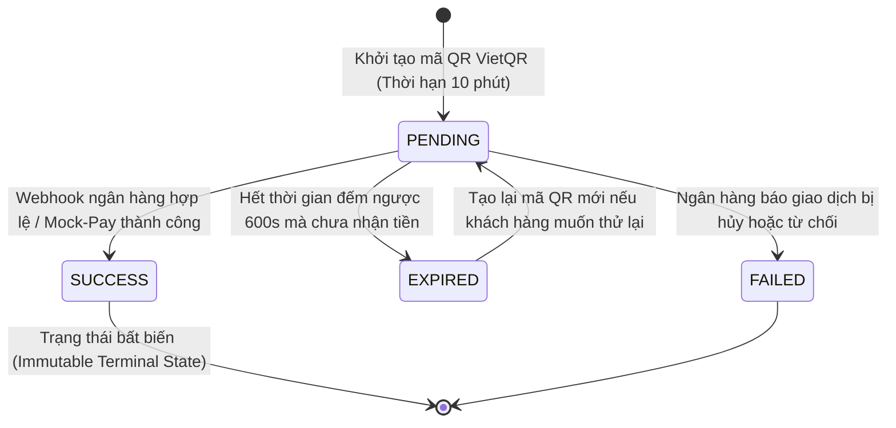
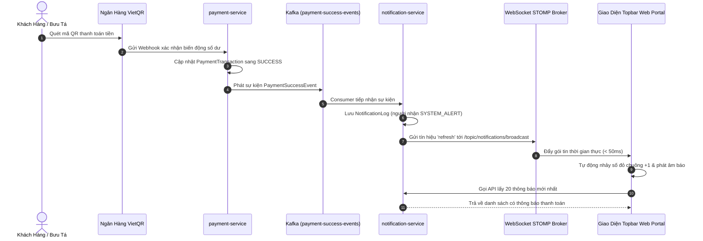

# Cẩm Nang 17: Cổng Thanh Toán Điện Tử VietQR Động, Đối Soát Tài Chính Tức Thời & Tự Động Hóa Chuông Thông Báo Topbar

---

## 1. Đặt Vấn Đề & Bối Cảnh Nghiệp Vụ Bưu Chính Thực Tế

Trong hệ thống chuỗi cung ứng logistics bưu chính quốc gia **VNPT Waybill Platform**, dòng tiền luân chuyển gắn liền với từng kiện hàng được phân định thành 2 dòng tài chính độc lập:
1. **Cước phí vận chuyển B2B (`SHIPPING_FEE`):** Khoản tiền khách hàng hoặc đối tác doanh nghiệp thanh toán cho dịch vụ giao vận bưu phẩm (gồm cước cơ bản theo khoảng cách, cước nấc khối lượng, phụ phí nhiên liệu và phí bảo hiểm).
2. **Tiền thu hộ COD (`COD` - Cash On Delivery):** Khoản tiền bưu tá thu hộ từ người nhận hàng khi phát kiện thành công tại chặng cuối (Last-Mile Delivery) để đối soát hoàn trả lại cho chủ shop.

### 1.1. Các bẫy nghiệp vụ thanh toán truyền thống trong Logistics
* **Rủi ro thất thoát tiền mặt bưu tá:** Bưu tá hiện trường phải ôm một lượng tiền mặt lớn trong suốt ca phát hàng, đối mặt nguy cơ rơi rớt, cướp giật, nhầm lẫn mệnh giá hoặc rủi ro nhận phải tiền giả.
* **Thời gian kiểm đếm và nộp két kéo dài:** Cuối ngày, hàng trăm bưu tá phải xếp hàng tại bưu cục để thủ quỹ kiểm đếm từng tờ tiền, đối chiếu bảng kê giấy, gây tắc nghẽn vận hành nghiêm trọng.
* **Sai lệch cú pháp chuyển khoản ngân hàng:** Khách hàng chuyển khoản thủ công vào tài khoản bưu cục nhưng nhập sai nội dung bưu gửi, sai số tiền hoặc thiếu mã vận đơn khiến kế toán mất hàng giờ đồng hồ rà soát sao kê ngân hàng để khớp lệnh.
* **Sự cố thanh toán đúp (Double-Payment):** Một bưu gửi đã thanh toán thành công nhưng hệ thống không khóa trạng thái tức thời, bưu tá hoặc khách hàng vô tình quét lại mã QR và chuyển khoản thêm một lần nữa, gây khiếu nại tài chính phức tạp.

### 1.2. Giải pháp: Cổng VietQR Dynamic QR mã hóa thông tin đối soát tự động
Nền tảng tích hợp **Cổng thanh toán VietQR động** kết hợp kiến trúc **Event-Driven Architecture qua Apache Kafka** và **WebSocket STOMP Broker thời gian thực**:
- Sinh mã QR động chuẩn NAPAS 247 mã hóa trực tiếp số tiền chính xác từng đồng và mã vận đơn trong nội dung chuyển khoản.
- Người nhận chỉ cần mở ứng dụng của bất kỳ ngân hàng nào tại Việt Nam (Vietcombank, MB, Techcombank, BIDV, VPBank,...) hoặc ví điện tử (MoMo, Viettel Money) quét mã là giao dịch hoàn tất trong 3 giây.
- Hệ thống lắng nghe Webhook ngân hàng, cập nhật tức thời trạng thái hóa đơn, phân phối sự kiện qua Kafka `payment-success-events` và kích hoạt quả chuông 🔔 Topbar nhảy số đỏ +1 cho toàn bộ cán bộ điều phối liên quan.

---

## 2. So Sánh Phân Tích Kiến Trúc Các Phương Án Thanh Toán

| Tiêu Chí So Sánh | Chuyển Khoản Thủ Công (Tài Khoản Tĩnh) | Cổng Thanh Toán Webview (VNPAY / MoMo) | Máy Quẹt Thẻ POS Cầm Tay | Cổng VietQR Dynamic QR Tích Hợp |
| :--- | :--- | :--- | :--- | :--- |
| **Trải nghiệm người dùng** | Rời rạc, khách phải gõ STK, số tiền, nội dung thủ công | Phải mở trình duyệt ngoài, nhập OTP thẻ ATM/Visa | Nhanh nếu khách mang thẻ ngân hàng | **Cực nhanh (3s), quét mã bằng mọi App Mobile Banking** |
| **Phí giao dịch thanh toán** | 0 VNĐ | Rất cao: 1.1% - 2.2% trên tổng giá trị đơn hàng | 1.0% - 1.8% + chi phí thuê bao hàng tháng | **0 VNĐ (Chuyển khoản liên ngân hàng 24/7 NAPAS)** |
| **Khả năng đối soát tự động** | Kém, phụ thuộc con người đọc sao kê | Tốt, qua Webhook IPN | Tốt, qua máy POS | **Tuyệt đối, tự động nhận diện theo mã thanh toán** |
| **Độ trễ cập nhật trạng thái** | Vài giờ đến vài ngày làm việc | 2 - 5 giây | 1 - 3 giây | **< 1 giây (Event-Driven Kafka + STOMP WebSocket)** |
| **Chi phí trang thiết bị** | 0 VNĐ | 0 VNĐ | Rất đắt (2 - 5 triệu VNĐ/máy POS cho mỗi bưu tá) | **0 VNĐ (Hiển thị ngay trên App Shipper hoặc Web Portal)** |
| **Phòng vệ thanh toán đúp** | Không thể ngăn chặn | Có thể ngăn chặn | Có thể ngăn chặn | **Khóa cứng ngay khi đơn ghi nhận trạng thái SUCCESS** |

---

## 3. Kiến Trúc Hệ Thống & Luồng Dữ Liệu Thanh Toán VietQR

```
+-------------------------------------------------------------------------------------------------------+
|                       KIẾN TRÚC THANH TOÁN VIETQR & PHÂN PHỐI SỰ KIỆN KAFKA                          |
+-------------------------------------------------------------------------------------------------------+
|                                                                                                       |
|  [ Web Portal / App Bưu Tá ]                                                                         |
|            |                                                                                          |
|     1. Yêu cầu tạo mã QR                                                                              |
|            v                                                                                          |
|  [ payment-service : 8095 ]                                                                          |
|            |                                                                                          |
|     2. Kiểm tra CSDL: Đơn đã trả tiền chưa?                                                           |
|        - Đã trả: Trả về trạng thái SUCCESS, khóa tạo mới                                              |
|        - Chưa trả: Tạo PaymentTransaction (PENDING) & sinh URL VietQR chuẩn                           |
|            |                                                                                          |
|     3. Khách hàng quét mã QR trên Mobile Banking chuyển khoản NAPAS 24/7                               |
|            v                                                                                          |
|  [ Cổng Ngân Hàng / VietQR Gateway ]                                                                  |
|            |                                                                                          |
|     4. Webhook IPN / Mock-Pay Test                                                                    |
|            v                                                                                          |
|  [ payment-service (Webhook Controller) ]                                                             |
|            |                                                                                          |
|     5. Xác thực chữ ký bí mật & cập nhật PaymentTransaction -> SUCCESS                                |
|            |                                                                                          |
|     6. Bắn sự kiện lên Kafka Topic: payment-success-events                                            |
|            |                                                                                          |
|            +------------------------------------+------------------------------------+                |
|            |                                    |                                    |                |
|            v                                    v                                    v                |
|  [ shipment-service : 8082 ]          [ shipper-service : 8089 ]          [ notification-service : 8085 ]
|  - Cập nhật cước bưu gửi              - Ghi nhận COD bưu tá               - Lưu NotificationLog       |
|  - Chuyển trạng thái PAID             - Đưa vào bảng nộp quỹ ca phát        (SYSTEM_ALERT)            |
|                                                                                      |                |
|                                                                               - Phát WebSocket STOMP  |
|                                                                                 kênh /broadcast       |
|                                                                                      v                |
|                                                                           [ Topbar Web Portal ]       |
|                                                                           - Chuông nhảy số đỏ +1      |
|                                                                           - Bật âm thông báo          |
+-------------------------------------------------------------------------------------------------------+
```

---

## 4. Máy Trạng Thái Giao Dịch Thanh Toán (Payment State Machine)

Một giao dịch thanh toán trong `payment-service` trải qua các mốc trạng thái nghiêm ngặt nhằm bảo đảm an toàn sổ sách tài chính:



### Quy tắc bất biến tài chính
* Khi giao dịch đã đạt mốc **`SUCCESS`**, trạng thái là bất biến vĩnh viễn (Immutable). Không một API hay tiến trình nào được phép ghi đè hoặc hạ trạng thái của giao dịch về `PENDING` hay `FAILED`.
* Hệ thống từ chối mọi yêu cầu sinh mã QR thanh toán mới cho một vận đơn nếu trong CSDL đã tồn tại giao dịch thành công của cùng loại thanh toán (`SHIPPING_FEE` hoặc `COD`).

---

## 5. Kiến Trúc Bảo Mật Webhook & Idempotency Trong Xử Lý Giao Dịch

### 5.1. Phòng thủ giả mạo Webhook qua Secret Key
Tất cả các lệnh gọi Webhook từ ngân hàng hoặc cổng trung gian tới endpoint `/api/payments/webhook` đều bắt buộc phải vượt qua bước thẩm tra tính xác thực:
- Header chứa khóa bí mật định danh đối tác (`X-Webhook-Secret`).
- Hệ thống đối soát chuỗi khóa bí mật cấu hình trong môi trường máy chủ (`vietqr.webhook-secret`).
- Nếu sai lệch hoặc thiếu khóa, hệ thống lập tức ném ngoại lệ `InvalidWebhookException`, trả mã `401 Unauthorized` và ghi nhật ký cảnh báo an ninh.

### 5.2. Chống lỗi Replay Attack & Ghi nhật ký kiểm toán (WebhookLog)
Mọi request gửi tới Webhook đều được lưu vết nguyên bản vào bảng `webhook_logs`:
- `payload`: Toàn bộ nội dung chuỗi JSON nhận được từ phía ngân hàng.
- `processedStatus`: `SUCCESS`, `DUPLICATE`, hoặc `FAILED`.
- `responseMessage`: Thông điệp phản hồi kỹ thuật.
- Khi nhận được một payload có mã giao dịch ngân hàng đã được xử lý thành công trước đó, hệ thống nhận diện đây là thông báo lặp (Idempotent Webhook), lập tức bỏ qua bước cập nhật dữ liệu và trả mã `200 OK` để xác nhận với đối tác mà không phát sinh sự kiện Kafka thừa.

---

## 6. Luồng Sự Kiện Bất Đồng Bộ Kafka & Phân Phối Dữ Liệu Đa Dịch Vụ

Khi giao dịch thanh toán thành công, `payment-service` đóng vai trò là Kafka Event Producer, đẩy thông điệp hợp đồng chuẩn lên cụm Kafka KRaft:

### 6.1. Cấu trúc sự kiện PaymentSuccessEvent
```json
{
  "trackingCode": "VNPT12345678",
  "paymentCode": "PAY-1727508000000",
  "amount": 35000,
  "paymentType": "SHIPPING_FEE",
  "paymentMethod": "VIETQR",
  "paidAt": "2026-09-28T15:30:00"
}
```

### 6.2. Phân phối sự kiện đa dịch vụ (Fan-out Pattern)
1. **`shipment-service` (Consumer Group: `shipment-payment-group`):**
   - Đọc sự kiện để cập nhật cờ `isPaid = true` và `paymentStatus = PAID` cho vận đơn.
   - Ngăn chặn nhân viên bưu cục bấm nhầm tính cước lại lần thứ 2.
2. **`shipper-service` (Consumer Group: `shipper-payment-group`):**
   - Nếu `paymentType == COD`, hệ thống cập nhật tiền COD của đơn sang trạng thái đã thanh toán qua tài khoản công ty.
   - Khi bưu tá nộp quỹ cuối ca phát, hệ thống tự động loại trừ các đơn COD thanh toán qua VietQR khỏi số tiền mặt phải bàn giao cho thủ quỹ, chỉ giữ lại tiền mặt thực tế.
3. **`notification-service` (Consumer Group: `notification-payment-group`):**
   - Lưu thông báo `NotificationLog` vào CSDL bưu chính.
   - Phát sóng WebSocket STOMP tới trình duyệt của người dùng.

---

## 7. Cơ Chế Chuông Thông Báo Topbar Thời Gian Thực (Realtime Topbar Bell)

### 7.1. Đặt vấn đề trải nghiệm người dùng
Nếu sau khi thanh toán thành công mà người quản lý bưu chính hoặc khách hàng phải ấn nút F5 để tải lại trang thì trải nghiệm vận hành sẽ bị gián đoạn. Nền tảng thiết kế cơ chế kết hợp giữa **lưu trữ bền vững trong CSDL** và **kênh đẩy tín hiệu thời gian thực**:



### 7.2. Đặc tính kỹ thuật của giải pháp thông báo
* **Lưu trữ CSDL chuẩn mực:** Bản ghi `NotificationLog` được lưu với người nhận `SYSTEM_ALERT`, loại `IN_APP`, tiêu đề *"Thanh toán cước vận đơn thành công"* hoặc *"Thanh toán COD thành công"*, kèm số tiền định dạng chuẩn `vi-VN` (ví dụ `35.000 đ`) và mã giao dịch.
* **Gộp thông báo thông minh tại Service Layer:** Khi người dùng mở chuông, hàm `getMyNotifications()` trong `notification-service` tự động truy vấn cả thông báo cá nhân theo số điện thoại lẫn thông báo toàn hệ thống `SYSTEM_ALERT`, khử trùng lặp qua `Set<Long>` và sắp xếp theo mốc thời gian mới nhất.
* **Biểu tượng giao dịch độc quyền:** Trên giao diện, hệ thống nhận diện tiêu đề thanh toán và gắn biểu tượng tiền tệ với vòng tròn xanh ngọc emerald (`bg-emerald-600`), nổi bật hoàn toàn so với các thông báo giao vận thông thường.

---

## 8. Phòng Vệ Chống Thanh Toán Đúp (Double-Payment Prevention)

Để triệt tiêu hoàn toàn nguy cơ một đơn hàng bị thanh toán 2 lần, kiến trúc phòng thủ được thiết lập đa tầng từ Database đến Frontend:

### Tầng 1: CSDL & Backend Service Layer
* Trong `PaymentServiceImpl`, hàm `createPayment` thực hiện kiểm tra:
  ```java
  Optional<PaymentTransaction> existingSuccess = paymentTransactionRepository
          .findFirstByTrackingCodeAndPaymentTypeAndStatus(trackingCode, paymentType, PaymentStatus.SUCCESS);
  if (existingSuccess.isPresent()) {
      return mapToResponse(existingSuccess.get());
  }
  ```
* Nếu đơn đã có giao dịch thành công, hệ thống không bao giờ tạo bản ghi mới hay sinh mã QR mới mà trả về ngay dữ liệu giao dịch cũ kèm cờ trạng thái `SUCCESS`.
* Cung cấp endpoint tra cứu tập trung `GET /api/payments/paid-codes` để trả về danh sách toàn bộ các mã vận đơn đã thanh toán thành công trong hệ thống.

### Tầng 2: Client UI Layer
* `ShipmentView` duy trì một tập hợp `paidTrackingCodes` (Reactive Set).
* Khi tải danh sách bưu gửi, hệ thống tự động đồng bộ danh sách mã đã trả tiền từ backend.
* Đối với đơn đã thu cước, nút bấm *"Trả Cước"* màu xanh dương lập tức được thay thế bằng huy hiệu tĩnh màu xanh ngọc emerald *"Đã Thu"*.
* Khi mở cửa sổ chi tiết bưu gửi, nếu đơn đã thanh toán, hệ thống không gọi API sinh QR mới mà hiển thị màn hình chúc mừng đã thanh toán thành công kèm dấu tích xanh và mã giao dịch đối soát.

---

## 9. Bộ Boilerplate Độc Lập Chuẩn Doanh Nghiệp (Java Spring Boot 3)

Dưới đây là mã nguồn độc lập, sạch sẽ, không chứa bất kỳ chú thích nào, sẵn sàng sao chép và tích hợp vào các dự án Spring Boot 3 doanh nghiệp:

### 9.1. Thực thể Giao Dịch Thanh Toán (PaymentTransaction.java)
```java
package org.app.paymentservice.entity;

import jakarta.persistence.*;
import lombok.*;
import org.app.paymentservice.dto.PaymentMethod;
import org.app.paymentservice.dto.PaymentStatus;
import org.app.paymentservice.dto.PaymentType;

import java.math.BigDecimal;
import java.time.LocalDateTime;

@Entity
@Table(name = "payment_transactions", indexes = {
        @Index(name = "idx_pay_tracking", columnList = "trackingCode"),
        @Index(name = "idx_pay_code", columnList = "paymentCode"),
        @Index(name = "idx_pay_status", columnList = "status")
})
@Getter
@Setter
@NoArgsConstructor
@AllArgsConstructor
@Builder
public class PaymentTransaction {

    @Id
    @GeneratedValue(strategy = GenerationType.IDENTITY)
    private Long id;

    @Column(nullable = false, unique = true, length = 64)
    private String paymentCode;

    @Column(nullable = false, length = 64)
    private String trackingCode;

    @Column(nullable = false, precision = 15, scale = 2)
    private BigDecimal amount;

    @Enumerated(EnumType.STRING)
    @Column(nullable = false, length = 32)
    private PaymentType paymentType;

    @Enumerated(EnumType.STRING)
    @Column(nullable = false, length = 32)
    private PaymentMethod paymentMethod;

    @Enumerated(EnumType.STRING)
    @Column(nullable = false, length = 32)
    private PaymentStatus status;

    @Column(length = 512)
    private String qrUrl;

    @Column(length = 255)
    private String note;

    @Column(length = 32)
    private String bankCode;

    @Column(length = 64)
    private String accountNo;

    @Column(length = 128)
    private String accountName;

    private LocalDateTime paidAt;

    private LocalDateTime createdAt;

    private LocalDateTime updatedAt;

    @PrePersist
    public void prePersist() {
        this.createdAt = LocalDateTime.now();
        this.updatedAt = LocalDateTime.now();
        if (this.status == null) {
            this.status = PaymentStatus.PENDING;
        }
    }

    @PreUpdate
    public void preUpdate() {
        this.updatedAt = LocalDateTime.now();
    }
}
```

### 9.2. Dịch vụ Sinh Mã QR VietQR Động (VietQrServiceImpl.java)
```java
package org.app.paymentservice.service.impl;

import org.app.paymentservice.service.VietQrService;
import org.springframework.beans.factory.annotation.Value;
import org.springframework.stereotype.Service;

import java.io.UnsupportedEncodingException;
import java.math.BigDecimal;
import java.net.URLEncoder;
import java.nio.charset.StandardCharsets;

@Service
public class VietQrServiceImpl implements VietQrService {

    @Value("${vietqr.bank-code:MB}")
    private String defaultBankCode;

    @Value("${vietqr.account-no:0987654321}")
    private String defaultAccountNo;

    @Value("${vietqr.account-name:VNPT POST LOGISTICS}")
    private String defaultAccountName;

    @Value("${vietqr.template:compact2}")
    private String defaultTemplate;

    @Override
    public String generateQrUrl(BigDecimal amount, String addInfo, String bankCode, String accountNo, String accountName) {
        String bCode = (bankCode != null && !bankCode.isBlank()) ? bankCode : defaultBankCode;
        String accNo = (accountNo != null && !accountNo.isBlank()) ? accountNo : defaultAccountNo;
        String accName = (accountName != null && !accountName.isBlank()) ? accountName : defaultAccountName;

        long cleanAmount = amount != null ? amount.longValue() : 0L;
        String encodedInfo = encodeUrl(addInfo != null ? addInfo : "");
        String encodedName = encodeUrl(accName);

        return String.format("https://img.vietqr.io/image/%s-%s-%s.png?amount=%d&addInfo=%s&accountName=%s",
                bCode, accNo, defaultTemplate, cleanAmount, encodedInfo, encodedName);
    }

    private String encodeUrl(String text) {
        try {
            return URLEncoder.encode(text, StandardCharsets.UTF_8.toString());
        } catch (UnsupportedEncodingException e) {
            return text;
        }
    }
}
```

### 9.3. Controller Tiếp Nhận Webhook Ngân Hàng (PaymentWebhookController.java)
```java
package org.app.paymentservice.controller;

import lombok.RequiredArgsConstructor;
import org.app.paymentservice.dto.request.WebhookPayloadDto;
import org.app.paymentservice.dto.response.PaymentResponse;
import org.app.paymentservice.service.PaymentService;
import org.springframework.beans.factory.annotation.Value;
import org.springframework.http.HttpStatus;
import org.springframework.http.ResponseEntity;
import org.springframework.web.bind.annotation.*;

import java.util.Map;

@RestController
@RequestMapping("/api/payments/webhook")
@RequiredArgsConstructor
public class PaymentWebhookController {

    private final PaymentService paymentService;

    @Value("${vietqr.webhook-secret:vnpt_waybill_secret_2026}")
    private String expectedWebhookSecret;

    @PostMapping
    public ResponseEntity<?> handleBankWebhook(
            @RequestHeader(value = "X-Webhook-Secret", required = false) String secretHeader,
            @RequestBody WebhookPayloadDto payload) {

        if (secretHeader == null || !expectedWebhookSecret.equals(secretHeader.trim())) {
            return ResponseEntity.status(HttpStatus.UNAUTHORIZED)
                    .body(Map.of("status", "ERROR", "message", "Chu ky xac thuc webhook khong hop le"));
        }

        PaymentResponse response = paymentService.processBankWebhook(payload);
        return ResponseEntity.ok(Map.of("status", "SUCCESS", "data", response));
    }
}
```

### 9.4. Consumer Lắng Nghe Kafka & Kích Hoạt Chuông Topbar (PaymentNotificationConsumer.java)
```java
package org.app.notificationservice.consumer;

import lombok.RequiredArgsConstructor;
import lombok.extern.slf4j.Slf4j;
import org.app.notificationservice.entity.NotificationLog;
import org.app.notificationservice.repository.NotificationRepository;
import org.app.sharedevents.entity.PaymentSuccessEvent;
import org.springframework.kafka.annotation.KafkaListener;
import org.springframework.messaging.simp.SimpMessagingTemplate;
import org.springframework.stereotype.Service;

import java.math.BigDecimal;
import java.text.NumberFormat;
import java.time.LocalDateTime;
import java.util.Locale;
import java.util.Map;

@Service
@Slf4j
@RequiredArgsConstructor
public class PaymentNotificationConsumer {

    private final SimpMessagingTemplate messagingTemplate;
    private final NotificationRepository notificationRepository;

    @KafkaListener(topics = "payment-success-events", groupId = "notification-payment-group")
    public void handlePaymentSuccess(PaymentSuccessEvent event) {
        log.info("[NOTIFICATION-SERVICE] Nhận event thanh toán thành công: trackingCode={}, amount={}",
                event.getTrackingCode(), event.getAmount());

        messagingTemplate.convertAndSend("/topic/payments/" + event.getTrackingCode(), event);

        String paymentType = event.getPaymentType() != null ? event.getPaymentType().trim().toUpperCase() : "SHIPPING_FEE";
        boolean isShippingFee = "SHIPPING_FEE".equals(paymentType);

        String title = isShippingFee ? "Thanh toán cước vận đơn thành công" : "Thanh toán COD thành công";

        BigDecimal amount = event.getAmount() != null ? event.getAmount() : BigDecimal.ZERO;
        String formattedAmount = NumberFormat.getNumberInstance(Locale.forLanguageTag("vi-VN")).format(amount) + " đ";

        String trackingCode = event.getTrackingCode() != null ? event.getTrackingCode().trim() : "";
        String method = event.getPaymentMethod() != null ? event.getPaymentMethod().trim() : "VietQR";
        String payCode = event.getPaymentCode() != null ? event.getPaymentCode() : "";

        String message = String.format("Vận đơn %s đã thanh toán %s thành công qua %s với số tiền %s. Mã GD: %s",
                trackingCode,
                isShippingFee ? "cước phí" : "tiền thu hộ COD",
                method,
                formattedAmount,
                payCode);

        NotificationLog noti = NotificationLog.builder()
                .trackingCode(trackingCode)
                .recipientPhone("SYSTEM_ALERT")
                .type("IN_APP")
                .title(title)
                .message(message)
                .status("SENT")
                .sentAt(event.getPaidAt() != null ? event.getPaidAt() : LocalDateTime.now())
                .isRead(false)
                .build();

        notificationRepository.save(noti);

        publishBellRefresh();

        Map<String, Object> notificationPayload = Map.of(
                "type", "PAYMENT_SUCCESS",
                "trackingCode", trackingCode,
                "amount", amount,
                "paymentMethod", method,
                "title", title,
                "message", message
        );
        messagingTemplate.convertAndSend("/topic/notifications", (Object) notificationPayload);
    }

    private void publishBellRefresh() {
        try {
            messagingTemplate.convertAndSend("/topic/notifications/broadcast", "refresh");
        } catch (Exception ex) {
            log.warn("[NOTIFICATION] Không đẩy được tín hiệu chuông broadcast: {}", ex.getMessage());
        }
    }
}
```

---

## 10. Hướng Dẫn Vận Hành & Bộ 10 Câu Hỏi Phỏng Vấn Tuyển Dụng

### 10.1. Cẩm nang lệnh kiểm thử thực chiến (cURL Scripts)

#### Tạo mã QR thanh toán cước
```bash
curl -X POST http://localhost:8080/api/payments/create-qr \
  -H "Content-Type: application/json" \
  -d '{
    "trackingCode": "VNPT99887766",
    "amount": 45000,
    "paymentType": "SHIPPING_FEE",
    "note": "CUOC VNPT99887766"
  }'
```

#### Giả lập thanh toán tức thời (Mock-Pay Test)
```bash
curl -X POST "http://localhost:8080/api/payments/mock-pay?trackingCode=VNPT99887766"
```

#### Kiểm tra danh sách các mã đơn đã thanh toán thành công
```bash
curl -X GET http://localhost:8080/api/payments/paid-codes
```

---

### 10.2. Bộ 10 Câu Hỏi Phỏng Vấn Kỹ Thuật Chuyên Sâu (Technical Interview Q&A)

#### Câu 1: Tại sao giải pháp VietQR động lại vượt trội hơn cổng thanh toán bên thứ ba (như VNPAY / MoMo Webview) trong bài toán giao hàng bưu chính chặng cuối?
* **Đáp án:** Trong logistics chặng cuối, bưu tá giao hàng ngoài đường phải đối mặt với mạng 4G chập chờn và áp lực giao 80-120 đơn/ngày. Việc mở webview cổng thanh toán bên thứ ba bắt người nhận phải nhập số thẻ ATM, chờ nhận mã OTP qua SMS rất chậm và dễ đứt kết nối. Ngược lại, VietQR động chỉ yêu cầu quét mã trực tiếp trên màn hình điện thoại của bưu tá; người nhận dùng ứng dụng Mobile Banking quen thuộc của họ để xác thực vân tay/FaceID trong 3 giây. Hơn nữa, phí giao dịch VietQR qua NAPAS 24/7 là 0 VNĐ, giúp doanh nghiệp bưu chính tiết kiệm hàng tỷ đồng tiền phí cổng thanh toán mỗi năm.

#### Câu 2: Làm thế nào để chống tấn công giả mạo Webhook ngân hàng khi kẻ gian cố tình gửi request thanh toán thành công giả tới server?
* **Đáp án:** Áp dụng mô hình bảo vệ 3 lớp:
  1. *Xác thực chữ ký mật:* Bắt buộc request gửi kèm Header `X-Webhook-Secret` hoặc chữ ký mã hóa HMAC-SHA256 tính toán từ `payload + secretKey`. Server băm lại payload và so sánh bằng thuật toán an toàn `MessageDigest.isEqual` (chống Timing Attack).
  2. *Kiểm tra số tiền và nội dung đối soát:* Không chỉ dựa vào cờ trạng thái mà phải so khớp số tiền thực nhận có bằng hoặc lớn hơn số tiền ghi trên vận đơn hay không.
  3. *IP Whitelisting & Network Perimeter:* Giới hạn danh sách dải IP được phép gọi tới Webhook endpoint thông qua Nginx hoặc tường lửa API Gateway.

#### Câu 3: Làm sao đảm bảo tính Idempotency (xử lý không lặp) khi ngân hàng gửi Webhook trùng lặp nhiều lần cho cùng một giao dịch?
* **Đáp án:** Trong bảng `payment_transactions`, cột `paymentCode` và mã tham chiếu ngân hàng `referenceCode` được đánh chỉ mục `UNIQUE`. Khi nhận Webhook, hệ thống kiểm tra trạng thái hiện tại của giao dịch trong Database. Nếu trạng thái đã là `SUCCESS`, hệ thống lập tức ghi nhận vào bảng `webhook_logs` với cờ `DUPLICATE` và trả về mã `200 OK` ngay lập tức để phía ngân hàng dừng cơ chế Retry, tuyệt đối không bắn lại sự kiện Kafka `payment-success-events` lần thứ hai.

#### Câu 4: Khi thanh toán thành công, tại sao lại dùng Kafka Event Streaming để đồng bộ sang shipment-service và shipper-service thay vì gọi OpenFeign đồng bộ?
* **Đáp án:** Áp dụng nguyên lý loose coupling (giảm khớp nối) và high availability (tính sẵn sàng cao):
  - Nếu gọi Feign đồng bộ, khi `shipment-service` hoặc `shipper-service` bị quá tải hoặc tạm thời bảo trì, request Webhook của ngân hàng sẽ bị timeout hoặc sập dây chuyền (Cascading Failure), dẫn đến việc tiền đã trừ của khách nhưng hệ thống báo lỗi.
  - Sử dụng Kafka giúp phân tách hoàn toàn luồng ghi nhận thanh toán với các nghiệp vụ hậu kỳ. Sự kiện được lưu an toàn trong Commit Log của cụm Kafka KRaft; các dịch vụ tiêu thụ tự động đọc và xử lý theo tốc độ của mình (Backpressure Support), bảo đảm tính nhất quán sau cùng (Eventual Consistency).

#### Câu 5: Trình bày cơ chế phòng ngừa thanh toán đúp (Double-Payment Prevention) từ tầng Backend xuống Database và Frontend?
* **Đáp án:** 
  - *Tại Backend:* Kiểm tra sự tồn tại của giao dịch `SUCCESS` của cùng đơn hàng và loại thanh toán trước khi cấp phát mã QR mới (`findFirstByTrackingCodeAndPaymentTypeAndStatus`). Nếu đã có, trả về dữ liệu cũ và từ chối tạo bản ghi mới.
  - *Tại Database:* Đặt ràng buộc logic hoặc unique partial index trên cặp `(trackingCode, paymentType)` với trạng thái `SUCCESS`.
  - *Tại Frontend:* Cung cấp API `/api/payments/paid-codes` để Frontend lưu trữ một `Set` các mã đơn đã thanh toán, lập tức chuyển nút bấm thanh toán thành huy hiệu *"Đã Thu"* và khóa mở modal thanh toán.

#### Câu 6: Làm thế nào quả chuông Topbar trên giao diện Web Portal nhảy số đỏ +1 ngay lập tức khi khách hàng vừa quét mã trả tiền xong?
* **Đáp án:** 
  1. `PaymentNotificationConsumer` trong `notification-service` nhận sự kiện từ Kafka.
  2. Lưu bản ghi `NotificationLog` vào CSDL với cờ `isRead = false`.
  3. Sử dụng Spring `SimpMessagingTemplate` phát một thông điệp siêu nhẹ `"refresh"` tới STOMP Topic `/topic/notifications/broadcast`.
  4. Trình duyệt của người dùng duy trì kết nối WebSocket STOMP tới topic này; khi nhận được tín hiệu, Frontend lập tức kích hoạt hàm `fetchNotifications()` để lấy thông báo mới nhất hoặc tự tăng biến phản ứng `unreadNotificationsCount`, khiến huy hiệu màu đỏ có hiệu ứng nhấp nháy `animate-pulse` lập tức nhảy số mà không cần reload trang.

#### Câu 7: Tại sao thông báo thanh toán lại được lưu với người nhận là `SYSTEM_ALERT` thay vì số điện thoại cụ thể của từng nhân viên?
* **Đáp án:** Trong quy trình logistics, một vận đơn liên quan đến nhiều bên liên quan tại cùng thời điểm: Điều phối viên tại trạm (Dispatcher), Bưu cục trưởng (Post Office Manager), Kế toán đối soát và Bưu tá phụ trách. Nếu lưu theo số điện thoại của 1 người cụ thể thì các nhân sự khác trong ca trực sẽ không nhận được thông báo. Gán nhãn `SYSTEM_ALERT` cho phép Service Layer gộp thông báo này vào hộp thư của mọi nhân viên quản trị đang đăng nhập, đồng thời hỗ trợ cơ chế đánh dấu đã đọc linh hoạt cho từng tài khoản.

#### Câu 8: Nếu mạng bị mất kết nối WebSocket STOMP giữa Client và máy chủ, hệ thống làm thế nào để đảm bảo người dùng không bị mất thông báo?
* **Đáp án:** Áp dụng mô hình kết hợp (Hybrid Notification Synchronization):
  - Kênh WebSocket STOMP đóng vai trò là Fast-Path để kích hoạt giao diện hiển thị ngay trong vòng < 50ms.
  - CSDL SQL Server lưu trữ bền vững toàn bộ lịch sử thông báo trong bảng `notification_logs`.
  - Trên Frontend, cấu hình một bộ định thời Polling dự phòng chạy định kỳ mỗi 30 giây (`setInterval`). Nếu kết nối WebSocket bị đứt, bộ định thời ngầm vẫn tự động gọi API `GET /api/notifications` để kéo dữ liệu mới nhất từ CSDL về, bảo đảm không bao giờ bị sót thông báo.

#### Câu 9: Trong kiến trúc Microservices, nếu Webhook ngân hàng thành công nhưng bước publish Kafka thất bại (Kafka broker tạm sập), làm thế nào để bảo toàn dữ liệu?
* **Đáp án:** Áp dụng mẫu thiết kế **Transactional Outbox Pattern**:
  - Giao dịch cập nhật trạng thái `PaymentTransaction` sang `SUCCESS` và việc ghi một bản ghi vào bảng `outbox_events` được thực thi trong cùng một Database Transaction `@Transactional`.
  - Một tiến trình ngầm độc lập (sử dụng Spring `@Scheduled` hoặc Debezium Change Data Capture) sẽ liên tục quét bảng outbox để đẩy sự kiện lên Kafka.
  - Chỉ khi Kafka Producer nhận được xác nhận `Ack` từ cụm Broker thì bản ghi outbox mới được đánh dấu là `SENT`. Giải pháp này triệt tiêu hoàn toàn rủi ro mất dữ liệu phân tán (Dual-Write Problem).

#### Câu 10: Làm thế nào để định dạng hiển thị tiền tệ và mốc thời gian thông báo chuẩn xác cho hàng nghìn người dùng tại các múi giờ khác nhau?
* **Đáp án:** 
  - *Tiền tệ:* Định dạng chuẩn thông qua `NumberFormat.getNumberInstance(Locale.forLanguageTag("vi-VN"))` tại backend và `Intl.NumberFormat('vi-VN', { style: 'currency', currency: 'VND' })` tại frontend để đảm bảo dấu phân cách phần nghìn luôn là dấu chấm (`.`) và ký hiệu tiền tệ là `đ` theo quy chuẩn kế toán Việt Nam.
  - *Thời gian:* Backend lưu trữ chuẩn ISO-8601 (`LocalDateTime` hoặc UTC `Instant`). Frontend sử dụng thuật toán tính khoảng cách thời gian tương đối (`diffSeconds`): dưới 60 giây hiển thị *"Vừa xong"*, dưới 60 phút hiển thị *"x phút trước"*, dưới 24 giờ hiển thị *"x giờ trước"*, vượt quá 1 ngày hiển thị ngày tháng cụ thể theo định dạng `dd/MM/yyyy HH:mm`.
