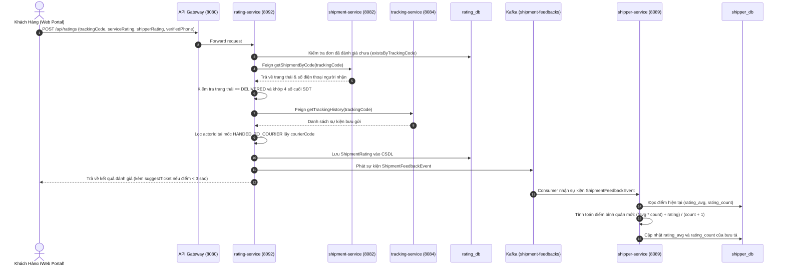

# Cẩm Nang 18: Đánh Giá Bưu Phẩm 2 Tầng, Đối Soát KPI Bưu Tá & Luồng Sự Kiện Kafka

---

## 1. Đặt Vấn Đề & Bối Cảnh Nghiệp Vụ Bưu Chính Thực Tế

Trong chuỗi cung ứng logistics bưu chính, trải nghiệm người nhận hàng tại chặng cuối (Last-Mile Delivery) quyết định trực tiếp tới uy tín thương hiệu và tỷ lệ giữ chân khách hàng của doanh nghiệp vận tải.

### 1.1. Các bẫy nghiệp vụ trong quản trị chất lượng giao nhận truyền thống
* **Đánh giá cào bằng:** Khách hàng không hài lòng vì gói hàng bị móp méo do xe tải liên tỉnh làm dập nhưng lại trút giận chấm 1 sao cho bưu tá phát hàng, khiến điểm thi đua của nhân viên giao nhận bị trừ oan uổng. Ngược lại, hàng đóng gói cẩn thận nhưng bưu tá có thái độ khiếm nhã thì hệ thống lại không bóc tách được nguyên nhân cốt lõi.
* **Đánh giá ảo và spam:** Kẻ xấu hoặc đối thủ cạnh tranh có thể gửi hàng loạt yêu cầu đánh giá tiêu cực nhằm hạ uy tín dịch vụ dù không hề là người nhận kiện hàng thực tế.
* **Thời gian trễ trong phản ứng chăm sóc khách hàng:** Khi khách hàng có trải nghiệm tồi tệ (chấm 1 hoặc 2 sao), thông tin thường chỉ nằm chết trong bảng thống kê hàng tháng của phòng nhân sự, bỏ lỡ thời điểm vàng (trong vòng 15-30 phút đầu tiên) để bộ phận CSKH liên hệ xử lý bồi thường và xoa dịu khách hàng.
* **Độ trễ tính toán KPI bưu tá:** Việc tính toán điểm đánh giá trung bình bằng các câu lệnh SQL tổng hợp nặng nề (`AVG`, `COUNT`, `GROUP BY`) vào cuối tháng gây nghẽn cơ sở dữ liệu và không tạo được động lực cải thiện chất lượng phục vụ theo thời gian thực cho đội ngũ bưu tá.

### 1.2. Giải pháp kiến trúc của VNPT Waybill Platform
Để giải quyết triệt để các tồn tại trên, hệ thống triển khai vi dịch vụ `rating-service` (Cổng 8092) kết nối bất đồng bộ với `shipper-service` (Cổng 8089) và `support-service` (Cổng 8093) qua Apache Kafka KRaft:
* **Mô hình đánh giá 2 tầng độc lập:** Tách bạch rõ ràng giữa điểm chất lượng bưu phẩm/đóng gói/tốc độ (`serviceRating`) và điểm thái độ phục vụ của bưu tá (`shipperRating`) theo thang điểm 1 đến 5 sao.
* **Phòng vệ gian lận 3 lớp:**
  1. Chỉ cho phép đánh giá khi bưu gửi đã đạt trạng thái phát thành công `DELIVERED` (xác thực qua Feign Client gọi `shipment-service`).
  2. Bắt buộc xác thực 4 số cuối số điện thoại người nhận trên vận đơn gốc (`verifiedPhone`).
  3. Khóa cứng đánh giá lặp lại (`uq_shipment_ratings_tracking`), mỗi mã bưu gửi chỉ được đánh giá duy nhất một lần.
* **Truy vết tự động danh tính bưu tá phát hàng:** Tự động tra cứu lịch sử sự kiện `HANDED_TO_COURIER` bên `tracking-service` để lấy mã nhân viên bưu tá (`courierCode`), khách hàng không cần nhập tay mã bưu tá.
* **Tính toán KPI lũy kế thời gian thực (< 10ms):** Bắn sự kiện `ShipmentFeedbackEvent` lên Kafka topic `shipment-feedbacks`. `shipper-service` tiêu thụ sự kiện và áp dụng công thức cập nhật điểm trung bình lũy kế tức thời, lưu vào `rating_avg` và `rating_count`.
* **Kích hoạt quy trình cứu vãn khách hàng (Customer Recovery):** Khi phát hiện điểm đánh giá dưới 3 sao, hệ thống tự động gắn cờ `suggestTicket = true` trong phản hồi để giao diện Web Portal lập tức hiển thị nút kết nối sang trung tâm CSKH `support-service`.

---

## 2. So Sánh Kiến Trúc: Đánh Giá Truyền Thống vs Event-Driven Realtime

| Tiêu Chí So Sánh | Đánh Giá Tạp Nham Cũ | Hệ Thống Đánh Giá Tích Hợp Sẵn |
| :--- | :--- | :--- |
| **Phân loại điểm số** | 1 điểm chung chung cho cả đơn | Phân tách 2 tầng: Dịch vụ bưu chính vs Bưu tá |
| **Kiểm soát tính hợp lệ** | Ai có link cũng chấm được | Bắt buộc trạng thái `DELIVERED` + Khớp 4 số cuối SĐT |
| **Chống đánh giá trùng lặp** | Dễ bị spam liên tục | Unique Constraint CSDL chặn đứng tại tầng dữ liệu |
| **Truy vết bưu tá chịu trách nhiệm** | Bưu tá tự khai hoặc thủ công rà soát | Tự động dò vết `actorId` từ mốc `HANDED_TO_COURIER` |
| **Tính toán điểm KPI bưu tá** | Batch Job cuối tháng chạy `AVG()` nặng CSDL | Event-Driven Kafka tính điểm lũy kế thời gian thực |
| **Phản ứng khi khách bức xúc (< 3 sao)** | Bị động, chờ khách gọi hotline chửi bới | Tự động gợi ý mở ticket cứu vãn trải nghiệm ngay lập tức |

---

## 3. Kiến Trúc Hệ Thống & Luồng Dữ Liệu Đánh Giá (Sequence Flow)



---

## 4. Thiết Kế Cơ Sở Dữ Liệu & Bản Ghi Flyway

Hệ thống tuân thủ nguyên tắc **Database-per-Service**, tách rời cơ sở dữ liệu đánh giá `rating_db` và cơ sở dữ liệu quản trị bưu tá `shipper_db`.

### 4.1. Cấu trúc bảng `shipment_ratings` (`rating_db`)

```sql
IF OBJECT_ID('shipment_ratings', 'U') IS NULL
BEGIN
    CREATE TABLE shipment_ratings (
        id                      BIGINT IDENTITY(1,1) NOT NULL PRIMARY KEY,
        tracking_code           NVARCHAR(50)         NOT NULL,
        courier_code            NVARCHAR(50)         NULL,
        service_rating          INT                  NOT NULL,
        shipper_rating          INT                  NOT NULL,
        tags                    NVARCHAR(500)        NULL,
        comment                 NVARCHAR(MAX)        NULL,
        attachment_urls         NVARCHAR(MAX)        NULL,
        verified_phone          NVARCHAR(10)         NULL,
        created_at              DATETIME2            NOT NULL CONSTRAINT DF_ratings_created_at DEFAULT SYSDATETIME(),
        CONSTRAINT uq_shipment_ratings_tracking UNIQUE (tracking_code)
    );

    CREATE INDEX idx_ratings_tracking_code ON shipment_ratings(tracking_code);
    CREATE INDEX idx_ratings_courier_code ON shipment_ratings(courier_code);
END;
```

### 4.2. Bổ sung trường KPI vào bảng `shippers` (`shipper_db`)

```sql
IF NOT EXISTS (SELECT 1 FROM sys.columns WHERE object_id = OBJECT_ID('shippers') AND name = 'rating_avg')
BEGIN
    ALTER TABLE shippers ADD rating_avg FLOAT NULL CONSTRAINT DF_shippers_rating_avg DEFAULT 5.0;
END;

IF NOT EXISTS (SELECT 1 FROM sys.columns WHERE object_id = OBJECT_ID('shippers') AND name = 'rating_count')
BEGIN
    ALTER TABLE shippers ADD rating_count INT NULL CONSTRAINT DF_shippers_rating_count DEFAULT 0;
END;
```

---

## 5. Hiện Thực Hóa Mã Nguồn Backend Chuẩn Doanh Nghiệp

### 5.1. DTO Sự Kiện Chung (`shared-events`)

```java
package org.app.sharedevents.entity;

import lombok.AllArgsConstructor;
import lombok.Builder;
import lombok.Data;
import lombok.NoArgsConstructor;

import java.io.Serializable;
import java.time.LocalDateTime;
import java.util.List;

@Data
@AllArgsConstructor
@NoArgsConstructor
@Builder
public class ShipmentFeedbackEvent implements Serializable {
    private String eventId;
    private String trackingCode;
    private String courierCode;
    private Integer serviceRating;
    private Integer shipperRating;
    private List<String> tags;
    private String comment;
    private LocalDateTime createdAt;
}
```

### 5.2. Nghiệp Vụ Xử Lý Đánh Giá (`rating-service`)

```java
package org.app.ratingservice.service.impl;

import lombok.RequiredArgsConstructor;
import lombok.extern.slf4j.Slf4j;
import org.app.ratingservice.client.ShipmentClient;
import org.app.ratingservice.client.TrackingClient;
import org.app.ratingservice.dto.request.CreateRatingRequest;
import org.app.ratingservice.dto.response.RatingResponse;
import org.app.ratingservice.dto.response.RatingStatusResponse;
import org.app.ratingservice.entity.ShipmentRating;
import org.app.ratingservice.repository.ShipmentRatingRepository;
import org.app.ratingservice.service.RatingService;
import org.app.sharedevents.entity.ShipmentFeedbackEvent;
import org.springframework.http.HttpStatus;
import org.springframework.kafka.core.KafkaTemplate;
import org.springframework.stereotype.Service;
import org.springframework.transaction.annotation.Transactional;
import org.springframework.web.server.ResponseStatusException;

import java.time.LocalDateTime;
import java.util.Optional;
import java.util.UUID;

@Service
@Slf4j
@RequiredArgsConstructor
public class RatingServiceImpl implements RatingService {

    public static final String TOPIC_FEEDBACK = "shipment-feedbacks";
    private final ShipmentRatingRepository shipmentRatingRepository;
    private final ShipmentClient shipmentClient;
    private final TrackingClient trackingClient;
    private final KafkaTemplate<String, Object> kafkaTemplate;

    @Override
    public RatingStatusResponse checkRatingStatus(String trackingCode) {
        if (trackingCode == null || trackingCode.isBlank()) {
            throw new ResponseStatusException(HttpStatus.BAD_REQUEST, "Mã vận đơn không được để trống");
        }

        String code = trackingCode.trim().toUpperCase();
        Optional<ShipmentRating> rating = shipmentRatingRepository.findByTrackingCode(code);
        if (rating.isPresent()) {
            ShipmentRating r = rating.get();
            return RatingStatusResponse.builder()
                    .trackingCode(code)
                    .isDelivered(true)
                    .hasRated(true)
                    .serviceRating(r.getServiceRating())
                    .shipperRating(r.getShipperRating())
                    .build();
        }

        boolean isDelivered = false;
        try {
            ShipmentClient.ShipmentDetailDto shipment = shipmentClient.getShipmentByCode(code);
            isDelivered = shipment != null && "DELIVERED".equalsIgnoreCase(shipment.getCurrentStatus());
        } catch (Exception e) {
            log.warn("Không thể tra cứu trạng thái giao hàng từ shipment-service cho mã {}: {}", code, e.getMessage());
        }
        return RatingStatusResponse.builder()
                .trackingCode(code)
                .isDelivered(isDelivered)
                .hasRated(false)
                .build();
    }

    @Override
    @Transactional
    public RatingResponse submitRating(CreateRatingRequest request) {
        String trackingCode = request.getTrackingCode().trim().toUpperCase();
        if (shipmentRatingRepository.existsByTrackingCode(trackingCode)) {
            throw new ResponseStatusException(HttpStatus.BAD_REQUEST, "Bưu gửi này đã được đánh giá trước đó.");
        }

        ShipmentClient.ShipmentDetailDto shipment;
        try {
            shipment = shipmentClient.getShipmentByCode(trackingCode);
        } catch (Exception e) {
            throw new ResponseStatusException(HttpStatus.NOT_FOUND, "Không tìm thấy thông tin bưu gửi " + trackingCode);
        }

        if (shipment == null || !"DELIVERED".equalsIgnoreCase(shipment.getCurrentStatus())) {
            throw new ResponseStatusException(HttpStatus.BAD_REQUEST, "Bưu gửi chưa được giao thành công, không thể đánh giá.");
        }

        String rawPhone = shipment.getReceiverPhone();
        String cleanDigits = rawPhone != null ? rawPhone.replaceAll("\\D+", "") : "";
        if (cleanDigits.length() < 4) {
            throw new ResponseStatusException(HttpStatus.BAD_REQUEST, "Số điện thoại người nhận trên đơn hàng không hợp lệ.");
        }
        String expectedLast4Digits = cleanDigits.substring(cleanDigits.length() - 4);
        if (!expectedLast4Digits.equals(request.getVerifiedPhone().trim())) {
            throw new ResponseStatusException(HttpStatus.BAD_REQUEST, "Số điện thoại xác thực không khớp.");
        }

        String courierCode = findCourierCode(trackingCode);

        String tagsStr = (request.getTags() != null && !request.getTags().isEmpty()) ? String.join(",", request.getTags()) : null;
        String attachStr = (request.getAttachmentUrls() != null && !request.getAttachmentUrls().isEmpty()) ? String.join(",", request.getAttachmentUrls()) : null;
        ShipmentRating rating = ShipmentRating.builder()
                .trackingCode(trackingCode)
                .courierCode(courierCode)
                .serviceRating(request.getServiceRating())
                .shipperRating(request.getShipperRating())
                .tags(tagsStr)
                .comment(request.getComment())
                .attachmentUrls(attachStr)
                .verifiedPhone(request.getVerifiedPhone())
                .createdAt(LocalDateTime.now())
                .build();

        ShipmentRating savedRating = shipmentRatingRepository.save(rating);
        ShipmentFeedbackEvent event = ShipmentFeedbackEvent.builder()
                .eventId(UUID.randomUUID().toString())
                .trackingCode(savedRating.getTrackingCode())
                .courierCode(savedRating.getCourierCode())
                .serviceRating(savedRating.getServiceRating())
                .shipperRating(savedRating.getShipperRating())
                .tags(request.getTags())
                .comment(savedRating.getComment())
                .createdAt(savedRating.getCreatedAt())
                .build();

        try {
            kafkaTemplate.send(TOPIC_FEEDBACK, savedRating.getTrackingCode(), event);
        } catch (Exception e) {
            log.error("Lỗi khi phát sự kiện ShipmentFeedbackEvent lên Kafka cho đơn {}", savedRating.getTrackingCode(), e);
        }

        boolean suggestTicket = (savedRating.getServiceRating() < 3 || savedRating.getShipperRating() < 3);
        return RatingResponse.builder()
                .id(savedRating.getId())
                .trackingCode(savedRating.getTrackingCode())
                .serviceRating(savedRating.getServiceRating())
                .shipperRating(savedRating.getShipperRating())
                .messages("Cảm ơn bạn đã gửi đánh giá. Chúng tôi sẽ xem xét phản hồi của bạn.")
                .suggestTicket(suggestTicket)
                .createdAt(savedRating.getCreatedAt())
                .build();
    }

    private String findCourierCode(String trackingCode) {
        try {
            return trackingClient.getTrackingHistory(trackingCode).stream()
                    .filter(history -> "HANDED_TO_COURIER".equalsIgnoreCase(history.getOperationType()))
                    .map(TrackingClient.TrackingHistoryDto::getActorId)
                    .filter(actorId -> actorId != null && !actorId.isBlank())
                    .map(String::trim)
                    .reduce((earlier, later) -> later)
                    .orElse(null);
        } catch (Exception e) {
            log.warn("Không thể lấy mã bưu tá từ tracking-service cho đơn {}: {}", trackingCode, e.getMessage());
            return null;
        }
    }
}
```

### 5.3. Tiêu Thụ Sự Kiện & Tính Toán KPI Lũy Kế (`shipper-service`)

```java
package org.app.shipperservice.consumer;

import lombok.RequiredArgsConstructor;
import lombok.extern.slf4j.Slf4j;
import org.app.sharedevents.entity.ShipmentFeedbackEvent;
import org.app.shipperservice.entity.Shipper;
import org.app.shipperservice.repository.ShipperRepository;
import org.springframework.kafka.annotation.KafkaListener;
import org.springframework.stereotype.Component;
import org.springframework.transaction.annotation.Transactional;

import java.math.BigDecimal;
import java.math.RoundingMode;
import java.util.Optional;

@Slf4j
@Component
@RequiredArgsConstructor
public class ShipmentFeedbackConsumer {

    private final ShipperRepository shipperRepository;

    @KafkaListener(topics = "shipment-feedbacks", groupId = "shipper-service-group")
    @Transactional
    public void handleFeedbackEvent(ShipmentFeedbackEvent event) {
        log.info("Nhận sự kiện ShipmentFeedbackEvent cho đơn {}: shipperRating={}, courierCode={}", event.getTrackingCode(), event.getShipperRating(), event.getCourierCode());

        if (event.getCourierCode() == null || event.getCourierCode().isBlank() || event.getShipperRating() == null) {
            log.warn("Bỏ qua tính KPI vì thiếu courierCode hoặc shipperRating: trackingCode={}", event.getTrackingCode());
            return;
        }

        Optional<Shipper> optShipper = shipperRepository.findByCourierCode(event.getCourierCode());
        if (optShipper.isEmpty()) {
            log.warn("Không tìm thấy bưu tá có mã {} để cập nhật KPI", event.getCourierCode());
            return;
        }

        Shipper shipper = optShipper.get();
        double currentAvg = shipper.getRatingAvg() != null ? shipper.getRatingAvg() : 5.0;
        int currentCount = shipper.getRatingCount() != null ? shipper.getRatingCount() : 0;

        int newCount = currentCount + 1;
        double newAvg = ((currentAvg * currentCount) + event.getShipperRating()) / newCount;
        newAvg = BigDecimal.valueOf(newAvg).setScale(2, RoundingMode.HALF_UP).doubleValue();

        shipper.setRatingAvg(newAvg);
        shipper.setRatingCount(newCount);
        shipperRepository.save(shipper);

        log.info("Đã cập nhật KPI cho bưu tá {} ({}): ratingAvg={}, ratingCount={}", shipper.getFullName(), shipper.getCourierCode(), newAvg, newCount);
    }
}
```

---

## 6. Bộ Câu Hỏi Phỏng Vấn Chuyên Sâu Về Kiến Trúc Đánh Giá & KPI

#### Câu 1: Tại sao nên tách `rating-service` thành một microservice riêng biệt thay vì gộp chung vào `shipment-service`?
Tách riêng giúp tuân thủ nguyên tắc đơn trách nhiệm (Single Responsibility Principle). Khối lượng đọc/ghi đánh giá độc lập hoàn toàn với vòng đời luân chuyển đơn hàng. Tách biệt giúp cô lập cơ sở dữ liệu `rating_db`, không làm tăng kích thước bảng bưu gửi cốt lõi và cho phép mở rộng độc lập khi có các đợt khảo sát chất lượng quy mô lớn.

#### Câu 2: Giải thích thuật toán tính điểm trung bình tích lũy trực tiếp mà không cần đọc lại toàn bộ lịch sử đánh giá?
Thay vì thực hiện truy vấn `SELECT AVG(rating) FROM shipment_ratings WHERE courier_code = ?` quét qua hàng chục nghìn dòng, hệ thống áp dụng công thức toán học gia số:
$$\text{Average}_{\text{new}} = \frac{(\text{Average}_{\text{current}} \times \text{Count}_{\text{current}}) + \text{Rating}_{\text{new}}}{\text{Count}_{\text{current}} + 1}$$
Thời gian tính toán chỉ mất $O(1)$ với độ phức tạp bộ nhớ $O(1)$, thực thi trong chưa đầy 1 mili-giây.

#### Câu 3: Làm thế nào để đảm bảo tính Idempotency khi Kafka Consumer nhận lại cùng một sự kiện đánh giá nhiều lần?
Trong `rating-service`, ràng buộc `UNIQUE (tracking_code)` đảm bảo mỗi bưu gửi chỉ sinh ra duy nhất một bản ghi đánh giá. Tại `shipper-service`, có thể kết hợp kiểm tra `eventId` hoặc lưu vết `lastProcessedEventId` trong bảng nhật ký kiểm toán để tránh cộng dồn hai lần cùng một sự kiện.

#### Câu 4: Tại sao sử dụng `trackingCode` làm partition key khi gửi tin nhắn lên Kafka topic `shipment-feedbacks`?
Sử dụng `trackingCode` làm message key đảm bảo toàn bộ các sự kiện liên quan đến cùng một bưu gửi luôn được phân phối vào cùng một partition cố định theo thuật toán băm `MurmurHash2`, duy trì thứ tự xử lý tuần tự tuyệt đối (Strict Ordering).

#### Câu 5: Nếu dịch vụ `tracking-service` bị sập tạm thời khi khách gửi đánh giá, hệ thống xử lý ra sao?
Khối `try-catch` trong hàm `findCourierCode` bắt ngoại lệ Feign Client và ghi log cảnh báo. Đánh giá vẫn được lưu thành công vào CSDL với `courierCode = null` để ghi nhận phản hồi của khách hàng, đồng thời không làm gián đoạn trải nghiệm người dùng cuối.

#### Câu 6: Làm thế nào để kiểm soát gian lận đánh giá khi kẻ xấu biết được mã vận đơn `trackingCode`?
Hệ thống bắt buộc cung cấp trường `verifiedPhone` chứa 4 chữ số cuối của số điện thoại người nhận. API kiểm tra chéo với dữ liệu bảo mật lưu trên `shipment-service`. Nếu không khớp, yêu cầu bị từ chối ngay với mã lỗi `HTTP 400 Bad Request`.

#### Câu 7: Cơ chế gợi ý cứu vãn trải nghiệm (`suggestTicket`) hoạt động như thế nào?
Khi khách hàng chấm điểm dưới 3 sao cho dịch vụ hoặc bưu tá, backend trả về cờ `suggestTicket = true`. Frontend nhận tín hiệu này sẽ chủ động hiển thị nút mở khiếu nại nhanh, điều hướng sang `support-service` và điền sẵn mã vận đơn, giúp chuyên viên CSKH tiếp nhận xử lý ngay lập tức.

#### Câu 8: Tại sao lại đặt giá trị mặc định `rating_avg = 5.0` và `rating_count = 0` cho bưu tá mới?
Đây là nguyên tắc thiết kế động viên nhân viên mới (Optimistic Default). Bưu tá mới vào nghề được ghi nhận điểm xuất phát tối đa để có cơ hội nhận các cuốc giao hàng chặng cuối, sau đó điểm số sẽ tự cân bằng chuẩn xác theo số lượng đánh giá thực tế của khách hàng.

#### Câu 9: Trong tình huống có hàng ngàn đánh giá được gửi cùng một lúc, Kafka hỗ trợ mở rộng như thế nào?
Kafka đóng vai trò là bộ đệm áp lực (Backpressure Buffer). Khi lượng đánh giá tăng đột biến, các sự kiện xếp hàng an toàn trong topic `shipment-feedbacks`. `shipper-service` có thể tăng số lượng instance consumer trong consumer group `shipper-service-group` để đọc và cập nhật song song tương ứng với số lượng partition của topic.

#### Câu 10: Điểm khác biệt giữa `ShipmentFeedbackEvent` và `ShipmentLifecycleEvent` trong kiến trúc hệ thống là gì?
`ShipmentLifecycleEvent` phản ánh các mốc biến đổi trạng thái vận hành cốt lõi của gói hàng (`CREATED`, `IN_TRANSIT`, `DELIVERED`). Trong khi đó, `ShipmentFeedbackEvent` là sự kiện phản hồi chất lượng phi vận hành (Non-operational Metric), phục vụ phân hệ đánh giá, thi đua khen thưởng và cải tiến quy trình phục vụ.
