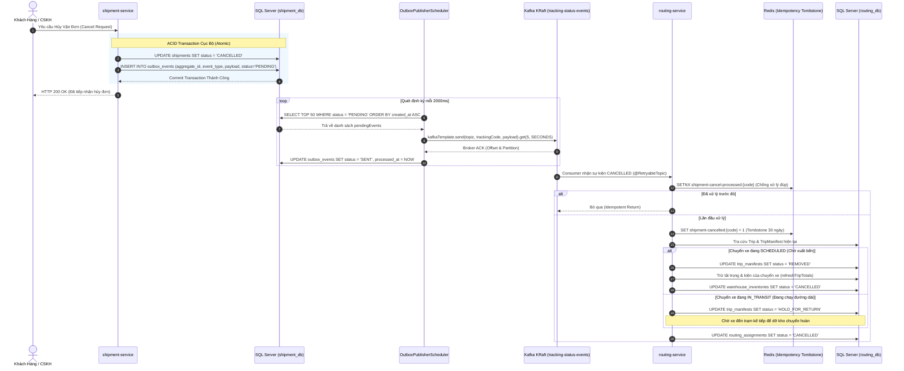

# Cẩm Nang 19: Transactional Outbox Pattern & Saga Compensation Architecture

[](https://www.oracle.com/java/)
[](https://spring.io/projects/spring-boot)
[](https://kafka.apache.org/)
[](https://www.microsoft.com/sql-server)
[](https://redis.io/)

---

## 1. Đặt Vấn Đề Nghiệp Vụ & Thách Thức Kiến Trúc Phân Tán

### 1.1. Nghịch Lý Kép Giữa Database ACID & Message Broker (Dual-Write Problem)
Trong kiến trúc vi dịch vụ bưu chính quy mô lớn, khi khách hàng tạo đơn vận hoặc hủy đơn, hệ thống phải thực hiện 2 thao tác:
1. **Ghi CSDL quan hệ:** Cập nhật bảng `shipments` trong SQL Server.
2. **Phát sự kiện (Event Streaming):** Bắn sự kiện lên Kafka topic `tracking-status-events` để các dịch vụ khác (`routing-service`, `notification-service`, `report-service`) xử lý luồng tiếp theo.

Nếu áp dụng cách tiếp cận thông thường (vừa gọi JPA `save()`, vừa gọi `kafkaTemplate.send()` trong cùng method `@Transactional`), hệ thống tất yếu đối mặt với **Dual-Write Problem**:
- Nếu CSDL commit thành công nhưng mạng tới Kafka gặp sự cố: Kafka không nhận được sự kiện $\rightarrow$ Dữ liệu giữa các vi dịch vụ bị bất đồng bộ nghiêm trọng (Đơn hàng đã tạo nhưng xe trục không bao giờ điều phối).
- Nếu Kafka nhận được sự kiện nhưng commit CSDL bị lỗi hoặc rollback (ví dụ vi phạm ràng buộc): Sự kiện "ma" đã phát ra ngoài $\rightarrow$ Các dịch vụ downstream xử lý một đơn hàng không hề tồn tại trong CSDL nguồn.
- Giao thức phân tán **Two-Phase Commit (2PC / XA Transactions)** không khả thi trên hạ tầng Message Broker hiện đại vì gây tắc nghẽn I/O, giảm throughput hàng chục lần và tạo điểm nghẽn Single Point of Failure (SPOF).

### 1.2. Thách Thức Saga Compensation Trong Vận Tải Đa Chặng
Khi một vận đơn bị hủy (`CANCELLED`) bởi khách hàng hoặc chuyên viên CSKH (`support-service`):
- Kiện hàng có thể đang nằm trong bảng kê (`TripManifest` trạng thái `LOADED`) của một chuyến xe trục (`Trip` trạng thái `SCHEDULED` chờ xuất bến).
- Hoặc chuyến xe đang lăn bánh trên quốc lộ (`Trip` trạng thái `IN_TRANSIT`).
- Nếu chỉ hủy đơn bên `shipment-service` mà không có cơ chế bù trừ giao dịch (**Saga Compensating Transactions**):
  - Chuyến xe bị tính sai tải trọng thực tế, xe bị chiếm chỗ ảo khiến các đơn hàng khác không thể xếp lên.
  - Khi xe cập bến Hub đích, thủ kho sẽ quét dỡ một kiện hàng đã hủy mà không có chỉ dẫn xử lý kho bãi, gây hỗn loạn tại cổng Hub.

---

## 2. Kiến Trúc Giải Pháp & Sơ Đồ Mermaid

Hệ thống triển khai kết hợp 2 mẫu thiết kế kiến trúc phân tán cấp Enterprise:
1. **Transactional Outbox Pattern:** Tận dụng giao dịch ACID cục bộ của SQL Server để lưu bản ghi nghiệp vụ và bản ghi sự kiện `OutboxEvent` vào cùng 1 transaction. Một tiến trình lập lịch độc lập (`OutboxPublisherScheduler`) sẽ quét bảng outbox, gửi sự kiện lên Kafka có xác thực phản hồi (`get()`), và chuyển trạng thái sang `SENT`.
2. **Saga Choreography & Redis Cancellation Tombstone:** Khi `routing-service` nhận sự kiện `CANCELLED` qua Kafka:
   - Ghi khóa bền vững `shipment-cancelled:{trackingCode}` và `shipment-cancel-processed:{trackingCode}` vào Redis với TTL 30 ngày (Idempotency Tombstone).
   - Nếu chuyến xe đang `SCHEDULED`: Lập tức đổi trạng thái manifest sang `REMOVED`, trừ tải trọng và số lượng kiện của chuyến xe, giải phóng tồn kho kho bãi `CANCELLED`.
   - Nếu chuyến xe đang `IN_TRANSIT`: Gắn nhãn `HOLD_FOR_RETURN` để xe tiếp tục chạy, trạm kế tiếp sẽ tự động dỡ kiện nhập kho chờ chuyển hoàn.



---

## 3. Phân Tích Mã Nguồn Thực Tế Trong Dự Án

### 3.1. Cấu Trúc Bảng CSDL Outbox (`V7__create_outbox_events_table.sql`)
Bảng `outbox_events` được quản lý bằng Flyway migration tại `shipment-service`:

```sql
IF NOT EXISTS (SELECT 1 FROM sys.tables WHERE name = 'outbox_events')
BEGIN
CREATE TABLE outbox_events (
    id BIGINT IDENTITY(1,1) PRIMARY KEY,
    aggregate_type VARCHAR(50) NOT NULL,
    aggregate_id VARCHAR(100) NOT NULL,
    event_type VARCHAR(100) NOT NULL,
    payload NVARCHAR(MAX) NOT NULL,
    status VARCHAR(20) NOT NULL CONSTRAINT DF_outbox_events_status DEFAULT 'PENDING',
    created_at DATETIME2 NOT NULL CONSTRAINT DF_outbox_events_created_at DEFAULT GETDATE(),
    processed_at DATETIME2 NULL
);

-- Chỉ mục tối ưu cho Scheduler quét Top 50 bản ghi PENDING
CREATE INDEX idx_outbox_status_created ON outbox_events(status, created_at);
END;
```

### 3.2. Thực Thể Java `OutboxEvent.java`
Được định nghĩa tại gói `org.app.shipmentservice.entity`:

```java
@Entity
@Table(name = "outbox_events")
@Data
@Builder
@NoArgsConstructor
@AllArgsConstructor
public class OutboxEvent {
    @Id
    @GeneratedValue(strategy = GenerationType.IDENTITY)
    private Long id;

    @Column(name = "aggregate_type", nullable = false, length = 50)
    private String aggregateType;

    @Column(name = "aggregate_id", nullable = false, length = 100)
    private String aggregateId;

    @Column(name = "event_type", nullable = false, length = 100)
    private String eventType;

    @Column(name = "payload", nullable = false, columnDefinition = "NVARCHAR(MAX)")
    private String payload;

    @Column(name = "status", nullable = false, length = 20)
    private String status;

    @Column(name = "created_at", nullable = false)
    private LocalDateTime createdAt;

    @Column(name = "processed_at")
    private LocalDateTime processedAt;
}
```

### 3.3. Bộ Lập Lịch Phát Sự Kiện An Toàn (`OutboxPublisherScheduler.java`)
Điểm đặc biệt trong thiết kế:
1. `fixedDelay = 2000`: Chờ 2 giây sau khi lượt quét trước hoàn tất mới bắt đầu lượt kế tiếp, triệt tiêu xung đột đa luồng quét đúp.
2. Gọi đồng bộ `.get(5, TimeUnit.SECONDS)` trên `CompletableFuture` của Kafka: Bảo đảm Broker đã ghi nhận sự kiện vào Commit Log với `acks=all` trước khi cập nhật `SENT` vào CSDL.
3. Nếu Kafka tạm thời không phản hồi hoặc timeout: Bỏ qua việc update `SENT`, giữ nguyên `PENDING` để lần quét sau tự động gửi lại (At-Least-Once Delivery).

```java
@Component
@RequiredArgsConstructor
@Slf4j
public class OutboxPublisherScheduler {

    private final OutboxEventRepository outboxEventRepository;
    private final KafkaTemplate<String, Object> kafkaTemplate;
    private final ObjectMapper objectMapper;

    @Scheduled(fixedDelay = 2000)
    public void publishPendingEvents() {
        List<OutboxEvent> pendingEvents = outboxEventRepository.findTop50ByStatusOrderByCreatedAtAsc("PENDING");
        if (pendingEvents.isEmpty()) {
            return;
        }

        for (OutboxEvent event : pendingEvents) {
            try {
                ShipmentStatusUpdatedEvent payload = objectMapper.readValue(event.getPayload(), ShipmentStatusUpdatedEvent.class);

                // send() đưa thư, .get() chờ Kafka xác nhận đã ghi nhận
                kafkaTemplate.send("tracking-status-events", event.getAggregateId(), payload)
                        .get(5, TimeUnit.SECONDS);

                event.setStatus("SENT");
                event.setProcessedAt(LocalDateTime.now());
                outboxEventRepository.save(event);

                log.info("[OUTBOX] Đã bắn event {} thành công cho đơn {}", event.getEventType(), event.getAggregateId());
            } catch (InterruptedException e) {
                Thread.currentThread().interrupt();
                log.error("[OUTBOX] Bị ngắt khi chờ Kafka ack cho event {}", event.getId());
            } catch (Exception e) {
                // Giữ nguyên PENDING, 2 giây nữa vòng quét sau sẽ gửi lại
                log.error("[OUTBOX] Gửi thất bại event {}: {}", event.getId(), e.getMessage());
            }
        }
    }
}
```

### 3.4. Saga Compensation Phía `routing-service` (`ShipmentCancelledConsumer.java`)
Xử lý toàn diện các kịch bản hủy chuyến xe và giải phóng kho:

```java
@KafkaListener(topics = "tracking-status-events", groupId = "routing-cancel-group")
@Transactional
@RetryableTopic(attempts = "3", backOff = @BackOff(delay = 1000, multiplier = 2))
public void handleCancelledShipmentEvent(ShipmentStatusUpdatedEvent event) {
    if (event == null || event.getTrackingCode() == null || !"CANCELLED".equalsIgnoreCase(event.getStatus())) {
        return;
    }

    String trackingCode = event.getTrackingCode().trim().toUpperCase();
    
    // Durable Tombstone: Ngăn sự kiện tạo đơn đến trễ tái kích hoạt lộ trình đã hủy
    redisTemplate.opsForValue().set("shipment-cancelled:" + trackingCode, "1", Duration.ofDays(30));

    // Idempotent Filter chống xử lý trùng lặp
    Boolean isFirstTime = redisTemplate.opsForValue().setIfAbsent(
            "shipment-cancel-processed:" + trackingCode, "1", Duration.ofDays(30));
    if (Boolean.FALSE.equals(isFirstTime)) {
        log.info("Sự kiện hủy đơn {} đã xử lý trước đó. Bỏ qua.", trackingCode);
        return;
    }

    try {
        LocalDateTime now = LocalDateTime.now();
        Optional<TripManifest> activeManifest = manifestRepository.findByTrackingCode(trackingCode).stream()
                .filter(m -> "LOADED".equalsIgnoreCase(m.getStatus()) || "HOLD_FOR_RETURN".equalsIgnoreCase(m.getStatus()))
                .findFirst();
        
        if (activeManifest.isPresent()) {
            TripManifest manifest = activeManifest.get();
            Trip trip = tripRepository.findById(manifest.getTripId()).orElse(null);

            if (trip != null && "SCHEDULED".equalsIgnoreCase(trip.getStatus())) {
                // KỊCH BẢN 1: Xe chưa xuất bến -> Tháo dỡ kiện, giải phóng tải xe ngay lập tức
                manifest.setStatus("REMOVED");
                manifest.setUnloadedAt(now);
                manifestRepository.save(manifest);
                releaseCancelledInventory(inventory, now);
                refreshTripTotals(trip);
            } else if (trip != null && "IN_TRANSIT".equalsIgnoreCase(trip.getStatus())) {
                // KỊCH BẢN 2: Xe đang lăn bánh trên đường -> Đánh dấu giữ hàng chờ dỡ ở trạm tới
                manifest.setStatus("HOLD_FOR_RETURN");
                manifestRepository.save(manifest);
            }
        }
    } catch (RuntimeException failure) {
        redisTemplate.delete("shipment-cancel-processed:" + trackingCode);
        throw failure;
    }
}
```

---

## 4. Bộ Boilerplate Độc Lập Cho Doanh Nghiệp (Copy-Paste Ready)

Dưới đây là module độc lập **Generic Transactional Outbox Engine** có thể tích hợp trực tiếp vào bất kỳ vi dịch vụ Spring Boot 3 nào:

```java
// =========================================================================
// GenericOutboxService.java
// =========================================================================
package com.enterprise.boilerplate.outbox;

import com.fasterxml.jackson.core.JsonProcessingException;
import com.fasterxml.jackson.databind.ObjectMapper;
import lombok.RequiredArgsConstructor;
import org.springframework.stereotype.Service;
import org.springframework.transaction.annotation.Propagation;
import org.springframework.transaction.annotation.Transactional;

import java.time.LocalDateTime;

@Service
@RequiredArgsConstructor
public class GenericOutboxService {

    private final GenericOutboxRepository outboxRepository;
    private final ObjectMapper objectMapper;

    /**
     * Bắt buộc tham gia vào Transaction hiện tại của nghiệp vụ chính.
     * Nếu nghiệp vụ chính rollback, bản ghi Outbox này cũng tự động rollback.
     */
    @Transactional(propagation = Propagation.MANDATORY)
    public void recordEvent(String aggregateType, String aggregateId, String eventType, Object payloadObject) {
        try {
            String jsonPayload = objectMapper.writeValueAsString(payloadObject);
            GenericOutboxEntity entity = GenericOutboxEntity.builder()
                    .aggregateType(aggregateType)
                    .aggregateId(aggregateId)
                    .eventType(eventType)
                    .payload(jsonPayload)
                    .status("PENDING")
                    .createdAt(LocalDateTime.now())
                    .build();
            outboxRepository.save(entity);
        } catch (JsonProcessingException e) {
            throw new IllegalArgumentException("Không thể serialize payload sang JSON", e);
        }
    }
}
```

---

## 5. 10 Câu Hỏi Phỏng Vấn Chuyên Sâu & Đáp Án Thực Chiến

### Câu 1: Dual-Write Problem là gì và tại sao @Transactional không thể giải quyết triệt để?
**Đáp án:** Dual-write xảy ra khi ứng dụng phải cập nhật hai hệ thống lưu trữ phân tán khác nhau (ví dụ SQL Database và Kafka Broker). `@Transactional` của Spring chỉ có hiệu lực với Transaction Manager của Database cục bộ (JDBC/Hibernate), không thể kiểm soát commit trên Kafka Broker. Nếu CSDL commit thành công nhưng Kafka bị disconnect, hoặc ngược lại Kafka nhận được message nhưng CSDL rollback, dữ liệu giữa 2 hệ thống sẽ bị vênh vĩnh viễn.

### Câu 2: Ưu và nhược điểm của Transactional Outbox Pattern so với Debezium CDC (Change Data Capture)?
**Đáp án:**
- **Outbox Pattern (Polling):** Dễ triển khai, kiểm soát hoàn toàn cấu trúc payload bằng code Java, độc lập với cơ chế database log nội bộ. Nhược điểm: Tạo tải polling nhỏ lên CSDL và có độ trễ nhất định (vài trăm ms đến vài giây theo chu kỳ poll).
- **Debezium CDC:** Đọc trực tiếp Transaction Log của CSDL (SQL Server CDC hoặc Postgres WAL), độ trễ cực thấp (< 100ms), không tốn query database. Nhược điểm: Phức tạp trong vận hành hạ tầng Kafka Connect, phụ thuộc chặt chẽ vào quyền quản trị CSDL cấp root và khó biến đổi payload linh hoạt trước khi phát sự kiện.

### Câu 3: Tại sao trong `OutboxPublisherScheduler`, ta lại gọi `kafkaTemplate.send().get(5, TimeUnit.SECONDS)` thay vì async callback?
**Đáp án:** Gọi `.get()` biến lệnh gửi bất đồng bộ thành đồng bộ để khối code block lại cho đến khi nhận được xác nhận ACK từ Kafka cluster. Nếu có lỗi mạng hoặc Broker timeout, exception sẽ được ném ra ngay tại chỗ, ngăn method đánh dấu `SENT` cho bản ghi outbox, bảo đảm nguyên tắc At-Least-Once Delivery. Nếu dùng async callback, method sẽ hoàn thành trước khi nhận ACK, dẫn đến rủi ro bản ghi outbox được đánh dấu hoàn thành trong khi Kafka chưa thực sự lưu được tin nhắn.

### Câu 4: Làm thế nào để đảm bảo thứ tự sự kiện (Ordering) trong Outbox Pattern khi có nhiều Worker chạy song song?
**Đáp án:**
1. Áp dụng cơ chế **Partitioning theo Aggregate ID:** Luôn truyền `aggregateId` (ví dụ `trackingCode`) làm Message Key của Kafka để tất cả sự kiện của cùng 1 đơn hàng luôn rơi vào cùng 1 Partition.
2. Ở tầng Database Outbox: Sắp xếp theo `created_at ASC, id ASC` và dùng distributed lock (hoặc chạy Scheduler dạng Leader-Election / Single Instance per Service) để tránh việc 2 worker cùng quét và gửi đúp các sự kiện của cùng một đơn hàng nhưng bị hoán đổi thứ tự.

### Câu 5: Saga Pattern dạng Choreography khác gì so với Orchestration? Hệ thống này áp dụng dạng nào?
**Đáp án:**
- **Orchestration:** Sử dụng một dịch vụ trung tâm (Saga Orchestrator) để điều khiển, gửi lệnh tuần tự đến từng dịch vụ tham gia và ra lệnh rollback khi có sự cố.
- **Choreography:** Không có dịch vụ điều phối trung tâm; các dịch vụ tự lắng nghe sự kiện từ Kafka và tự quyết định hành động tiếp theo hoặc thực hiện hành động bù trừ (Compensating Transaction).
- Dự án này áp dụng **Choreography**: `shipment-service` phát sự kiện `CANCELLED` lên topic Kafka, `routing-service` tự tiêu thụ và tự điều phối việc tháo dỡ kiện, giải phóng tải xe mà không cần `shipment-service` phải biết cấu trúc nội bộ của `routing-service`.

### Câu 6: "Compensating Transaction" (Giao dịch bù trừ) là gì và tại sao không thể dùng rollback trong Saga?
**Đáp án:** Trong kiến trúc microservices, mỗi dịch vụ có CSDL riêng độc lập và giao dịch cục bộ của các bước trước đó đã được COMMIT thành công (không thể rollback vật lý theo kiểu CSDL quan hệ). Do đó, khi bước sau gặp lỗi, hệ thống phải thực hiện "Giao dịch bù trừ" (Compensating Transaction) - tức là một thao tác nghiệp vụ mới mang tính đảo ngược hệ quả của bước trước đó (ví dụ: chuyển tiền bồi hoàn, đổi trạng thái từ `LOADED` sang `REMOVED`, trừ tải trọng chuyến xe).

### Câu 7: Redis Cancellation Tombstone giải quyết vấn đề Race Condition nào trong luồng hủy đơn?
**Đáp án:** Trong hệ thống phân tán, do mạng trễ hoặc Kafka rebalance, sự kiện hủy đơn (`CANCELLED`) có thể đến `routing-service` TRƯỚC KHI sự kiện tạo đơn (`CREATED`) được xử lý xong. Nếu không có Tombstone, sự kiện `CREATED` đến sau sẽ khởi tạo một lộ trình mới cho đơn hàng đã bị hủy. Bằng cách ghi key tombstone bền vững `shipment-cancelled:{code}` vào Redis, bất kỳ luồng xử lý định tuyến nào sau này khi nhận sự kiện tạo đơn đều phải kiểm tra key này; nếu tồn tại, nó sẽ lập tức hủy bỏ việc xếp chuyến.

### Câu 8: Xử lý thế nào nếu chuyến xe trục đang chạy trên quốc lộ (`IN_TRANSIT`) nhưng bưu gửi trên xe bị khách hàng yêu cầu hủy?
**Đáp án:** Khi xe đang chạy ở tốc độ cao trên đường, không thể vật lý tháo dỡ kiện hàng xuống xe ngay lập tức. Do đó, `routing-service` chuyển trạng thái manifest sang `HOLD_FOR_RETURN` nhưng vẫn giữ nguyên tải trọng trên xe. Khi xe cập bến Hub kế tiếp (`arriveAtStop`), nhân viên quét mã dỡ hàng sẽ nhận diện cờ `HOLD_FOR_RETURN` để dỡ kiện vào khu vực lưu kho chuyển hoàn thay vì phân luồng đi tiếp chặng sau.

### Câu 9: Trong Outbox Pattern, làm sao để dọn dẹp (Cleanup) bảng `outbox_events` để không làm phình CSDL SQL Server?
**Đáp án:** Có 3 chiến lược:
1. Thiết lập một Scheduled Job chạy vào ban đêm: `DELETE FROM outbox_events WHERE status = 'SENT' AND processed_at < DATEADD(day, -7, GETDATE())`.
2. Lưu các bản ghi đã gửi sang bảng lưu trữ `outbox_events_archive` phục vụ kiểm toán trước khi xóa khỏi bảng chính.
3. Sử dụng Table Partitioning theo tháng và Drop partition cũ sau khi hết thời hạn lưu trữ.

### Câu 10: Tại sao Consumer trong Saga phải luôn đảm bảo tính Idempotency (Bất biến lũy thừa)?
**Đáp án:** Do cơ chế At-Least-Once Delivery của Kafka và cơ chế Retry tự động (`@RetryableTopic`), một sự kiện bù trừ có thể được gửi và xử lý nhiều hơn 1 lần. Nếu consumer không idempotent, việc trừ tải trọng chuyến xe hoặc cập nhật số lượng kiện có thể bị trừ lặp lại nhiều lần, dẫn đến sai lệch nghiêm trọng số liệu vật lý của chuyến xe. Consumer áp dụng Redis `SETNX` với transaction ID để chặn đứng 100% các request xử lý lặp.
