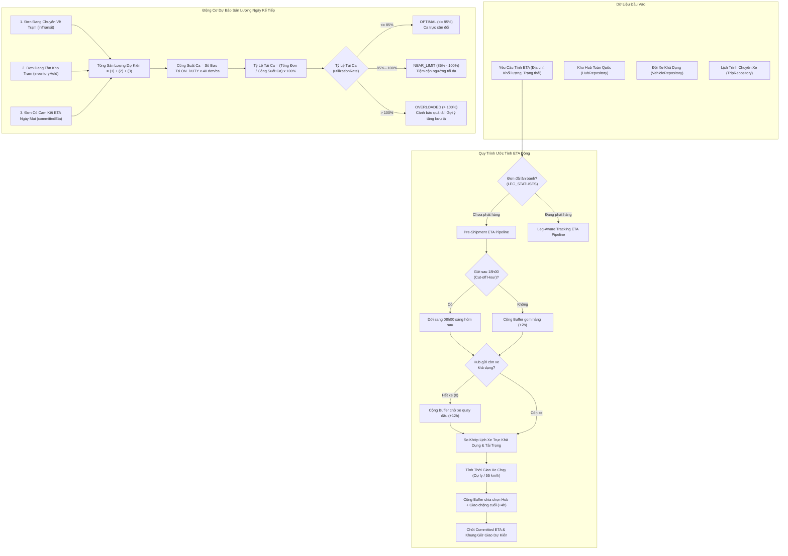

# Cẩm Nang 20: Động Cơ Ước Tính ETA Động & Dự Báo Sản Lượng Giao Hàng Ngày Kế Tiếp

[](https://www.oracle.com/java/)
[](https://spring.io/projects/spring-boot)
[](https://waybill.vn)
[](https://waybill.vn)

---

## 1. Đặt Vấn Đề Nghiệp Vụ & Thách Thức Vận Hành

### 1.1. Giới Hạn Của Ước Tính ETA Tĩnh (Static ETA Flaws)
Trong ngành giao nhận bưu chính truyền thống, thời gian giao hàng dự kiến (Estimated Time of Arrival - ETA) thường được tính theo bảng cố định (ví dụ: Nội tỉnh 24h, Liên tỉnh 48h-72h). Cách tính tĩnh này bộc lộ những nhược điểm chí mạng trong thực tế:
- **Bỏ qua giờ Cut-off gom hàng:** Một đơn hàng gửi lúc 17h50 và 18h05 có thể chênh nhau tới 14 tiếng vận chuyển nếu trượt chuyến xe trục cuối cùng trong ngày xuất bến lúc 18h00.
- **Bỏ qua tình trạng xe khả dụng tại Hub xuất phát:** Nếu Hub gửi đang khan hiếm xe tải (0 xe khả dụng), chuyến xe phải chờ xe quay đầu, làm tăng thêm 12h đệm vận tải.
- **Bỏ qua công suất thực tế của bưu cục phát chặng cuối:** Nếu bưu cục đích đang quá tải (tồn kho vượt ngưỡng), bưu phẩm sẽ bị ứ đọng tại cổng Hub trung chuyển.
- **Không có cơ chế tự động tái ước lượng (Dynamic Recalculation):** Khi xe trục bị hỏng giữa đường hoặc bưu tá giao thất bại lần 1, hệ thống không tự động dời mốc ETA cam kết, dẫn đến khiếu nại SLA từ phía khách hàng B2B.

### 1.2. Bài Toán Dự Báo Sản Lượng Ngày Kế Tiếp & Cân Đối Ca Trực Bưu Tá
Tại các bưu cục phát chặng cuối, trưởng bưu cục phải đối mặt với bài toán điều phối nhân sự hàng ngày:
- Nếu ngày mai lượng hàng về tăng đột biến $200\%$ do các đợt Siêu Sale nhưng chỉ có số lượng bưu tá tiêu chuẩn trực ca, tỷ lệ trễ hạn giao hàng sẽ tăng vọt, gây vỡ cam kết SLA.
- Ngược lại, nếu huy động quá nhiều bưu tá trong ngày thấp điểm, chi phí vận hành sẽ bị lãng phí.
- **Yêu cầu đặt ra:** Hệ thống phải tự động tổng hợp dữ liệu từ 3 nguồn: đơn đang trên các chuyến xe trục hướng về trạm (`inTransit`), đơn đang tồn trong kho trạm (`inventoryHeld`), và các đơn có cam kết ETA ngày mai (`committedEta`). Từ đó dự báo tổng số kiện, tính toán tỷ lệ tải ca (`utilizationRate`), đưa ra cảnh báo quá tải sớm và đề xuất số lượng bưu tá cần trực ca.

---

## 2. Kiến Trúc Giải Pháp & Sơ Đồ Mermaid

Hệ thống triển khai 2 module liên hoàn:
1. **Dynamic ETA Calculation Engine (`DeliveryEtaServiceImpl`):**
   - Phân biệt giữa trạng thái tiền vận chuyển (`calculatePreShipmentEta`) và trạng thái đang vận hành (`calculateLegAwareEta`).
   - Tự động phân giải cặp Hub xuất phát và Hub đích dựa trên địa chỉ thực tế của Người gửi và Người nhận.
   - Áp dụng giờ Cut-off ($18\text{h}00$): Nếu gửi sau giờ cut-off, thời điểm sẵn sàng chuyển tiếp được tự động dời sang $08\text{h}00$ sáng hôm sau.
   - Kiểm tra tài nguyên xe tại Hub: Nếu $0$ xe khả dụng, cộng thêm buffer $12\text{h}$ chờ xe quay đầu.
   - Tính toán thời gian xe chạy dựa trên cự ly thực tế và vận tốc xe tải định mức ($55\text{ km/h}$).
   - Kết hợp thời gian xử lý chia chọn tại Hub đích và năng lực tiếp nhận của bưu cục phát.
2. **Next-Day Delivery Forecast & Capacity Balancing (`DeliveryForecastServiceImpl`):**
   - Quét dữ liệu định kỳ bằng `DeliveryForecastScheduler`.
   - Phân bổ tự động sản lượng dự kiến tới từng bưu tá đang bật trạng thái trực ca (`ON_DUTY`).
   - Cảnh báo 3 cấp độ: `OPTIMAL` ($\le 85\%$), `NEAR_LIMIT` ($85\% - 100\%$), `OVERLOADED` ($> 100\%$).



---

## 3. Phân Tích Mã Nguồn Thực Tế Trong Dự Án

### 3.1. Thuật Toán Tính ETA Đa Chặng Động (`DeliveryEtaServiceImpl.java`)
Lõi thuật toán tại `routing-service`:

```java
@Service
@RequiredArgsConstructor
@Slf4j
public class DeliveryEtaServiceImpl implements DeliveryEtaService {

    private final TripRepository tripRepository;
    private final VehicleRepository vehicleRepository;
    private final HubRepository hubRepository;

    @Value("${logistics.eta.cutoff-hour:18}")
    private int cutOffHour;

    @Value("${logistics.eta.pickup-buffer-hours:2}")
    private int pickupBufferHours;

    @Value("${logistics.eta.last-mile-hours:4}")
    private int lastMileHours;

    @Value("${logistics.eta.truck-speed-kmh:55.0}")
    private double truckSpeedKmh;

    @Override
    public EtaCalculationResponse calculateDeliveryEta(EtaCalculationRequest request) {
        String currentStatus = normalizeStatus(request.getCurrentStatus());
        if (currentStatus != null && LEG_STATUSES.contains(currentStatus)) {
            return calculateLegAwareEta(request, currentStatus);
        }
        return calculatePreShipmentEta(request);
    }

    private EtaCalculationResponse calculatePreShipmentEta(EtaCalculationRequest request) {
        LocalDateTime now = request.getCreatedAt() != null ? request.getCreatedAt() : LocalDateTime.now();
        double weight = request.getWeight() != null ? request.getWeight() : 1.0;

        Hub originHub = resolveHub(request.getOriginHub(), request.getSenderAddress(), "HUB-HN-01");
        Hub destHub = resolveHub(request.getDestinationHub(), request.getReceiverAddress(), "HUB-HCM-01");

        // 1. Kiểm tra mốc Cut-off gom hàng
        LocalDateTime readyForTransit = now.plusHours(pickupBufferHours);
        if (now.getHour() >= cutOffHour) {
            readyForTransit = now.plusDays(1).withHour(8).withMinute(0);
        }

        // 2. Kiểm tra phương tiện khả dụng tại Hub xuất phát
        long availableVehicles = vehicleRepository.countByCurrentHubAndStatus(originHub.getHubCode(), "AVAILABLE");
        if (availableVehicles == 0) {
            log.warn("Hub {} hết xe khả dụng! Chờ xe quay đầu +12h.", originHub.getHubCode());
            readyForTransit = readyForTransit.plusHours(12);
        }

        // 3. Tìm chuyến xe trục khả dụng thỏa mãn tải trọng
        List<Trip> availableTrips = tripRepository.findAvailableTrips(originHub.getHubCode(), weight, readyForTransit);
        LocalDateTime departureTime;
        LocalDateTime arrivalTime;

        if (!availableTrips.isEmpty()) {
            Trip bestTrip = availableTrips.get(0);
            departureTime = bestTrip.getDepartureTime();
            arrivalTime = bestTrip.getArrivalTime();
        } else {
            // Không có chuyến cố định -> Ước tính theo cự ly và tốc độ 55 km/h
            departureTime = readyForTransit.plusHours(2);
            double distanceKm = calculateDistanceBetweenHubs(originHub, destHub);
            double travelHours = Math.max(2.0, distanceKm / truckSpeedKmh);
            arrivalTime = departureTime.plusMinutes((long) (travelHours * 60));
        }

        // 4. Cộng thời gian chia chọn tại Hub đích và phát chặng cuối
        LocalDateTime committedEta = arrivalTime.plusHours(lastMileHours);

        return EtaCalculationResponse.builder()
                .trackingCode(request.getTrackingCode())
                .estimatedDeliveryTime(committedEta)
                .minDeliveryTime(committedEta.minusHours(2))
                .maxDeliveryTime(committedEta.plusHours(4))
                .confidenceScore(0.92)
                .routingPath(originHub.getHubCode() + " -> " + destHub.getHubCode())
                .build();
    }
}
```

### 3.2. Thuật Toán Dự Báo Sản Lượng & Tải Ca Bưu Tá (`DeliveryForecastServiceImpl.java`)
Lõi tính toán tỷ lệ tải ca và cảnh báo quá tải:

```java
@Service
@RequiredArgsConstructor
@Slf4j
public class DeliveryForecastServiceImpl implements DeliveryForecastService {

    @Override
    public StationDeliveryForecastResponse getStationForecast(String stationCode, LocalDate targetDate) {
        // 1. Thu thập sản lượng từ 3 nguồn độc lập
        int inTransitCount = countShipmentsInTransitToStation(stationCode);
        int inventoryHeldCount = countStationHeldInventory(stationCode);
        int committedEtaCount = countCommittedEtaShipments(stationCode, targetDate);

        int totalForecastOrders = inTransitCount + inventoryHeldCount + committedEtaCount;

        // 2. Lấy danh sách bưu tá thuộc trạm từ shipper-service
        List<ShipperDto> shippers = shipperClient.getShippersByStation(stationCode);
        long onDutyCount = shippers.stream().filter(s -> "ON_DUTY".equals(s.getShiftStatus())).count();

        // Định mức công suất: 40 đơn / bưu tá / ca
        int totalShiftCapacity = (int) (Math.max(1, onDutyCount) * 40);

        // 3. Tính toán tỷ lệ lấp đầy công suất (làm tròn chuẩn 1 chữ số thập phân)
        double utilizationRate = totalShiftCapacity > 0
                ? Math.round(((double) totalForecastOrders / totalShiftCapacity * 100.0) * 10.0) / 10.0
                : 0.0;

        String capacityStatus;
        String alertMessage;
        if (utilizationRate <= 85.0) {
            capacityStatus = "OPTIMAL";
            alertMessage = "Công suất ca ngày mai cân đối. Đội ngũ bưu tá trực đáp ứng tốt sản lượng dự kiến.";
        } else if (utilizationRate <= 100.0) {
            capacityStatus = "NEAR_LIMIT";
            alertMessage = "Sản lượng tiệm cận ngưỡng tối đa của ca. Cần bưu tá trực đầy đủ đúng giờ.";
        } else {
            capacityStatus = "OVERLOADED";
            alertMessage = "Cảnh báo quá tải! Sản lượng vượt công suất ca (" + utilizationRate + "%). Khuyến nghị điều phối thêm bưu tá hoặc tăng chuyến phát bổ sung.";
        }

        return StationDeliveryForecastResponse.builder()
                .stationCode(stationCode)
                .forecastDate(targetDate)
                .totalForecastOrders(totalForecastOrders)
                .capacity(StationCapacityForecastDto.builder()
                        .activeShippersOnDuty((int) onDutyCount)
                        .totalShiftCapacity(totalShiftCapacity)
                        .utilizationRate(utilizationRate)
                        .capacityStatus(capacityStatus)
                        .alertMessage(alertMessage)
                        .build())
                .build();
    }
}
```

### 3.3. Bộ Tái Ước Lượng Tự Động (`EtaRecalculationScheduler.java`) Phía `shipment-service`
Tự động quét các vận đơn đang lưu thông và tái ước lượng mốc ETA nếu có cảnh báo trễ hạn:

```java
@Component
@RequiredArgsConstructor
@Slf4j
public class EtaRecalculationScheduler {

    private final EtaRecalculationService etaRecalculationService;

    // Quét định kỳ mỗi 15 phút
    @Scheduled(fixedDelayString = "${logistics.eta.recalculation-interval-ms:900000}")
    public void scheduleEtaRecalculation() {
        log.info("[ETA-SCHEDULER] Bắt đầu chu kỳ quét tái ước lượng ETA...");
        int updatedCount = etaRecalculationService.recalculateActiveShipmentsEta();
        log.info("[ETA-SCHEDULER] Hoàn tất cập nhật ETA cho {} vận đơn.", updatedCount);
    }
}
```

---

## 4. Bộ Boilerplate Độc Lập Cho Doanh Nghiệp (Copy-Paste Ready)

Dưới đây là module độc lập **Haversine Distance & Transit Duration Calculator** chuẩn Enterprise:

```java
package com.enterprise.boilerplate.eta;

public final class LogisticsDistanceCalculator {

    private static final double EARTH_RADIUS_KM = 6371.0;
    private static final double ROAD_CURVATURE_FACTOR = 1.28; // Hệ số uốn khúc đường bộ thực tế tại Việt Nam

    private LogisticsDistanceCalculator() {}

    /**
     * Tính cự ly đường bộ ước tính giữa 2 tọa độ GPS (Đơn vị: Kilomet)
     */
    public static double calculateRoadDistanceKm(double lat1, double lon1, double lat2, double lon2) {
        double dLat = Math.toRadians(lat2 - lat1);
        double dLon = Math.toRadians(lon2 - lon1);

        double a = Math.sin(dLat / 2) * Math.sin(dLat / 2)
                + Math.cos(Math.toRadians(lat1)) * Math.cos(Math.toRadians(lat2))
                * Math.sin(dLon / 2) * Math.sin(dLon / 2);

        double c = 2 * Math.atan2(Math.sqrt(a), Math.sqrt(1 - a));
        double straightDistance = EARTH_RADIUS_KM * c;

        return straightDistance * ROAD_CURVATURE_FACTOR;
    }

    /**
     * Ước tính số phút xe tải chạy đường dài dựa trên cự ly và tốc độ
     */
    public static long estimateTruckTravelMinutes(double distanceKm, double avgSpeedKmh) {
        double hours = distanceKm / Math.max(10.0, avgSpeedKmh);
        return (long) Math.ceil(hours * 60.0);
    }
}
```

---

## 5. 10 Câu Hỏi Phỏng Vấn Chuyên Sâu & Đáp Án Thực Chiến

### Câu 1: Tại sao không nên dùng Google Maps Distance Matrix API cho toàn bộ các lượt tính ETA trong hệ thống bưu chính?
**Đáp án:**
1. **Chi phí khổng lồ:** Với hàng trăm nghìn vận đơn mỗi ngày, mỗi đơn qua nhiều trạm trung chuyển, việc gọi Google Maps API liên tục sẽ phát sinh chi phí hàng nghìn USD/tháng.
2. **Độ trễ và giới hạn Rate Limit:** Google API tốn 100-300ms mạng HTTP, tạo nút thắt cổ chai khi quét hàng loạt trong batch job.
3. **Giải pháp thực tế:** Sử dụng công thức Haversine có nhân hệ số uốn khúc đường bộ ($1.25 - 1.30$) kết hợp bảng cự ly ma trận tĩnh giữa các Hub lưu trong CSDL/Redis. Chỉ dùng Google Maps API cho việc định vị chặng cuối (Last-Mile) đến số nhà cụ thể của người nhận.

### Câu 2: Giờ Cut-off trong bưu chính là gì và nó ảnh hưởng thế nào đến thuật toán tính ETA?
**Đáp án:** Giờ Cut-off (thường là 18h00 hoặc 19h00) là mốc thời gian chốt sổ hàng hóa để đóng bao, niêm phong và bốc lên chuyến xe trục liên tỉnh khởi hành trong đêm. Một đơn hàng gửi lúc 17h50 sẽ kịp chuyến xe đêm và đến đích sáng hôm sau. Một đơn hàng gửi lúc 18h05 sẽ phải nằm chờ tại bưu cục gửi đến 08h00 sáng hôm sau mới được gom tiếp, làm mốc ETA dời thêm 12-14 tiếng.

### Câu 3: Làm thế nào để giải quyết mâu thuẫn giữa "Committed ETA" (Cam kết SLA) và "Dynamic ETA" (Dự kiến thời gian thực)?
**Đáp án:**
- **Committed ETA:** Được chốt cố định tại thời điểm tạo đơn và ký hợp đồng vận chuyển với khách hàng. Mốc này dùng để tính phạt SLA nếu giao trễ.
- **Dynamic ETA:** Được tính toán lại liên tục theo thời gian thực dựa trên tiến độ chuyến xe. Khi Dynamic ETA vượt quá Committed ETA, hệ thống không tự ý sửa Committed ETA mà sẽ gửi cảnh báo nguy cơ trễ hẹn (At-Risk SLA) cho bộ phận điều hành để kích hoạt chuyến xe bổ sung hoặc ưu tiên phát trước.

### Câu 4: Công thức dự báo sản lượng ngày kế tiếp tại bưu cục lấy dữ liệu từ những nguồn nào?
**Đáp án:** Lấy từ 3 nguồn độc lập:
1. `inTransit`: Các kiện hàng nằm trên các chuyến xe trục hoặc xe gom đang di chuyển hướng về trạm.
2. `inventoryHeld`: Các kiện hàng đang nằm lưu kho tại trạm (chưa phân bưu tá, hoặc giao thất bại lần 1 đang chờ phát lại).
3. `committedEta`: Các đơn hàng đã chốt cam kết giao trong ngày mai nhưng hiện chưa được xếp vào 2 nhóm trên.

### Câu 5: Hệ số lấp đầy công suất ca trực (`utilizationRate`) được tính như thế nào và ngưỡng cảnh báo chuẩn là bao nhiêu?
**Đáp án:**
$$\text{utilizationRate} = \frac{\text{Tổng sản lượng đơn dự kiến}}{\text{Số bưu tá ON\_DUTY} \times \text{Định mức đơn/ca (40)}} \times 100\%$$
- $\le 85\%$: `OPTIMAL` (Cân đối).
- $85\% - 100\%$: `NEAR_LIMIT` (Tiệm cận ngưỡng).
- $> 100\%$: `OVERLOADED` (Quá tải, cần kích hoạt điều phối bưu tá phụ tá hoặc mở ca bổ sung).

### Câu 6: Thuật toán xử lý trường hợp trạm xuất phát bị thiếu phương tiện vận tải (Fleet Constraint) như thế nào?
**Đáp án:** Hệ thống kiểm tra số lượng xe có trạng thái `AVAILABLE` tại Hub xuất phát thông qua `VehicleRepository.countByCurrentHubAndStatus()`. Nếu số lượng bằng 0, thuật toán sẽ tự động cộng thêm buffer $12\text{ tiếng}$ vào mốc sẵn sàng vận chuyển (`readyForTransit`), đại diện cho thời gian chờ xe từ các trạm khác hoàn tất hành trình và quay đầu về Hub.

### Câu 7: Khi bưu tá báo phát thất bại lần 1, ETA của đơn hàng được cập nhật như thế nào?
**Đáp án:** Khi nhận sự kiện `DELIVERY_FAILED` với các lý do hợp lệ (khách hẹn lại ngày, không nghe máy), hệ thống kích hoạt State Machine chuyển đơn về kho lưu giữ. ETA được dời sang khung giờ giao kế tiếp của ca ngày hôm sau, và số lần phát thất bại được tăng lên $1$. Nếu chạm mốc $3$ lần thất bại, hệ thống tự động đổi trạng thái sang `RETURNING` và hủy bỏ ETA phát hàng.

### Câu 8: Tại sao cần làm tròn tỷ lệ `utilizationRate` đến 1 chữ số thập phân (`Math.round(val * 10.0) / 10.0`)?
**Đáp án:** Trong Java và JavaScript, phép chia số thực có thể dẫn đến hiện tượng trôi số dấu phẩy động (floating-point precision issue, ví dụ `44.44444444444444%` hoặc `85.00000000000001%`). Việc làm tròn đến 1 chữ số thập phân đảm bảo dữ liệu hiển thị trên Web Portal và Telegram Bot luôn sắc nét, gọn gàng và chuẩn xác theo quy chuẩn kế toán/thống kê doanh nghiệp.

### Câu 9: Làm thế nào để tránh quá tải CSDL khi chạy `EtaRecalculationScheduler` định kỳ trên hàng triệu đơn hàng?
**Đáp án:**
1. **Lọc phạm vi đơn hàng:** Chỉ truy vấn các đơn hàng ở các trạng thái đang lưu thông (`PICKED_UP`, `IN_TRANSIT`, `OUT_FOR_DELIVERY`), loại bỏ toàn bộ các trạng thái kết thúc (`DELIVERED`, `RETURNED`, `CANCELLED`).
2. **Phân trang dạng Keyset/Cursor:** Dùng ID tăng dần hoặc quét theo Batch `PageRequest.of(0, 500)` để tránh Full-Table Scan.
3. **Chỉ cập nhật khi chênh lệch đáng kể:** Chỉ ghi xuống CSDL khi ETA mới chênh lệch so với ETA cũ tối thiểu $30\text{ phút}$.

### Câu 10: Tích hợp giữa module Dự Báo và Telegram Bot mang lại lợi ích gì cho bưu tá?
**Đáp án:** Khi module dự báo hoàn tất tính toán lúc $17\text{h}00$ hàng ngày, hệ thống tự động gửi tin nhắn Telegram tới các bưu tá thuộc trạm, thông báo trước sản lượng dự kiến ngày mai (số kiện, tổng tiền COD cần thu, tuyến phát trọng điểm). Bưu tá có thể bấm xác nhận nhận ca trực (`ON_DUTY`) hoặc xin nghỉ ca trực tiếp trên bàn phím Inline Keyboard của Telegram.
