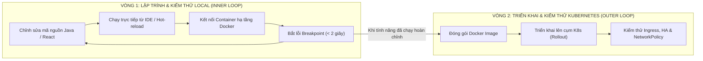

# Hướng Dẫn Kiến Trúc Chuẩn Hóa Cụm Kubernetes Mini Waybill Platform

Tài liệu này tổng hợp toàn bộ các thay đổi chuẩn hóa kiến trúc cụm Kubernetes theo chuẩn Production và High Availability (HA), tối ưu hóa cho môi trường phát triển Docker Desktop và sẵn sàng làm bằng chứng năng lực cho hồ sơ ứng tuyển Fresher.

---

## 1. Danh Sách Các Thành Phần Đã Chuẩn Hóa

### A. Tầng Bảo Mật & Dữ Liệu Nội Bộ (ClusterIP & Zero-Trust)
- [k8s/01-infrastructure/sqlserver.yaml](file:///c:/Users/LENOVO/Desktop/microservice/mini-waybill-platform/k8s/01-infrastructure/sqlserver.yaml): Chuyển từ LoadBalancer sang ClusterIP. Đóng hoàn toàn cổng ngoại vi, chỉ cho phép kết nối nội bộ cổng 1433.
- [k8s/01-infrastructure/redis.yaml](file:///c:/Users/LENOVO/Desktop/microservice/mini-waybill-platform/k8s/01-infrastructure/redis.yaml): Chuyển từ LoadBalancer sang ClusterIP. Đóng cổng ngoại vi 6379.
- [k8s/01-infrastructure/network-policies.yaml](file:///c:/Users/LENOVO/Desktop/microservice/mini-waybill-platform/k8s/01-infrastructure/network-policies.yaml): Chính sách tường lửa Kubernetes phân vùng mạng nghiêm ngặt:
  - Khóa cơ sở dữ liệu SQL Server: Chỉ các Pod backend được gửi gói tin đến cổng 1433.
  - Khóa Redis: Chỉ các Pod nghiệp vụ có nhu cầu cache được kết nối.
  - Khóa Frontend: Ngăn chặn giao tiếp thẳng vào cơ sở dữ liệu, chỉ được gọi API Gateway.

### B. Tầng Cổng Vào Duy Nhất (Single Entrypoint Ingress)
- [k8s/03-ingress/waybill-ingress.yaml](file:///c:/Users/LENOVO/Desktop/microservice/mini-waybill-platform/k8s/03-ingress/waybill-ingress.yaml): Cấu hình Ingress NGINX tiếp nhận trực tiếp qua địa chỉ http://localhost cổng 80:
  - Tuyến /api: Định tuyến về api-gateway:8080.
  - Tuyến /: Định tuyến về frontend:80.
  - Hỗ trợ thêm các tên miền: waybill.local, api.waybill.local, storage.waybill.local.
- [k8s/02-services/frontend.yaml](file:///c:/Users/LENOVO/Desktop/microservice/mini-waybill-platform/k8s/02-services/frontend.yaml): Chuyển Service sang ClusterIP, chuyển quyền tiếp nhận ngoại vi cho Ingress.
- [k8s/02-services/api-gateway.yaml](file:///c:/Users/LENOVO/Desktop/microservice/mini-waybill-platform/k8s/02-services/api-gateway.yaml): Chuyển Service sang ClusterIP, nâng lên 2 bản sao (Replicas = 2) kèm cấu hình phân tán podAntiAffinity.

### C. Tính Sẵn Sàng Cao & Tự Động Co Giãn (High Availability & Scaling)
- [k8s/02-services/shipment-service.yaml](file:///c:/Users/LENOVO/Desktop/microservice/mini-waybill-platform/k8s/02-services/shipment-service.yaml): Nâng cấu hình lên 2 bản sao (Replicas = 2) kèm podAntiAffinity.
- [k8s/02-services/customer-service.yaml](file:///c:/Users/LENOVO/Desktop/microservice/mini-waybill-platform/k8s/02-services/customer-service.yaml): Duy trì 2 bản sao phục vụ cân bằng tải.
- [k8s/02-services/hpa-rules.yaml](file:///c:/Users/LENOVO/Desktop/microservice/mini-waybill-platform/k8s/02-services/hpa-rules.yaml): Khai báo các quy tắc tự động co giãn ngang (HorizontalPodAutoscaler) từ 2 đến 6 Pods khi CPU vượt quá 70%.

### D. Tiện Ích Quản Trị & Vận Hành
- [scripts/db-connect.ps1](file:///c:/Users/LENOVO/Desktop/microservice/mini-waybill-platform/scripts/db-connect.ps1): Script tiện ích một chạm mở kênh an toàn (kubectl port-forward) kết nối SSMS/DBeaver vào database trên máy tính Windows.
- [scripts/deploy-standardized-k8s.ps1](file:///c:/Users/LENOVO/Desktop/microservice/mini-waybill-platform/scripts/deploy-standardized-k8s.ps1): Script tự động kiểm tra Ingress NGINX và đồng bộ toàn bộ cụm chỉ qua một lệnh chạy.

---

## 2. Quy Trình Kích Hoạt & Triển Khai Thực Tế

Khi bạn đã sẵn sàng triển khai kiến trúc mới lên cụm Docker Desktop:

### Bước 1: Dọn dẹp tài nguyên và tắt container cũ
Để tránh xung đột cổng và giải phóng 6 - 8 GB RAM, mở PowerShell chạy lệnh:

```powershell
docker stop waybill-kafka-2 waybill-kafka-3
```

Nếu đang chạy các dịch vụ Docker Compose cũ:
```powershell
docker compose down
```

### Bước 2: Bật lại Kubernetes trên Docker Desktop
1. Mở giao diện Docker Desktop trên Windows.
2. Nhấn biểu tượng Bánh răng (Settings) -> Chọn mục Kubernetes.
3. Tích chọn Enable Kubernetes -> Nhấn nút Apply & restart.
4. Chờ biểu tượng Kubernetes ở góc dưới chuyển sang màu xanh lá.

### Bước 3: Áp dụng toàn bộ kiến trúc chuẩn hóa
Mở PowerShell tại thư mục dự án và chạy script tự động:

```powershell
powershell -ExecutionPolicy Bypass -File scripts/deploy-standardized-k8s.ps1
```

### Bước 4: Kiểm tra trạng thái hoạt động của cụm
Chạy lệnh kiểm tra tổng thể:

```powershell
kubectl get pods,svc,ingress,networkpolicy -n waybill
```

Tất cả các dịch vụ microservices sẽ hiển thị trạng thái Running, các cơ sở dữ liệu ở dạng ClusterIP an toàn, và Ingress hiển thị địa chỉ localhost:80.

### Bước 5: Truy cập hệ thống
- Mở trình duyệt Web: Truy cập trực tiếp http://localhost để vào giao diện quản lý vận đơn.
- Gọi API: Truy cập http://localhost/api/... hoặc qua Ingress.
- Kết nối quản trị SQL Server từ Windows:
  Chạy lệnh:
  ```powershell
  powershell -ExecutionPolicy Bypass -File scripts/db-connect.ps1
  ```
  Sau đó mở SSMS nhập máy chủ localhost,1433 với tài khoản sa và mật khẩu Admin@123456.

---

## 3. Quy Trình Phát Triển 2 Vòng (Inner Loop vs Outer Loop)

Đây là quy trình tiêu chuẩn áp dụng trong các công ty công nghệ lớn: phân tách rõ ràng giữa giai đoạn viết mã kiểm thử cục bộ (nhanh, nhẹ, có debug) và giai đoạn triển khai lên Kubernetes (chuẩn hóa, chịu lỗi, sẵn sàng demo).



---

### A. Vòng Lặp Nội Bộ (Inner Loop): Làm Việc Hàng Ngày Trên Máy Tính Cá Nhân

Trong vòng lặp này, Kubernetes trên Docker Desktop có thể tạm tắt để máy tính tiết kiệm 6 - 8 GB RAM và giữ nhiệt độ máy mát mẻ.

#### 1. Cấu hình các container hạ tầng Docker đang phục vụ máy Local:
Các container hạ tầng chạy ngầm trong Docker cung cấp đầy đủ các cổng cho ứng dụng trên máy tính Windows kết nối:

| Hạ tầng | Tên Container | Cổng kết nối từ Windows Host | Thông tin đăng nhập |
| :--- | :--- | :--- | :--- |
| **SQL Server** | `waybill-sqlserver-replica` | `localhost:2433` (hoặc `1433`) | User: `sa`, Pass: `Admin@123456` |
| **Redis** | `redis` | `localhost:6379` | Không mật khẩu |
| **Kafka** | `waybill-kafka-1` | `localhost:9092` | KRaft Broker độc lập |
| **RabbitMQ** | `mini-waybill-rabbitmq` | `localhost:5672` (Web UI: `15672`) | User: `admin`, Pass: `admin` |
| **MinIO** | `waybill-minio` | `localhost:9000` (Web UI: `9001`) | User: `minioadmin`, Pass: `minioadmin` |

#### 2. Lệnh tối ưu RAM cho máy khi chạy Local:
Tắt 2 broker phụ để chỉ giữ lại 1 broker Kafka duy nhất cho máy nhẹ:
```powershell
docker stop waybill-kafka-2 waybill-kafka-3
```

#### 3. Chạy và kiểm thử mã nguồn:
- **Backend (Spring Boot):**
  Mở project trong IntelliJ IDEA, mở file Application của service cần sửa (ví dụ `ShipmentServiceApplication.java`). Bấm chuột phải chọn **Debug**. Ứng dụng khởi động trong 2 giây, kết nối thẳng vào database `localhost:2433` và Kafka `localhost:9092`.
- **Frontend (Next.js):**
  Mở terminal tại thư mục giao diện:
  ```powershell
  cd frontend
  npm run dev
  ```
  Truy cập `http://localhost:3000`. Mọi thay đổi trong mã nguồn React được cập nhật tức thời (Hot-Reload).

---

### B. Vòng Lặp Ngoại Vi (Outer Loop): Đóng Gói Và Đưa Lên Kubernetes

Khi một tính năng mới đã được kiểm thử chạy ổn định ở môi trường local và bạn muốn đưa lên cụm Kubernetes để kiểm thử tích hợp hoặc chuẩn bị bài báo cáo/demo:

#### Bước 1: Đóng gói Docker Image mới cho dịch vụ vừa sửa
Giả sử bạn vừa sửa mã nguồn của `shipment-service`:
```powershell
docker build -t khanhnv26/shipment-service:latest ./shipment-service
```

Nếu bạn sửa giao diện `frontend`:
```powershell
docker build -t khanhnv26/frontend:latest ./frontend
```

#### Bước 2: Bật lại Kubernetes trên Docker Desktop
Mở Docker Desktop Settings -> Kubernetes -> Tích chọn Enable Kubernetes -> Bấm Apply & restart.

#### Bước 3: Cập nhật dịch vụ trên cụm Kubernetes mà không gây gián đoạn
Ra lệnh cho Kubernetes tải bản dựng mới và tự động thực hiện Rolling Update:
```powershell
kubectl rollout restart deployment/shipment-service -n waybill
```

Theo dõi tiến trình Pod mới thay thế Pod cũ an toàn:
```powershell
kubectl rollout status deployment/shipment-service -n waybill
```

#### Bước 4: Kiểm tra kết quả qua Ingress
Mở trình duyệt truy cập `http://localhost` để kiểm chứng toàn bộ luồng nghiệp vụ trên hạ tầng Kubernetes chuẩn hóa.
