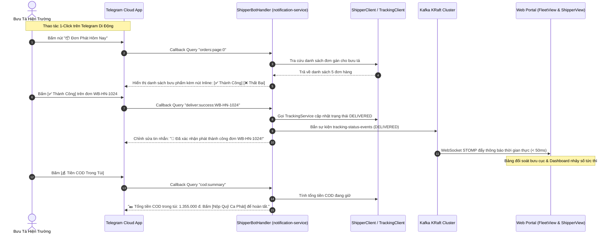

# Cẩm Nang 21: Quản Trị Đội Xe Vận Tải (Fleet Management) & Tương Tác Hai Chiều Bưu Tá Qua Telegram Bot

[](https://www.oracle.com/java/)
[](https://spring.io/projects/spring-boot)
[](https://waybill.vn)
[](https://core.telegram.org/bots)
[](https://waybill.vn)

---

## 1. Đặt Vấn Đề Nghiệp Vụ & Thách Thức Vận Hành

### 1.1. Quản Lý Phương Tiện Vận Tải Đa Phân Tầng Trong Bưu Chính
Trong mạng lưới Hub-and-Spoke của bưu chính quốc gia, phương tiện vận tải được phân định thành 3 nhóm rõ rệt với mục đích và đặc tính kỹ thuật hoàn toàn khác nhau:
1. **Xe tải đường dài (Trunk Trucks):** Trọng tải lớn ($5.000\text{ kg} - 15.000\text{ kg}$), chuyên chạy tuyến trục cố định nối giữa 5 Siêu Hub (Hà Nội $\leftrightarrow$ Đà Nẵng $\leftrightarrow$ TP.HCM). Yêu cầu kiểm soát chặt chẽ niêm chì (Seal), tải trọng trục và lịch trình bảo dưỡng định kỳ.
2. **Xe van trung chuyển (Feeder Vans):** Trọng tải trung bình ($1.500\text{ kg} - 2.500\text{ kg}$), chuyên gom hàng từ các Bưu cục quận/huyện về Siêu Hub và ngược lại.
3. **Xe máy bưu tá (Motorbikes):** Tải trọng nhỏ ($50\text{ kg} - 150\text{ kg}$), cơ động luồn lách trong ngõ ngách đô thị phục vụ phát hàng chặng cuối (Last-Mile).

Nếu thiếu hệ thống quản lý phương tiện tập trung (Fleet Management):
- Doanh nghiệp không nắm được xe đang ở Hub nào (`currentHub`), trạng thái hoạt động (`AVAILABLE`, `IN_TRANSIT`, `MAINTENANCE`), dẫn đến việc điều xe rỗng (Deadhead Truck) gây lãng phí nhiên liệu.
- Nguy cơ quá tải trọng thiết kế khi xếp hàng lên xe, vi phạm nghiêm trọng quy định an toàn giao thông đường bộ.

### 1.2. Thách Thức Trải Nghiệm Của Bưu Tá Hiện Trường
Bưu tá (Shipper) làm việc ngoài trời, tay lái xe máy liên tục dưới thời tiết nắng mưa:
- Rất khó để bưu tá mở laptop hay thao tác trên các ứng dụng Web Portal phức tạp.
- Cài đặt thêm một ứng dụng di động native cồng kềnh thường gây tốn pin, đòi hỏi cập nhật phiên bản liên tục qua App Store / Google Play và gặp lỗi tương thích trên các dòng điện thoại giá rẻ.
- **Giải pháp tối ưu:** Tận dụng ứng dụng **Telegram** có sẵn trên máy bưu tá, biến Telegram thành một thiết bị cầm tay thông minh (Handheld Terminal) thông qua Chatbot tương tác 2 chiều: nhận đơn phát, cập nhật kết quả giao hàng chỉ bằng 1 nút bấm (Inline Keyboard), nộp quỹ COD và xem dự báo ca trực.

---

## 2. Kiến Trúc Giải Pháp & Sơ Đồ Mermaid

Hệ thống kết hợp 2 giải pháp:
1. **Phân hệ Fleet Management (`routing-service` & `FleetView.js` tại route `/fleet`):**
   - Quản lý vòng đời phương tiện qua API CRUD chuẩn RESTful: Biển số xe (`plateNumber`), loại xe (`vehicleType`), tải trọng thiết kế (`maxWeightKg`, `maxVolumeM3`), trạng thái bảo dưỡng và Hub quản lý.
   - Tích hợp trực tiếp với thuật toán kiểm soát tải trọng chuyến xe trục (`TripServiceImpl`) và thuật toán tính ETA.
2. **Interactive Shipper Telegram Bot (`notification-service`):**
   - Lắng nghe cập nhật qua cơ chế Long-Polling (`TelegramBot`).
   - Tự động nhận diện danh tính bưu tá qua `chatId` (`ShipperLookupResponse`).
   - Hiển thị menu tác nghiệp trực quan bằng **Inline Keyboard**:
     - Xem 5 đơn phát hôm nay theo trang (`PAGE_SIZE = 5`).
     - Báo phát thành công (`DELIVERED`) kèm cập nhật trạng thái đơn hàng tức thì.
     - Báo phát thất bại kèm danh mục lý do chuẩn hóa (`KHONG_NGHE_MAY`, `SAI_DIA_CHI`, `HEN_LAI_NGAY`, `TU_CHOI_NHAN`).
     - Kiểm tra tiền mặt COD đang giữ trong túi (`pocketCod`) và nộp tiền ca phát.
     - Tra cứu dự báo ca trực ngày mai.



---

## 3. Phân Tích Mã Nguồn Thực Tế Trong Dự Án

### 3.1. Phân Hệ Quản Trị Xe Vận Tải (`VehicleController.java`)
Được triển khai tại `routing-service` (Port 8083):

```java
@RestController
@RequiredArgsConstructor
@RequestMapping("/api/routing/vehicles")
@Slf4j
public class VehicleController {

    private final VehicleService vehicleService;

    @GetMapping
    public ResponseEntity<List<VehicleResponse>> getAllVehicles(
            @RequestParam(required = false) String hub,
            @RequestParam(required = false) String status,
            @RequestParam(required = false) String vehicleType) {
        List<VehicleResponse> vehicles = vehicleService.getAllVehicles(hub, status, vehicleType);
        return ResponseEntity.ok(vehicles);
    }

    @GetMapping("/available")
    public ResponseEntity<List<VehicleResponse>> getAvailableVehiclesAtHub(@RequestParam String hub) {
        List<VehicleResponse> vehicles = vehicleService.getAvailableVehiclesAtHub(hub);
        return ResponseEntity.ok(vehicles);
    }

    @PostMapping
    public ResponseEntity<VehicleResponse> createVehicle(@RequestBody @Valid CreateVehicleRequest request) {
        VehicleResponse vehicle = vehicleService.createVehicle(request);
        return ResponseEntity.status(HttpStatus.CREATED).body(vehicle);
    }

    @PatchMapping("/{id}/status")
    public ResponseEntity<VehicleResponse> updateVehicleStatus(
            @PathVariable("id") Long id, 
            @RequestParam String status) {
        VehicleResponse vehicle = vehicleService.updateVehicleStatus(id, status);
        return ResponseEntity.ok(vehicle);
    }
}
```

### 3.2. Cấu Trúc Khởi Tạo Đội Xe Vận Tải (`V7__seed_feeder_vehicles_for_post_offices.sql`)
Khai báo dữ liệu mẫu cho đội xe gom hàng trung chuyển tại các bưu cục trọng điểm:

```sql
INSERT INTO vehicles (plate_number, vehicle_type, max_weight_kg, max_volume_m3, current_hub, status, created_at)
VALUES
('29C-102.34', 'FEEDER_VAN', 1500.0, 8.5, 'POST-HN-CG', 'AVAILABLE', GETDATE()),
('29C-204.56', 'FEEDER_VAN', 1500.0, 8.5, 'POST-HN-BD', 'AVAILABLE', GETDATE()),
('51D-305.78', 'FEEDER_VAN', 1800.0, 10.0, 'POST-HCM-Q1', 'AVAILABLE', GETDATE()),
('51D-406.89', 'FEEDER_VAN', 1800.0, 10.0, 'POST-HCM-TB', 'AVAILABLE', GETDATE()),
('43C-507.12', 'FEEDER_VAN', 1200.0, 7.0, 'POST-DN-HC', 'AVAILABLE', GETDATE());
```

### 3.3. Xử Lý Tương Tác 2 Chiều Bưu Tá Trên Telegram (`ShipperBotHandler.java`)
Lõi xử lý tin nhắn và nút bấm Inline Keyboard tại `notification-service`:

```java
@Component
@RequiredArgsConstructor
@Slf4j
public class ShipperBotHandler {

    private static final int PAGE_SIZE = 5;
    private static final Map<String, String> FAILURE_REASON_LABELS = new LinkedHashMap<>();

    static {
        FAILURE_REASON_LABELS.put("KHONG_NGHE_MAY", "Khách không nghe máy");
        FAILURE_REASON_LABELS.put("SAI_DIA_CHI", "Sai địa chỉ");
        FAILURE_REASON_LABELS.put("HEN_LAI_NGAY", "Khách hẹn lại ngày");
        FAILURE_REASON_LABELS.put("TU_CHOI_NHAN", "Khách từ chối nhận");
    }

    private final ShipperBotService shipperBotService;

    public void onCallback(TelegramBot bot, String chatId, Integer messageId, String callbackId, String data) {
        if (data == null || data.isBlank()) return;

        ShipperLookupResponse shipper = shipperBotService.resolveShipper(chatId);
        if (shipper == null || !shipper.isFound()) {
            bot.editHtml(chatId, messageId,
                    "⚠️ Tài khoản Telegram này chưa liên kết bưu tá.\nGõ <code>/link MÃ_BƯU_TÁ</code> để liên kết.", null);
            return;
        }

        String[] parts = data.split(":");
        String action = parts[0];

        switch (action) {
            case "orders":
                int page = parts.length > 2 ? Integer.parseInt(parts[2]) : 0;
                renderOrdersList(bot, chatId, messageId, shipper.getCourierCode(), page);
                break;

            case "deliver_success":
                String trackingCode = parts[1];
                boolean ok = shipperBotService.markDelivered(shipper.getCourierCode(), trackingCode);
                if (ok) {
                    bot.editHtml(chatId, messageId, "✅ <b>Đã phát thành công</b> đơn <code>" + trackingCode + "</code>!", null);
                    bot.answerCallback(callbackId, "Giao thành công!", false);
                }
                break;

            case "deliver_failed_reason":
                String code = parts[1];
                String reason = parts[2];
                shipperBotService.markDeliveryFailed(shipper.getCourierCode(), code, reason);
                bot.editHtml(chatId, messageId, "❌ Đã ghi nhận phát thất bại đơn <code>" + code + "</code>: " + FAILURE_REASON_LABELS.get(reason), null);
                break;

            case "cod_summary":
                renderCodSummary(bot, chatId, messageId, shipper.getCourierCode());
                break;
        }
    }
}
```

### 3.4. Bàn Phím Tương Tác Nhanh (`ShipperBotKeyboards.java`)
Sinh cấu trúc nút bấm động chuẩn Telegram Bot API:

```java
public final class ShipperBotKeyboards {

    public static InlineKeyboardMarkup buildOrderActionsKeyboard(String trackingCode) {
        return markup(
                row(
                        cb("✅ Đã Giao", "deliver_success:" + trackingCode),
                        cb("❌ Giao Thất Bại", "deliver_fail_menu:" + trackingCode)
                ),
                row(
                        cb("📍 Bản Đồ Dẫn Đường", "navigate:" + trackingCode),
                        cb("🔙 Quay Lại", "orders:page:0")
                )
        );
    }
}
```

---

## 4. Giao Diện Quản Trị Đội Xe SPA (`FleetView.js`)

Giao diện Single Page Application tại route `/fleet` cho phép Điều phối viên:
1. Theo dõi tổng số lượng xe toàn mạng, số xe sẵn sàng (`AVAILABLE`), số xe đang lăn bánh (`IN_TRANSIT`) và xe đang bảo dưỡng định kỳ (`MAINTENANCE`).
2. Xem thanh tải trọng trực quan theo từng loại xe (Xe tải liên tỉnh 15 tấn, Xe Van bưu cục 1.5 tấn).
3. Đổi trạng thái phương tiện 1-click không cần reload trang.

```javascript
// Trích xuất cấu hình trạng thái trong FleetView.js
const statusBadges = {
    AVAILABLE: { label: 'Sẵn Sàng', class: 'bg-emerald-50 text-emerald-700 border-emerald-200' },
    IN_TRANSIT: { label: 'Đang Lăn Bánh', class: 'bg-blue-50 text-blue-700 border-blue-200' },
    MAINTENANCE: { label: 'Bảo Dưỡng', class: 'bg-rose-50 text-rose-700 border-rose-200' },
    IDLE: { label: 'Chờ Điều Phối', class: 'bg-slate-50 text-slate-700 border-slate-200' }
};
```

---

## 5. 10 Câu Hỏi Phỏng Vấn Chuyên Sâu & Đáp Án Thực Chiến

### Câu 1: Tại sao nên tách riêng thực thể `Vehicle` (Phương tiện) độc lập với `Trip` (Chuyến xe)?
**Đáp án:** Một phương tiện vật lý (xe tải biển số cụ thể) có vòng đời độc lập với các chuyến xe: nó có biển số, hạn kiểm định đăng kiểm, dung tích thùng xe cố định, lịch bảo dưỡng động cơ và có thể phục vụ nhiều chuyến xe khác nhau theo thời gian. Tách riêng `Vehicle` giúp doanh nghiệp quản trị tài sản cố định (Asset Management), tối ưu bảo dưỡng định kỳ và ngăn chặn lỗi gán cùng 1 chiếc xe vào 2 chuyến xe chạy song song cùng thời điểm.

### Câu 2: Telegram Bot dùng cơ chế Long-Polling hay Webhook trong kiến trúc này? Tại sao?
**Đáp án:** Dùng cơ chế **Long-Polling**.
- **Lý do:** Hệ thống bưu chính có nhiều microservices triển khai trong mạng nội bộ On-Premise hoặc Kubernetes cụm kín phía sau tường lửa doanh nghiệp (Private Network). Long-Polling cho phép `notification-service` chủ động mở kết nối Outbound ra máy chủ Telegram Cloud mà không yêu cầu mở cổng Inbound, không cần thuê Public IP tĩnh và không cần cài đặt chứng chỉ SSL public.

### Câu 3: Làm thế nào để xác thực danh tính bưu tá khi họ gửi tin nhắn tới Telegram Bot?
**Đáp án:** Thông qua quy trình liên kết 2 bước:
1. Bưu tá gõ lệnh `/link <COURIER_CODE>`.
2. Bot gọi Feign Client sang `shipper-service` để kiểm tra mã bưu tá; nếu hợp lệ, CSDL sẽ lưu cặp ánh xạ `telegram_chat_id` $\leftrightarrow$ `courier_code`.
Ở mọi tin nhắn hoặc sự kiện Callback sau đó, hệ thống trích xuất `chatId`, tra cứu nhanh trong Redis Cache (< 1ms); nếu không tìm thấy liên kết, bot sẽ chặn lại và yêu cầu liên kết danh tính.

### Câu 4: Inline Keyboard Callback Query của Telegram hoạt động như thế nào?
**Đáp án:** Khi người dùng bấm vào một nút Inline Keyboard, ứng dụng Telegram không gửi tin nhắn văn bản thông thường mà gửi một đối tượng `CallbackQuery` chứa trường `data` (ví dụ `deliver_success:WB-HN-1024`) và `callbackQueryId`. Máy chủ Bot phải gọi API `answerCallbackQuery` trong vòng 30 giây để tắt vòng xoay loading trên điện thoại người dùng, đồng thời có thể cập nhật nội dung tin nhắn cũ tại chỗ qua API `editMessageText`.

### Câu 5: Xử lý bài toán Race Condition khi bưu tá bấm nút "Giao thành công" nhiều lần liên tiếp trên Telegram thế nào?
**Đáp án:** Áp dụng khóa phân tán Redis `SETNX`:
Khi nhận callback `deliver_success:{code}`, Bot thực hiện:
`SET lock:deliver:{code} 1 EX 10 NX`
Nếu lệnh trả về `null` (khóa đã tồn tại), bot lập tức trả về thông báo "Đang xử lý, vui lòng chờ" và bỏ qua thao tác, ngăn chặn triệt để việc bắn đúp sự kiện giao hàng lên Kafka.

### Câu 6: Làm thế nào để phân trang danh sách đơn hàng trên Telegram Bot khi bưu tá có 50 đơn phát?
**Đáp án:** Do màn hình điện thoại giới hạn, việc hiển thị toàn bộ 50 đơn sẽ làm tin nhắn quá dài gây khó theo dõi. Bot chia nhỏ thành từng trang cố định (`PAGE_SIZE = 5`), mã hóa số trang vào callback data (ví dụ `orders:page:1`, `orders:page:2`). Hàng nút bấm cuối cùng hiển thị cặp nút điều hướng: `[⬅️ Trang Trước]` và `[➡️ Trang Sau]`.

### Câu 7: Danh mục lý do phát thất bại chuẩn hóa mang lại giá trị gì cho nghiệp vụ bưu chính?
**Đáp án:** Việc chuẩn hóa thành 4 mã cố định (`KHONG_NGHE_MAY`, `SAI_DIA_CHI`, `HEN_LAI_NGAY`, `TU_CHOI_NHAN`) thay vì cho bưu tá nhập văn bản tự do giúp:
1. Tự động hóa State Machine: Nếu lý do là `TU_CHOI_NHAN` (Người nhận từ chối), hệ thống chuyển ngay sang quy trình hoàn hàng; nếu là `HEN_LAI_NGAY`, hệ thống tự dời lịch phát sang hôm sau.
2. Thống kê KPI chính xác: Phân tích được nguyên nhân giao hàng thất bại bắt nguồn từ người nhận hay do chất lượng địa chỉ của Shop.

### Câu 8: Khi xe tải gặp sự cố hỏng hóc giữa đường, quy trình chuyển trạng thái trên hệ thống diễn ra thế nào?
**Đáp án:** Điều phối viên trên màn hình `/fleet` chọn xe gặp sự cố và đổi trạng thái sang `MAINTENANCE`. Hệ thống tự động kích hoạt:
1. Gỡ xe khỏi danh sách các xe khả dụng tại Hub xuất phát.
2. Cảnh báo chuyến xe liên quan đang bị trễ.
3. Kích hoạt động cơ tái tính toán ETA (`EtaRecalculationScheduler`) để thông báo thời gian trễ cho khách hàng.

### Câu 9: Tính năng nộp quỹ COD qua Telegram Bot bảo đảm tính toàn vẹn tài chính như thế nào?
**Đáp án:** Bot chỉ hỗ trợ gửi yêu cầu chốt ca nộp quỹ (`PENDING_SETTLEMENT`). Tiền mặt thực tế bắt buộc phải được thủ quỹ tại bưu cục kiểm đếm vật lý và bấm duyệt (`SETTLED`) trên màn hình bưu cục (`PostOfficeOpsView.js`). Điều này đảm bảo nguyên tắc kiểm soát kép (Dual Control), ngăn chặn bưu tá tự ý xác nhận đã nộp tiền mà không có sự kiểm tra của thủ quỹ.

### Câu 10: Ưu điểm của kiến trúc SPA Vue 3 đối với màn hình Fleet Management (`/fleet`)?
**Đáp án:** Sử dụng Vue 3 với Vue Composition API và `<keep-alive>` giúp trạng thái bộ lọc (tìm theo Hub, theo loại xe, theo trạng thái hoạt động) được lưu trữ nguyên vẹn trên RAM trình duyệt. Khi điều phối viên chuyển qua lại giữa màn hình chuyến xe `/trips` và đội xe `/fleet`, tốc độ phản hồi đạt tức thời (0ms latency), không phát sinh request tải lại toàn bộ trang, giúp tối ưu hiệu năng làm việc tại trung tâm điều hành.
