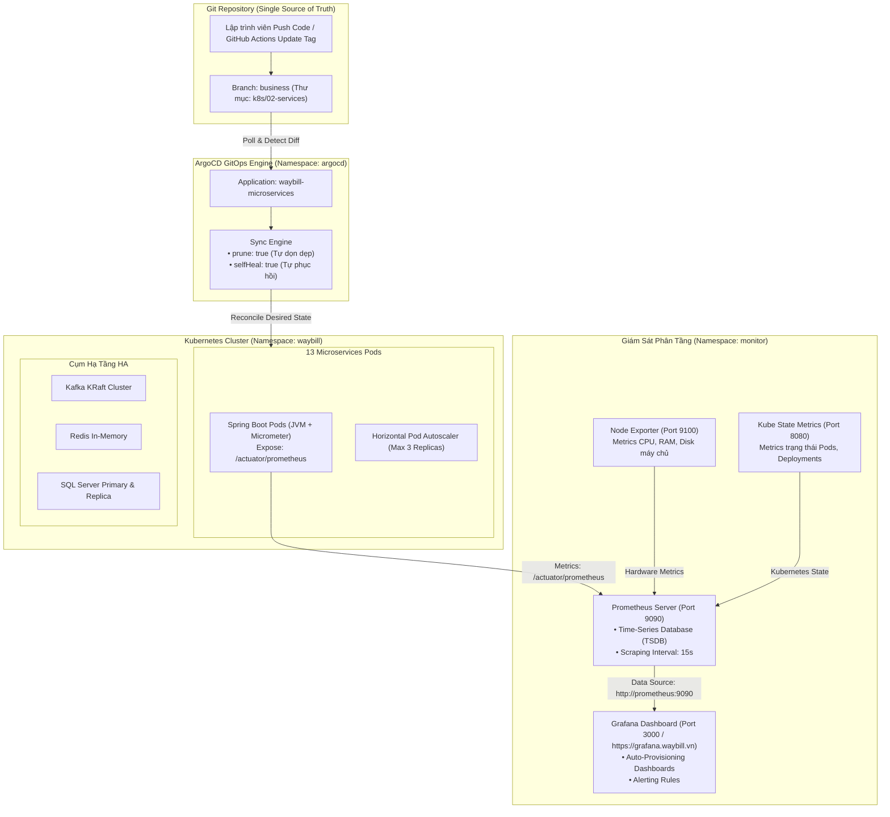

# Cẩm Nang 22: Vận Hành GitOps Với ArgoCD & Giám Sát Toàn Diện (Prometheus & Grafana)

[](https://kubernetes.io/)
[](https://argoproj.github.io/cd/)
[](https://prometheus.io/)
[](https://grafana.com/)
[](https://spring.io/projects/spring-boot)

---

## 1. Đặt Vấn Đề Nghiệp Vụ & Thách Thức Vận Hành (DevOps / SRE)

### 1.1. Hiện Tượng Configuration Drift Trong Triển Khai Thủ Công
Khi vận hành một hệ thống phân tán gồm 13 microservices nghiệp vụ kết hợp cụm hạ tầng phụ trợ (Kafka KRaft, Redis, Eureka HA, RabbitMQ, MinIO, SQL Server):
- Nếu kỹ sư DevOps sử dụng lệnh `kubectl apply` thủ công hoặc sửa nóng tài nguyên trên cụm bằng `kubectl edit`/`kubectl patch`:
  - Trạng thái thực tế trên cụm (Live State) sẽ bị lệch khỏi mã nguồn trên kho lưu trữ Git (Desired State) - hiện tượng **Configuration Drift**.
  - Không thể truy vết ai đã thay đổi thông số, không có lịch sử kiểm toán (Audit Trail), và khi cụm gặp sự cố cần dựng lại từ đầu, hệ thống không thể tái tạo chính xác trạng thái trước đó.
- **Giải pháp GitOps:** Đưa kho lưu trữ Git trở thành **Single Source of Truth** (Nguồn chân lý duy nhất). Mọi thay đổi về cấu hình, biến môi trường, tài nguyên CPU/RAM hay phiên bản Docker image đều phải được commit vào Git. Công cụ **ArgoCD** chạy liên tục trong cụm để so khớp và tự động kéo trạng thái trên cluster về đúng với Git.

### 1.2. Thách Thức Giám Sát & Đo Lường (Observability) Trong Microservices
Trong kiến trúc đơn khối (Monolith), theo dõi log trên 1 máy chủ là đủ. Nhưng với 13 microservices chạy phân tán trên Kubernetes:
- Làm sao phát hiện một Pod bị rò rỉ bộ nhớ (Memory Leak) hoặc bị OOMKilled (Out-Of-Memory) trước khi người dùng gặp lỗi?
- Làm sao đo lường được thời gian phản hồi (P95, P99 Latency) của từng endpoint API khi lưu lượng tăng đột biến?
- Làm sao biết cụm Kafka KRaft có bị chậm nhịp tiêu thụ (Consumer Lag) hay không?
- **Giải pháp Observability:** Thiết lập hệ thống giám sát phân tầng chuẩn công nghiệp gồm: **Prometheus** (cào và lưu trữ time-series metrics), **Node Exporter** (giám sát máy chủ vật lý), **Kube State Metrics** (giám sát đối tượng K8s) và **Grafana** (trực quan hóa với 3 Dashboard chuyên sâu).

---

## 2. Kiến Trúc Giải Pháp & Sơ Đồ Mermaid

Hệ thống triển khai 2 trụ cột vận hành tự động:
1. **Quy Trình GitOps Hoàn Khép Kín (Closed-Loop GitOps với ArgoCD):**
   - GitHub Actions CI/CD khi đóng gói image mới sẽ tự động cập nhật image tag vào file `k8s/02-services/*.yaml`.
   - ArgoCD Controller liên tục thăm dò (Poll) branch `business`.
   - Khi phát hiện sự khác biệt (Out-of-Sync), ArgoCD kích hoạt quy trình đồng bộ tự động:
     - `prune: true`: Tự động xóa các tài nguyên thừa trên K8s nếu file YAML tương ứng bị xóa trên Git.
     - `selfHeal: true`: Nếu ai đó can thiệp sửa trực tiếp trên K8s, ArgoCD tự động ghi đè và phục hồi về trạng thái chuẩn trên Git.
2. **Kiến Trúc Giám Sát Phân Tầng (Prometheus & Grafana Stack):**
   - Triển khai toàn bộ trong namespace độc lập `monitor`.
   - Prometheus cào metrics qua cơ chế Service Discovery nội bộ K8s từ `/actuator/prometheus` của 13 dịch vụ Spring Boot, Node Exporter (Port 9100) và Kube State Metrics (Port 8080).
   - Grafana tự động nạp (Auto-Provisioning) 3 dashboard thông qua ConfigMap `grafana-dashboards-cm.yaml`:
     - **Dashboard 1 (`dashboard-waybill.json`):** Tổng quan tình trạng nền tảng bưu chính.
     - **Dashboard 2 (`waybill-k8s-infra.json`):** Chi tiết phần cứng K8s (CPU/Memory usage, Network I/O, Pod restarts).
     - **Dashboard 3 (`waybill-microservices.json`):** Chi tiết JVM (Heap Memory, Garbage Collection pause, Active Threads, HTTP 2xx/4xx/5xx Request Rates).



---

## 3. Phân Tích Mã Nguồn Cấu Hình Thực Tế

### 3.1. Cấu Hình Khởi Tạo ArgoCD Application (`k8s/argocd-app.yaml`)
Định nghĩa ứng dụng tự động đồng bộ khai báo (Declarative GitOps):

```yaml
apiVersion: argoproj.io/v1alpha1
kind: Application
metadata:
  name: waybill-microservices
  namespace: argocd
spec:
  project: default
  source:
    repoURL: 'https://github.com/Khanhnv26/Mini-Waybill-Platform---VNPT-Cloud.git'
    targetRevision: business
    path: k8s/02-services
  destination:
    server: 'https://kubernetes.default.svc'
    namespace: waybill
  syncPolicy:
    automated:
      prune: true               # Tự xóa pod nếu file yaml bị xóa trên Git
      selfHeal: true            # Tự phục hồi nếu ai sửa lén trên cluster
    syncOptions:
      - CreateNamespace=true
```

### 3.2. Cấu Hình Prometheus Thu Thập Metrics (`k8s/04-monitoring/prometheus.yaml`)
Thiết lập bộ cào metrics tự động qua Kubernetes Service Discovery:

```yaml
apiVersion: v1
kind: ConfigMap
metadata:
  name: prometheus-config
  namespace: monitor
data:
  prometheus.yml: |
    global:
      scrape_interval: 15s
      evaluation_interval: 15s

    scrape_configs:
      - job_name: 'kubernetes-pods'
        kubernetes_sd_configs:
          - role: pod
        relabel_configs:
          # Chỉ cào các Pod có gắn annotation prometheus.io/scrape: "true"
          - source_labels: [__meta_kubernetes_pod_annotation_prometheus_io_scrape]
            action: keep
            regex: true
          - source_labels: [__meta_kubernetes_pod_annotation_prometheus_io_path]
            action: replace
            target_label: __metrics_path__
            regex: (.+)
          - source_labels: [__address__, __meta_kubernetes_pod_annotation_prometheus_io_port]
            action: replace
            regex: ([^:]+)(?::\d+)?;(\d+)
            replacement: $1:$2
            target_label: __address__
```

### 3.3. Cấu Hình Auto-Scaling Khống Chế Tải (`k8s/02-services/hpa-rules.yaml`)
Để đảm bảo cụm không tự mở rộng vô tội vạ làm cạn kiệt tài nguyên node máy chủ, hệ thống khống chế trần `maxReplicas: 3`:

```yaml
apiVersion: autoscaling/v2
kind: HorizontalPodAutoscaler
metadata:
  name: tracking-service-hpa
  namespace: waybill
spec:
  scaleTargetRef:
    apiVersion: apps/v1
    kind: Deployment
    name: tracking-service
  minReplicas: 1
  maxReplicas: 3
  metrics:
    - type: Resource
      resource:
        name: cpu
        target:
          type: Utilization
          averageUtilization: 75
    - type: Resource
      resource:
        name: memory
        target:
          type: Utilization
          averageUtilization: 80
```

### 3.4. Cấu Hình Unique Eureka Instance ID Chống Stale Registry
Khi chạy trên Kubernetes, mỗi Pod có một IP động và hostname riêng biệt. Nếu dùng cấu hình mặc định, khi Pod bị kill và khởi động lại, Eureka có thể lưu lại bản ghi cũ (Stale Instance) gây lỗi 503 khi Gateway điều hướng.
Giải pháp được cấu hình trong `application.properties` của các microservices:

```properties
# Khắc phục triệt để lỗi Stale Registry trên K8s
eureka.instance.instance-id=${spring.application.name}:${random.uuid}
eureka.instance.prefer-ip-address=true
eureka.instance.lease-renewal-interval-in-seconds=5
eureka.instance.lease-expiration-duration-in-seconds=10
```

---

## 4. Bộ 3 Dashboard Grafana Chuyên Sâu (`k8s/04-monitoring/dashboards/`)

Các dashboard được tự động nạp sẵn vào Grafana thông qua ConfigMap, truy cập trực tiếp tại [https://grafana.waybill.vn](https://grafana.waybill.vn):

1. **Dashboard 1: Nền Tảng Bưu Chính Tổng Thể (`dashboard-waybill.json`)**
   - Số lượng vận đơn khởi tạo / phát thành công theo thời gian thực.
   - Doanh thu cước vận chuyển và tổng tiền COD luân chuyển trong ngày.
   - Tỷ lệ hoàn thành SLA toàn mạng và số lượng vé khiếu nại đang mở.
2. **Dashboard 2: Hạ Tầng Kubernetes (`waybill-k8s-infra.json`)**
   - Mức tiêu thụ CPU & RAM của toàn cụm và từng Node máy chủ.
   - Thống kê Pod Restart Count: Phát hiện ngay Pod nào bị CrashLoopBackOff hoặc OOMKilled.
   - Băng thông mạng Network Receive/Transmit giữa các Pods.
3. **Dashboard 3: Hiệu Năng Microservices & JVM (`waybill-microservices.json`)**
   - Bộ nhớ JVM Heap & Non-Heap (Eden, Survivor, Tenured Gen).
   - Tần suất và thời gian dừng của Garbage Collection (GC Pauses).
   - Biểu đồ HTTP Request Rate phân tách theo mã trạng thái: HTTP 200 (Thành công), HTTP 4xx (Lỗi Client), HTTP 5xx (Lỗi Hệ Thống).
   - Thời gian phản hồi trung bình (Response Time Latency) theo từng API.

---

## 5. 10 Câu Hỏi Phỏng Vấn Chuyên Sâu & Đáp Án Thực Chiến

### Câu 1: GitOps là gì và nó giải quyết bài toán cốt lõi nào so với CI/CD truyền thống?
**Đáp án:** Trong CI/CD truyền thống (Push-based), pipeline CI/CD chủ động dùng quyền admin để kết nối trực tiếp vào cụm K8s và chạy lệnh `kubectl apply`. Cách làm này để lộ thông tin chứng chỉ cluster ra môi trường CI, và không thể phát hiện nếu có ai đó sửa trực tiếp trên cụm.
Ngược lại, **GitOps (Pull-based)** đảo ngược chiều điều khiển: một Agent (như ArgoCD) chạy khép kín bên trong cụm K8s, liên tục so khớp trạng thái mong muốn trên Git và trạng thái thực tế trên cụm. GitOps giải quyết triệt để vấn đề Configuration Drift, bảo mật tuyệt đối chứng chỉ truy cập và cung cấp lịch sử phiên bản hoàn chỉnh qua Git commit.

### Câu 2: Trong cấu hình ArgoCD, tùy chọn `prune: true` và `selfHeal: true` có ý nghĩa gì?
**Đáp án:**
- `prune: true`: Tự động xóa bỏ các tài nguyên trên K8s (Pods, Services, Ingress) nếu file YAML định nghĩa chúng bị xóa khỏi kho Git. Ngăn chặn hiện tượng rác tài nguyên (Orphan Resources).
- `selfHeal: true`: Nếu có kỹ sư dùng lệnh `kubectl` để sửa nóng cấu hình (ví dụ đổi image, tăng replicas thủ công trên cụm), ArgoCD sẽ ngay lập tức phát hiện sự sai lệch và tự động ghi đè, phục hồi về đúng cấu hình đang khai báo trên Git.

### Câu 3: Làm thế nào để giải quyết vấn đề rò rỉ Secrets khi áp dụng GitOps lưu toàn bộ YAML lên Git?
**Đáp án:** Không bao giờ lưu mật khẩu, API key dạng plain-text lên Git. Các giải pháp tiêu chuẩn gồm:
1. **Sealed Secrets của Bitnami:** Mã hóa Secret bằng khóa công khai (Public Key), lưu file mã hóa an toàn trên Git; Controller trong K8s dùng Private Key để giải mã.
2. **External Secrets Operator (ESO):** Đồng bộ Secret từ các dịch vụ quản lý khóa chuyên nghiệp như HashiCorp Vault, AWS Secrets Manager hoặc Azure Key Vault vào K8s Secret.
3. **Kustomize secretGenerator:** Tách biệt cấu hình môi trường và sinh Secret cục bộ tại bước deploy.

### Câu 4: Cơ chế "Pull-based" của Prometheus có ưu điểm gì so với mô hình "Push-based" của InfluxDB hay Graphite?
**Đáp án:**
- **Prometheus (Pull-based):** Máy chủ Prometheus chủ động gửi HTTP request đến từng ứng dụng để cào (scrape) metrics theo chu kỳ định kỳ. Ưu điểm: Máy chủ kiểm soát được tốc độ cào dữ liệu, tránh bị ứng dụng spam làm quá tải; phát hiện được ngay lập tức dịch vụ nào bị sập (nếu endpoint `/actuator/prometheus` không phản hồi, Prometheus đánh dấu target DOWN ngay lập tức).
- **Push-based:** Ứng dụng tự đẩy dữ liệu lên máy chủ; nếu ứng dụng gặp lỗi lặp vô tận (infinite loop) gửi metrics liên tục, máy chủ nhận metrics có thể bị nghẽn và sập.

### Câu 5: Metric `container_memory_working_set_bytes` khác gì so với `container_memory_usage_bytes` trong K8s?
**Đáp án:**
- `container_memory_usage_bytes`: Bao gồm toàn bộ bộ nhớ container đang sử dụng, TÍNH CẢ bộ nhớ đệm trang tệp tin (File Cache / Page Cache) của Linux kernel.
- `container_memory_working_set_bytes`: Là bộ nhớ thực tế mà ứng dụng không thể giải phóng ngay lập tức. **Kubernetes OOM-Killer chỉ căn cứ vào chỉ số `working_set_bytes`** để quyết định có tiêu hủy (kill) Pod hay không khi chạm ngưỡng Memory Limit. Do đó, khi cấu hình Alert trong Prometheus, luôn phải dùng `container_memory_working_set_bytes`.

### Câu 6: Tại sao cần khống chế `maxReplicas: 3` trong cấu hình HPA thay vì để tự do mở rộng?
**Đáp án:** Để bảo vệ hạ tầng máy chủ vật lý và các dịch vụ chia sẻ dùng chung (Shared Resources) như CSDL SQL Server và Kafka:
Nếu một dịch vụ gặp lỗi làm CPU tăng đột biến (ví dụ vòng lặp vô hạn), nếu để HPA mở rộng tự do (ví dụ lên 50 replicas), 50 Pods này sẽ cùng mở connection pool (HikariCP) kết nối tới CSDL SQL Server, làm tràn giới hạn connection và đánh sập toàn bộ CSDL của cả hệ thống. Việc khống chế trần an toàn (`maxReplicas: 3`) giúp cách ly lỗi và bảo toàn tài nguyên tổng thể.

### Câu 7: Tại sao cần cấu hình `eureka.instance.instance-id=${spring.application.name}:${random.uuid}` trên Kubernetes?
**Đáp án:** Khi Pod bị restart trên Kubernetes, Pod mới có thể được cấp cùng IP hoặc khác IP nhưng giữ nguyên hostname. Nếu Eureka Instance ID được đặt mặc định theo hostname, Eureka Server có thể coi Pod mới là bản ghi cũ và áp dụng thời gian chờ hết hạn thuê (Lease Expiration Duration), dẫn đến tình trạng Gateway tiếp tục chuyển tiếp request tới một Pod đã bị tiêu hủy (lỗi 503 Service Unavailable). Việc gắn UUID ngẫu nhiên đảm bảo mỗi vòng đời Pod là một định danh duy nhất, loại bỏ hoàn toàn các bản ghi rác (Stale Entries).

### Câu 8: RED Method và USE Method trong giám sát hệ thống là gì?
**Đáp án:**
- **RED Method (Dành cho Microservices / Request-driven):**
  - **R**ate: Số lượng request trên giây.
  - **E**rrors: Số lượng request bị lỗi (HTTP 4xx, 5xx).
  - **D**uration: Thời gian xử lý của request (Latency P50, P95, P99).
- **USE Method (Dành cho Hạ tầng / Infrastructure):**
  - **U**tilization: Phần trăm thời gian tài nguyên bận (CPU, RAM, Disk).
  - **S**aturation: Mức độ quá tải / hàng đợi chờ tài nguyên (Load average, Queue length).
  - **E**rrors: Số lượng lỗi phần cứng hoặc mạng (Drop packets, Disk I/O errors).

### Câu 9: Làm thế nào để Grafana tự động nạp (Provision) Dashboards mà không cần Import thủ công qua giao diện web?
**Đáp án:** Sử dụng cơ chế **Grafana Dashboard Provisioning**:
1. Đặt các tệp JSON dashboard vào một thư mục được mount từ ConfigMap (`k8s/04-monitoring/grafana-dashboards-cm.yaml`).
2. Cấu hình file `dashboards.yaml` trong thư mục `/etc/grafana/provisioning/dashboards` để chỉ định Grafana quét thư mục chứa file JSON khi khởi động. Khi Grafana Pod khởi chạy, toàn bộ dashboard sẽ tự động hiển thị mà không cần người dùng đăng nhập bấm Import.

### Câu 10: Khi tỷ lệ P99 Latency của API Gateway tăng vọt, quy trình điều tra (Troubleshooting) gồm những bước nào?
**Đáp án:**
1. **Kiểm tra RED Metrics trên Grafana Dashboard 3:** Xác định xem độ trễ tăng ở toàn bộ các dịch vụ hay chỉ tập trung ở một API cụ thể (ví dụ `/api/trips` hay `/api/shipments`).
2. **Kiểm tra JVM & GC Pauses:** Xem microservice đó có đang bị Full GC thường xuyên (Stop-the-world) do cạn bộ nhớ Heap hay không.
3. **Kiểm tra CSDL & HikariCP:** Xem số lượng Active DB Connections có chạm trần `maximumPoolSize` (gây nghẽn Connection Timeout) hay không.
4. **Kiểm tra Hạ tầng K8s trên Dashboard 2:** Xem Node chứa Pod có bị CPU Throttling do cấu hình CPU Limit quá thấp hay không.
