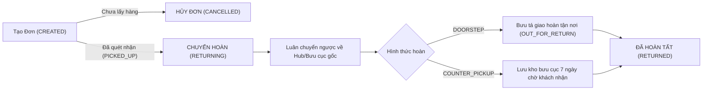
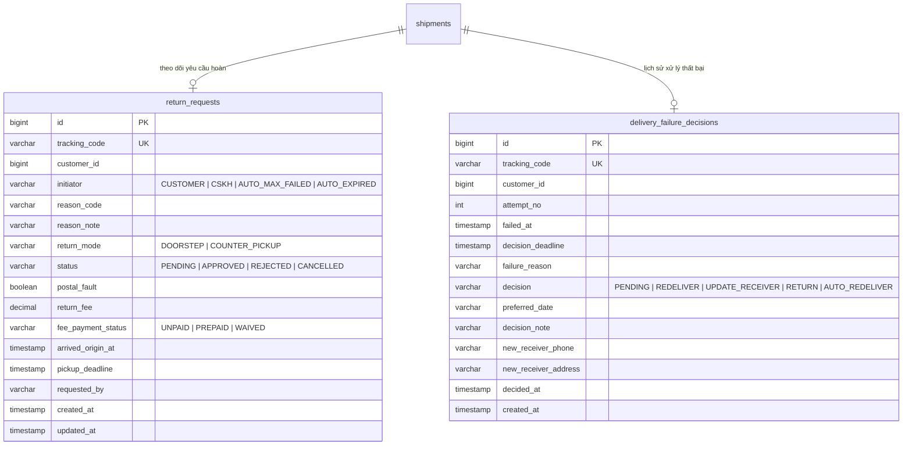
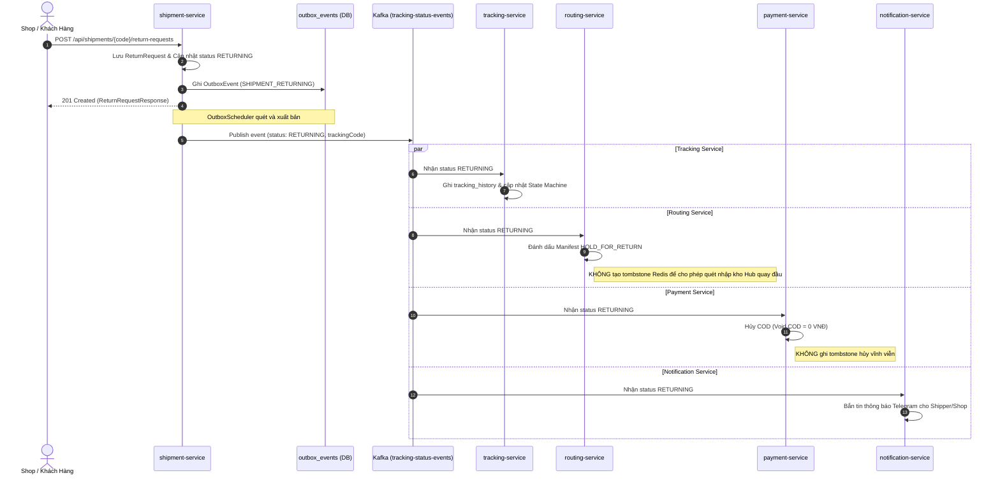

# Cẩm Nang Kỹ Thuật 23: Quy Trình Hoàn Hàng Toàn Diện (Customer Return Flow & Failure Decision SLA)

> **Mục tiêu cẩm nang:** Tổng hợp toàn diện thiết kế kiến trúc, máy trạng thái, giải thuật tính cước hoàn, quy trình Saga phân tán, cơ chế hẹn giờ 24h/7 ngày và đồng bộ đa kênh (Web Khách Hàng, Bưu Cục, Bưu Tá, Telegram Bot) cho tính năng **Hoàn Hàng (Return Flow)** trong nền tảng `Mini-Waybill-Platform`.

---

## 1. Tổng Quan Nghiệp Vụ & Giới Hạn Trách Nhiệm

Trong mô hình Logistics B2B & Thương mại điện tử (e-Commerce), hàng hóa đã rời khỏi kho người gửi sẽ bước vào chuỗi kiểm soát vật lý nghiêm ngặt. Việc hủy đơn hàng (`CANCELLED`) chỉ được chấp nhận khi bưu phẩm **chưa phát sinh tác nghiệp vật lý** (trước khi bưu tá hoặc bưu cục quét nhận). Khi bưu phẩm đã vào luồng vận tải (`PICKED_UP`), mọi thao tác thu hồi hàng hóa phải chuyển sang **Quy trình Chuyển Hoàn (Return Process)**.

### 1.1. Các Tình Huống Kích Hoạt Hoàn Hàng
1. **Khách hàng (Shop) chủ động yêu cầu hoàn:**
   * Khả dụng từ `PICKED_UP`, `IN_TRANSIT`, `ARRIVED_DEST_HUB`, `OUT_FOR_DELIVERY` đến `DELIVERY_FAILED`.
   * Shop phát hiện người nhận bùng hàng, sai thông tin hoặc hủy giao dịch ngoài đời thực.
2. **Khách hàng quyết định hoàn sau khi giao thất bại (`DELIVERY_FAILED`):**
   * Khi bưu tá báo giao thất bại lần 1 hoặc lần 2, hệ thống kích hoạt **Cửa sổ quyết định 24 giờ**.
   * Shop có 3 lựa chọn: (1) Giao lại (hẹn ngày), (2) Đổi SĐT / Địa chỉ người nhận trong cùng quận/huyện, (3) Hoàn về người gửi.
3. **Hệ thống tự động kích hoạt hoàn:**
   * **Hết hạn 24 giờ:** Nếu Shop không đưa ra quyết định, hệ thống tự động tái phát.
   * **Giao thất bại lần 3:** Tự động kích hoạt chuyển hoàn ngay lập tức (`AUTO_MAX_FAILED`), không cho phép phát lại tiếp để bảo vệ chi phí vận hành.

---

## 2. Chính Sách Cước Hoàn & Xử Lý Tiền Thu Hộ COD

### 2.1. Công Thức Cước Hoàn (Return Fee Policy)
Cước chuyển hoàn được tính toán tập trung tại `ReturnFeeCalculator`:
$$\text{ReturnFee} = \begin{cases} 0 \text{ VNĐ}, & \text{nếu } \text{postalFault} = \text{true} \\ \text{round}(0.5 \times \text{shippingFee}), & \text{nếu } \text{postalFault} = \text{false} \end{cases}$$

* **Quy tắc 50% cước gốc:** Phản ánh đúng chuẩn vận hành bưu chính (phí chiều về bằng 50% phí chiều đi). Nếu đơn hàng miễn cước hoặc thiếu dữ liệu, áp dụng mức cước cơ sở mặc định (35.000đ $\times$ 50% = 17.500đ).
* **Miễn cước do lỗi bưu cục (`postalFault = true`):** Khi bưu tá làm mất hàng, giao trễ vượt SLA cam kết hoặc nhân viên chăm sóc khách hàng (CSKH) xác minh lỗi thuộc về bưu cục, cước hoàn bằng $0$ VNĐ.
* **Hủy tiền thu hộ (Void COD):** Ngay khi đơn chuyển sang `RETURNING`, tiền thu hộ COD được thiết lập về **$0$ VNĐ**, bưu tá và quầy giao dịch tuyệt đối không thu tiền hàng COD từ người gửi.

### 2.2. Phương Thức Thanh Toán Cước Hoàn
Khách hàng có thể lựa chọn 2 hình thức:
* **Trả trước qua VietQR (`feePaymentStatus = PREPAID`):** Thanh toán ngay trên giao diện Web qua mã VietQR động sinh bởi `payment-service`. Khi bưu phẩm hoàn về, bưu tá hoặc quầy giao dịch chỉ bàn giao bưu phẩm và **không thu thêm tiền mặt**.
* **Thu khi nhận hàng (`feePaymentStatus = UNPAID`):** Bưu tá thu tiền mặt / quầy giao dịch thu tiền mặt hoặc quét VietQR lúc trả hàng tận tay cho người gửi.

---

## 3. Kiến Trúc Dữ Liệu & Bảng Bổ Sung (Flyway V9)

Cơ sở dữ liệu `shipment-service` được bổ sung 2 bảng với quan hệ $1:1$ với `shipments`:

---

## 4. Saga Phân Tán & Phối Hợp Đa Dịch Vụ (Kafka Event Streams)

Khi một đơn hàng chuyển sang `RETURNING`, hệ thống kích hoạt chuỗi xử lý bất đồng bộ qua Transactional Outbox Pattern:

### 4.1. Quy Tắc Tombstone Guard (Tránh Deadlock Vận Hành)
* Trong kiến trúc gốc, sự kiện hủy đơn (`CANCELLED`) thiết lập Redis key `shipment-cancelled:{trackingCode}` vĩnh viễn nhằm ngăn chặn quét barcode trên băng chuyền.
* **Đối với trạng thái `RETURNING`:** Bưu phẩm thực tế vẫn nằm trên xe hoặc trong kho và **bắt buộc phải được quét mã barcode** để nhập kho Hub trung chuyển chiều về (`HOLD_FOR_RETURN`), dỡ hàng và nhập kho bưu cục gửi. Do đó, Consumer của `routing-service` và `payment-service` được lập trình để **không đặt tombstone** khi nhận tín hiệu `RETURNING`.

---

## 5. Tự Động Hóa Cron Schedulers & Quản Lý SLA

`shipment-service` duy trì 2 cron scheduler chạy ngầm với độ tin cậy cao:

| Scheduler Class | Tần suất | Chức năng nghiệp vụ |
|---|---|---|
| `FailureDecisionTimeoutScheduler` | Mỗi 1 phút (`0 */1 * * * *`) | Quét các bản ghi `delivery_failure_decisions` có `decision = 'PENDING'` và `now > decision_deadline`. Tự động chuyển thành `AUTO_REDELIVER` và bắn sự kiện `OUT_FOR_DELIVERY` để bưu tá tiếp tục phát ngày kế tiếp. |
| `CounterPickupExpiryScheduler` | Mỗi 5 phút (`0 */5 * * * *`) | Quét các đơn hàng `COUNTER_PICKUP` đã cập bến bưu cục gửi (`arrived_origin_at != null`) có `now > pickup_deadline` (quá 7 ngày lưu kho). Tự động chuyển đổi hình thức sang `DOORSTEP` để bưu tá mang trả tận nhà người gửi. |

---

## 6. Giao Diện Người Dùng & Đồng Bộ Đa Kênh

### 6.1. Web Khách Hàng (`ShipmentView.js` & `TrackingView.js`)
* **Tab "Cần Xử Lý":** Hiển thị danh sách các đơn `DELIVERY_FAILED` đang trong cửa sổ 24 giờ. Có đồng hồ đếm ngược từng giây (`23:59:58`), thông báo lý do thất bại và 3 nút tác vụ:
  * *Giao Lại*: Hẹn ngày tái phát.
  * *Đổi SĐT/ĐC*: Cập nhật thông tin người nhận (trong cùng quận/huyện).
  * *Hoàn Về*: Xác nhận chuyển hoàn về Shop ngay lập tức.
* **Tab "Đơn Hoàn":** Quản lý toàn bộ vòng đời đơn hoàn qua 4 thẻ KPI (`Đang chuyển hoàn`, `Chờ nhận tại quầy`, `Đang phát hoàn`, `Đã hoàn tất`), tích hợp cổng VietQR thanh toán cước hoàn trước và công tắc CSKH xác nhận miễn phí do lỗi bưu cục.
* **Nút bấm danh sách vận đơn:** 
  * Trạng thái $\le$ `ROUTE_ASSIGNED`: Nút **Hủy Đơn**.
  * Trạng thái từ `PICKED_UP` đến `DELIVERY_FAILED`: Nút **Yêu Cầu Hoàn**.
* **Tra cứu hành trình (`TrackingView.js`):** Timeline hiển thị Banner chuyển hoàn nổi bật với thông tin người yêu cầu, hình thức hoàn (`DOORSTEP` vs `COUNTER_PICKUP`), thời hạn lưu kho 7 ngày và trạng thái cước hoàn (`PREPAID` vs `UNPAID`).

### 6.2. Ứng Dụng Bưu Tá & Telegram Bot (`ShipperView.js` & `ShipperBotHandler.java`)
* **Kiểm tra hình thức hoàn:** Khi đơn hàng là `COUNTER_PICKUP`, bưu tá và Telegram Bot **bị chặn không cho nhận phát hoàn** (`acceptReturn`), hiển thị thông báo yêu cầu lưu kho chờ khách đến lấy tại quầy.
* **Thu cước hoàn:**
  * Nếu cước hoàn đã được thanh toán trước (`PREPAID`) hoặc miễn phí (`postalFault`), bưu tá không tạo VietQR thu tiền và ghi nhận phát hoàn cước 0đ.
  * Nếu chưa trả trước, bot cung cấp tùy chọn thu tiền mặt hoặc tạo mã VietQR cước hoàn (50%).

### 6.3. Bưu Cục Giao Dịch (`PostOfficeOpsView.js`)
* **Phân hệ Tồn Kho Bưu Cục:** Bổ sung bộ lọc và đếm số lượng `Chờ nhận tại quầy (Hoàn)` (`COUNTER_PICKUP`).
* **Modal Trả Hàng Tại Quầy:** Giao dịch viên bấm *Trả Hàng Tại Quầy*, hệ thống tự động tra cứu chính sách cước hoàn. Nếu khách đã trả trước qua VietQR hoặc miễn cước, màn hình hiển thị nhãn xanh *"Cước thu: 0 VNĐ - Giao dịch viên trao bưu phẩm trực tiếp cho khách"*; nếu chưa trả, yêu cầu thu đủ tiền mặt trước khi hoàn tất đổi trạng thái `RETURNED`.

---

## 7. Đặc Tả API Đầu Cuối (REST Endpoints)

| Phương thức | Đường dẫn API | Quyền hạn / Header | Mô tả |
|---|---|---|---|
| `GET` | `/api/shipments/{code}/return-quote` | `CUSTOMER`, `ROLE_ADMIN` | Ước tính cước hoàn (50%), kiểm tra tính hợp lệ và cảnh báo hủy COD. |
| `POST` | `/api/shipments/{code}/return-requests` | `CUSTOMER`, `ROLE_ADMIN` | Tạo yêu cầu chuyển hoàn (chọn `DOORSTEP` hoặc `COUNTER_PICKUP`). |
| `GET` | `/api/shipments/{code}/return-request` | `CUSTOMER`, `ROLE_ADMIN`, `ROLE_SHIPPER`, `ROLE_POST_OFFICE_STAFF` | Tra cứu chi tiết yêu cầu hoàn (cước, trạng thái thanh toán, hình thức hoàn). |
| `GET` | `/api/shipments/return-requests` | `CUSTOMER`, `ROLE_ADMIN`, `ROLE_CS` | Lấy danh sách các đơn hoàn theo bộ lọc trạng thái. |
| `PATCH`| `/api/shipments/{code}/return-request/postal-fault` | `ROLE_ADMIN`, `ROLE_CS` | Đánh dấu lỗi thuộc phía bưu chính để miễn 100% cước hoàn. |
| `GET` | `/api/shipments/pending-decisions` | `CUSTOMER`, `ROLE_ADMIN` | Lấy danh sách đơn giao thất bại đang chờ quyết định trong 24 giờ. |
| `POST` | `/api/shipments/{code}/failure-decision` | `CUSTOMER`, `ROLE_ADMIN` | Gửi quyết định xử lý (`REDELIVER`, `UPDATE_RECEIVER`, `RETURN`). |

---

## 8. Hướng Dẫn Kiểm Thử & Xác Minh (Verification Checklist)

1. [x] **Flyway Migration V9:** Tạo thành công bảng `return_requests` và `delivery_failure_decisions` với index `tracking_code`.
2. [x] **Unit Test ReturnFeeCalculator:** 50% cước cơ sở, 0đ khi `postalFault = true`.
3. [x] **Integration Test Schedulers:** Cron 24h tự động tái phát, cron 7 ngày tự động chuyển `COUNTER_PICKUP` sang `DOORSTEP`.
4. [x] **Kafka Tombstone Guard:** Đảm bảo `RETURNING` không chặn quét mã trung chuyển tại kho Hub.
5. [x] **Telegram Shipper Bot:** Nhận diện đúng đơn `COUNTER_PICKUP` và đơn hoàn trả trước `PREPAID`.
6. [x] **Post Office Operations:** Giao dịch viên trả hàng tại quầy phân biệt chính xác đơn đã trả trước và đơn cần thu phí.
